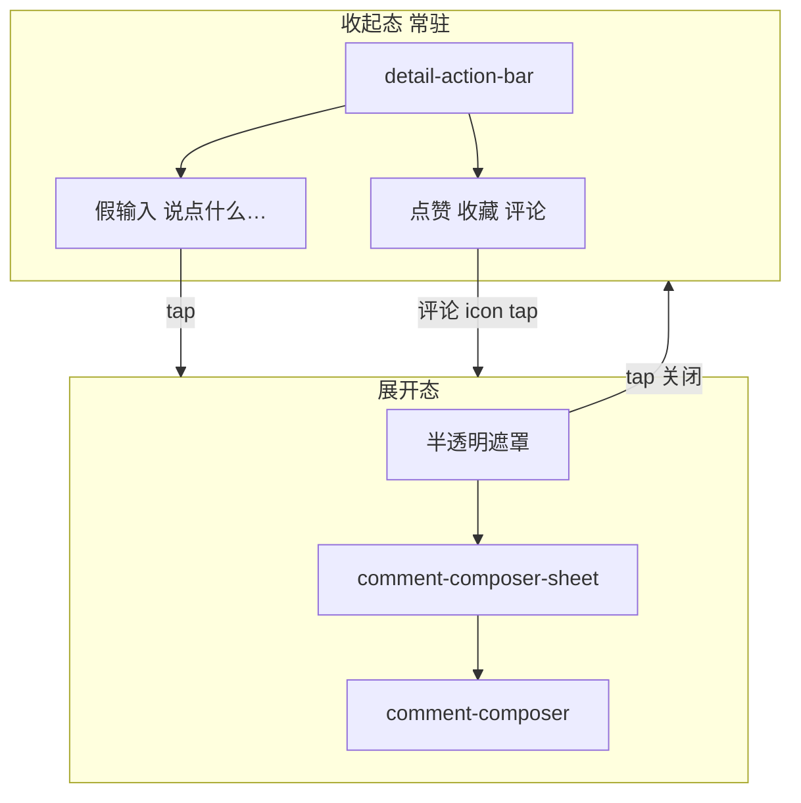
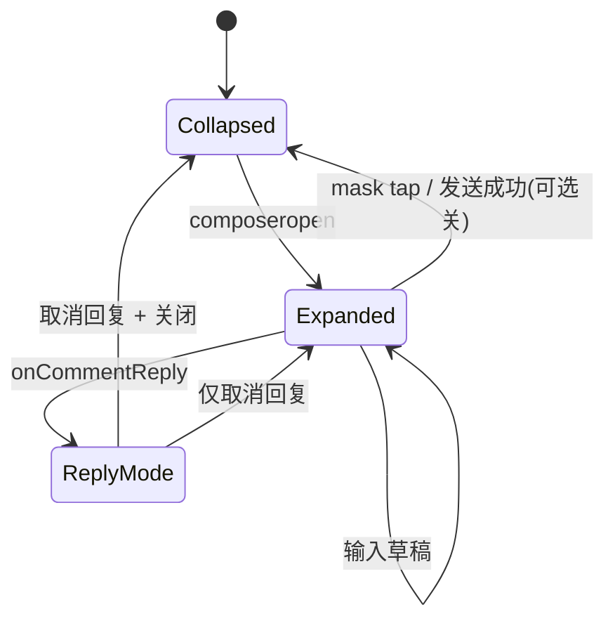

# 评论输入 · 底栏收起与展开（第三阶段）

> **组件：** `detail-action-bar`（收起态）、`comment-composer`（展开态）、页面级 sheet 容器  
> **适用页面：** `detail-life`（改造底栏）、`detail-pro`（**新增**问题下评论流 + 底栏 sheet，产品已确认 3.2）、`answer-detail`（**新增**底栏 + sheet）  
> **关联：** `MASTER.md`、`MASTER-phase3-token-delta.md`（假输入底 `--color-chip-neutral-bg`）、`phase3-overview.md` §3、`secondary-pages/detail.md`

---

## 1. 目标与范围

| 项 | 说明 |
|----|------|
| **目标** | 详情页评论输入改为：**默认收起**——底栏左侧圆角假输入「说点什么…」+ 右侧点赞/收藏/评论；点击假输入或评论图标 → **底部浮层**展开真实 `textarea` + 发送。 |
| **参照** | 产品附图（Typora）：收起态底栏 + 键盘顶起展开态；**不要求**默认纳入 @ / 表情 / 相册工具栏。 |
| **不在范围** | 完整小红书评论工具栏、`imageUrls` 评论配图 → `needs-confirm-phase3.md` |

---

## 2. 现状与差距

| 项 | 现状 | 差距 |
|----|------|------|
| `detail-life` | 列表内 `#composer-anchor` 常驻 `<comment-composer>`；底栏 `detail-action-bar` 三列均分点赞/收藏/评论 | 评论按钮仅 `scrollTo` 锚点，与小红书「假输入」不一致 |
| `answer-detail` | 讨论区内嵌 `comment-composer`；**无** `detail-action-bar` | 缺固定底栏；与 FAB「答」共存需 z-index 规范 |
| `comment-composer` | 大块 `textarea` + 字数 + 发送，始终占位 | 需改为仅 **sheet 展开时** 渲染 |
| `detail-pro` | 有底栏，原无问题下评论流 | **已确认 3.2**：问题卡下 `comment-list` + 底栏假输入 + sheet（`contentId` 问题线程） |

---

## 3. 设计依据溯源

| 决策 | 来源 | 说明 |
|------|------|------|
| 假输入圆角条 + 暖灰底 | **项目取舍**（附图）+ **token-delta** `--color-chip-neutral-bg` `#F0EDE7` | 与 `--color-bg` 区分一度，明显可点（Input Affordance） |
| `position: fixed` 遮罩 + 底 sheet | **项目取舍** | 微信无统一 BottomSheet 组件；固定底栏 + 全屏半透明遮罩 |
| `cursor-spacing` / `adjust-position` / `safe-area-inset-bottom` | **Pro-Max 依据**（`bottom sheet input keyboard safe area mobile comment`：移动键盘、输入可见） | 与二阶段表单 sticky bar 一致 |
| 发送钮 `--color-cta` 纯色 | **MASTER 延续** | 禁止蓝紫渐变 |
| 草稿关闭后可保留 | **项目取舍** | **P2** 可选；P0 允许关闭清空或保留 `composerValue` 由页面控制 |
| 回复态顶栏「回复 @昵称」 | **项目取舍** | 展开 sheet 时展示，取消则清空 `_replyTarget` |
| 不纳入表情条 | **项目取舍** + **需确认** | 控制范围，避免半成品工具栏 |

**Pro-Max 检索（2026-05-17）：** `bottom sheet input keyboard safe area mobile comment` → 输入需可见标签/边框、假输入需明显可交互；采纳 affordance + safe-area，不采纳 borderless 输入。

---

## 4. 架构示意



**z-index 栈（`answer-detail` 含 FAB）：**

| 层级 | z-index | 元素 |
|------|---------|------|
| 内容 | 0 | 列表、讨论卡 |
| FAB「答」 | 40 | `answer-page__fab`（保持现状，低于 sheet） |
| 固定底栏 | 50 | `detail-action-bar`（现状 `.dab--fixed`） |
| 遮罩 + sheet | 100 | 展开评论层 |

---

## 5. 收起态 · `detail-action-bar` 改造

### 5.1 区块结构（七项之 1）

```
detail-action-bar (fixed)
└── dab__inner (flex row, align center)
    ├── dab__composer-trigger（左，flex:1）  ← 新增：假输入
    └── dab__actions（右，flex-shrink:0）
        ├── 点赞 dab__action
        ├── 收藏 dab__action
        └── 评论 dab__action（可显示数量）
```

**移除：** 现状三列等分 + 中间 `dab__sep` 分隔线（改为左一条假输入 + 右一组图标操作，操作间可用 `gap` 替代竖线，或保留 1rpx 弱分割仅 between 图标）。

### 5.2 栅格

| 区域 | 规格 |
|------|------|
| 底栏容器 | `position: fixed; left:0; right:0; bottom:0`；`padding: 0 24rpx calc(12rpx + env(safe-area-inset-bottom))`（**延续现状**） |
| 内栏 `.dab__inner` | `flex-direction: row`; `align-items: center`; `gap: 16rpx`; `padding: 16rpx 12rpx`（略减纵向，给假输入留高） |
| 假输入区 | `flex: 1`; `min-width: 0`; **宽度弹性** 约占总宽 55–65%（375 屏约 **184–220rpx** 为最小视觉宽度参考，实际用 `flex:1` 自适应） |
| 右侧操作组 | `flex-shrink: 0`; 三图标横排 `gap: 20–24rpx`；每图标热区 ≥ **72rpx** 宽 |

**页面底部留白：** `.detail-page__foot-spacer` / `.answer-page__fab-spacer` 高度 ≥ `calc(112rpx + env(safe-area-inset-bottom))`（底栏变高后微调，与二阶段 `120rpx` 对齐验收）。

### 5.3 组件属性与事件

**新增 properties：**

| 属性 | 类型 | 默认 | 说明 |
|------|------|------|------|
| `composerPlaceholder` | String | `说点什么…` | 假输入占位 |
| `showComposerTrigger` | Boolean | `true` | 是否展示左侧假输入（三详情页均为 `true`） |

**事件：**

| 事件 | 触发 | 说明 |
|------|------|------|
| `composeropen` | 点击假输入 | 页面 `openComposer()` |
| `like` / `collect` | 不变 | 请求中 `loading` 禁用 |
| `comment` | 点击评论图标 | **改为** `composeropen`（与假输入同效）；**不再**默认 `scrollTo` |

**移除页面逻辑：** `detail-life` / `answer-detail` 中 `wx.pageScrollTo({ selector: '#composer-anchor' })`；删除列表内 `#composer-anchor` 与常驻 `comment-composer`。

### 5.4 色彩（收起态）

| 元素 | Token / 值 |
|------|------------|
| 底栏背景 | `var(--color-surface-elevated)` `#FFFFFF` |
| 顶边线 | `1rpx solid var(--color-border)` |
| 假输入背景 | `var(--color-chip-neutral-bg)` `#F0EDE7`（**token-delta**；附图 `#F0EDE7` 与之一致） |
| 假输入占位字 | `var(--color-text-tertiary)` `#8C939E` |
| 假输入文案 | `26–28rpx`（定稿 **28rpx**） |
| 点赞激活 | 图标 SVG 品牌绿（现状）；计数 `var(--color-stat-active)` / brand |
| 收藏激活 | `var(--color-favorite-active)` `#B45309`（**token-delta**，替代绿色收藏态） |
| 评论数 | `var(--color-stat)` 二级字色；图标 `var(--color-text-secondary)` |

### 5.5 字体与图标

| 元素 | 规格 |
|------|------|
| 假输入 | `28rpx` / `400`；单行 `ellipsis` |
| 操作图标 | 沿用 `images/detail-action-bar/*.svg`；`44rpx` 方形容器（现状） |
| 操作文案 | 收起态**可隐藏**「点赞/收藏/评论」文字，仅图标 + 评论数（与附图一致）；若保留文字则 `22rpx` label + `26rpx` count（现状），二选一以**附图优先：仅图标+数字** 为 P1 精简 |

**定稿（P0）：** 右侧显示图标 + 数字（点赞/收藏/评论数），不显示「点赞」「收藏」汉字 label，节省宽度给假输入。

### 5.6 交互（收起态）

| 操作 | 行为 |
|------|------|
| 点假输入 | `trigger composeropen` → 页面 `composerVisible=true` |
| 点评论图标 | 同假输入 |
| 点赞/收藏 | 与现状一致；`loading` 时忽略重复点击 |
| hover | `dab__composer-trigger--hover` / `dab__action--hover` → `opacity: 0.88` |

---

## 6. 展开态 · Sheet + `comment-composer`

### 6.1 区块结构

```
page（detail-life / answer-detail）
├── 页面内容（可滚动）
├── detail-action-bar（收起态仍可见，z-index 50）
└── comment-sheet（wx:if composerVisible，z-index 100）
    ├── comment-sheet__mask（bindtap 关闭）
    └── comment-sheet__panel
        ├── [可选] reply-bar：回复 @昵称 | 取消
        └── comment-composer（复用组件）
```

**实现位置：** sheet 容器可放在**页面 wxml** 根级（推荐，便于页面持有 `composerValue` / `_replyTarget`），或新建 `comment-composer-sheet` 组件封装遮罩+顶栏+composer。

### 6.2 栅格

| 元素 | 规格 |
|------|------|
| 遮罩 | `position: fixed; inset: 0`; `background: rgba(26, 29, 33, 0.45)`；`transition: opacity 200ms` |
| 面板 | `position: fixed; left: 0; right: 0; bottom: 0`; 背景 `var(--color-card-bg)`；顶圆角 `24rpx`；`padding-bottom: env(safe-area-inset-bottom)` |
| 面板最大高 | `min(70vh, 560rpx)` 内容区 + 安全区（避免挡满屏） |
| `textarea` | `min-height: 120rpx`; `max-height: 320rpx`（**延续** `comment-composer`） |
| 发送按钮 | 高 `64rpx`；`padding: 0 28rpx`；圆角 `32rpx` |
| 字数 | 左下 `24rpx`：`{len} / 500` |

### 6.3 组件 · `comment-composer`（展开态专用）

**属性（延续 + 补充）：**

| 属性 | 说明 |
|------|------|
| `value` / `placeholder` | 页面受控；默认 placeholder **`友善评论，文明发言`**（收起假输入仍为「说点什么…」） |
| `maxlength` | `500` |
| `submitting` / `disabled` | 发送中 loading；未达字数 disabled |
| `autoFocus` | Phase3 新增：sheet 打开后 `true`，延迟 `setData` 后 focus（真机需验证） |

**`textarea` 微信属性：**

| 属性 | 值 |
|------|-----|
| `cursor-spacing` | `32`（延续，可增至 `48` 若键盘遮挡） |
| `adjust-position` | `true` |
| `show-confirm-bar` | `false` |
| `hold-keyboard` | 发送前 `true`（减少发送后键盘闪退，P1） |

### 6.4 色彩（展开态）

| 元素 | Token |
|------|-------|
| 面板背景 | `var(--color-card-bg)` |
| 顶栏回复提示 | `var(--color-text-secondary)`；「取消」`var(--color-link)` |
| 输入字色 | `var(--color-text-primary)` |
| 字数 hint | `var(--color-text-tertiary)` |
| 发送 | `background: var(--color-cta)`；disabled opacity `0.45` |

### 6.5 字体与图标

| 元素 | 规格 |
|------|------|
| 回复条 | `26rpx`；昵称 `font-weight: 500` |
| 输入 | `28rpx` / `line-height: 1.55` |
| 发送 | `26rpx` / `500` |
| 图标 | 无 emoji；发送用 `button type="primary"` 品牌色 |

### 6.6 交互（展开态）

| 操作 | 行为 |
|------|------|
| 打开 | `composerVisible=true`；遮罩淡入 200ms；聚焦输入 |
| 关闭 | 点遮罩 / 下滑手势（P2）/ 发送成功后（见下） | `composerVisible=false` |
| 草稿 | **P2**：关闭保留 `composerValue`；**P0** 由页面决定（建议保留，避免误触丢失） |
| 发送成功 | 清空输入 + `_replyTarget`；关闭 sheet；toast「发送成功」；刷新评论列表 |
| 发送失败 | sheet 不关；toast 错误 |
| 回复某人 | 点评论「回复」→ 先 `openComposer()`，顶栏显示 `回复 @昵称` + 「取消」清空回复目标 |
| 取消回复 | 清空 `replyPlaceholder` 回默认；`_replyTarget=null` |

**与 `onCommentReply` 衔接：** 去掉 `scrollTo #composer-anchor`；改为 `setData({ replyPlaceholder, composerVisible: true })`。

---

## 7. 分页面规格（七项摘要）

### 7.1 `detail-life`

| 维度 | 规格 |
|------|------|
| 区块 | 移除讨论区内嵌 `comment-composer`；底栏改造；sheet 挂页面根 |
| 栅格 | `foot-spacer` 适配新底栏高度 |
| 组件 | `detail-action-bar` + `comment-sheet` + `comment-list` |
| 色彩 | 假输入 `--color-chip-neutral-bg`；收藏激活暖色 |
| 字体图标 | §5.5 / §6.5 |
| 交互 | `onDetailComment` → `openComposer`；`composeropen` 事件 |
| 衔接 | `index.wxml` 删 `#composer-anchor`；`index.ts` 管理 `composerVisible` |

### 7.2 `answer-detail`

| 维度 | 规格 |
|------|------|
| 区块 | 讨论区内移除常驻 composer；**新增** `detail-action-bar fixed`（点赞/藏/评绑定**当前回答**互动，若暂无则仅评论入口） |
| 栅格 | `answer-page__fab-spacer` 增高；FAB `z-index:40` < 底栏 `50` < sheet `100` |
| 组件 | 同 life；互动 API 沿用回答维度字段 |
| 色彩/字体 | 同 life |
| 交互 | 评论图标打开 sheet；FAB「答」仍 `navigateTo publish-answer` |
| 衔接 | `index.wxml` 底栏 + sheet；`index.ts` `openComposer` / `closeComposer` |

**说明：** 若当前回答未接入点赞/收藏，底栏右侧仅显示评论图标 + 假输入（P0 允许）；P1 补齐互动数。

### 7.3 `detail-pro`（产品已确认 3.2）

| 维度 | 规格 |
|------|------|
| 区块 | 问题主卡下方新增「评论」区：`comment-list`（`show-more="{{false}}"`）；**无**列表内常驻 composer；底栏 + sheet 同 `detail-life` |
| 栅格 | `foot-spacer` / FAB：`FAB z-index 40` < 底栏 `50` < sheet `100`；FAB `bottom` 高于底栏，与 `answer-detail` 一致 |
| 组件 | `detail-action-bar` 假输入 + 三操作；`comment-sheet` + `comment-composer`；评论 API **仅** `contentId`（不传 `answerId`） |
| 色彩/字体 | 同 life；专业标签仍 `--color-content-pro-bg` |
| 交互 | 假输入 / 评论图标 → `openComposer`；发表后更新 `detail.commentCount`；回答卡「评论 N」仍进入 `answer-detail` |
| 衔接 | `pages/detail-pro/index.wxml\|ts\|wxss` 对齐 `detail-life` 评论块；移除 scroll/toast 式「请在回答下评论」 |

**与回答评论分工：** 本页 = 问题讨论（`{contentId}:q`）；`answer-detail` = 某条回答讨论（`{contentId}:a:{answerId}`）。

---

## 8. 状态机



---

## 9. 页面衔接点汇总

| 文件 | 改动 |
|------|------|
| `components/detail-action-bar/index.wxml\|wxss\|ts` | 假输入 + 右操作；`composeropen` 事件 |
| `components/comment-composer/index.*` | 可选 `autoFocus`；样式微调适配 sheet |
| `pages/detail-life/index.wxml\|ts\|wxss` | 移除列表 composer；sheet 状态；`openComposer` |
| `pages/answer-detail/index.wxml\|ts\|wxss` | 新增底栏 + sheet；FAB/spacer z-index |
| `pages/detail-pro/index.wxml\|ts\|wxss` | 问题下 `comment-list` + sheet；`openComposer` / `closeComposer`；评论 API 无 `answerId` |

---

## 10. 验收标准

| # | 验收项 |
|---|--------|
| 1 | 进入 `detail-life` / `detail-pro` / `answer-detail` 时，列表底部**无**大块常驻 textarea |
| 2 | 底栏左侧可见圆角灰底「说点什么…」，右侧点赞/收藏/评论（含数量） |
| 3 | 点击假输入或评论图标，底部 sheet 展开，键盘顶起不挡输入 |
| 4 | 字数 `0/500`、未输入时发送 disabled；提交中 loading |
| 5 | 点击遮罩关闭 sheet；`env(safe-area-inset-bottom)` 在 iPhone 全面屏正常 |
| 6 | 回复评论后展开态显示「回复 @昵称」，可取消 |
| 7 | `answer-detail` FAB 不被 sheet 遮挡误触；底栏在 FAB 之上、sheet 之下 |
| 8 | `detail-pro` 问题下可展开评论 sheet 并发表；FAB 与底栏、sheet 层级正确 |
| 9 | 无电蓝、emoji 图标、玻璃拟态 |

---

## 11. 落地优先级（摘录）

| 优先级 | 内容 |
|--------|------|
| **P0** | `detail-action-bar` 假输入；页面 sheet + 移除常驻 composer；`detail-life` / `detail-pro` / `answer-detail` 接入 |
| **P1** | `answer-detail` 底栏互动数；收起态仅图标+数字；`hold-keyboard` |
| **P2** | 关闭保留草稿；下滑关闭 sheet；发送后是否自动关 |

详见 `implementation-priority-phase3.md`。
