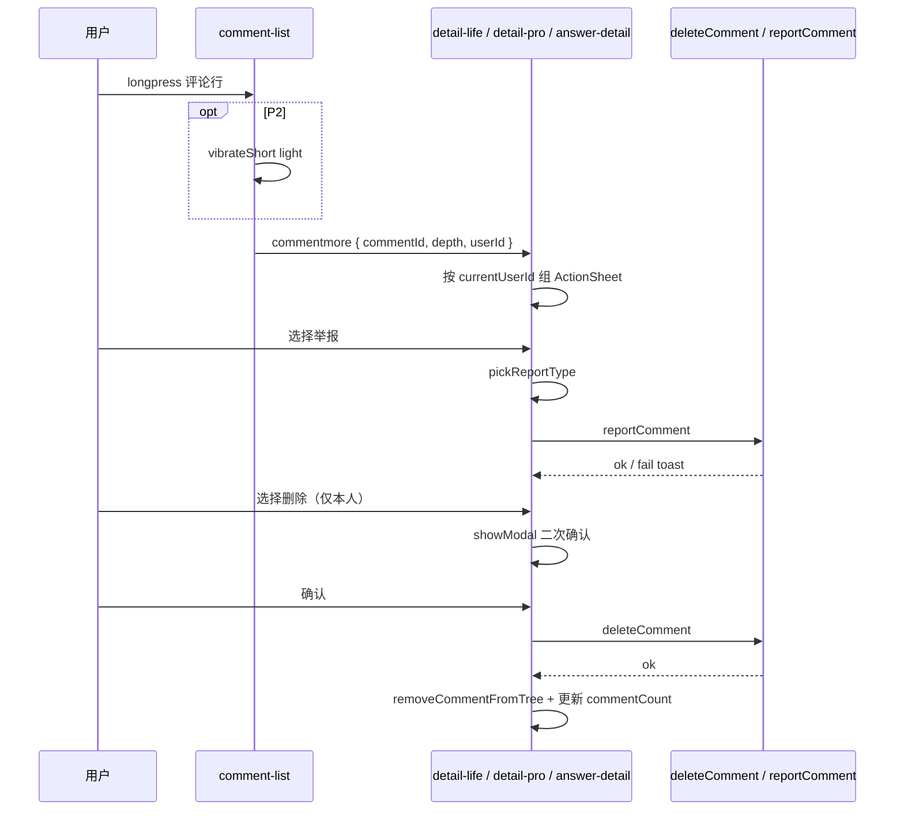

# 评论交互 · 长按删除/举报（第三阶段）

> **组件：** `miniprogram/components/comment-list`  
> **适用页面：** `pages/detail-life`、`pages/detail-pro`、`pages/answer-detail`（共用 `comment-list` + 页面级 `onCommentMore`）  
> **关联：** `MASTER.md`、`phase3-overview.md` §3、`MASTER-phase3-token-delta.md`（链接色仅影响重试文案，本稿不改评论行主色）

---

## 1. 目标与范围

| 项 | 说明 |
|----|------|
| **目标** | 一级评论与楼中楼（二级）回复均支持**长按**弹出操作面板，完成举报、删除（本人）；对齐小红书「长按评论」心智，补齐二级回复无入口的缺口。 |
| **不在范围** | 复制、置顶、拉黑用户、评论带图；全局换主色 → `needs-confirm-phase3.md` |
| **接口** | 复用已有 `deleteComment`、`reportComment`、`pickReportType`；**不新增**后端接口 |

---

## 2. 现状与差距

| 层级 | 现状（代码） | 差距 |
|------|--------------|------|
| 一级评论 | 原 `show-more` 展示「更多」→ ActionSheet | Phase3 定稿**移除**一级「更多」，仅 `longpress` |
| 二级回复 | `cl__reply-row` 仅有「回复」「点赞」`catchtap` | **无** `longpress` / `showMore`，无法删除/举报 |
| 页面删除刷新 | `detail-life`：`comments.filter` 仅移除**一级**；`answer-detail`：删除后 `runCommentsReset` 全量刷新 | 二级删除需从父评论 `replies` 移除并更新 `replyCount` |
| 权限 | `answer-detail` 已有 `currentUserId`（`getUserInfo`）；`detail-life` **未**缓存 `currentUserId`，且 ActionSheet **始终**展示「删除评论」 | 需按 `userId` 控制删除项可见性 |

---

## 3. 设计依据溯源

| 决策 | 来源 | 说明 |
|------|------|------|
| 长按为唯一菜单入口 | **项目取舍**（产品确认 2.3） | 一级与二级均仅 `longpress`；界面更简洁 |
| `wx.showActionSheet` + `wx.showModal` 二次确认删除 | **MASTER 延续** + 微信原生能力 | 不自定义底部 Sheet 样式，减少维护 |
| 删除项按 `currentUserId === item.userId` | **项目取舍** | 他人评论仅「举报」；未登录不展示删除 |
| 长按与「回复/点赞」不冲突 | **Pro-Max 依据**（`action sheet contextual menu mobile touch`：触控目标、手势勿与点击冲突） | 行内操作用 `catchtap`；长按绑在**行容器** |
| 可选 `wx.vibrateShort({ type: 'light' })` | **Pro-Max 依据**（Haptic 适度） | **P2**，失败静默，不阻塞主流程 |
| 禁止 `scale` 按压 | **MASTER 延续** §1.2 | 长按反馈用轻震 + Sheet，不用 `active:scale-95`（Pro-Max 示例与本项目冲突） |

**Pro-Max 检索（2026-05-17）：** `long press action sheet comment mobile delete report` → 按压需即时反馈、移动优先；无专用「评论长按」条目，采纳通用 Interaction / Mobile First 原则。

---

## 4. 组件规格（七项）

### 4.1 区块结构

```
comment-list
├── cl__item（一级评论行）          ← longpress（无「更多」）
│   ├── 头像 / 昵称 / 时间 / 正文
│   ├── cl__foot：回复 | 点赞
│   └── cl__replies
│       └── cl__reply-row（二级）   ← longpress（新增）
│           ├── 头像 / meta / 正文
│           └── cl__reply-foot：回复 | 点赞
```

**长按热区：** 一级绑在 `.cl__item`（不含 `page-list-footer`）；二级绑在 `.cl__reply-row` 根节点，覆盖头像+正文+脚栏，**不**包含「展开 N 条回复」`.cl__toggle`（避免与展开手势混淆）。

### 4.2 栅格与尺寸

| 元素 | 规格 |
|------|------|
| 一级行 `.cl__item` | 保持现状 `padding: 20rpx 24rpx`；`gap: 16rpx` |
| 二级行 `.cl__reply-row` | 保持现状缩进；长按热区最小高度 ≥ **88rpx**（Pro-Max 触控目标约 44px） |
| ActionSheet 项 | 系统默认；视觉高度由微信控制，设计不自定义 |
### 4.3 组件与属性（`comment-list`）

| 属性 | 类型 | 默认 | 说明 |
|------|------|------|------|
| `showMore` | Boolean | `false` | **Phase3 定稿：详情页不传 `true`**；保留属性供其他场景，一级不渲染「更多」 |
| `enableLongPressMore` | Boolean | `true` | Phase3 新增：是否启用一级/二级 `longpress` → `commentmore` |
| `longPressDuration` | — | 系统默认 | 使用微信默认长按阈值，不自定义 `bindtouchstart` 计时 |

**事件（沿用 + 扩展 payload）：**

```ts
// 一级/二级 longpress 触发（一级无「更多」）
commentmore: { commentId: number; depth: 0 | 1; userId: number }
```

| 事件 | 触发 | `detail` |
|------|------|----------|
| `commentmore` | 一级 `onMoreTap` / 一级&二级 `onLongPressMore` | `commentId`, `depth`（0=一级，1=二级）, `userId` |
| `reply` / `like` | 不变 | 不变 |

**WXML 要点（实现参考，非最终代码）：**

- 一级：在 `.cl__item` 增加 `bindlongpress="onLongPressMore"`，`data-id` / `data-user-id` / `data-depth="0"`。
- 二级：在 `.cl__reply-row` 增加 `bindlongpress="onLongPressMore"`，`data-depth="1"`；子元素继续 `catchtap` 拦截冒泡，避免长按后误触点赞。
- `onLongPressMore` 内 `if (!enableLongPressMore) return`，再 `triggerEvent('commentmore', …)`。

### 4.4 色彩

| 场景 | Token / 值 |
|------|------------|
| 长按无行内高亮 | 不增加绿色描边/底色（避免与点赞激活绿叠色） |
| 删除确认按钮 | `confirmColor: '#C43D3D'`（`--color-danger`，替换现状 `#e54d42` 以统一 token） |
| 举报成功 / 删除成功 toast | 系统 `success`；失败 `icon: 'none'` |

### 4.5 字体与图标

| 元素 | 规格 |
|------|------|
| ActionSheet 文案 | 系统默认；顺序见 §4.6.1 |
| 图标 | 不使用 emoji；Sheet 为纯文字项 |

### 4.6 交互与状态

#### 4.6.1 ActionSheet 文案与顺序（页面层 `onCommentMore`）

| 用户身份 | `itemList` | 说明 |
|----------|------------|------|
| 评论作者（`currentUserId === userId`） | `['举报', '删除']` | 索引 0 举报，1 删除 |
| 非作者 | `['举报']` | 仅举报 |
| 未登录（`currentUserId == null`） | `['举报']` | 删除不展示；若点删除逻辑被绕过，接口失败 toast |

**与现状差异：** 现状为固定 `['举报评论', '删除评论']` 且删除始终展示；Phase3 改为短文案 + 条件删除。

**举报流（不变）：**

1. `pickReportType()` → 取消则结束  
2. `reportComment({ commentId, reportType })`  
3. 成功 `已提交`；失败 toast 截断 ≤18 字  

**删除流：**

1. `wx.showModal`：标题 `删除评论`；内容 `删除后不可恢复，确定删除该评论吗？`；`confirmText: 删除`；`confirmColor: var(--color-danger)`  
2. `deleteComment(commentId)`  
3. 成功 → 列表局部更新（见 §5.3）+ `已删除` toast  

**长按反馈（P0 / P2）：**

| 优先级 | 行为 |
|--------|------|
| P0 | 弹出 ActionSheet 即视为反馈 |
| P2 | `wx.vibrateShort({ type: 'light' })`，`fail` 忽略 |

**取消：** 用户点击 Sheet 遮罩或「取消」→ 无 toast、无列表变更。

#### 4.6.2 删除后列表刷新规则

| 删除对象 | `detail-life` / `answer-detail` 数据操作 |
|----------|----------------------------------------|
| 一级评论 | 从 `comments` 顶层移除；`detail.commentCount` / 问题维度评论数 **-1**（若页面有） |
| 二级回复 | 在父一级 `replies` 中移除该条；`replyCount = max(0, replyCount - 1)`；**不**减少内容总评论数（与后端语义一致：回复计入父 thread） |

**实现建议：** 页面新增 `removeCommentFromTree(list, commentId)`，复用已有 `patchComment` 思路；`answer-detail` 删除二级时**优先**局部更新，避免 `runCommentsReset` 全量刷新（减少闪烁）。

**展开态：** 若删除后 `replies` 为空且 `replyCount === 0`，隐藏「展开/收起」；若仅剩折叠条数内回复，更新「展开 N 条回复」文案。

#### 4.6.3 一级「更多」去留（定稿，产品已确认 2.3）

| 方案 | 决定 |
|------|------|
| 仅长按 | ✅ **定稿** |
| 长按 + 保留「更多」 | ❌ 已废弃 |

**理由：** 一级与二级交互统一；减少脚栏文字噪音。发现成本由长按 + 可选 P2 `wx.vibrateShort` 补偿。

### 4.7 页面衔接点

| 页面 | 文件 | 改动 |
|------|------|------|
| 生活详情 | `pages/detail-life/index.ts` | `onLoad`/`onShow` 同步 `currentUserId`；`onCommentMore` 按 §4.6.1；`confirmDeleteComment` 支持二级移除 |
| 专业详情 | `pages/detail-pro/index.ts` | **新增**与 life 同级评论逻辑；`listComments`/`createComment` 仅 `contentId`（问题线程）；`currentUserId` + `onCommentMore` |
| 回答详情 | `pages/answer-detail/index.ts` | `onCommentMore` 条件删除；删除二级树形更新 |
| 评论列表 | `components/comment-list/index.wxml\|ts` | 一级/二级 `longpress`；移除一级「更多」渲染；`commentmore` 带 `depth`、`userId` |

**`detail-life` 需补 `currentUserId`：**

```ts
// 与 answer-detail 一致
const res = await getUserInfo();
const currentUserId = /* uid 合法 ? uid : null */;
```

---

## 5. 时序（Mermaid）



---

## 6. 验收标准

| # | 验收项 |
|---|--------|
| 1 | 一级、二级评论长按均可弹出操作面板 |
| 2 | 非本人评论 Sheet 仅「举报」；本人含「举报」「删除」 |
| 3 | 删除需二次确认；确认色为 `--color-danger` |
| 4 | 删除一级：列表消失，详情评论数减 1 |
| 5 | 删除二级：父评论下回复消失，`replyCount` 与展开文案同步 |
| 6 | 「回复」「点赞」点击不触发长按菜单；长按后不误触点赞 |
| 7 | 一级评论**无**「更多」文字链，仅长按出菜单 |
| 8 | 举报/删除失败有 toast；取消无残留 loading |
| 9 | `detail-pro` 问题下评论流支持长按删除/举报（与 life 一致） |

---

## 7. 落地优先级（摘录）

| 优先级 | 内容 |
|--------|------|
| **P0** | `comment-list` longpress；**移除一级「更多」**；三详情页条件 ActionSheet + 树形刷新；`detail-life` / `detail-pro` 补 `currentUserId` |
| **P2** | `wx.vibrateShort`（补偿仅长按发现成本） |

详见后续 `implementation-priority-phase3.md`。
