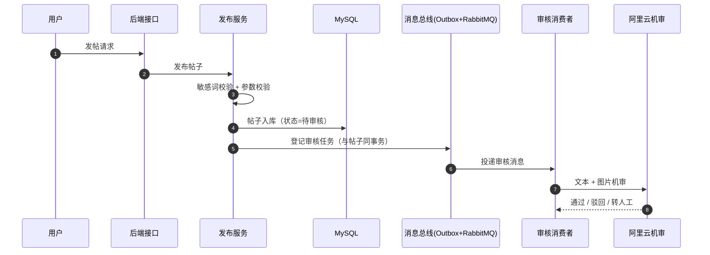
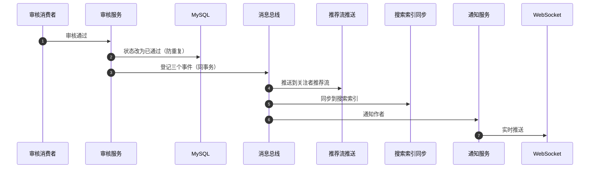
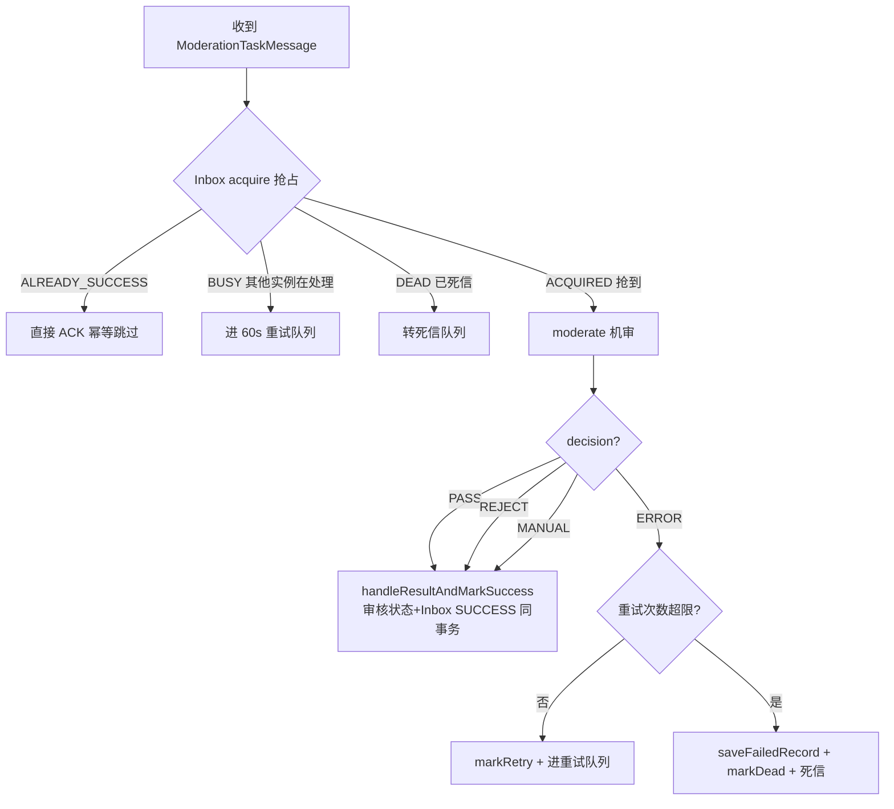

# demo0 链路 01：内容发布链路--一个帖子从发帖到被搜到的完整旅程

> **一句话概括**：用户发帖后，帖子先进入"待审核"状态，经过阿里云机审（或人工审核）通过后，才会被写入推荐流、搜索索引、向量索引，并通知作者结果。**审核不通过的内容永远不会出现在任何人的视野里。**

---

## 一、链路全景（先看这张图）

**阶段一：发布 -> 审核**（用户发帖，帖子进入"待审核"状态，交给机审）



**阶段二：审核通过 -> 三路并行**（帖子被放行后，同时推推荐流、进搜索、通知作者）



**这条链路回答了面试最经典的问题**："一个帖子从发布到被搜到，中间发生了什么？"--答案就是上面两张图：**发布 -> 机审 -> 通过 -> 三路并行（推荐流 / 搜索索引 / 通知）**。

---

## 二、问题推演：为什么审核要异步 + 走 MQ？

### 2.1 三个备选方案对比

| 维度 | 方案 A：同步审核 | 方案 B：异步 + 直接调 MQ | 方案 C：异步 + Outbox（本项目） |
| --- | --- | --- | --- |
| 发帖响应速度 | 慢（等阿里云返回，1-3 秒） | 快 | 快 |
| 审核失败重试 | 无 | 有（MQ 重试） | 有（Inbox 重试 + 死信） |
| 消息可靠性 | - | **本地事务成功但 MQ 发送失败 -> 帖子永远没人审核** | **Outbox 表与业务同事务，消息不丢** |
| 幂等消费 | - | 需自己实现 | Inbox 唯一索引兜底 |

**决策理由**：发帖是高频操作，同步等机审会让用户等 1-3 秒，体验差；而"先提交事务再发 MQ"存在悬空窗口（事务成功但消息丢失，帖子永远卡在 PENDING）。**Outbox 模式把"发消息"变成"写本地表"，与业务同事务提交，从根上消灭了消息丢失**。

### 2.2 为什么审核通过后要"三路并行"而不是同步做？

审核通过后需要做三件事：推送到关注者 Feed、写入 ES 搜索索引、通知作者。如果同步做：
- 关注者多时，Feed 推送要遍历所有关注者写 Redis，耗时不可控
- ES 写入失败会导致整个审核事务回滚，审核结果丢失

所以拆成三个独立事件，**每个事件一个消费者，互不影响，各自有重试**。审核事务只负责"改状态 + 登记三个 Outbox"，秒级完成。

---

## 三、核心实现细节（代码级）

### 3.1 发布：敏感词校验 + 待审入库

`ContentServiceImpl.publish` 的关键步骤：

| 步骤 | 做什么 | 为什么 |
| --- | --- | --- |
| 1 | 敏感词校验（SensitiveWordChecker） | 第一道防线，拦截明显违规内容，省机审费用 |
| 2 | 参数校验（标题/内容/类型） | 防脏数据 |
| 3 | INSERT content（auditStatus=PENDING） | 先落库，状态为"待审" |
| 4 | INSERT content_image | 图片单独表 |
| 5 | afterCommit 创建审核 Outbox | **事务提交后才登记事件**，避免回滚时产生幽灵事件 |

> **关键点**：审核任务在 `afterCommit` 里创建，而不是事务内。因为如果事务回滚，帖子不存在了，审核任务就是"审核一个不存在的帖子"。afterCommit 保证"只有帖子真正入库了，才去安排审核"。

### 3.2 审核消费：Inbox 抢占 + 机审 + 结果处理

`ModerationConsumer` 是这条链路的"心脏"，它把可靠消费（Inbox）和业务（机审）串起来：



**三个设计亮点**：

1. **审核状态更新和 Inbox SUCCESS 在同一个事务**（`handleResultAndMarkSuccess`）：要么"审核结果落库 + 标记成功"一起成功，要么一起回滚。防止"审核结果写了但 Inbox 没标记成功 -> 下次重试重复审核"。
2. **ERROR 不能标记 SUCCESS**：机审服务异常（如阿里云超时）不算审核结论，必须重试或进死信，不能把"审核失败"当成"审核通过"。
3. **CAS 防重复审核**：`updateAuditStatusIfPending` 用 `WHERE audit_status = PENDING` 条件更新，返回 0 说明已被其他实例/管理员处理过，直接跳过。**数据库条件更新是防并发重复处理的最后防线**。

### 3.3 审核通过：CAS 更新 + 三路 Outbox

`ContentAuditServiceImpl.approveContent` 在一个事务里完成：

```java
// 1. CAS：只有 PENDING 才能改成 APPROVED，返回 0 说明已被处理
int updatedRows = contentMapper.updateAuditStatusIfPending(contentId, APPROVED);
if (updatedRows != 1) return;  // 已被管理员/其他实例处理，跳过

// 2. 三个 Outbox 与审核状态同事务提交
outboxEventService.createFeedUpsertEvent(content);          // 推送给关注者
outboxEventService.createSearchReconcileEvent(CONTENT, contentId, "AUDIT_APPROVED"); // 校准 ES
createAuditNotificationEvent(content, APPROVED, null);      // 通知作者
```

> **为什么用 CAS 而不是先查再改**：审核可能被"机审 + 人工审核 + 定时任务"同时触发，先查再改有竞态（两个都查到 PENDING，都去改）。`UPDATE ... WHERE status=PENDING` 是原子操作，只有一个能成功。

### 3.4 Feed 推送：以 MySQL 为准的"对账式"推送

`FeedPushConsumer` 收到 Feed 事件后，**不是直接用消息里的数据写 Redis，而是重新查 MySQL**：

```java
// 重新读取 MySQL 当前状态，乱序消息不会恢复已删除或已驳回帖子
followService.reconcileContentFeed(contentId, publishUserId, contentType, createTime);
```

**为什么**：MQ 消息可能乱序（比如"发布"和"删除"两个事件顺序颠倒）。如果直接按消息内容写 Redis，可能把已删除的帖子又写回推荐流。**以 MySQL 当前状态为准重新计算，天然免疫乱序**--这是"事件只负责提醒，状态以数据库为准"的对账思想。

### 3.5 ES 校准：upsert 还是 delete 由 MySQL 决定

`SearchReconcileServiceImpl.reconcileSearchIndex` 同样是对账式：

```java
elasticSearchService.upsertByContentId(targetId);  // 内部重新查 MySQL
// 帖子存在且审核通过 -> upsert；不存在/已删除/未通过 -> delete
```

**事件只带 targetType + targetId，不带内容**。ES 文档的最终状态永远由 MySQL 当前数据决定，重复执行幂等。

> **小知识**：upsert 是 update + insert 的合成词，意思是"有这条文档就更新，没有就插入"。对账逻辑里，内容存在且审核通过就 upsert（写入/更新），否则就 delete（删除），保证 ES 里永远只有"该被搜到"的内容。

---

## 四、边界与失败处理（面试区分度所在）

| 场景 | 处理方式 | 为什么这样设计 |
| --- | --- | --- |
| 机审服务超时/异常 | ERROR -> 重试（60s 延迟）-> 超限进 DEAD + 死信队列 | 审核结论不能靠猜，宁可人工兜底 |
| 机审与人工同时审核 | CAS 条件更新，只有一个生效 | 防并发重复处理 |
| Feed 消息乱序 | 消费者重新查 MySQL 对账 | 乱序消息不会恢复已删除内容 |
| ES 写入失败 | SearchReconcile 事件重试 | 最终一致（ES 和 MySQL 短暂不同步，但会自动收敛），MySQL 是唯一真相 |
| WebSocket 推送失败 | 只记日志，不重试 | 通知已落库，用户可从列表读取，实时推送是"尽力而为" |
| 审核通过但 Feed 推送失败 | Feed 事件重试 | 关注者看不到新帖是体验问题，值得重试 |

**面试追问**："审核通过后，如果 ES 写入一直失败怎么办？"--答：SearchReconcile 事件会按 Outbox 重试梯度（60s->4m->16m...）重试，最终进 DEAD 由管理员人工重放。**ES 和 MySQL 是最终一致，不是强一致**，这是异步架构的必然取舍。

## 五、面试追问详解（问 -> 答 -> 依据）

### Q1：为什么审核要异步做，不能在发帖接口里同步调机审吗？

**面试官为什么问**：考察对"同步 vs 异步"取舍的真实理解，判断你是真做过性能考虑，还是背概念。

**我的回答**：
"同步做有两个问题。第一是响应速度：阿里云机审一次调用 1 到 3 秒，高峰期更久，如果同步调用，发帖接口就要等机审返回才能响应用户——就算前端可以立刻展示"审核中"，后端线程也被阻塞了 1~3 秒，接口吞吐量急剧下降，这对发帖这种高频操作是不可接受的。第二是可用性：机审是第三方接口，把它放进发帖事务里，第三方一抖动，发帖功能就跟着失败--我们没有理由让第三方服务的稳定性决定自己核心功能的可用性。所以我们把审核异步化：发帖事务只做最少的事，写帖子、写图片、登记一个审核任务的 Outbox 事件，毫秒级返回；审核在后台消费，结果通过通知异步告知用户。"

**回答的依据**：
- `ContentServiceImpl.publish` 中审核任务在事务 `afterCommit` 后才登记，发帖主流程不等待机审
- Outbox 事件与帖子同事务写入，消息可靠性由数据库保证（见链路 09）
- 机审消费者 `ModerationConsumer` 独立消费，失败重试不影响发帖接口

---

### Q2：为什么用 Outbox 而不是事务提交后直接发 MQ？

**面试官为什么问**：这是分布式消息的经典问题，考察你对"双写一致性"的理解深度。

**我的回答**：
"事务提交后直接发 MQ，存在一个时间窗口：事务已经提交了，但发 MQ 那一刻进程崩了或者网络断了，这条消息就永远丢了--帖子会卡在'待审核'状态没人处理。反过来，先发消息再提交事务也不行：事务回滚了，消费者却收到一条'待审核'的假消息。这就是本地事务和消息系统的双写一致性问题。Outbox 的思路是把'发消息'这个动作变成'写本地表'：业务和 Outbox 事件在同一个 MySQL 事务里，要么都成功要么都回滚，原子性由数据库保证，不依赖任何分布式事务组件。消息的实际投递由后台调度器扫描 Outbox 表完成，投递失败还有重试梯度兜底。"

**回答的依据**：
- `tb_outbox_event` 表与业务表同库同事务，`publish` 方法内完成事件登记
- 调度器按租约抢占投递，重试梯度 60s->4m->16m->6h，8 次后进死信（链路 09 详述）
- RabbitMQ 本身不支持事务消息，这是选 Outbox 的直接原因

---

### Q3：审核结果落库和 Inbox 标记 SUCCESS 为什么必须在一个事务里？

**面试官为什么问**：考察消费端幂等设计的细节，这是"至少一次投递"语义下的必修课。

**我的回答**：
"MQ 的投递语义是至少一次，消息可能重复投递。如果审核结果落库和 Inbox 标记成功分开提交，就有这样一个窗口：审核结果写进去了，但还没来得及标记 SUCCESS，消费者崩溃了--消息重新投递，同一条内容被审核两遍，浪费机审费用还可能出并发问题。反过来，如果只标记了 SUCCESS 但结果没落库，这条审核就永远丢了。所以我们把'更新审核状态'和'标记 Inbox SUCCESS'放在同一个数据库事务里，要么一起成功要么一起回滚，保证消费恰好一次的业务效果。"

**回答的依据**：
- `ModerationResultService.handleResultAndMarkSuccess` 方法名就体现了这个约定：handle result **and** mark success 同事务
- Inbox 表 `UNIQUE(message_id, consumer_group)` 唯一索引是最后一道防线

---

### Q4：机审返回 ERROR 为什么不能当成审核通过处理？

**面试官为什么问**：考察异常路径下的安全意识，区分"真懂"和"背模板"的分水岭。

**我的回答**：
"ERROR 意味着机审服务本身出了问题--超时、限流、网络异常，这时候我们对内容的安全性一无所知。如果把 ERROR 当通过，等于说'审核系统坏了就放行一切'，违规内容会趁故障窗口涌入平台，这是内容产品的重大风险。所以 ERROR 的处理是：不产生任何审核结论，走重试（60 秒延迟重试），重试耗尽进死信队列并落一条 FAILED 记录，由人工兜底。宁可让内容多等一会儿，也不能让'不确定'变成'通过'。"

**回答的依据**：
- `ModerationConsumer` 中 ERROR 分支走 `markRetry`，超限后 `saveFailedRecord`（taskStatus=FAILED）+ 死信
- 审核结果合并优先级 REJECT > MANUAL > ERROR > PASS，ERROR 永远不会得出 PASS 结论（链路 02）

---

### Q5：CAS 更新是怎么防止重复审核的？为什么不直接先查再改？

**面试官为什么问**：考察并发控制的基本功，"先查再改"的竞态是经典考点。

**我的回答**：
"先查再改有竞态：两个执行者（比如机审消费者和人工审核）同时查到状态是 PENDING，都认为自己可以处理，然后各自去更新--机审通过了、人工驳回了，最后结果取决于谁后提交，而且两边都触发了后续的 Feed 推送和通知，产生脏数据。CAS 的做法是把'检查'和'更新'合并成一条原子 SQL：UPDATE content SET audit_status = APPROVED WHERE id = ? AND audit_status = PENDING。数据库行锁保证同一时刻只有一个事务能成功，返回的影响行数不是 1 就说明别人已经处理过了，直接放弃。这是数据库层面的最后防线，比分布式锁轻量得多。"

**回答的依据**：
- `ContentAuditServiceImpl.approveContent` 调用 `updateAuditStatusIfPending`，返回非 1 直接 return
- 后续的三个 Outbox 事件（Feed/ES/通知）只在 CAS 成功后才登记，防重复触发

---

### Q6：Feed 推送时为什么重新查 MySQL，而不是直接用消息里的数据写 Redis？

**面试官为什么问**：考察对消息乱序问题的理解，这是事件驱动架构的高级考点。

**我的回答**：
"MQ 只保证至少一次，不保证顺序。设想用户发了帖子又马上删了，这两条事件可能乱序到达：删除事件先到、发布事件后到。如果消费者直接拿消息里的数据写 Redis，'发布'事件会把已经删除的帖子重新写进推荐流--用户刷到一个点开是 404。我们的做法是消费者收到事件后不当真，只把它当作'该刷新了'的提醒，重新查 MySQL 拿这条帖子的当前状态：存在且审核通过才写推荐流，否则跳过。这样不管消息怎么乱序、重复，最终推荐流都会收敛到数据库的真实状态。"

**回答的依据**：
- `FeedPushConsumer` 调用 `reconcileContentFeed`（reconcile 这个词就是对账的意思），内部重新读 MySQL
- `SearchReconcileServiceImpl.reconcileSearchIndex` 同样模式：事件只带 ID，ES 文档状态由 MySQL 决定

---

### Q7：ES 和 MySQL 的最终一致性具体怎么保证？

**面试官为什么问**：双写一致性是引入 ES 后的必问题，考察你有没有系统性方案而不是"加个重试"。

**我的回答**：
"三个层次。第一层，事件不丢：ES 同步走 Outbox，与触发变更的业务同事务，变更发生了事件就一定存在。第二层，乱序免疫：同步事件只带内容 ID，消费者重查 MySQL 决定 upsert 还是 delete，消息顺序错了也不影响最终状态。第三层，失败重试：ES 写入失败按梯度重试，8 次后进死信，管理员可以在后台看到并人工重放。整体上 ES 是最终一致，秒级延迟内收敛，对搜索场景足够--搜索本来就容忍几十秒的索引延迟，不值得为强一致牺牲架构。"

**回答的依据**：
- 三个触发点都登记 `createSearchReconcileEvent`：审核通过（upsert）、驳回/删除（delete）、互动计数变化（更新排序字段）
- 死信处理链路：DEAD 状态 + `AdminEventController` 人工重放接口

---

### Q8：WebSocket 推送失败了会影响通知吗？

**面试官为什么问**：考察对"可靠"和"实时"两个不同需求的区分能力。

**我的回答**：
"不影响，因为通知有两层：落库是根基，WebSocket 推送是锦上添花。消费者收到通知事件后，先把通知写进 notification 表并标记 Inbox SUCCESS，这一步是事务性的、可靠的；然后再尝试 WebSocket 实时推送，这一步失败只记日志不重试。因为通知已经落库，用户打开通知列表一定能看到，实时推送失败最多损失'立刻知道'的体验，不损失通知本身。如果反过来让推送失败触发重试，用户可能因为离线收到堆积的重试，推送压力也被放大。"

**回答的依据**：
- `NotificationConsumeServiceImpl` 的方法名 `saveAndMarkSuccess` 和 `pushWebSocketBestEffort` 体现了这个分层：save 可靠、push 尽力而为
- 方法注释明确"推送失败不影响 Inbox 状态"

---

### Q9：审核通过后为什么要拆成三个事件，合成一个不行吗？

**面试官为什么问**：考察对单一职责和故障隔离的权衡意识。

**我的回答**：
"三个下游的特性完全不同：Feed 推送要遍历关注者写 Redis，大 V 发帖时可能要处理几十万个关注者，耗时不可控；ES 同步依赖 ES 集群健康；通知要写库加推送。合成一个事件、一个消费者，任何一个下游慢或挂，会把另外两个一起拖死--比如 ES 故障时 Feed 推送也停了。拆成三个独立事件后，各自有各自的消费者、各自的队列、各自的重试和死信，故障完全隔离。审核事务本身只负责登记三个事件，秒级完成，不会被下游拖累。"

**回答的依据**：
- `approveContent` 中 `createFeedUpsertEvent`、`createSearchReconcileEvent`、`createAuditNotificationEvent` 三次登记
- 三个消费者 `FeedPushConsumer`、`SearchReconcileConsumer`、`NotificationConsumer` 独立消费独立重试

---

### Q10：帖子被驳回后用户怎么办，这个流程闭环了吗？

**面试官为什么问**：考察产品闭环意识，面试官想看你是只懂技术还是懂业务。

**我的回答**：
"闭环了。驳回时除了更新状态，还会登记一个审核结果通知事件，用户会收到'内容未通过审核'的通知，驳回原因可以从审核记录里查到。用户修改内容后重新提交，帖子回到 PENDING 状态重新走一遍审核流程。而且重新提交时有个成本优化：审核服务会计算内容指纹，如果用户只改了一个字，指纹变了会重新机审；但改完又改回去、或者重复提交同样的内容，指纹没变就直接复用上次的审核结果，不再花钱调阿里云。"

**回答的依据**：
- `rejectContent` 与 `approveContent` 对称，同样走 CAS + 通知事件
- 指纹防重机制在链路 02 详解：MD5(标题+内容+排序后图片URL)，命中历史 DONE 记录直接复用结论
