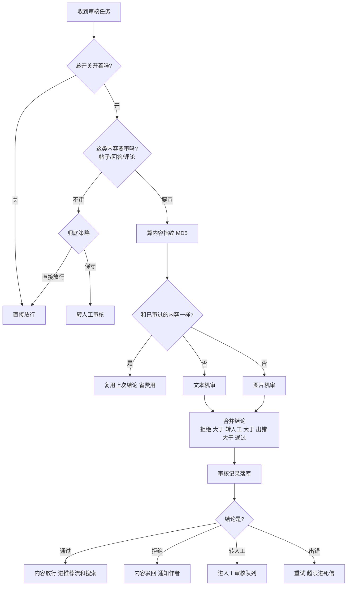
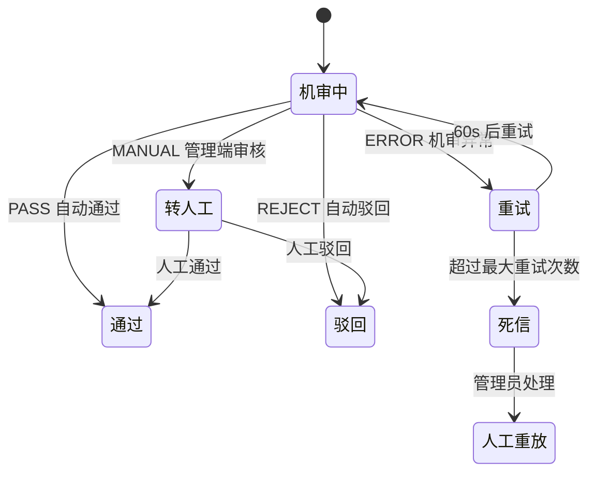

# demo0 链路 02：内容审核链路--多模态机审 + 指纹防重 + 人工兜底

> **一句话概括**：一条内容（帖子/回答/评论）发布后，系统用阿里云内容安全对**文本和图片**分别机审，按"拒绝 > 转人工 > 出错 > 通过"的优先级合并结果，自动驳回违规内容、把可疑内容转人工审核，并记录每一次审核的完整证据（指纹、标签、原始响应）。

---

## 一、链路全景



---

## 二、问题推演：审核系统要解决什么？

### 2.1 三个核心矛盾

| 矛盾 | 具体问题 | 解决方案 |
| --- | --- | --- |
| **成本** | 每条内容都调阿里云机审，费用随内容量线性增长 | **MD5 指纹防重**：内容没变就复用历史结果，不重复调 |
| **多模态** | 一条帖子既有文本又有图片，怎么综合判断？ | 文本、图片**分别审核**，再按优先级合并 |
| **误判** | 机审可能误伤正常内容，也可能漏过违规内容 | 引入 **MANUAL（转人工）** 中间态，可疑内容人工兜底 |

### 2.2 为什么需要"转人工"这个中间态？

机审是概率判断，不是绝对正确。如果只有"通过/拒绝"二选一：
- 阈值调严 -> 误伤正常内容（用户发帖被拒，体验差）
- 阈值调松 -> 漏过违规内容（平台风险）

**MANUAL 中间态**让系统"拿不准就交给人工"，既保护用户体验又守住合规底线。这是内容审核系统的标准做法。

### 2.3 为什么结果合并要按"REJECT > MANUAL > ERROR > PASS"？

| 优先级 | 含义 | 为什么最高 |
| --- | --- | --- |
| REJECT | 任一通道明确违规 | **安全第一**，只要有一处违规就拒绝 |
| MANUAL | 任一通道拿不准 | 有可疑就转人工，不放过 |
| ERROR | 审核出错 | 出错不能当通过，走重试 |
| PASS | 全部通过 | 最低优先级 |

**核心思想**：审核是"一票否决"逻辑--**只要有一个通道认为有问题，就不能直接通过**。宁可多转人工，不可漏放违规。

---

## 三、核心实现细节

### 3.1 指纹防重：怎么判断"内容没变"？

```java
private String calculateFingerprint(ModerationTaskMessage task) {
    // 1. 标题 + 内容
    sb.append(task.getTitle()).append("\n");
    sb.append(task.getContent());
    // 2. 图片 URL 列表（排序后拼接，保证顺序无关）
    List<String> sortedUrls = new ArrayList<>(task.getImageUrls());
    Collections.sort(sortedUrls);
    for (String url : sortedUrls) sb.append(url);
    // 3. MD5
    return DigestUtils.md5DigestAsHex(sb.toString().getBytes(UTF_8));
}
```

**设计细节**：
- 图片 URL **排序后**拼接：同一组图片不管顺序如何，指纹一致
- 指纹相同 + 历史记录 DONE -> 直接返回历史 decision，**不调阿里云，省费用**
- 指纹不同（比如用户改了内容重新提交）-> 重新审核

> **面试点**：指纹防重是"成本优化"的典型例子。面试官问"怎么控制审核成本"，这就是答案--**用本地计算（MD5）替代昂贵的第三方调用**。

### 3.2 多模态审核编排

| 通道 | 客户端 | 输入 | 输出 |
| --- | --- | --- | --- |
| 文本 | AliyunTextModerationClient | 标题 + 内容拼接 | ModerationResult（审核结论） |
| 图片 | AliyunImageModerationClient | 图片 URL 列表 | ModerationResult（审核结论） |

两个通道**独立执行**，各自返回 decision，最后 `mergeResults` 合并。文本和图片互不依赖，一个失败不影响另一个（失败返回 ERROR 由合并逻辑处理）。

### 3.3 审核记录：证据链落库

`ModerationRecord` 记录每次审核的完整证据：

| 字段 | 内容 | 取证价值 |
| --- | --- | --- |
| target_type / target_id | 审核对象 | 谁被审了 |
| provider | ALIYUN | 审核来源（哪家服务商审的） |
| decision | PASS/REJECT/MANUAL/ERROR | 结论 |
| risk_level | 风险等级 | 严重程度 |
| reject_reason | 拒绝原因 | 为什么拒 |
| labels | 命中的违规标签（JSON） | 具体违规点 |
| raw_response | 阿里云原始响应 | 可追溯原始证据 |
| content_fingerprint | MD5 指纹 | 防重依据 |
| task_status | DONE / FAILED | 审核是否完成 |

> **面试点**：审核记录是"合规审计"的一部分。面试官问"机审结果怎么留痕"，这就是答案--**原始响应 + 标签 + 指纹全量落库，可追溯**。

### 3.4 审核结果回写：CAS + 通知

审核结论出来后，`ModerationResultService.handleResultAndMarkSuccess` 在**一个事务**里：
1. 根据 decision 调 `approveContent`（PASS）或 `rejectContent`（REJECT/MANUAL 转人工后）
2. 标记 Inbox SUCCESS

`approveContent` / `rejectContent` 内部用 `updateAuditStatusIfPending`（CAS）更新状态，防止机审和人工审核并发重复处理。

---

## 四、失败处理与人工兜底

### 4.1 审核失败的完整路径



| 场景 | 处理 | 兜底 |
| --- | --- | --- |
| 机审 ERROR | 重试（60s 延迟） | 超限 -> saveFailedRecord(FAILED) + DEAD + 死信队列 |
| 机审 MANUAL | 转人工审核队列 | 管理端 AdminModeration 人工处理 |
| 人工审核 | 通过/驳回 | 结果同样走 CAS 更新 + 通知 |

### 4.2 目标类型开关的兜底策略

每种内容类型（CONTENT/ANSWER/COMMENT）可独立开关审核。关闭时按 `disabledPolicy` 兜底：
- `APPROVED` -> 直接放行（信任该类型内容）
- 其他 -> MANUAL 转人工（保守处理）

**这体现了"配置化降级"**：不同内容类型的审核策略可独立调整，不用改代码。

## 五、面试追问详解（问 -> 答 -> 依据）

### Q1：怎么控制机审成本？内容量大了费用怎么扛？

**面试官为什么问**：考察工程落地的成本意识，纯技术方案不看账单的工程师不完整。

**我的回答**：
"我们做了三层成本控制。第一层最靠前：发帖时的本地敏感词校验，明显违规的内容直接拦在机审之前，一次阿里云调用都不花。第二层是审核侧的指纹防重：对每条待审内容计算 MD5 指纹--标题、正文、排序后的图片 URL 拼起来取哈希，审核前先查历史记录，如果有指纹相同且已完成的记录，直接复用当时的结论，不再调阿里云。典型场景是用户改了又改回去了、或者重复提交，这些都不产生新费用。第三层是配置开关：每种内容类型（帖子/回答/评论）可以独立关闭机审，按业务风险评估调整调用量。本地敏感词和指纹防重都是本地计算，成本几乎为零。"

**回答的依据**：
- `ContentModerationServiceImpl.calculateFingerprint`：MD5(标题 + 内容 + 排序后图片URL)，图片排序保证顺序无关
- `selectLatest` 命中 DONE 状态且指纹一致即复用，`saveRecord` 落库的 `content_fingerprint` 字段就是复用依据
- 第一道防线 `SensitiveWordChecker` 在 `publish` 入口，`moderationProperties` 支持按目标类型开关

---

### Q2：文本和图片的审核结果怎么合并？为什么是这个优先级？

**面试官为什么问**：考察多渠道决策的设计能力，以及"安全优先"的价值观。

**我的回答**：
"文本和图片是两个独立通道，各自返回 PASS/REJECT/MANUAL/ERROR 四种结论，合并规则是一票否决制：任一通道 REJECT 整体 REJECT，否则任一 MANUAL 整体 MANUAL，再否则任一 ERROR 整体 ERROR，全 PASS 才 PASS。这个优先级背后的逻辑是安全兜底：只要有一个通道明确说违规，就不能放过；有一个通道拿不准，就交给人工；有一个通道出错了，绝不能当通过。反过来如果按'多数决'或者'平均值'，图片违规但文本正常就会被放行。审核这种场景，宁可误杀转人工，不可漏放。"

**回答的依据**：
- `mergeResults` 实现 REJECT > MANUAL > ERROR > PASS 的短路合并
- 两个通道独立执行互不依赖，文本审核挂了不影响图片审核跑完，错误被隔离在各自通道内

---

### Q3：为什么需要 MANUAL（转人工）这个中间态？

**面试官为什么问**：考察对"机审不是万能的"的现实认知，区分做过真实审核系统和只做过 demo 的人。

**我的回答**：
"机审是概率模型，不是规则引擎，它必然会误判和漏判。如果只有通过/拒绝二档，阈值调严正常内容被误杀、用户体验崩；调松违规内容漏过去、平台担风险--这个两难在二档体系里无解。MANUAL 中间态就是解法：机审拿不准的分值区间直接转人工队列，由管理员判断。这样机审处理掉大部分明确的 CASE 省人力，人工只处理灰度 CASE 保准确。我们的 ModerationRecord 会把命中的违规标签、风险等级、阿里云原始响应全量落库，人工审核时能看到机审为什么拿不准，判断效率也高。"

**回答的依据**：
- `ModerationDecision` 枚举有四个值：PASS/REJECT/MANUAL/ERROR，MANUAL 进入管理端 `AdminModerationController` 审核队列
- 人工审核结果与机审一样走 CAS 更新 + 通知，两条路径殊途同归

---

### Q4：机审服务超时或挂了怎么办？

**面试官为什么问**：考察第三方依赖的故障设计，几乎每个用第三方 API 的系统都会被问。

**我的回答**：
"分两种情况。偶发超时：单次审核返回 ERROR，因为审核状态更新和 Inbox SUCCESS 在一个事务里，事务回滚后消息重新投递，60 秒延迟后重试，大多数抖动一次重试就过了。持续故障：重试按梯度退避，8 次耗尽后这条任务进死信队列，同时 saveFailedRecord 落一条 taskStatus=FAILED 的记录，管理后台能看到积压的失败任务。故障恢复后管理员可以批量人工重放。整个过程中 ERROR 永远不会被当成审核结论，没有'故障期间放行'的窗口。这个设计和限流的 failClosed 是同一个价值观：安全链路上，不确定就是不通过。"

**回答的依据**：
- `ModerationConsumer` ERROR 分支：`markRetry` -> 延迟重试 -> 超限 `markDead` + `saveFailedRecord`（provider=ALIYUN，taskStatus=FAILED）
- 死信队列 + `AdminEventController` 人工重放兜底

---

### Q5：审核记录都存了什么？为什么要存阿里云的原始响应？

**面试官为什么问**：考察合规意识和可追溯性设计，金融/内容行业必问。

**我的回答**：
"ModerationRecord 是审核的完整证据链：审的是谁（target_type/target_id）、谁审的（provider=ALIYUN）、结论是什么（decision）、风险等级、拒绝原因、命中的违规标签、还有阿里云的原始 JSON 响应、内容指纹、任务状态。存原始响应是合规刚需：如果用户申诉'我的帖子为什么被删'，或者监管要求平台举证，我们要能还原当时机审的完整判断依据，而不是只有一个'违规'结论。原始响应也方便排查机审误判--看它命中了什么标签、置信度多少，反过来优化我们自己的阈值策略。"

**回答的依据**：
- `ModerationRecord` 实体字段：labels（JSON 数组）、raw_response、risk_level、reject_reason、content_fingerprint、task_status 全量落库
- 记录与内容状态解耦，内容删了审核记录还在，满足留存要求

---

### Q6：机审和人工审核同时处理一条内容怎么办？

**面试官为什么问**：又是并发控制，但场景换成了审核域，考察知识迁移能力。

**我的回答**：
"和发布链路的 CAS 是同一套防线：审核状态的更新永远是条件更新 UPDATE ... WHERE audit_status = PENDING，谁先提交谁生效，后到的影响行数是 0 直接跳过。举例：机审判了通过，正好管理员在后台手动驳回了同一条内容--机审的事务里 CAS 失败，它不会覆盖人工的驳回决定，也不会再触发后面的 Feed 推送和通知。人工审核和机审在权限上是平等的，先到先得，数据库行锁做仲裁。这比在应用层加分布式锁简单可靠，天然支持多实例部署。"

**回答的依据**：
- `updateAuditStatusIfPending` 是所有审核路径（机审 PASS/REJECT、人工通过/驳回）的共同入口
- CAS 影响行数非 1 时直接 return，后续 Outbox 事件不登记

---

### Q7：指纹为什么要把图片 URL 排序后再拼接？

**面试官为什么问**：小细节见真章，考察设计时是否考虑边界情况。

**我的回答**：
"因为同一组图片用户可能以不同顺序上传，或者前端列表渲染顺序不稳定，但内容本质没变。如果按原始顺序拼接，'图A图B'和'图B图A'会算出两个不同的指纹，同质内容被当成新内容重新机审，防重就失效了。排序后拼接保证指纹只取决于图片的集合而不是顺序。同理标题和正文分别拼接在固定位置，用换行符分隔避免拼接歧义。这个细节的原则是：指纹要反映'内容语义'而不是'提交时的物理形态'，否则防重的召回率会白白损失。"

**回答的依据**：
- `calculateFingerprint` 中 `Collections.sort(sortedUrls)` 后再拼接
- 指纹是复用历史审核结果的唯一依据，指纹稳定性直接决定防重效果

---

### Q8：审核开关关掉之后，存量内容怎么办？

**面试官为什么问**：考察配置变更的全链路影响意识，很多人只答一半。

**我的回答**：
"分两部分。对存量已审核内容：审核记录和内容状态都还在，关开关不改变已有结论，已通过的继续展示，已驳回的继续隐藏。对新内容：开关关闭后新发布的内容不再进机审队列，但不是裸奔--按 disabledPolicy 兜底，配置成 APPROVED 就直接放行（信任该类型内容），配置成其他就转人工。这个设计的关键是把'关审核'和'怎么处置新内容'拆成两个独立决策，运营可以根据风险等级选择激进的直接放行或保守的转人工，而不是被迫在'全审'和'全放'之间二选一。"

**回答的依据**：
- `moderationProperties` 按目标类型（CONTENT/ANSWER/COMMENT）独立开关 + disabledPolicy 兜底策略
- 配置化降级不改代码，运营可在配置中心动态调整
