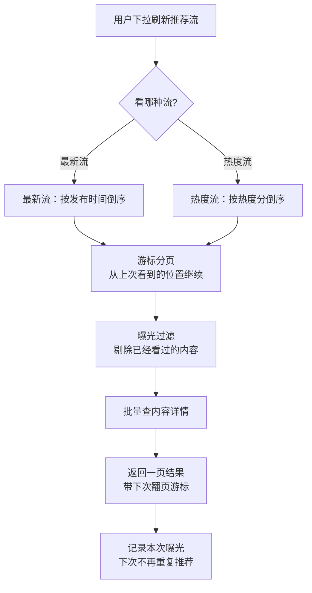
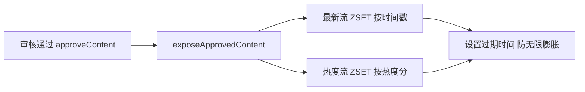

# demo0 链路 03：推荐流链路--Redis ZSET 双池 + 游标分页 + 曝光过滤

> **一句话概括**：推荐流是社区产品**读多写少**的典型场景。项目用 Redis ZSET 维护"最新流"和"热度流"两个有序集合，配合**游标分页**（避免深分页）和**曝光过滤**（避免重复推荐），让用户刷推荐流时毫秒级响应。

---

## 一、链路全景



**写路径**（内容审核通过时）：



---

## 二、问题推演：推荐流为什么这么设计？

### 2.1 三个备选方案对比

| 维度 | 方案 A：MySQL 分页查 | 方案 B：Redis List | 方案 C：Redis ZSET（本项目） |
| --- | --- | --- | --- |
| 响应速度 | 慢（深分页慢） | 快 | 快 |
| 排序能力 | 需 ORDER BY | 只能按插入序 | **按分数排序（时间/热度）** |
| 动态更新 | 每次全量查 | 头插 | **按分数插入，天然有序** |
| 深分页 | OFFSET 越大越慢 | 无 | **游标分页，恒定快** |

**决策理由**：推荐流要支持"最新"和"最热"两种排序，Redis List 做不到按分数排序；MySQL 深分页（OFFSET 10000）性能差。**ZSET 的 score 天然支持排序，且 ZRANGEBYSCORE 游标分页恒定 O(logN)**（O(logN) 的意思是"数据量翻倍，查询时间只增加一点点"，百万条和一万条查询速度几乎一样），完美匹配。

### 2.2 为什么用"游标分页"而不是 OFFSET 分页？

| 分页方式 | 原理 | 问题 |
| --- | --- | --- |
| OFFSET 分页 | `LIMIT 10 OFFSET 1000` | 翻页越深越慢（MySQL 要扫描前 1000 行）；**数据变动时翻页错乱**（新内容插入导致重复/漏页） |
| 游标分页 | `WHERE score < 上次最小值 ORDER BY score DESC LIMIT 10` | 恒定快；**基于"上次看到哪"继续翻，天然免疫新数据插入** |

**核心思想**：游标分页用"上次返回的最后一条的 score"作为下次查询的起点，而不是"跳过 N 条"。推荐流是实时变动的数据，OFFSET 分页会因新内容插入而错乱，游标分页不会。

### 2.3 为什么需要"曝光过滤"？

推荐流如果每次都返回同样的内容，用户会看到重复。项目用 Redis Set 记录"已曝光的内容 ID"，查询时剔除。**这是推荐系统的"去重"基础**，也是"为什么刷着刷着内容不重复"的答案。

---

## 三、核心实现细节

### 3.1 双池结构：最新流 + 热度流

| 池 | Redis Key 模式 | Score | 排序 |
| --- | --- | --- | --- |
| 最新流 | `feed:latest:{type}` | 发布时间戳 | 时间倒序 |
| 热度流 | `feed:hot:{type}:{分片}` | 热度分 | 热度倒序 |

**热度流为什么要分片**（`resolveRecommendHotKey`）：热度分跨度大（新帖 0 分，爆帖几万分），如果所有内容放一个 ZSET，新帖分数低会被"淹没"在底部永远刷不到。**按热度分区间分片**，让不同热度段的内容都有曝光机会。

### 3.2 热度公式：为什么是"点赞×3 + 评论×2 + 收藏×5"？

```java
double hotScore = (likeCount * 3 + commentCount * 2 + collectCount * 5)
                / Math.pow(ageHours + 2, 1.5);
```

| 权重 | 含义 | 为什么 |
| --- | --- | --- |
| 收藏 ×5 | 收藏是"高价值行为" | 用户愿意收藏说明内容有长期价值 |
| 点赞 ×3 | 中等价值 | 表达认可 |
| 评论 ×2 | 参与度 | 评论成本高于点赞 |
| 时间衰减 ^1.5 | 新内容加权 | 老内容热度自然下降，给新内容让位 |

> **面试点**：热度公式是"业务规则"的体现。面试官问"热度怎么算"，你要能讲出**每个权重的业务含义**和**时间衰减的作用**，而不是背公式。

### 3.3 热度对账：为什么"消息只提醒，分数以 MySQL 为准"？

```java
// reconcileHotScore 注释：消息只负责提醒，最终分数始终根据 MySQL 当前计数重新计算
```

点赞/评论/收藏发生时，会发一个"热度更新"事件。消费者收到事件后**不直接累加 Redis 分数**，而是**重新查 MySQL 的点赞数/评论数/收藏数，重算热度分写入 ZSET**。

**为什么**：
1. **幂等**：同一个事件重放多次，结果一样（都是重算）
2. **免疫乱序**：消息乱序不影响最终分数
3. **免疫丢失**：即使某个事件丢了，下次任何事件触发重算都会纠正

**这是"事件驱动 + 状态对账"的经典模式**：事件只负责"提醒该更新了"，真正的状态永远从权威数据源（MySQL）重算。

### 3.4 游标分页的完整实现

```java
// 1. 从 ZSET 取一页（minScore 是上次最后一条的分数，offset 是跳过同分段的条数）
//    reverseRangeByScoreWithScores = 按分数范围倒序取，连分数一起返回
Set<ZSetOperations.TypedTuple<String>> tuples = redisTemplate.opsForZSet()
    .reverseRangeByScoreWithScores(key, 0, minScore, offset, pageSize);

// 2. 记录本次返回的最后一条的 score 和同分段的 offset
// 3. 曝光过滤：剔除已看过的 ID
// 4. 批量查详情，返回 ScrollResult(list, minTime, offset, hasMore)
```

**为什么需要 offset**：如果多条内容分数相同（比如同一秒发布的帖子），只靠 minScore 会漏掉同分段的。**offset 记录"上次在同分数段内跳过了几条"**，保证同分段内容不遗漏。

---

## 四、边界与失败处理

| 场景 | 处理 | 为什么 |
| --- | --- | --- |
| Redis 无该 key（冷启动） | 返回空列表 + hasMore=false | 不阻塞，等 Feed 推送填充 |
| 内容被删除 | Feed DELETE 事件 -> 从 ZSET 移除 | 已删除内容不能出现在推荐流 |
| 内容被驳回 | 审核驳回 -> 从 ZSET 移除 | 违规内容不能曝光 |
| 曝光 Set 无限膨胀 | 设置过期时间 | 只保留近期曝光记录 |
| 热度流 ZSET 无限膨胀 | 设置过期时间 | 只保留近期内容 |

## 五、面试追问详解（问 -> 答 -> 依据）

### Q1：推荐流为什么选 Redis ZSET，不用 List 或者直接查 MySQL？

**面试官为什么问**：数据结构选型是推荐流的第一问，考察你是否真的对比过方案。

**我的回答**：
"三个方案我都对比过。直接查 MySQL：推荐流是高并发读，每次刷都要 ORDER BY + 分页，深分页时 OFFSET 越大扫描越多，DB 顶不住这个读压力。Redis List：快是快，但它只能按插入顺序排列，我们的推荐流要支持'最新'和'最热'两种排序，热度还会动态变化，List 插进去就动不了了。Redis ZSET 的 score 成员分正好满足需求：最新流用时间戳当 score，热度流用热度分当 score，ZRANGEBYSCORE 按分数范围取数据，复杂度稳定 O(logN)，而且分数可以随时 ZINCRBY 更新。写路径上，内容审核通过后 ZADD 进两个池子，读路径完全不打 MySQL。"

**回答的依据**：
- 最新流 score=发布时间戳，热度流 score=热度分，同一个 ZSET 结构复用两种语义
- `recommend` 用 `reverseRangeByScoreWithScores(key, 0, minScore, offset, pageSize)` 游标式读取

---

### Q2：游标分页和传统 OFFSET 分页到底差在哪？

**面试官为什么问**：深分页是后端高频题，考察你是否理解两种分页的本质区别。

**我的回答**：
"差在两个维度。性能：OFFSET 10000 LIMIT 10 意味着数据库要真的跳过前一万条再取十条，页越深越慢；游标分页用'上一页最后一条的分数'做起点，WHERE score < 上次最小值 ORDER BY score DESC LIMIT 10，每页的工作量恒定，第一百页和第一页一样快。正确性：推荐流数据是实时变动的，OFFSET 分页在翻页过程中如果有新内容插入，会导致偏移错乱--用户看到重复或者漏内容；游标分页锚定的是'我已经看到哪里'，新内容插在顶部不影响后面的页，天然免疫这种错乱。对 feed 这种无限下拉的场景，游标分页几乎是唯一正确解。"

**回答的依据**：
- `ScrollResult` 返回 list + minTime + offset + hasMore，下一页请求带上这三个游标参数
- ZSET 的 `reverseRangeByScoreWithScores` 天然支持 score 范围查询

---

### Q3：为什么游标里除了 minScore 还要带 offset？

**面试官为什么问**：这是上一问的延伸，能答上来说明真实现过游标分页，很多候选人这里就卡住了。

**我的回答**：
"因为分数会撞车。比如热度流里多条内容热度分相同，或者最新流里同一秒发布了好几条帖子。假设五条内容都是 100 分，用户第一页看了其中三条，下次查询 WHERE score < 100 就把这五条全跳过了--后面两条永远刷不到。所以游标要带两个值：minScore 定位到'上次看到的分数'，offset 表示'在这个分数段里我已经看过了几条'，下次查询从这个分数段的第 offset 条继续。组合起来才能做到不重不漏。这是游标分页最容易被忽略的边界，不处理就是线上 bug。"

**回答的依据**：
- `recommend` 的查询参数 minScore + offset 组合，`ScrollResult` 回传下一次要用的游标
- Redis 的 reverseRangeByScore 的 offset 参数语义正是'同分数段内跳过 N 条'

---

### Q4：热度公式怎么设计的？每个权重为什么这么定？

**面试官为什么问**：考察业务建模能力，看你是拍脑袋还是有业务逻辑。

**我的回答**：
"基本公式是：热度分 =（点赞数×3 + 评论数×2 + 收藏数×5）除以发布时长的 1.5 次方衰减。权重的业务逻辑是按行为成本排的：点赞是成本最低的表达，权重最低乘 3；评论要打字思考，成本中等乘 2；收藏意味着用户认为内容有长期价值、以后还要回来看，是最强的质量信号，乘 5。分母的时间衰减是指数级的：新内容在前几个小时加分明显，一天后热度大幅衰减，一周后基本沉底--这样推荐流天然保持新鲜度，老爆帖不会永远霸榜。指数 1.5 是调出来的，衰减太快新内容没有积累窗口，太慢旧内容出不去。"

**回答的依据**：
- `calculateHotScore`：`(likeCount * 3 + commentCount * 2 + collectCount * 5) / Math.pow(ageHours + 2, 1.5)`
- 分母加 2 避免刚发布时除以接近 0 的数导致分数爆炸

---

### Q5：热度更新为什么是重算而不是累加？

**面试官为什么问**：这是事件驱动 + 对账模式的核心考点，能区分背答案和懂原理的人。

**我的回答**：
"因为累加在分布式环境下有三种坑。第一不幂等：同一个点赞事件被重放两次，累加会加两次分；第二怕乱序：点赞和取消点赞事件乱序到达，累加的结果取决于到达顺序；第三怕丢失：中间任何一个事件丢了，缓存的热度就永久偏差。重算彻底绕开这三个坑：事件只当作'该刷新了'的提醒，消费者收到后重新查 MySQL 的真实计数，用公式算出分数覆盖写入 ZSET。同一事件重放十次，结果一样；乱序到达，最后一次重算总是对的；丢一个事件，下一个事件的重算会把误差纠正回来。代价是每次多一次 MySQL 读，但换来的是绝对自愈。"

**回答的依据**：
- `reconcileHotScore` 的注释原文："消息只负责提醒，最终分数始终根据 MySQL 当前计数重新计算"
- reconcile 这个命名贯穿 Feed 推送、ES 同步、热度更新三个场景，是项目的统一模式

---

### Q6：曝光过滤是怎么做的？会不会内存爆炸？

**面试官为什么问**：考察推荐去重的实现细节和资源意识。

**我的回答**：
"用 Redis Set 存每个用户已经曝光过的内容 ID，查询推荐流时把取到的一批内容先 SDIFF 掉已曝光的再返回，返回后把本批内容 SADD 进曝光集合。内存方面有两道保险：曝光 Set 和推荐流 ZSET 本身都设置了过期时间，只保留近期数据--推荐流内容本来就在滚动淘汰，一个月前的内容不需要从曝光记录里排除它，因为用户大概率刷不到它了。极端情况下用户狂刷，Set 里也就几万个整数 ID，Redis 完全扛得住。这个设计没上布隆过滤器，因为业务量级用不上，Set 的语义更简单、还能精确删除，不为炫技引入复杂度。"

**回答的依据**：
- `recommend` 流程：取一页 -> 曝光 Set 过滤 -> 批量查详情 -> 回填曝光 Set
- Redis key 均设置 TTL 防止无限膨胀

---

### Q7：热度流为什么要分片？

**面试官为什么问**：考察对推荐公平性和长尾曝光的理解，答得好是加分项。

**我的回答**：
"如果不分片，所有内容按热度分放在一个 ZSET 里，头部效应会非常严重：爆帖几万分，新帖零分，新帖排在几万名之后，用户永远刷不到--等于新内容没有冷启动流量，平台内容生态会僵化。分片的思路是把热度分成几个区间段，比如'爆热区/温热区/新内容区'，每个段一个 ZSET，推荐时从不同段按配比抽取，保证新内容有保底曝光、中等热度内容有机会往上走。resolveRecommendHotKey 根据分数路由到对应的分片 key。本质上这是简化的多级流量池：内容先在新人池里竞争，数据好就晋级到更大的池子。"

**回答的依据**：
- `resolveRecommendHotKey` 按热度分路由到不同分片 key
- 与'最新流'并存本身也是一种兜底：完全按时间给所有新内容平等曝光机会

---

### Q8：内容被删除或驳回了，推荐流里还能刷到吗？

**面试官为什么问**：考察一致性思维和读路径的兜底设计。

**我的回答**：
"两层保障。第一层主动移除：内容删除和驳回都会发 Feed DELETE 事件，消费者从推荐流 ZSET 里 ZREM 掉这个 ID，正常情况下秒级生效。第二层兜底过滤：推荐流查询批量回表查 MySQL 拿详情时，已删除/已驳回的内容查不到或者状态不对，会被过滤掉不返回给用户。也就是说即使 ZREM 消息延迟了或者丢了，用户也看不到已删除的内容，最多是这一页少几条。双保险的逻辑是：缓存清理是优化，数据库状态才是真相，任何读路径最终都要以数据库校验。"

**回答的依据**：
- 删除链路：`deleteContent` 级联删除 + Feed DELETE Outbox + Search reconcile + 向量删除
- 读路径批量查详情时按 audit_status 过滤，数据库状态是最后防线
