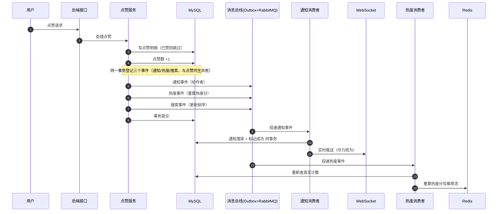
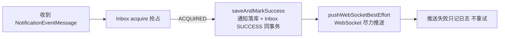

# demo0 链路 04：点赞收藏与通知链路--一次点赞引发的"连锁反应"

> **一句话概括**：用户点一个赞，背后发生四件事：写点赞明细、更新计数、触发热度重算、给内容作者发通知（落库 + WebSocket 实时推送）。**这四件事通过 Outbox 解耦，点赞事务只做最少的写操作，其余全部异步。**

---

## 一、链路全景



---

## 二、问题推演：为什么点赞要拆这么多步？

### 2.1 一次点赞的"副作用"清单

| 副作用 | 谁需要 | 实时性要求 |
| --- | --- | --- |
| 点赞明细落库 | 用户自己（我的点赞列表） | 必须同步（用户要立刻看到"已赞"） |
| 点赞数 +1 | 内容详情页 | 必须同步（用户要立刻看到数字变化） |
| 通知作者"有人赞了你" | 内容作者 | 可异步（晚几秒无感） |
| 热度分更新 | 推荐流排序 | 可异步（最终一致即可） |
| ES 点赞数字段更新 | 搜索结果排序 | 可异步 |

**核心矛盾**：如果所有副作用都在点赞事务里同步做，一次点赞要写 5 张表 + 调 MQ + 调 ES，事务时间长、失败面大。**必须把"用户能感知的"同步做，把"用户无感的"异步做。**

### 2.2 为什么通知要"落库 + WebSocket"双通道？

| 通道 | 特点 | 用途 |
| --- | --- | --- |
| 通知列表（落库） | 可靠、可查询、可持久 | **通知的"真相"**，用户随时可读 |
| WebSocket 推送 | 实时、不可靠 | **通知的"提醒"**，让用户立刻知道 |

**设计思想**：WebSocket 推送是"尽力而为"的提醒，即使推送失败，通知也已落库，用户打开通知列表能看到。**实时推送是锦上添花，落库才是通知的根基**。这避免了"推送失败 = 通知丢失"的可靠性问题。

### 2.3 为什么通知落库和 Inbox SUCCESS 要同事务？

```java
// NotificationConsumeService.saveAndMarkSuccess
// 通知落库 + Inbox 标记 SUCCESS 在同一个事务
```

如果不同事务：通知落库成功但 Inbox 没标记成功 -> 消息重试 -> **重复插入通知**（用户收到两条"有人赞了你"）。同事务保证"要么通知写入 + 标记成功一起完成，要么一起回滚重试"，**消费幂等由数据库事务保证**。

---

## 三、核心实现细节

### 3.1 点赞事务：最少写 + 三个 Outbox

`likeContent` 在一个事务里完成：

```java
// 1. 明细（幂等：已点赞则直接返回）
contentLikedMapper.insert(contentId, userId);
// 2. 计数
contentMapper.incrementLikeCount(contentId);
// 3. 三个 Outbox 与业务同事务（点赞成功事件才存在，点赞回滚事件一起消失）
outboxEventService.createNotificationEvent(...);   // 通知作者
outboxEventService.createHotScoreEvent(...);        // 热度重算
outboxEventService.createSearchReconcileEvent(...); // ES 校准
```

**为什么明细要幂等**：用户可能重复点击"点赞"（前端防抖失效、网络重试）。`INSERT` 前先查是否已赞，已赞直接返回，避免重复计数。

### 3.2 通知消费：落库 + 推送

`NotificationConsumer` 收到通知事件后：



**为什么推送失败不重试**：通知已落库，用户可从列表读取。WebSocket 推送是"实时提醒"，重试的价值低（用户可能已下线），且重试会放大推送压力。**区分"必须可靠"（落库）和"尽力而为"（推送）**。

### 3.3 热度重算：事件只提醒，分数以 MySQL 为准

`HotScoreConsumer` 收到热度事件后，**不累加 Redis 分数**，而是重新查 MySQL 的点赞/评论/收藏数，重算热度分写入 ZSET（详见链路 03 的 3.3 节）。**同一个事件重放多次结果一致，天然幂等。**

---

## 四、边界与失败处理

| 场景 | 处理 | 为什么 |
| --- | --- | --- |
| 重复点赞 | 明细幂等，已赞直接返回 | 防重复计数 |
| 通知消费重复 | 通知落库 + Inbox SUCCESS 同事务 | 防重复通知 |
| WebSocket 推送失败 | 只记日志 | 通知已落库，推送是尽力而为 |
| 热度事件丢失 | 下次任何事件触发重算纠正 | 状态以 MySQL 为准，最终一致 |
| 取消点赞 | 删除明细 + 计数-1 + 通知 Outbox（可选） | 与点赞对称 |

## 五、面试追问详解（问 -> 答 -> 依据）

### Q1：一次点赞要写哪些数据？为什么有的同步有的异步？

**面试官为什么问**：这是主链路的变体问法，考察你能否清晰拆解一个操作的副作用清单。

**我的回答**：
"一次点赞总共有五个副作用：点赞明细落库、内容计数加一、给作者发通知、热度分重算、ES 里点赞数字段更新。拆分标准是用户感知：明细和计数必须同步--用户点完赞刷新页面要立刻看到'已赞'和数字加一，这两步在点赞事务里直接做。通知、热度、ES 用户完全无感，晚几秒毫无影响，所以都通过 Outbox 事件异步做。这样点赞事务只包含两次 MySQL 写，毫秒级完成；如果五个副作用全同步做，事务里要写五张表还要调外部服务，任何一个慢都会拖垮点赞接口，失败面也大。判断哪些副作用可以异步，本质上是在问'用户对这个副作用的延迟容忍度是多少'。"

**回答的依据**：
- `likeContent` 事务内：`contentLikedMapper.insert` + 计数更新 + 三个 `outboxEventService.create*Event`
- 通知/热度/ES 三个事件各自独立消费、独立重试，故障隔离

---

### Q2：为什么通知要落库 + WebSocket 双通道？只用 WebSocket 不行吗？

**面试官为什么问**：考察对'可靠'和'实时'两种不同需求的辨别，这是推送系统的核心设计题。

**我的回答**：
"WebSocket 只能保证'在线用户实时收到'，不能保证'通知一定送达'：用户可能不在线、连接可能断开、推送可能失败。如果通知只走 WebSocket，掉线期间的通知就永久丢了。所以通知的真相必须落库--notification 表是唯一可靠的数据源，用户任何时候打开通知列表都能完整读到；WebSocket 推送只是'在线时的实时提醒'，失败了无所谓，反正落库已经完成。两个通道职责清晰：落库保可靠，推送保实时，互不承担对方的责任。这个分层在方法名上都有体现：saveAndMarkSuccess 是可靠层，pushWebSocketBestEffort 名字里就写着'尽力而为'。"

**回答的依据**：
- `NotificationConsumeServiceImpl.saveAndMarkSuccess`：通知 INSERT + Inbox SUCCESS 同事务
- `pushWebSocketBestEffort`：推送失败只记日志，不影响 Inbox 状态，注释明确写了这个约定

---

### Q3：通知消费怎么防止重复？用户收到两条一样的通知很尴尬。

**面试官为什么问**：消费幂等的场景化提问，比抽象问'什么是幂等'更能检验实战。

**我的回答**：
"三道防线。第一道是业务前置检查：消费逻辑会判断同样的通知是否已存在，存在就跳过业务插入。第二道是 Inbox 表：message_id + consumer_group 有唯一索引，消息重复投递时第二次插入 Inbox 直接被数据库拒绝。第三道是事务绑定：通知落库和 Inbox 标记 SUCCESS 在同一个事务里，不存在'通知写了但没标记'或'标记了但通知没写'的中间态。所以即使 MQ 把同一条消息投递了两次，第一次完整成功后，第二次在 Inbox 层就被拦住，用户永远只看到一条通知。"

**回答的依据**：
- `tb_inbox_event` 的 `UNIQUE(message_id, consumer_group)` 唯一索引是最终防线
- acquire 返回 ALREADY_SUCCESS 时消费者直接 ACK 跳过，业务代码都不用执行

---

### Q4：WebSocket 推送失败为什么不重试？

**面试官为什么问**：反直觉的设计题，考察'不重试'背后的权衡，答出来说明理解推送语义。

**我的回答**：
"三个理由。第一，重试收益低：推送失败大概率是用户不在线或连接断了，立刻重试还是失败；等用户上线了，他打开通知列表自然能看到落库的通知，推送的历史使命已经结束。第二，重试有放大效应：如果推送服务抖动，积压的推送请求叠加重试会形成雪崩，把推送服务和 WebSocket 连接打垮。第三，语义上推送是'提醒'不是'交付'：通知本体已经在库里了，推送丢了不损失任何数据，为不损失数据的通道设计重试机制是过度设计。所以失败就记条日志，让人排查时能看到，仅此而已。"

**回答的依据**：
- `pushWebSocketBestEffort` 异常捕获后仅 log，方法名 BestEffort 明确语义
- 与通知落库的 REQUIRES 事务语义形成鲜明对比：可靠操作用事务，尽力操作用日志

---

### Q5：用户狂点点赞按钮会怎样？

**面试官为什么问**：高频互动场景的并发与幂等考察，很贴近真实故障。

**我的回答**：
"两层防护。入口层：点赞前先查明细，如果已经点过赞直接返回成功，不重复插入也不重复计数--前端按钮置灰失效、网络重试、用户手速快，都挡在这一层。数据库层：即使查明细和插入之间有并发间隙（两个请求同时查到'未点赞'），content_liked 表上(user_id, content_id)的唯一索引会让第二次插入直接失败，事务回滚，计数也不会多加。另外这个接口上有 @RateLimit 注解，单用户短时间超过阈值直接 429，连数据库都不用碰。三层下来，狂点既不会产生脏数据，也不会打垮服务。"

**回答的依据**：
- `likeContent` 先查后插 + 明细表唯一索引兜底
- 点赞接口挂 @RateLimit（scene 区分，防刷）
- 计数与明细在同一事务，插入失败计数回滚

---

### Q6：热度事件丢了，热度分就错了吗？

**面试官为什么问**：延续链路 03 的对账思想，换个场景验证你是否真的理解。

**我的回答**：
"会短暂错，但会自愈。假设点赞的热度事件丢了，缓存里 ZSET 的分数比真实热度低了。但下一个任何互动事件--再来一个赞、一条评论、一次收藏--触发重算时，消费者重新查 MySQL 拿真实计数，算出来的分数会覆盖掉错误值。因为重算的数据源永远是数据库，错误没有机会长期存在，最多持续到下一次互动。更进一步，reconcileHotScore 本身可以定时全量跑，把整个 ZSET 按数据库重算一遍，彻底消除累积误差。这就是对账模式的精髓：单点丢失不破坏最终正确性。"

**回答的依据**：
- 热度计算 `reconcileHotScore` 每次从 MySQL 计数重算，不依赖事件携带的增量
- Outbox 本身已把事件丢失概率压到极低（与业务同事务），对账是第二重保险

---

### Q7：取消点赞和点赞的流程对称吗？有什么不同？

**面试官为什么问**：考察逆向流程的完整性，很多人只做正向忘了逆向。

**我的回答**：
"基本对称但有个不同。对称的部分：取消点赞同样是删明细、计数减一的事务，然后触发热度重算事件、ES 校准事件让缓存和索引跟上。不同的是通知：点赞会给作者发'有人赞了你'，但取消点赞不会发'有人取消赞了你'--这没有业务价值还可能造成困扰，所以取消路径不登记通知事件。另外取消点赞的幂等和点赞一样靠查明细：没点过赞的取消请求直接返回成功。设计逆向流程的原则是：数据一致性必须对称恢复（明细、计数、热度、ES 都要回退），但业务副作用按价值取舍（通知不发）。"

**回答的依据**：
- 取消点赞走类似 `likeContent` 的事务结构，明细删除 + 计数 decrement + 热度/ES 事件
- 通知事件的创建只存在于点赞路径，取消路径无 `createNotificationEvent` 调用

---

### Q8：如果让你优化点赞接口的性能，你会从哪里下手？

**面试官为什么问**：开放性优化题，考察性能优化的方法论和层次感。

**我的回答**：
"先测量再优化，假设瓶颈确认在数据库写上，我会按成本递增的顺序考虑。第一步是批量化：现在一次点赞是明细 INSERT + 计数 UPDATE 两次写，可以合并优化批量场景。第二步是计数异步化：点赞数不必强一致，可以把计数从 MySQL 挪到 Redis INCR，定时批量回写数据库，点赞事务就只剩一次明细插入。第三步是明细走异步：甚至明细都可以先写 Redis List 或本地队列，异步批量落库，接口变成纯内存操作。但每一步都在牺牲一致性换性能，第二步之后'点赞立刻查列表'可能看到旧数据，业务能不能接受要和产品对齐。性能优化的本质是拿不需要的一致性换需要的吞吐量。"

**回答的依据**：
- 当前实现的写路径：明细 + 计数同事务，是强一致但两次写的方案
- 热度和 ES 已经是异步的（Outbox），说明项目已经在'用户无感的副作用异步化'上做了第一层优化
