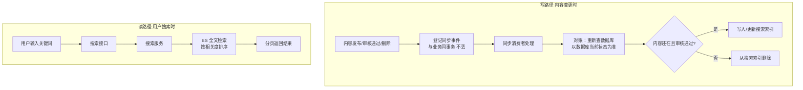

# demo0 链路 05：搜索链路--ES 检索 + 对账式索引同步

> **一句话概括**：搜索是"读"场景，用 Elasticsearch 提供全文检索；但 ES 和 MySQL 是两套存储，内容变更后如何保证 ES 索引和 MySQL 一致？项目用 **SearchReconcile（对账）机制**：事件只带内容 ID，ES 文档的最终状态永远由 MySQL 当前数据决定。

---

## 一、链路全景



---

## 二、问题推演：为什么需要"对账"而不是直接同步？

### 2.1 三个备选方案对比

| 维度 | 方案 A：同步写 ES | 方案 B：MQ 直接同步 | 方案 C：对账式（本项目） |
| --- | --- | --- | --- |
| 一致性 | 强一致 | 最终一致 | 最终一致 |
| 事务耦合 | ES 失败回滚业务 | 消息丢失则索引缺失 | 事件不丢（Outbox） |
| 乱序消息 | - | **可能把已删除的又写回** | **以 MySQL 为准，免疫乱序** |
| 幂等 | - | 需自己实现 | **天然幂等（重算）** |

**决策理由**：同步写 ES 会让业务事务依赖 ES 可用性（ES 挂了业务就失败）；MQ 直接同步有乱序和丢失问题。**对账式**让事件只带 ID，消费者重新查 MySQL 决定 upsert 还是 delete，**无论消息乱序、重复、丢失，最终 ES 都会收敛到 MySQL 的状态**。

### 2.2 为什么事件只带 ID 不带内容？

```java
// SearchReconcile 事件只带 targetType + targetId
outboxEventService.createSearchReconcileEvent(CONTENT, contentId, "AUDIT_APPROVED");
```

**如果事件带内容**：消息里是"发布时的内容"，如果内容后来被编辑，ES 里就是旧内容；如果内容被删除，消息里还有内容，消费者不知道该删。

**如果事件只带 ID**：消费者每次重新查 MySQL 拿最新状态，**ES 永远反映 MySQL 的当前状态**。这是"事件驱动 + 状态对账"的核心--**事件是提醒，状态以数据库为准**。

---

## 三、核心实现细节

### 3.1 对账逻辑：upsert 还是 delete 由 MySQL 决定

```java
public void reconcileSearchIndex(String targetType, Long targetId) {
    // 重新查 MySQL 当前状态
    // 内容存在且审核通过 -> upsert
    // 内容不存在 / 已删除 / 未通过审核 -> delete
    elasticSearchService.upsertByContentId(targetId);
}
```

**为什么审核不通过要 delete**：未通过审核的内容不能出现在搜索结果里。如果内容从"待审"变"驳回"，必须从 ES 删除，否则用户能搜到违规内容。

> **小知识**：upsert 是 update + insert 的合成词，意思是"有这条文档就更新，没有就插入"。对账逻辑里，内容存在且审核通过就 upsert（写入/更新），否则就 delete（删除）。

### 3.2 搜索查询：ES 全文检索

```java
// SearchService.searchContent
// 1. 记录搜索历史（可选）
// 2. ES 查询：BM25 全文检索，按相关度排序
// 3. 分页返回
```

**为什么用 ES 而不是 MySQL LIKE**：
| 维度 | MySQL LIKE '%关键词%' | ES 全文检索 |
| --- | --- | --- |
| 性能 | 全表扫描，慢 | 倒排索引（先分词建"词->文档"映射，查询按词直达），快 |
| 相关度排序 | 无 | BM25 相关度评分 |
| 分词 | 无（整串匹配） | 中文分词 |
| 高亮 | 无 | 支持 |

### 3.3 触发对账的时机

| 时机 | 事件 | 结果 |
| --- | --- | --- |
| 审核通过 | AUDIT_APPROVED | upsert（内容可被搜到） |
| 审核驳回 | AUDIT_REJECTED | delete（违规内容不可搜） |
| 内容删除 | DELETE | delete |
| 内容编辑 | UPDATE | upsert（更新索引） |
| 点赞/收藏 | LIKE/COLLECT | upsert（更新计数影响排序） |

---

## 四、边界与失败处理

| 场景 | 处理 | 为什么 |
| --- | --- | --- |
| ES 写入失败 | SearchReconcile 事件重试（Outbox 梯度） | 最终一致，MySQL 是真相 |
| 消息乱序 | 重新查 MySQL 对账 | 乱序不影响最终状态 |
| 消息重复 | 重算幂等 | 结果一样 |
| 消息丢失 | 下次任何事件触发重算纠正 | 收敛到 MySQL 状态 |
| 搜索无结果 | 返回空列表 + 热门发现兜底 | 提升空结果体验 |

## 五、面试追问详解（问 -> 答 -> 依据）

### Q1：为什么用 Elasticsearch，MySQL 的 LIKE 不行吗？

**面试官为什么问**：搜索选型是引入 ES 的标准理由题，考察你是真理解倒排索引还是跟风上 ES。

**我的回答**：
"LIKE '%关键词%' 有三个致命问题。第一性能：前置通配符让 MySQL 放弃索引走全表扫描，内容表上了百万行一次查询就要几百毫秒起步，并发一上来直接拖垮主库。第二相关性：LIKE 只能判断'包含不包含'，无法回答'哪个结果更相关'--用户搜'校招'，标题带校招的、正文提了一句校招的、校招出现十次的，MySQL 无法区分，但用户的期待是有排序的。第三分词：中文没有天然分词，LIKE 整串匹配搜'如何面试'，内容写'面试该如何准备'就搜不到。ES 的倒排索引先把内容分词建'词->文档'的映射，查询按词直达文档，毫秒级返回；BM25 算法综合词频、文档长度给每个结果打相关度分，天然解决排序；中文分词器把语义单元切开，'面试'和'如何面试'能正确命中。"

**回答的依据**：
- `SearchService.searchContent` 走 `elasticSearchService.searchContent`（ES 查询）
- MySQL 仍是内容真相，ES 只承担检索，职责分离（详见 Q2）

---

### Q2：ES 和 MySQL 的数据一致性怎么保证的？

**面试官为什么问**：双写一致性是上 ES 后的必问题，答不出系统性方案基本过不了。

**我的回答**：
"我们的方案叫对账式同步，三层保障。第一层事件不丢：所有影响搜索可见性的变更--审核通过、驳回、删除、编辑、互动计数变化--都在业务事务里往 Outbox 登记一个 SearchReconcile 事件，变更发生了事件就必然存在。第二层乱序免疫：同步事件只带内容 ID 不带内容本身，消费者收到后重新查 MySQL 拿最新状态，存在且审核通过就 upsert，否则 delete--消息重复、乱序都不影响最终状态，因为每一步都收敛到数据库真相。第三层失败兜底：ES 写入失败按梯度重试，8 次后进死信，管理后台可见可重放。整体是秒级延迟的最终一致，对搜索这个场景完全够用，用户不会因为一条内容晚几秒能被搜到而投诉。"

**回答的依据**：
- `SearchReconcileServiceImpl.reconcileSearchIndex` -> `upsertByContentId` 内部重查 MySQL 决定 upsert/delete
- 触发点全覆盖：approveContent/rejectContent/deleteContent/likeContent/collect 均登记事件

---

### Q3：为什么同步事件只带 ID，不把内容直接放进消息里？

**面试官为什么问**：细节设计题，考察事件驱动架构中'事件语义'的深层理解。

**我的回答**：
"带内容的消息有两个隐患。第一是过期：消息生成时刻的内容快照，消费时可能已经变了--用户发了又改，消息里的标题是旧的，直接写入 ES 就是脏数据；正确做法永远是消费时查库拿最新。第二是无法表达删除：消息带着内容到达消费者，消费者看到'有内容'就 upsert，但这条内容可能已经被删了，消费者无从判断--消息里没有'我已被删除'的字段，就算加了，编辑再删除再编辑的序列也会把状态搞乱。只带 ID 就把'内容是什么'的判断权完全交回数据库：消费者查库，库里有就写，没有就删，消息只承担'这个 ID 该刷一下了'的提醒职责。事件语义越薄，越不容易被时序问题污染。"

**回答的依据**：
- `createSearchReconcileEvent(CONTENT, contentId, reason)` 的 payload 只有标识符和原因，没有内容字段
- Feed 推送的 `reconcileContentFeed` 同样模式，全项目统一

---

### Q4：消息乱序具体会出什么问题？怎么被解决的？

**面试官为什么问**：把抽象的'乱序'落到具体 case，检验是不是真想过这个场景。

**我的回答**：
"举个具体例子：用户发帖，一分钟内又删了。如果 MQ 把'删除'事件先投递、'发布'事件后投递（分区重平衡、消费者重启都可能造成），直接按消息内容处理的话：删除时 ES 里本来就没这条文档，删了个寂寞；随后发布事件到达，消费者看到'新内容发布'，把文档写进 ES--结果已删除的内容出现在搜索结果里，用户点进去 404，这是线上事故级别的脏数据。我们的解法是消费者不信任消息的字面意思：收到发布事件也重新查库，发现这条内容已经不存在了，就什么都不做（或者顺手删一下 ES 里的残留）。消息的先后顺序无所谓，因为每次处理的结论都来自数据库的当前状态，最后一次处理永远收敛到正确状态。"

**回答的依据**：
- `reconcileSearchIndex` 无论收到什么事件，都执行同一个逻辑：查 MySQL -> upsert 或 delete
- 这也是方法名叫 reconcile（对账）而不是 sync（同步）的原因

---

### Q5：审核不通过的内容为什么必须从 ES 删除？

**面试官为什么问**：内容安全题，考察对'可见性'的全域一致性意识。

**我的回答**：
"因为搜索是违规内容的'后门'。正常流播路径上，推荐流、详情页都有审核状态过滤，驳回的内容用户看不到。但如果 ES 里还留着这条文档，用户一搜索就把它捞出来了--等于审核体系在搜索场景失效。所以驳回事件触发的对账逻辑里，ES 侧的动作是 delete：内容状态不是 APPROVED 就不允许存在于索引中。这条规则同样覆盖'先通过后被举报下架'的场景：状态一变，对账事件会自动把文档清掉。可见性控制的原则是：任何一个读取入口，最终都要以数据库的审核状态为准，缓存和索引只是加速层。"

**回答的依据**：
- `upsertByContentId` 的判定逻辑：内容存在 AND audit_status=APPROVED 才 upsert，否则 delete
- 驳回路径 `rejectContent` 同样登记 SearchReconcile 事件，与删除共用对账逻辑

---

### Q6：ES 写入失败会怎么样？会影响业务吗？

**面试官为什么问**：考察故障域隔离意识，答案的核心是'不影响'。

**我的回答**：
"不影响业务，这是架构上刻意保证的。写路径上，ES 同步是 Outbox 异步事件，业务事务（发帖、审核、点赞）的成功完全不依赖 ES 写入成功--ES 集群整个宕机，发帖点赞照常工作，只是新内容暂时搜不到。消费路径上，ES 写入失败只是这条对账事件消费失败，按梯度重试，8 次后进死信等人工处理，不影响其他事件。恢复后，死信重放会补齐错过的同步。唯一受影响的是搜索结果的时效性：故障期间新内容进不了索引，搜索到的可能是旧快照。这个取舍很明确：搜索可用性可以短暂降级，核心业务绝不陪葬。"

**回答的依据**：
- ES 客户端只出现在消费者（SearchReconcileConsumer）里，业务主流程没有任何对 ES 的同步调用
- Outbox 死信 + AdminEventController 人工重放兜底

---

### Q7：对账式同步和直接双写（业务里同时写 MySQL 和 ES）比，优势在哪？

**面试官为什么问**：方案对比题，检验对'为什么不用更直观的方案'的思考深度。

**我的回答**：
"直接双写有三个硬伤。第一耦合可用性：ES 挂了，双写的事务要么回滚业务（ES 故障影响发帖），要么业务成功但 ES 丢失（不一致且无人知晓）--两头堵。第二无重试语义：双写失败就是失败了，没有系统化的重试和死信，靠人肉补数据。第三不幂等：重试双写时，upsert 没问题但任何带条件的更新都可能重复执行。对账式把这些问题一次性解决：业务和事件同事务（可靠登记），消费异步（故障隔离），重查数据库（幂等且免疫乱序），重试加死信（失败可见可处理）。代价是引入了 Outbox 表和调度器的复杂度，以及秒级的同步延迟--对搜索场景，这个代价完全值得。"

**回答的依据**：
- 双写方案在本项目的对照物：点赞计数如果同步双写 ES，ES 抖动会直接影响点赞接口
- Outbox 完整机制见链路 09

---

### Q8：搜索没有结果时怎么优化用户体验？

**面试官为什么问**：产品思维收尾题，技术人能答好这道题会加分。

**我的回答**：
"空结果页不能就一句'没有找到相关内容'，那是死胡同。我们做了热门发现兜底：搜索无结果时返回当前的热门内容聚合，把用户的搜索意图转化为一次浏览发现--用户搜不到想要的，至少能看看大家在看什么。另外搜索历史会记录用户搜过什么，热门发现的数据源之一就是全站的搜索热词，相当于用一个简单机制同时做了空结果兜底和搜索需求的聚合分析。理想状态下还可以做搜索建议、错别字纠正、同义词扩展，但那些要在数据和模型成熟后再上，热门发现是性价比最高的第一层。"

**回答的依据**：
- `SearchService` 的热门发现聚合接口（hotDiscover），基于搜索历史和内容热度
- 空结果 + 兜底推荐的模式在小红书、抖音等社区产品中是标准做法
