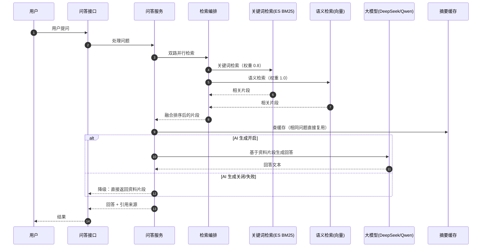

# demo0 链路 06：RAG 问答链路--双路检索 + AI 生成 + 优雅降级

> **一句话概括**：用户提问后，系统先从知识库（ES 全文 + 向量）**双路并行检索**出相关片段，再交给大模型（DeepSeek/Qwen）基于这些片段生成回答。**检索是"事实来源"，AI 是"表达方式"**--AI 只负责组织语言，不负责编造事实，这就是 RAG（检索增强生成）的核心价值。

---

## 一、链路全景



---

## 二、问题推演：为什么用 RAG 而不是直接问大模型？

### 2.1 三个备选方案对比

| 维度 | 方案 A：直接问大模型 | 方案 B：纯检索返回片段 | 方案 C：RAG（本项目） |
| --- | --- | --- | --- |
| 事实准确性 | **会编造（幻觉）**，不知道知识库内容 | 准确但生硬 | **基于检索片段回答，有据可依** |
| 回答体验 | 流畅 | 差（一堆片段） | 流畅 + 可引用 |
| 知识更新 | 依赖模型训练数据 | 实时 | 实时（检索最新内容） |
| 成本 | 高（每次全量生成） | 低 | 中 |

**决策理由**：直接问大模型，模型不知道"这个社区里有什么内容"，会一本正经地编造答案（幻觉问题）；纯检索返回片段，用户看到的是碎片。**RAG 让大模型"先看资料再回答"**，既准确又流畅，还能给出引用来源。

### 2.2 为什么双路检索（BM25 + 向量）？

| 检索方式 | 原理 | 擅长 | 弱点 |
| --- | --- | --- | --- |
| BM25 全文检索 | 关键词匹配 + 词频 | 精确关键词、专有名词 | 同义词、语义相近但字面不同 |
| 向量检索 | 语义相似度 | 语义理解、同义改写 | 精确匹配弱、冷启动 |

**单一检索都有盲区**：用户问"怎么申请校友认证"，如果知识库里写的是"如何通过身份核验"，BM25 可能匹配不上（字面不同），但向量检索能识别语义相近。**双路并行 + 加权融合（es-weight 0.8 / vector-weight 1.0）**，取长补短。

### 2.3 为什么 AI 要"可降级"？

AI 生成是外部依赖（大模型 API），可能超时、限流、故障。如果 AI 挂了整个问答就不可用，体验差。**降级策略**：AI 生成失败时，直接返回检索到的片段列表，用户至少能看到相关内容。**核心功能（检索）不依赖外部 AI，增强功能（生成）可降级**。

---

## 三、核心实现细节

### 3.1 双路并行检索 + 融合

```java
// RagRetrieveFacade：双路并行检索
// 1. ES BM25 检索（es-weight 0.8）
// 2. 向量检索（vector-weight 1.0）
// 3. 按加权分数融合排序
```

**为什么并行**：两路检索互不依赖，并行执行把耗时从"两路之和"降到"两路之最"。**融合权重**（0.8 vs 1.0）是调参结果，向量检索权重略高（语义匹配更符合问答场景）。融合排序的直观理解：每条片段拿"关键词得分 × 0.8 + 语义得分 × 1.0"算总分，按总分从高到低取前几条给大模型。

### 3.2 摘要缓存：相同问题不重复生成

```java
// 相同/相似问题复用缓存，减少 AI 调用成本
```

**为什么缓存**：AI 生成成本高、耗时长。用户反复问同一个问题（比如"怎么注册"），每次都调大模型是浪费。**缓存命中直接返回，省成本 + 提速**。

### 3.3 AI 生成：基于片段，不裸答

```java
// 把检索片段作为上下文，让大模型"基于资料回答"
// 片段不足时明确告知"知识库中未找到相关内容"
```

**关键设计**：大模型的 prompt（给模型的指令文本）里明确"只基于提供的资料回答，资料中没有的不要编造"。**这是抑制幻觉的关键**--不是靠大模型自觉，而是靠 prompt 约束 + 片段兜底。

---

## 四、边界与失败处理

| 场景 | 处理 | 为什么 |
| --- | --- | --- |
| AI 超时/限流 | 降级返回检索片段 | 核心检索不依赖 AI |
| 知识库无相关内容 | 明确告知"未找到" | 不编造 |
| 向量检索冷启动 | BM25 兜底 | 向量索引未建好时全文检索仍可用 |
| 相同问题重复问 | 摘要缓存命中 | 省成本 + 提速 |
| 检索片段过多 | 截断/排序取 topN | 控制 token 成本 |

## 五、面试追问详解（问 -> 答 -> 依据）

### Q1：为什么要用 RAG，直接把问题扔给大模型不行吗？

**面试官为什么问**：RAG 的存在意义是第一问，考察你懂不懂它解决的到底是什么问题。

**我的回答**：
"直接问大模型有两个致命问题。第一是幻觉：模型不知道我们社区里有什么内容，但它会一本正经地编--用户问'怎么申请校友认证'，模型可能编一个根本不存在的流程，用户照着做就出事了。第二是知识时效：模型的训练数据有截止日期，社区里昨天新增的规则它完全不知道。RAG 的解法是'先查资料再回答'：把用户问题先在知识库里检索出相关片段，把这些片段作为上下文喂给模型，要求它只基于资料作答。这样模型的职责从'知识来源'降级为'表达工具'--事实由检索保证，模型只负责把事实组织成流畅的自然语言。准确性和流畅性各归其位。"

**回答的依据**：
- `RagSearchService` 的流程：检索（RagRetrieveFacade）在前，生成（AI）在后，生成依赖检索结果作为上下文
- prompt 约束'只基于提供的资料回答'，双重抑制幻觉

---

### Q2：为什么检索要 BM25 和向量双路并行？

**面试官为什么问**：混合检索是 RAG 的进阶考点，考察对两种检索原理的把握。

**我的回答**：
"因为两种检索的能力是互补的，各有盲区。BM25 是关键词匹配：擅长精确命中--用户搜'身份证过期'，含这个词的内容直接捞出来，专有名词、编号这类精确查询它无可替代。但它不懂语义：内容写的是'证件过了有效期'，字面上没有'身份证过期'，BM25 就匹配不上。向量检索反过来：把文本编码成语义向量，'身份证过期'和'证件过了有效期'在向量空间里距离很近，能匹配上；但它的精确匹配能力弱，专有名词容易被语义稀释。单用任何一路都有漏召回，双路并行合并，精确的和语义的都能召回。我们配置的融合权重是 es-weight 0.8、vector-weight 1.0，向量略高，因为问答场景语义匹配的价值更大。"

**回答的依据**：
- `RagRetrieveFacade` 并行调用 ES BM25 检索和向量检索，按权重融合排序
- 两个检索通道互不依赖，并行执行把延迟压到两路中较慢的那个

---

### Q3：AI 生成挂了怎么办？整个问答功能就不可用了吗？

**面试官为什么问**：第三方依赖（大模型 API）的降级设计，AI 应用的必答题。

**我的回答**：
"不会，这个功能在设计上就是可降级的。链路分两段：检索段和生成段。检索段是我们的核心能力，只依赖 ES 和向量库，完全不碰外部 AI。生成段才是调大模型 API 的地方，它有独立开关：大模型超时、限流、故障时，可以配置降级--直接把检索到的片段列表返回给用户，用户看到的是'相关内容'而不是'AI 总结'。体验从'有人给我念答案'退化成'我自己翻资料'，但功能没有中断。这个设计的判断标准是：检索是问题域的必需品，AI 生成是体验增强品--必需品不依赖增强品的可用性。"

**回答的依据**：
- 配置项 `aiAnswer.enabled` 控制 AI 生成开关，关闭时纯检索返回
- AI 调用失败不影响已经完成的检索结果返回，异常被隔离在生成段

---

### Q4：怎么抑制大模型的幻觉？

**面试官为什么问**：幻觉是 LLM 应用的核心痛点，考察工程化的抑制手段而不是空谈。

**我的回答**：
"三层抑制。第一层在检索：RAG 本身就是反幻觉的--模型看到的上下文是真实检索到的社区内容，不是它自己的参数记忆，事实来源被锚定了。第二层在 prompt：系统提示明确要求'只基于提供的资料回答，资料中没有的信息不要编造'，并且在片段不足时明确输出'知识库中未找到相关内容'而不是硬答。第三层在产品：回答会附上引用的来源片段，用户可以核对--这既是对模型的约束（知道答案会被溯源，生成时更贴近资料），也是给用户的信任机制。当然这些不能百分之百消除幻觉，但把幻觉率压到可用水平，剩下的长尾靠用户反馈迭代。"

**回答的依据**：
- prompt 模板包含资料上下文和'不得编造'的约束，无相关内容时输出标准话术
- 返回结构包含引用片段，前端可展示来源

---

### Q5：为什么相同的问题要缓存？缓存的是什么？

**面试官为什么问**：AI 成本控制题，RAG 落地时省钱的关键手段。

**我的回答**：
"缓存的是'问题到答案'的完整映射：检索路径 + 检索到的片段 + AI 生成的回答。缓存的动机是成本和延迟双优化：一次 RAG 问答的成本包括向量检索、ES 检索、大模型 token 三块，延迟是三段之和；社区问答有很强的热点聚集性--'怎么注册''怎么认证'这类问题会被反复问，每次都全链路跑一遍是纯浪费。命中缓存直接返回，毫秒级响应，零成本。设计上要注意两点：一是缓存 key 用原始问题文本，同题才命中，改一个字就重新计算；二是缓存的 TTL 要平衡新鲜度，知识库内容更新后缓存可能过期--我们接受短暂陈旧，因为高频问题的答案通常稳定。"

**回答的依据**：
- RAG 链路的 summary cache 机制：相同问题复用历史摘要
- 检索段（数据新鲜）和生成段（表达稳定）的缓存价值不同，生成段更值得缓存

---

### Q6：向量检索冷启动怎么办？

**面试官为什么问**：考察对'检索双路'其中一路不可用时的兜底意识。

**我的回答**：
"向量检索依赖内容预先做 embedding 建索引，新内容、或者系统刚上线索引还没建好时，向量路是空的。这时候 BM25 就是兜底：全文检索不依赖 embedding，内容入库就能搜到，只是召回上限低一些。我们内容进索引的链路也保证了及时性：内容审核通过后，除了 ES 索引和推荐流，还会触发向量索引的写入，正常情况下秒级就能被向量检索召回。极端情况比如向量服务整体故障，退化为纯 BM25 检索，问答功能仍然可用，只是语义匹配能力暂时缺失。还是那个原则：双路设计天然互为兜底。"

**回答的依据**：
- 审核通过的 `approveContent` 链路里包含向量索引写入，与 ES 索引、推荐流并行触发
- 双路检索的融合层在一路为空时自然退化为单路结果

---

### Q7：检索片段太多会有什么问题？怎么控制？

**面试官为什么问**：上下文窗口和成本的实操题，做过 RAG 的人都知道这里的坑。

**我的回答**：
"三个问题。第一是成本：大模型按 token 计费，上下文塞二十个片段，每个片段一千字，一次调用就是两三万 token，成本翻着涨。第二是效果：上下文太长模型反而'迷失在中间'--关键信息被淹没在无关片段里，回答质量下降，这是有论文支撑的现象（lost in the middle）。第三是延迟：输入越长生成越慢。所以要做截断和筛选：双路检索各自取 topN，融合后再排序取前几个片段，总长度控制在阈值内；片段本身也做切片（chunk），超长内容切块后只取相关的块。本质是在'给模型的证据充分性'和'成本延迟'之间找平衡点。"

**回答的依据**：
- rag 包的 chunk 模块负责内容切片，检索层按权重排序后截断 topN
- chunk 化让长内容的相关段落能被精准召回，而不是整篇塞进上下文

---

### Q8：如果要把这个 RAG 做得更好，你会往哪些方向迭代？

**面试官为什么问**：开放演进题，考察技术视野和对自己系统短板的认知。

**我的回答**：
"四个方向按优先级排。第一是查询改写：用户的问题往往口语化甚至有错别字，先用小模型把问题改写成适合检索的形式（补全省略、纠正错字、拆分多问），检索召回率会明显提升，这是性价比最高的一步。第二是重排序：现在的融合是静态权重，可以引入一个 rerank 模型对初筛片段精排，相关性判断从'字面和向量相似'升级到'语义细粒度匹配'。第三是知识库治理：把社区内容蒸馏成结构化的 QA 对和高密度摘要，比原始帖子的信噪比高得多。第四是评测体系：建一个 golden 测试集，每次改动跑一遍检索命中率和回答准确率，让迭代有量化依据。这些方向的前提是当前链路的可观测数据--哪些问题检索空了、哪些回答用户点了踩，这些日志现在就该埋好。"

**回答的依据**：
- 当前实现的融合权重是静态配置（0.8/1.0），rerank 是自然的下一步
- chunk + summary cache 的现有结构为知识库蒸馏留了扩展点
