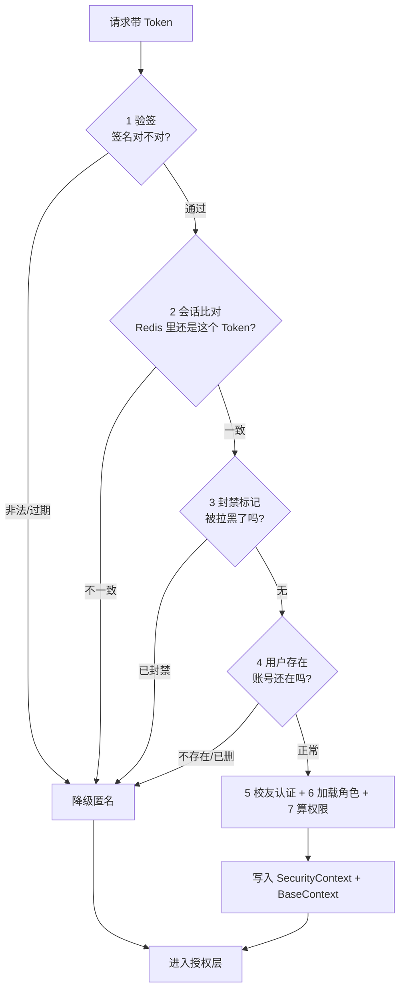
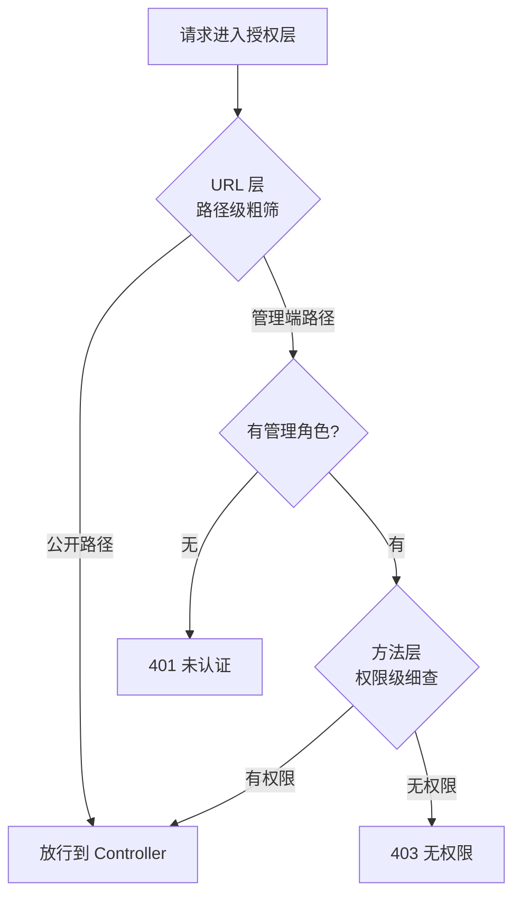

# demo0 链路 07：认证与授权链路--从"你是谁"到"你能做什么"

> **一句话概括**：认证回答"你是谁"（验 Token），授权回答"你能做什么"（查权限）。项目用 **JWT + Redis 会话**做认证（验签不查库 + 可随时失效），用 **RBAC 双层授权**（URL 粗粒度 + @PreAuthorize 细粒度）做授权。

---

## 一、链路全景

**第一步：认证**（过滤器七步校验，回答"你是谁"）

**第二步：授权**（双层拦截，回答"你能做什么"）

---

## 二、问题推演：认证方案怎么选？

### 2.1 三个备选方案对比

| 维度 | 纯无状态 JWT | Session/Cookie | JWT + Redis 会话（本项目） |
| --- | --- | --- | --- |
| 水平扩展 | 天然支持 | 需共享存储 | 天然支持 |
| 封号立刻生效 | **做不到** | 可以 | **可以（删 Redis 键）** |
| 单设备登录 | 做不到 | 可以 | 可以（Redis 只存最新 Token） |
| 每请求开销 | 无 | 无 | 一次 Redis GET |

**决策理由**：社区产品必须支持"封号立刻生效"（内容安全硬需求），纯 JWT 出局；小程序端 Cookie 别扭，Session 出局。**JWT 承担"自证身份"（验签即信任），Redis 承担"随时翻脸"（可撤销）**，各取所长。

### 2.2 为什么认证失败"降级匿名"而不是返回 401？

推荐流/搜索要求"匿名可访问 + 带 Token 时返回个性化数据"。如果 Token 过期就返回 401，用户会被强制登出，体验差。**正确语义**：坏 Token 当作"未登录"处理，返回通用数据。**过滤器负责"尽最大努力认证"，授权层负责"该拒绝时拒绝"**--`/admin/**` 等强认证路径由授权层拦截匿名访问返回 401。

### 2.3 为什么 RBAC 而不是 is_admin？

旧模型只有 `is_admin` 布尔，只能回答"是不是管理员"，无法细分十种管理能力（删帖、封号、改角色、重放事件...）。**RBAC 的"用户-角色-权限"两级间接**：角色授予走数据库（运营可操作），角色含哪些权限走代码 `RolePermissionMapping`（开发控版本）。**角色是运营数据（库），权限是代码契约（码）**。

---

## 三、核心实现细节

### 3.1 七步校验链（每步挡一类攻击）

| 步骤 | 检查 | 挡住的攻击 |
| --- | --- | --- |
| 1 | jjwt 验签 + 过期（jjwt 是 Java 的 JWT 库，验签=用密钥验证签名真伪） | 伪造/过期 Token |
| 2 | Redis 会话比对 | 旧 Token（被顶号）、登出后 Token |
| 3 | Redis 封禁标记 | 已封禁用户 |
| 4 | DB 用户存在性 | 已注销用户 |
| 5 | DB 软删标志 | 被软删用户 |
| 6 | 校友认证状态（Redis 缓存 12h） | 决定 VERIFIED_USER 角色 |
| 7 | user_role 表加载角色 | RBAC 数据来源 |

**角色组装**：`roles = [USER] + [VERIFIED_USER 若认证] + [user_role 表 ACTIVE 角色]`，再经 `RolePermissionMapping` 算出权限集合。

### 3.2 双写双清：为什么必须清理？

过滤器同时写 `SecurityContext`（Spring Security 的"当前用户"容器，供授权判断）和 `BaseContext`（项目自定义的"当前用户"容器，兼容存量 59 处调用），finally 中**双清**。**为什么必须清**：Servlet 线程池复用线程，不清会"身份串号"--上一个用户的身份泄漏给下一个请求，这是最经典的越权隐患。Security 的 ThreadLocal 自动清，自定义 BaseContext 必须手动清。

### 3.3 双层授权：为什么两层都要？

| 层 | 机制 | 粒度 | 例子 |
| --- | --- | --- | --- |
| URL 层 | authorizeHttpRequests | 路径前缀 | /admin/** 需管理角色 |
| 方法层 | @PreAuthorize | 单接口单权限 | grant/revoke 需 role:manage |

**只留一层的退化**：只有 URL 层 -> 管理端内部无隔离（审核员能改角色）；只有方法层 -> 每个接口要记得加注解，漏一个就是漏洞。**URL 层防线外移（省资源），方法层最小权限（防越权）**。

### 3.4 角色变更即时生效

角色变更后，`afterCommit` 回调删除该用户 Redis 登录态 -> 下次请求认证失败 -> 降级匿名 -> 管理端 401。**为什么 afterCommit 而不是事务内删**：事务内删 Redis 后 MySQL 回滚，登录态被"误伤"（角色没变却要重登）。afterCommit 保证"只有数据库真正提交了才失效会话"。

---

## 四、边界与失败处理

| 场景 | 处理 | 为什么 |
| --- | --- | --- |
| Redis 全挂 | 认证链第 2 步失败 -> 全员降级匿名 -> 管理端全 401 | 安全优先，宁可不可用不可越权 |
| Token 过期访问推荐流 | 降级匿名返回通用数据 | 可选认证三态 |
| Token 过期访问管理端 | 401 | 强认证路径由授权层兜底 |
| 被降权用户继续操作 | afterCommit 删会话 -> 下次请求 401 | 无需等 Token 过期 |
| 重复授予角色 | 唯一索引 (user_id, role_code) 兜底 | 数据库层幂等 |

## 五、面试追问详解（问 -> 答 -> 依据）

### Q1：JWT 加 Redis，这不就退化成 Session 了吗？

**面试官为什么问**：这是 JWT + Redis 方案最尖锐的质疑，答好了证明你理解两者本质区别。

**我的回答**：
"表面看像，本质不同。Session 的语义是'状态完全在服务端'：每个请求都要回 Session 存储查一次完整的用户状态，存储挂了认证全挂。我们的 JWT + Redis 是分层的：JWT 验签承担身份可信的证明--签名是对的、没过期的，这个判断在本地完成，不依赖任何外部服务；Redis 只承担撤销语义，存的是'这个用户当前的 Token 是什么'这一个字符串。关键差异在故障行为：Redis 挂了，验签依然通过，只是撤销检查失效，已登录用户降级继续用，直到 Token 过期；Session 存储挂了，所有人都得重新登录。换句话说 Redis 在我们的架构里是增强件不是必需件，拿掉它系统退化但可用，Session 架构里存储是命根子，拿掉就死。这个'可退化'的属性是设计出来的。"

**回答的依据**：
- `TokenAuthenticationServiceImpl` 七步链：验签在前（本地计算），Redis 会话比对在后（增强检查）
- Redis 异常时验签已通过的用户仍可完成基本认证路径

---

### Q2：Token 过期了，为什么推荐流返回正常数据而不是 401？

**面试官为什么问**：考察'可选认证'这个非常规设计，能讲清楚的都是真思考过三态语义的。

**我的回答**：
"因为推荐流对认证的需求是可选的：匿名用户能看通用推荐，登录用户看带点赞态的个性化数据。Token 过期的用户本质上等价于匿名用户，正确语义是'当作未登录返回通用数据'，让用户无感继续刷--如果返回 401 强制弹登录，用户刷得正开心被打断，体验是毁灭性的。但同一个过期 Token 去访问管理端，得到的就是 401，因为管理端是强认证场景。所以'认证失败怎么响应'不是一个全局决定，而是由资源对认证的依赖强度决定：过滤器只负责'尽力认证'，三种结果（认证成功/匿名/坏 Token 降级匿名）都放行，'该不该拒绝'交给授权层按路径判断。职责分离之后，这个看似矛盾的行为就自然成立了。"

**回答的依据**：
- `OptionalJwtAuthenticationFilter` 认证失败走降级匿名分支，不抛 401
- `/admin/**` 由 `authorizeHttpRequests` 拦截匿名访问返回 401，公开路径放行

---

### Q3：SecurityContext 和 BaseContext 双写，为什么要清理？不清理会怎样？

**面试官为什么问**：ThreadLocal 泄漏是 Web 层经典事故，考察对线程池复用的理解。

**我的回答**：
"会串号。Tomcat 是线程池模型，线程处理完一个请求不销毁、回到池里处理下一个请求。ThreadLocal 是绑定在线程上的，如果请求结束不清 SecurityContext 和 BaseContext，下一个复用这个线程的请求会读到上一个用户的身份--A 用户刚操作完，B 用户的请求在这个线程上被当成 A 执行，这是最严重的越权事故。清理逻辑在过滤器的 finally 块里：SecurityContextHolder 有 Spring Security 自己的清理机制，但 BaseContext 是我们自定义的 ThreadLocal，Spring 不管它，必须手动 remove。双写就要双清，缺一个都是漏洞。这也是我 review 代码时最优先检查的点：任何往 ThreadLocal 塞请求级数据的地方，必须有对应的清理。"

**回答的依据**：
- `OptionalJwtAuthenticationFilter` 的 finally 块：`SecurityContextHolder.clearContext()` + `BaseContext.remove()` 成对出现
- 项目从拦截器时代就保留 BaseContext（59 处调用），双写双清是绞杀者迁移的兼容层

---

### Q4：角色和权限的映射为什么放代码里，不放数据库？

**面试官为什么问**：考察配置驱动的边界意识，'什么都放数据库'和'什么都硬编码'都是坑。

**我的回答**：
"因为权限字符串是代码契约，不是运营数据。@PreAuthorize 注解里写的是 hasAuthority('role:manage') 这样的硬编码字符串，它必须和 RolePermissionMapping 里的权限常量逐字匹配才有效。如果映射放数据库，某天运营改错了权限名，授权会静默失效--代码不报错、编译不报错，功能就是莫名不让用，排查起来非常痛苦。放代码里，权限常量定义在 PermissionConstants 类中，注解和映射引用同一个常量，重构时编译器兜底。而'哪个用户有什么角色'是运营随时要变的业务数据，放数据库。这条分界线的判断标准：跟着代码逻辑走的放代码，跟着人走的放数据库。角色入库、权限入码，各得其所。"

**回答的依据**：
- `RolePermissionMapping` 是静态代码块初始化的不可变 Map，`PermissionConstants` 统一定义权限常量
- `tb_user_role` 表只存 user_id + role_code，角色授予/撤销是运营操作

---

### Q5：为什么 URL 层和 @PreAuthorize 方法层两道授权都要？

**面试官为什么问**：考察纵深防御的授权设计，只答一层的人没做过多角色系统。

**我的回答**：
"两层解决不同的问题。URL 层是粗粒度的防线外移：/admin/** 整个前缀要求管理角色，非法请求在过滤器链就被 401/403 挡住，根本不会进到 Controller，不消耗业务资源。方法层是最小权限：同在 /admin/ 下，内容审核员和管理员能做的操作完全不同--审核员能删帖但没有 role:manage 权限，调授予角色的接口会被 @PreAuthorize 拦截。只留 URL 层，管理端内部就是'进了门都是老大'，审计员能封号、运营能改角色，权限粒度退化成布尔值。只留方法层，每个接口都要记得加注解，漏一个就是漏洞--我们项目历史上就出过注解没注册的认证漏洞，这就是当初迁移 Spring Security 的直接原因。两层各挡一类风险，缺一不可。"

**回答的依据**：
- `SecurityConfiguration` 的 `authorizeHttpRequests`：/admin/** 要求管理角色之一
- `AdminRoleController` 的 grant/revoke 方法挂 `@PreAuthorize("hasAuthority('role:manage')")`
- 历史漏洞：@RequireAuth 注解存在但 AuthInterceptor 未注册（迁移导火索）

---

### Q6：给管理员降权之后，他手里的旧 Token 还有效吗？

**面试官为什么问**：无状态认证的'权限即时生效'是经典难题，考察你是不是真的解决了。

**我的回答**：
"有效最多一个请求的时间。JWT 本身改不了，Token 里带的旧角色会一直存在到过期，但我们不让它有机会生效：撤销角色的业务事务提交后，afterCommit 回调会删掉这个用户在 Redis 里的登录会话。他下一次请求走到认证链的会话比对步骤时，Redis 里已经没有他的 Token 了，认证失败降级匿名，访问管理端直接 401。所以整个链路是：角色变更落库 -> 会话失效 -> 下次请求重新认证 -> 新 Token 只带新角色。从数据角度权限是即时的，从攻击者角度，他手里那个七天的 Token 在降权后立刻变成废纸。"

**回答的依据**：
- `AdminRoleServiceImpl` 的 revokeRole 在 `TransactionSynchronization.afterCommit` 中删除 `login:token:{userId}`
- 认证链第二步会话比对：Redis 无此 Token 即认证失败

---

### Q7：为什么删会话要放在 afterCommit，事务里直接删不行吗？

**面试官为什么问**：事务与外部系统交互的经典时序题，答对说明真踩过或真想过。

**我的回答**：
"事务里删会犯'误伤'错误。假设在事务内删 Redis：撤销角色的 SQL 执行了、会话也删了，然后事务在提交前的最后一步失败了回滚--数据库里角色还在，但用户的登录态已经没了。用户什么都没做错，却被强制下线重新登录，这是无故伤害。afterCommit 的语义是'事务真正提交成功后才执行'：数据库变更落盘了，才去失效会话。这时即使删 Redis 失败，方向也是安全的--角色已经撤了但旧会话多活了一小会儿，用户重新认证即恢复，不一致是短暂的、可自愈的；反过来的不一致（角色没变但会话没了）是不可自愈的用户伤害。做跨系统操作时，我把这个原则总结为：宁可让缓存多活，不可让用户白白受损。"

**回答的依据**：
- `TransactionSynchronizationManager.registerSynchronization` + afterCommit 回调删除会话
- 对比：如果事务回滚，afterCommit 不执行，用户会话完好

---

### Q8：Redis 全挂了，认证系统什么表现？

**面试官为什么问**：故障推演题，考察对整个依赖链的极端情况推演能力。

**我的回答**：
"分用户群看。已登录用户：Redis 挂了，认证链的会话比对失败，所有人降级为匿名--普通用户刷推荐流无感（本来就是匿名也能看），但个性化数据没了，管理端全部 401，管理员进不了后台。新登录用户：登录本身要写 Redis 会话，登录接口直接失败。限流和封禁也依赖 Redis，但方向是安全的：限流器按 failClosed 语义拒绝危险接口，防刷保护反而升级为'宁可错杀'。总体评估：Redis 故障时系统退化为'只读的匿名服务'，核心浏览功能可用，写操作和管理功能停摆，但不存在任何越权窗口--所有降级方向都是收紧权限而不是放大权限。这是安全系统的底线设计：故障时的默认行为是拒绝而不是放行。"

**回答的依据**：
- 认证链第二步失败即降级匿名，匿名访问 /admin/** 被 URL 层拦截为 401
- 限流 failClosed=true 的接口在 Redis 故障时全部拒绝（链路 08）
