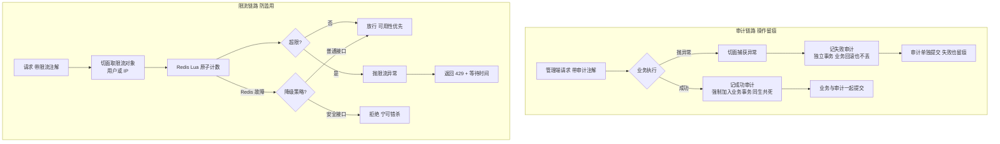
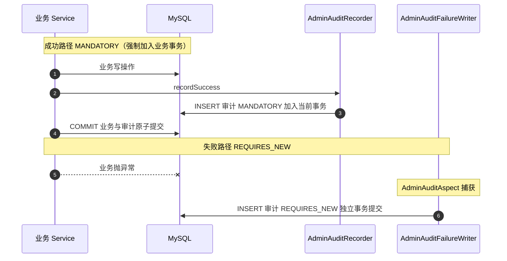

# demo0 链路 08：审计与限流链路--"留痕"与"防滥用"两道防线

> **一句话概括**：审计让"谁在什么时候对什么对象做了什么"变成一条 SQL 就能回答的问题（双事务模型保证不可抵赖）；限流用注解 + AOP + Redis Lua 原子计数挡住脚本刷接口（failClosed 让每个接口自己决定降级语义）。

---

## 一、链路全景



---

## 二、问题推演

### 2.1 审计：为什么 log.info 不够？

| 缺陷 | 后果 |
| --- | --- |
| 业务回滚吞日志 | 日志说"封号成功"，数据库却没封--**审计失去法律效力** |
| 不可查询 | 想查"谁动过帖子 123"，只能 grep 服务器日志 |
| 信息不全 | 没有统一字段（谁、何时、IP、前后快照） |

**核心矛盾**：审计的两种结果有相反的事务诉求--**成功审计必须与业务同事务**（防"审计说成功但业务回滚"的假账），**失败审计必须独立于业务事务**（业务回滚不能吞掉审计）。单一事务策略无法同时满足，所以拆成两条路径。

### 2.2 限流：为什么自己做而不是上网关？

项目无独立网关，限流必须在应用内做。三个子问题：
1. **切入点**：Filter / Interceptor / AOP 注解 -> 选 **AOP 注解**（贴方法上，所见即所得，可直接读 SecurityContext）
2. **计数器放哪**：JVM 内存 / Redis -> 选 **Redis**（多实例共享，Lua 原子）
3. **Redis 挂了怎么办**：拒绝 / 放行 -> 用 **failClosed 参数**让每个接口自己决定

**为什么固定窗口而不是滑动窗口/令牌桶**：防护目标是"挡脚本刷接口"而非"精确整形流量"，固定窗口的边界突刺（100/分钟在边界两秒放过 200 个）对安全场景无关紧要，**简单性胜过精确性**。

---

## 三、核心实现细节

### 3.1 审计双事务模型



| 传播行为 | 语义 | 在审计中的角色 |
| --- | --- | --- |
| MANDATORY | 必须已存在事务，否则抛异常 | recordSuccess 强制寄生业务事务，防假账 |
| REQUIRES_NEW | 挂起当前事务开新事务 | recordFailure 独立提交，防吞日志 |

> **MANDATORY 的价值**：如果 recordSuccess 用默认 REQUIRED，某天在事务外调用它，审计会"静默地"写进独立事务，回到假账问题。MANDATORY 把"必须同事务"变成运行时强制约束。**用传播行为表达架构意图，是事务设计的高级用法。**

### 3.2 审计字段即证据链

| 字段 | 来源 | 取证价值 |
| --- | --- | --- |
| request_id | X-Request-Id 或 UUID，唯一索引 | 串联一次请求，防抵赖锚点 |
| operator_id / roles | SecurityContext | 谁、以什么身份 |
| action / target | @AdminAudit 注解 + SpEL（Spring 表达式，从方法参数里取值） | 对什么做了什么 |
| before/after_summary | 业务快照（限长 2000 字） | 前后状态对比 |
| result_status / error | 成功/失败路径填充 | 操作结果 |
| client_ip / ua | RequestContextHolder | 从哪发起 |

### 3.3 限流 Lua 原子性

```lua
-- rate_limit.lua：INCR + 首次 EXPIRE + 返回三元组，单线程原子执行
local current = redis.call('INCR', KEYS[1])
if current == 1 then
    redis.call('EXPIRE', KEYS[1], ARGV[1])
end
local ttl = redis.call('TTL', KEYS[1])
local allowed = current <= tonumber(ARGV[2])
return { allowed and 1 or 0, current, ttl }
```

**为什么必须 Lua**：INCR 和 EXPIRE 分开发送有竞态--INCR 成功但 EXPIRE 未执行（进程崩溃），key 永不过期，**计数器只增不减，接口永久 429**。Lua 在 Redis 单线程内原子执行"读-改-写"，一次往返完成判断。

### 3.4 failClosed：每个接口自己决定熔断语义

```java
@RateLimit(scene = "login:password", limit = 5, windowSeconds = 300, failClosed = true)  // 登录防爆破
@RateLimit(scene = "content:publish", limit = 10, windowSeconds = 60, failClosed = true) // 发帖防刷
@RateLimit(scene = "search", limit = 30, windowSeconds = 60, failClosed = false)         // 搜索可降级
```

| failClosed | 语义 | 适用 |
| --- | --- | --- |
| true | Redis 挂 -> 全部拒绝 | 防滥用是接口存在前提（登录、发帖） |
| false | Redis 挂 -> 全部放行 | 限流只是保护性优化（搜索） |

> **面试高频**："限流器自己成为可用性单点怎么办？"--答案就是 failClosed 二分：**安全组件的降级策略由业务属性决定，而不是组件统一决定**。

---

## 四、边界与失败处理

| 场景 | 处理 | 为什么 |
| --- | --- | --- |
| 审计失败但业务成功 | 同事务回滚，宁可业务失败不留假账 | 强一致取舍 |
| 业务失败但审计失败 | REQUIRES_NEW 独立提交，审计必落库 | 失败也要留痕 |
| 限流 Redis 故障 | failClosed 决定拒绝/放行 | 降级语义按接口声明 |
| 限流超限 | 429 + Retry-After 头 | 客户端知道等多久 |
| 审计表膨胀 | 低频管理操作 + 单行 INSERT | 非瓶颈 |

## 五、面试追问详解（问 -> 答 -> 依据）

### Q1：MANDATORY 和 REQUIRED 的传播行为有什么区别？什么场景用 MANDATORY？

**面试官为什么问**：Spring 事务传播行为是高频题，但 MANDATORY 的使用场景能答出来的人不多。

**我的回答**：
"REQUIRED 是有事务就加入、没有就新建，是最宽容的默认值；MANDATORY 是必须已经存在事务，否则直接抛异常，是最严格的约束。区别在于对'意外情况'的处理：REQUIRED 会静默兜底（没事务就自己开一个），MANDATORY 会立刻失败暴露问题。我们用 MANDATORY 的场景是审计的成功记录：recordSuccess 必须寄生在业务事务里，与业务同生共死，单独存在没有意义还危险--如果哪天有人在事务外调用它，REQUIRED 会让审计'静默地'写进独立事务，业务回滚了审计还在，形成假账；MANDATORY 直接抛异常，开发第一时间就知道调用姿势错了。用一句话总结：MANDATORY 是把架构约定（必须同事务）编码成运行时强制的手段，它不是让代码更宽容，是让错误更早暴露。"

**回答的依据**：
- `AdminAuditRecorderImpl.recordSuccess` 标注 `@Transactional(propagation = Propagation.MANDATORY)`
- 对照组：`AdminAuditFailureWriter` 用 REQUIRES_NEW，两者构成审计双事务模型

---

### Q2：REQUIRES_NEW 挂起原事务，两个事务看到的数据一致吗？

**面试官为什么问**：REQUIRES_NEW 的隔离性是深水区，考察数据库连接和隔离级别的底层理解。

**我的回答**：
"不一致，而且这正是我们需要的。REQUIRES_NEW 会挂起当前事务、从连接池拿一个新连接开新事务，两个事务各自有各自的隔离级别视图。具体到审计场景：业务事务标记回滚时（比如驳回操作抛了异常），失败审计的 REQUIRES_NEW 事务在另一个连接上--业务事务未提交的任何中间状态它看不到，业务回滚也不影响它已经提交的审计记录。如果不隔离会怎样？失败审计跟着业务事务走，业务一回滚审计也没了，'谁在什么时候做失败了什么'这个最关键的证据就丢了。代价是新连接占用连接池资源，如果外层事务持有行锁、新事务又试图拿同一行锁会死锁--所以失败审计只做 INSERT 不碰业务行，从设计上避开死锁可能。"

**回答的依据**：
- `AdminAuditFailureWriter.recordFailure` 用 REQUIRES_NEW 独立提交，只 INSERT 审计表
- 审计表与业务表无外键约束，独立插入不涉及业务行锁

---

### Q3：如果审计写入失败，但业务成功了，怎么办？

**面试官为什么问**：这是双事务模型的极端 case，考察强一致取舍的边界思考。

**我的回答**：
"这种情况系统会让整个操作失败。成功审计用 MANDATORY 寄生在业务事务里：业务 SQL 执行了、审计 INSERT 时数据库满了或者约束冲突，异常向上抛，整个事务回滚--帖子状态没改、审计也没写，两边一致地失败。用户侧表现为操作失败重试。听起来苛刻，但这是有意为之的取舍：成功审计的本质是'宣称操作成功'的正式记录，如果允许'操作成功但审计缺失'，审计体系就有了缺口，合规场景下一个没有留痕的成功操作比一次失败的操作更危险。宁可让业务少成功一次，不能让审计出现沉默的漏洞。这个取舍的前提是审计写入的失败率极低（单行 INSERT 到独立表），为极小概率事件牺牲一点点可用性，换审计体系的完备性。"

**回答的依据**：
- `recordSuccess` 与业务在同事务，审计 INSERT 失败即整体回滚
- 审计表设计极简（单行 INSERT 无外键），把失败率压到接近零

---

### Q4：限流的 INCR 和 EXPIRE 为什么必须放 Lua 脚本里？

**面试官为什么问**：Redis 原子性是限流的实现核心，考察对'为什么不用两条命令'的理解。

**我的回答**：
"因为 INCR 和 EXPIRE 是两条命令，分开执行就有中间态。具体的事故剧本：第一个请求 INCR 后计数变成 1，正要执行 EXPIRE 时进程崩溃或者网络断了--key 存在但永不过期。从此这个 key 的计数只增不减，阈值是 100 的话，累计到第 101 个请求开始，所有请求永远 429，这个接口等于永久熔断，直到人工发现删 key。Lua 脚本把'计数、判断是否首次、设置过期、返回结果'打包成 Redis 单线程内的原子执行，要么全做要么全不做，不存在中间态。附带的好处是网络往返从多次降到一次，限流检查的性能也更好。所有'读-改-写'模式的 Redis 操作都应该用 Lua 或原子命令，这是分布式计数的基本功。"

**回答的依据**：
- `rate_limit.lua`：INCR + 首次判断 EXPIRE + TTL 查询，单脚本原子返回 allowed/remaining/ttl 三元组
- 消费端一次调用拿到判定和剩余额度，429 响应的 Retry-After 头直接用返回的 ttl

---

### Q5：failClosed 为什么让每个接口自己声明，不全局统一？

**面试官为什么问**：这是限流设计的点睛之笔，考察'降级策略应由谁决定'的架构观。

**我的回答**：
"因为'Redis 挂了该怎么办'取决于接口的业务属性，不是限流组件能替业务决定的。登录接口：它的限流是为了防爆破，限流器失效的窗口期攻击者可以无限尝试密码，安全损失不可逆--必须 failClosed=true 宁可拒绝。搜索接口：限流只是保护性优化，Redis 挂了还拒绝搜索，等于自己把自己搞宕机，可用性损失远大于被刷风险--failClosed=false 放行。如果全局统一设成拒绝，搜索这类高可用接口被连坐；统一放行，登录这类安全接口裸奔。所以这个决策必须下放到每个接口的声明者：写 @RateLimit 注解的人最清楚这个接口的安全/可用权衡。参数默认 false 可用性优先，安全敏感的接口显式声明 true，把选择权和责任一起交给声明处。"

**回答的依据**：
- `@RateLimit` 注解的 `failClosed` 属性，默认 false
- 项目实际用法：login:password 和 content:publish 设 true，search 设 false

---

### Q6：为什么选固定窗口，不用滑动窗口或者令牌桶？

**面试官为什么问**：限流算法对比是标准题，答的关键是'知道各自适用场景'而不是背算法。

**我的回答**：
"先承认固定窗口的缺陷：窗口交界处可能放进双倍流量--限 100 每分钟，第 59 秒放 100 个、第 61 秒又放 100 个，两秒内 200 个请求穿过了。然后回答为什么仍然选它：我们的防护目标是'挡住脚本刷接口'，攻击脚本的请求量级是正常用户的几十上百倍，100 和 200 的穿透气量对攻击者无关紧要，对正常用户更是碰不到阈值。而滑动窗口要维护 ZSET 时间戳集合，内存 O(请求数)还要清理；令牌桶的补充逻辑复杂，多实例下的参数调优也麻烦。固定窗口一个 key 一个计数器，实现五十行，内存 O(1)，够用。如果未来真有平滑整流的需求（比如保护下游脆弱服务），那时候升级滑动窗口不迟。限流算法选型的原则是匹配威胁模型：防滥用选简单够用的，做流量整形才需要精细算法。"

**回答的依据**：
- `rate_limit.lua` 的固定窗口实现：key 按 scene+subject 隔离，窗口由 EXPIRE 控制
- 场景对照：本项目限流注解全部用于防刷（登录/发帖/搜索），无下游整流需求

---

### Q7：限流的 key 是怎么设计的？为什么这样设计？

**面试官为什么问**：key 设计决定限流的精度和效果，是最容易看出实践经验的细节。

**我的回答**：
"key 的结构是 security:rate-limit:{scene}:{subject}，两层维度。scene 是业务场景标识，比如 login:password、content:publish、search--不同接口的阈值和窗口完全不同，必须隔离计数。subject 是限流主体：登录用户取 userId，匿名请求取客户端 IP（从 X-Forwarded-For 取第一段，适配代理架构）。这样设计实现了精确到'人对场景'的限流：同一个用户发帖被限流，不影响他搜索；不同用户之间互不干扰。这里有个权衡点：按 IP 限流会误伤出口 IP 相同的企业用户，按用户限流挡不住分布式攻击。我们内部系统以登录态为主，userId 优先是合理选择；如果是对外 API 面临真分布式攻击，就要上设备指纹或者验证码配合，那是另一个量级的对抗。"

**回答的依据**：
- `RateLimitAspect` 从 SecurityContext 取 userId，匿名时回退到 IP（X-Forwarded-For 链第一段）
- scene 在 @RateLimit 注解上声明，subject 由切面运行时解析

---

### Q8：审计日志会不会成为性能瓶颈？怎么评估和优化？

**面试官为什么问**：考察对'治理功能自身代价'的评估意识，审计是写放大场景。

**我的回答**：
"先评估量级再谈优化。我们的审计只覆盖管理端操作--封号、删帖、改角色这类操作，每天撑死几千条，单行 INSERT 到独立表，MySQL 单机轻松扛住每秒几千次插入，离瓶颈很远。这个量级判断是前提：管理端操作是低频高危场景，审计天然不是高并发链路，先不过度设计。如果未来审计范围扩大到用户端高频操作，量级涨到每秒几万，我的优化路径是：第一步异步化--审计事件走我们现成的 Outbox 体系，业务事务里只登记事件，消费端批量落库，业务链路的写延迟降到最低；第二步归档--热数据留 MySQL 供查询，冷数据按月归档到对象存储。有意思的是 Outbox 基建本来就是现成的，审计异步化几乎零边际成本--这也是统一消息总线的好处之一。"

**回答的依据**：
- 审计入口 @AdminAudit 注解只出现在 admin 包的 Controller 上，用户端零覆盖
- 演进路径复用 Outbox（链路 09），项目文档演进规划中明确列为后续方向
