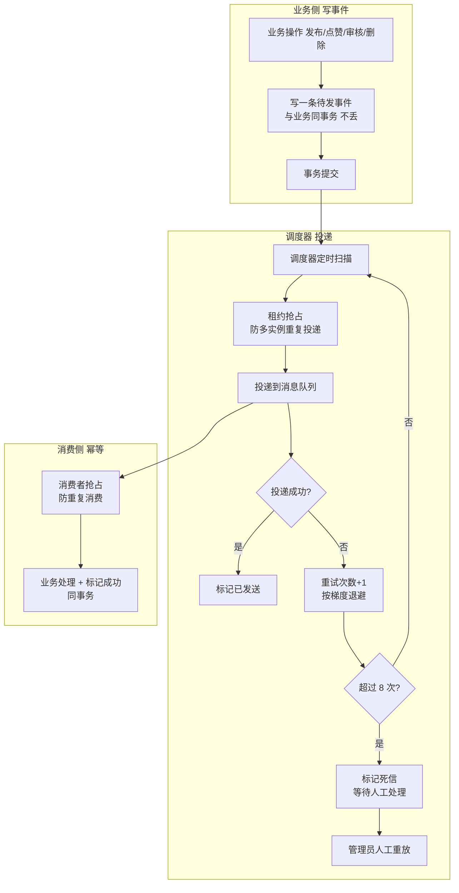
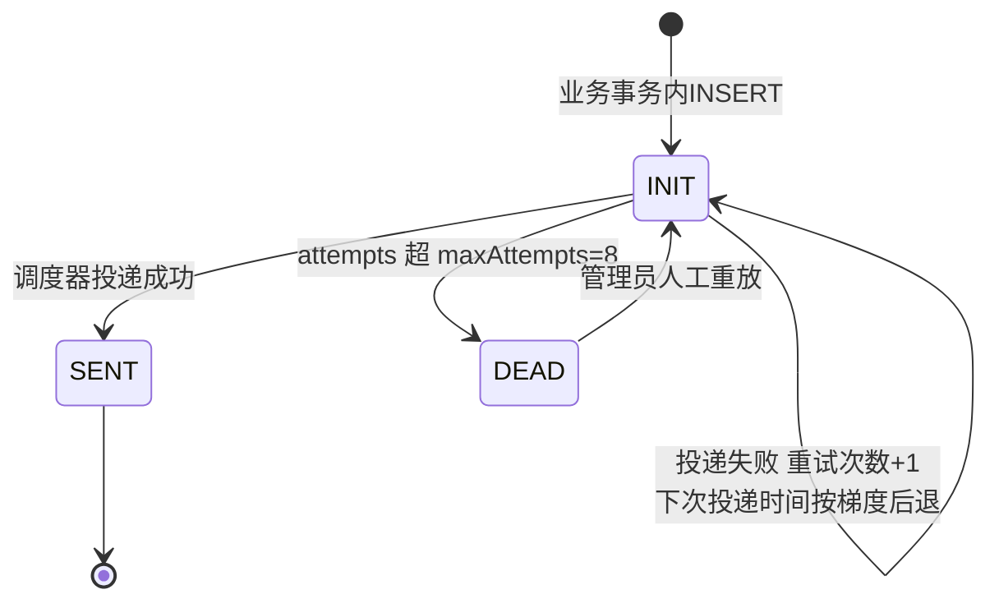

# demo0 链路 09：Outbox 可靠消息--贯穿所有链路的"事件总线"

> **一句话概括**：Outbox 是 demo0 所有异步链路的"地基"。业务事务内往本地表写一条"待发送事件"，事务提交后由调度器扫描投递 MQ。**本地表和业务数据在同一个 MySQL 事务里，原子性由数据库保证，不依赖任何分布式事务组件**--发布、点赞、通知、搜索、热度全部复用这条总线。

---

## 一、链路全景



---

## 二、问题推演：为什么需要 Outbox？

### 2.1 本地事务与 MQ 的"悬空"问题

```text
先发消息后提交事务：事务回滚了，消费者却收到"已成功"的假消息
先提交事务后发消息：提交成功但发送时进程崩溃，消息永远丢了
```

这两个方向都有失败窗口，这就是**双写一致性**问题。Outbox 的解法：**把"发消息"变成"写本地表"**，与业务同事务提交。消息的"产生"由数据库保证原子，消息的"投递"由调度器保证可靠。

### 2.2 三个备选方案对比

| 维度 | 事务消息（RocketMQ） | 本地消息表 + 定时任务 | Outbox + 调度器（本项目） |
| --- | --- | --- | --- |
| 依赖 | 需支持事务消息的 MQ | 无 | 无 |
| 可靠性 | 高 | 中（定时扫描） | 高（租约 + 重试梯度） |
| 多实例 | 天然 | 需防重复扫描 | 租约抢占防重复投递 |
| 复杂度 | 中 | 低 | 中 |

**决策理由**：RabbitMQ 不支持事务消息，所以用本地表方案。相比简单定时任务，Outbox 增加了**租约抢占**（多实例安全）和**重试梯度**（退避防打崩下游），可靠性更高。

---

## 三、核心实现细节

### 3.1 双表结构

| 表 | 作用 | 关键字段 |
| --- | --- | --- |
| tb_outbox_event | 待投递事件 | event_id(UK)、aggregate_type/id（哪个业务对象）、event_type（什么事件）、payload(JSON)（事件内容）、status(INIT/SENT/DEAD)、attempts（已重试次数）、next_attempt_at（下次投递时间）、leased_until（租约到期时间） |
| tb_inbox_event | 消费幂等 | message_id、consumer_group、payload、status、attempts、**UNIQUE(message_id, consumer_group)** |

### 3.2 事件状态机



### 3.3 关键机制拆解

| 机制 | 参数 | 解决的问题 |
| --- | --- | --- |
| 业务内写入 | 与业务同事务 | 消息不丢（原子性） |
| **租约抢占** | lease-ms: 60000 | 多实例部署时同一事件只被一个调度器处理；实例崩溃后租约过期，其他实例接管 |
| **重试梯度** | initial-delay 60s，multiplier 4.0，max-delay 6h | 短暂故障快速重试，持续故障退避防打崩下游 |
| 死信 + 人工重放 | maxAttempts: 8 | 失败可见可处理，而非无限重试的僵尸 |
| Inbox 幂等 | UNIQUE(message_id, consumer_group) | "至少一次投递"下的重复消费问题 |
| 数据保留 | retention-days: 7 | SENT 事件定期清理，表不无限膨胀 |

### 3.4 租约抢占：多实例怎么防重复投递？

```sql
-- 条件 UPDATE 实现乐观锁抢占
UPDATE tb_outbox_event
SET leased_until = NOW() + INTERVAL 60 SECOND
WHERE status = 'INIT'
  AND leased_until < NOW()          -- 租约已过期（未被其他实例持有）
  AND next_attempt_at <= NOW()      -- 到了重试时间
LIMIT 20;
```

**为什么需要租约**：两个后端实例同时扫描 outbox 表，同一事件会被投递两次。`leased_until` 配合条件 UPDATE 实现**乐观锁抢占**，抢到才有投递权。实例崩溃后租约 60s 过期，其他实例接管--**事件在 MySQL，实例崩溃不丢消息**。

### 3.5 Inbox 幂等：消费端怎么防重复？

```java
// 消费者处理前先 Inbox acquire
// 业务处理 + Inbox 标记 SUCCESS 在同一个事务
// UNIQUE(message_id, consumer_group) 数据库层兜底
```

**"至少一次投递 + 消费端幂等"比追求"恰好一次"简单且可实现**。Inbox 唯一索引兜底重复消费：即使消息被投递两次，第二次插入 Inbox 会因唯一索引失败，业务不会重复执行。

---

## 四、Outbox 如何贯穿所有链路

| 业务链路 | 登记的 Outbox 事件 | 消费者 |
| --- | --- | --- |
| 内容发布 | 审核任务 | ModerationConsumer |
| 审核通过 | Feed 推送 / ES 校准 / 通知 | FeedPushConsumer / SearchReconcileConsumer / NotificationConsumer |
| 点赞/收藏 | 通知 / 热度 / ES 校准 | NotificationConsumer / HotScoreConsumer / SearchReconcileConsumer |
| 内容删除 | Feed DELETE / ES 校准 / 向量删除 | FeedPushConsumer / SearchReconcileConsumer |
| 管理端操作 | 审计（可选） | - |

> **面试点**：Outbox 不是孤立组件，而是**所有异步链路的统一地基**。讲项目时强调"所有异步操作都走同一条可靠消息总线"，体现架构一致性。

---

## 五、边界与失败处理

| 场景 | 处理 | 为什么 |
| --- | --- | --- |
| 调度器实例崩溃 | 租约 60s 过期，其他实例接管 | 事件在 MySQL，不丢 |
| 投递持续失败 | 重试梯度退避 -> 8 次后 DEAD | 防打崩下游，失败可见 |
| 消费者重复收到 | Inbox 唯一索引幂等 | 至少一次 + 消费幂等 |
| 事件永久失败 | DEAD + 人工重放 | 人工兜底 |
| 表无限膨胀 | retention-days 定期清理 | 控制存储 |

## 六、面试追问详解（问 -> 答 -> 依据）

### Q1：为什么用 Outbox，不用 RocketMQ 的事务消息？

**面试官为什么问**：考察方案选型时对基础设施现状的清醒认知，而不是'哪个更强用哪个'。

**我的回答**：
"事务消息确实能解决同样的问题，但它有两个前提我们不具备。第一是 MQ 选型：项目用的是 RabbitMQ，它的核心竞争力是灵活的路由和低延迟，不支持事务消息这个半事务机制；换 RocketMQ 能解决消息可靠性，但等于为一个需求更换整个消息基础设施，牵连所有消费者。第二是团队运维成本：事务消息需要理解 half message、回查机制这套复杂语义，Outbox 的心智模型简单得多--'往本地表插一条，后台扫出来发'，任何工程师十分钟就能理解全貌。Outbox 的代价是多一张表一个调度器，但这两个组件都在我们可控的 MySQL 和 Spring 生态里，没有引入新的运维对象。技术选型的原则是：用已有的、可控的组件解决问题，而不是为了理论最优引入新依赖。"

**回答的依据**：
- 项目 MQ 是 RabbitMQ（application.yml 的 rabbitmq 配置），Outbox 是在其上构建的可靠性层
- Outbox 调度器是纯 Spring `@Scheduled` 任务，无额外中间件

---

### Q2：租约机制是怎么防多实例重复投递的？

**面试官为什么问**：多实例部署是生产标配，租约是 Outbox 生产化的关键考点。

**我的回答**：
"多个后端实例同时跑 Outbox 调度器，扫到同一条 INIT 状态的事件，各自投递一次--消息就重复了。租约的思路是给事件加一个'处理权凭证'：调度器抢占事件时执行条件 UPDATE，把 leased_until 改成当前时间加 60 秒，WHERE 条件要求租约已过期（leased_until < NOW()）。数据库行锁保证同一时刻只有一个 UPDATE 能成功，抢到租约的实例获得 60 秒的独占处理权，其他实例的 UPDATE 影响行数为零，自然跳过。60 秒的设计是双刃：太短的话投递慢的事件租约过期，被别的实例重复处理；太长的话实例崩溃后事件要等很久才被接管。我们的事件投递是毫秒级的，60 秒绰绰有余又不会让故障接管太慢。本质是数据库乐观锁，只是粒度从'整批事件'细化到了'单事件的独占窗口'。"

**回答的依据**：
- 抢占 SQL：`UPDATE ... SET leased_until = NOW() + 60s WHERE status='INIT' AND leased_until < NOW() AND next_attempt_at <= NOW() LIMIT 20`
- 配置 `lease-ms: 60000`，与抢占窗口一致

---

### Q3：投递实例崩溃了，事件会丢吗？

**面试官为什么问**：故障场景推演，考察对'消息在哪一层持久化'的把握。

**我的回答**：
"不会，因为事件的持久层是 MySQL 不是内存。实例崩溃时的状态有三种可能：第一种，还没抢到租约--事件还是 INIT，别的实例照常扫到处理。第二种，抢到租约还没投递--事件在它手里但 leased_until 只有 60 秒，租约过期后其他实例的抢占条件重新满足，事件被接管重投。第三种，投递成功但还没来得及标记 SENT--MQ 里已有消息，接管实例会再投一次，消费者靠 Inbox 幂等吸收这次重复。三种情况殊途同归：事件不丢，最多多投一次。整个设计的根基就一句话：状态在数据库里，进程是可丢弃的。"

**回答的依据**：
- Outbox 事件状态（INIT/SENT/DEAD）全部落 MySQL，调度器是无状态可重启的
- '至少一次 + 消费端幂等'的组合贯穿设计（见 Q5）

---

### Q4：重试梯度为什么是 60 秒起、4 倍递增、封顶 6 小时？

**面试官为什么问**：重试策略的参数不是拍脑袋，考察背后的故障恢复时间尺度分析。

**我的回答**：
"梯度设计对应两类故障的时间尺度。瞬时抖动（网络闪断、MQ 重启）的恢复时间是秒级到分钟级，所以第一次重试定在 60 秒，错过了第一次还有 4 分钟、16 分钟的兜底，瞬时故障基本在前三次内消化。持续故障（磁盘满、配置错误、下游长时间宕机）的恢复时间是小时级，密集重试没有意义还可能压垮正在恢复的服务，所以退避要指数增长并且封顶 6 小时--最长每 6 小时试一次，直到 8 次耗进取 DEAD。4 倍这个系数让曲线在'快速消化瞬时故障'和'克制对待持续故障'之间取得平衡：2 倍太慢（8 次才覆盖 2 小时），10 倍太陡（第 4 次就到天级）。另外这套参数全部在配置文件里，运营可以按业务事件的重要性调整，比如审计类事件可以调得更激进。"

**回答的依据**：
- 配置：initial-delay 60000ms，multiplier 4.0，max-delay 6h，maxAttempts 8
- 完整时间线：60s -> 4m -> 16m -> 64m -> 4.3h -> 6h -> 6h -> 6h，总跨度约一天后进死信

---

### Q5：为什么追求'至少一次 + 幂等'，不追求'恰好一次'？

**面试官为什么问**：这是分布式消息的理论根基题，答得出'恰好一次的代价'才算是真懂。

**我的回答**：
"'恰好一次'在分布式环境下要么做不到，要么代价高到不值得。它要求投递和消费这两个跨系统的动作原子完成，本质上还是分布式事务问题--要么引入重量级协调者（性能差），要么靠两阶段提交（阻塞可用性）。工程上的正解是降级目标：接受'至少一次'，把力气花在消费端幂等上。投递可以重复，但重复会被识别和吸收：Inbox 表的 message_id + consumer_group 唯一索引，配合'业务处理与标记成功同事务'，第二次投递要么被唯一索引拒绝，要么被 acquire 的状态检查直接跳过。从业务视角看效果就是恰好一次，但实现是两个简单的、各自可靠的机制组合：可靠投递（Outbox 重试）+ 幂等消费（Inbox 索引）。组合简单部件胜过追求单一复杂机制，这是分布式系统设计的通用智慧。"

**回答的依据**：
- Inbox acquire 的四种返回（ACQUIRED/ALREADY_SUCCESS/BUSY/DEAD）覆盖了重复消费的所有路径
- 业务 + Inbox SUCCESS 同事务的约定贯穿所有消费者（Moderation/Notification/SearchReconcile）

---

### Q6：DEAD 状态的事件最后怎么处理？就永远死了吗？

**面试官为什么问**：死信的最后一公里，考察'失败可见可处理'的运营闭环。

**我的回答**：
"不是，DEAD 是终点站不是坟墓。事件 8 次重试耗尽后标记 DEAD，同时进入 RabbitMQ 的死信队列，两个地方都能看到积压：管理后台的 AdminEventController 提供事件查询和重放接口，运维能看到哪些事件死了、死的原因（重试次数、最后错误）。处理路径有两条：如果是下游临时故障导致的（比如 ES 挂了一天），故障恢复后管理员点重放，事件从 DEAD 回到 INIT 重新走投递流程；如果事件本身有问题（payload 格式错误导致消费者必然失败），修完消费逻辑后同样重放验证。设计原则是：自动化解决 99% 的常见故障（重试），但 1% 的疑难必须让人看得见、够得着，而不是让失败静默消失或者无限重试空转。死信不是异常，是这个体系里正常的一等公民。"

**回答的依据**：
- 事件状态机 DEAD -> INIT 的转移只由人工重放触发（AdminEventController）
- saveFailedRecord 同时在业务侧落 FAILED 记录，双通道可观测

---

### Q7：Outbox 表会不会无限膨胀？

**面试官为什么问**：表治理意识，存储问题是长期运行的系统的必然考题。

**我的回答**：
"有三层控制。第一层是状态收敛：事件的生命周期很短，正常投递毫秒级完成变 SENT，异常的重试一天内也有结论（SENT 或 DEAD），表里的活跃数据始终是少量的 INIT 状态。第二层是定期清理：配置了 retention-days，SENT 状态的事件保留 7 天后清理--为什么留 7 天而不是立刻删？留给排查问题用：用户反馈'三天前的通知没收到'，还能查到当时的事件和投递记录。第三层是 DEADC 事件的区别对待：DEAD 不自动清理，因为它们代表未解决的业务问题，清理等于掩盖故障，必须人工处理后（重放成功变 SENT）才会进入保留期。三个状态三种策略：活跃的留着投递、成功的短期留存、失败的永久可见，存储成本和可观测性各得其所。"

**回答的依据**：
- 配置 `retention-days: 7`，仅清理 SENT
- DEAD 状态无自动清理路径，由人工处置后流转

---

### Q8：你们项目里哪些地方用了 Outbox？它是孤立组件还是通用机制？

**面试官为什么问**：考察对架构整体性的认识，Outbox 是基建，用得广说明架构一致性好。

**我的回答**：
"Outbox 是全项目异步链路的统一总线，所有跨系统副作用都走它。按链路数：内容发布后走审核任务（ModerationConsumer 消费）；审核通过后触发三路事件--Feed 推送、ES 校准、作者通知，各有独立消费者；点赞收藏触发热度重算、通知、ES 更新三个事件；内容删除触发 Feed 移除、ES 删除、向量清理。粗略算六个业务场景、十来种事件类型，全部复用同一套 Outbox 基础设施：同一张表、同一个调度器、同一套租约和重试逻辑、同一个 Inbox 幂等约定。这个一致性带来的工程价值是：任何新功能要发异步事件，登记一行 Outbox 事件就行，可靠性、幂等、死信、可观测全是现成的；排查问题时只要懂这一套机制，所有链路通杀。好的基建就应该像这样'存在感低、复用度高'。"

**回答的依据**：
- `OutboxEventService` 的 create*Event 系列方法被 ContentServiceImpl、ContentAuditServiceImpl 等多处调用
- 消费者目录（mq/consumer）下的 Moderation/FeedPush/Notification/SearchReconcile/HotScore 等消费者全部遵循 Inbox 消费约定
