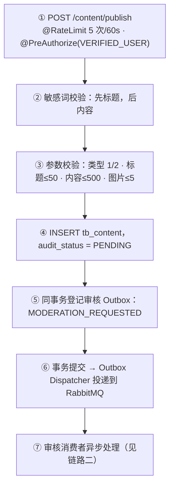
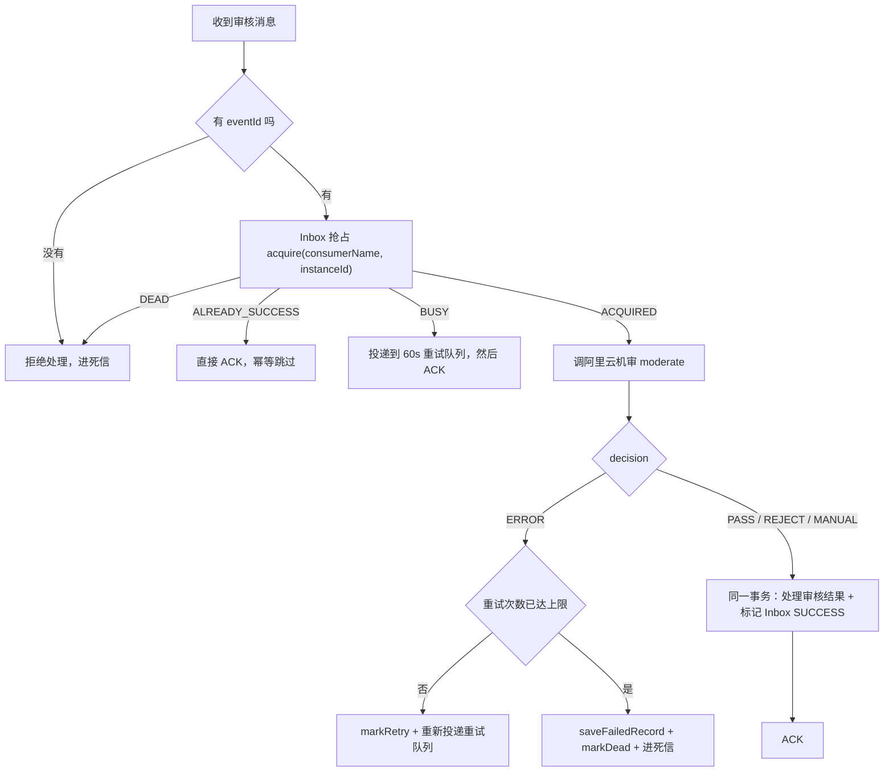
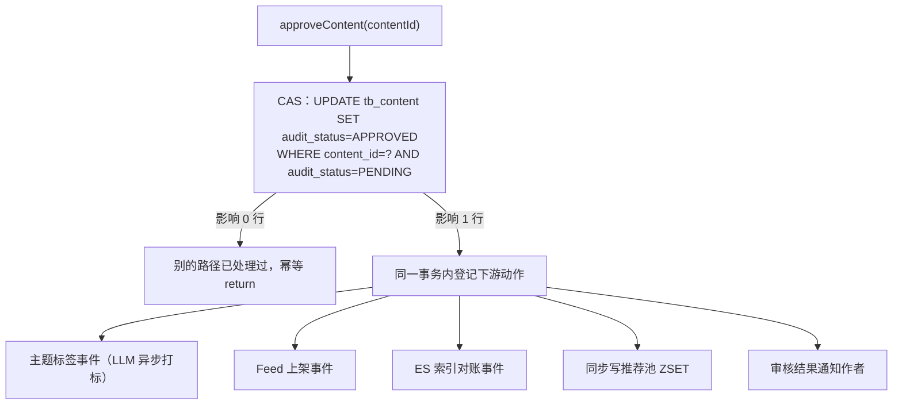
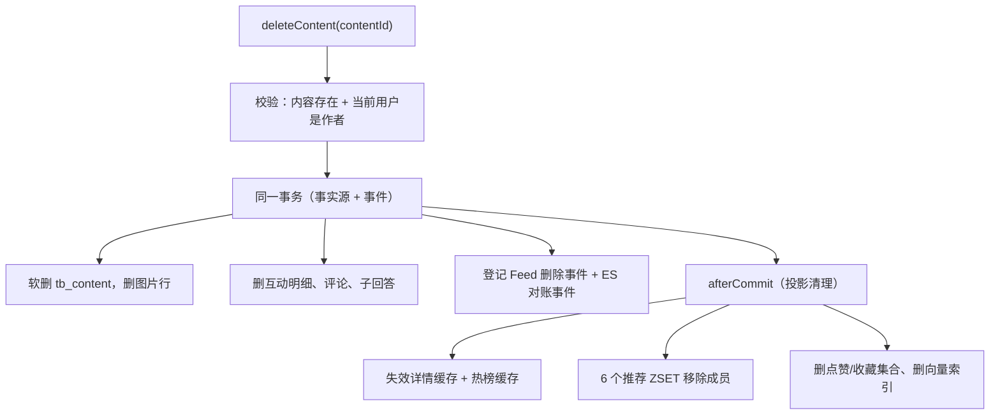

# demo0 content 链路 01：发布 → 审核 → 删除（写路径）

> **一句话本质**：content 的写操作只有三件事——**发布**（落库 + 登记审核）、**审核**（改状态 + 广播下游）、**删除**（软删 + 清理投影）。三条链路守同一条铁律：**MySQL 是唯一事实源，Redis / ES / 推荐流都只是可以重建的投影。**

## 本页包含

| 链路 | 解决什么问题 | 核心技术点 |
| --- | --- | --- |
| 一、发布 | 发帖如何既快又可靠地进入审核 | 敏感词前置、同事务 Outbox、审核策略三态配置 |
| 二、审核消费 | 机审消息如何不重不漏地消费 | Inbox 租约抢占、结果与幂等标记同事务、ERROR 不等于 PASS |
| 三、状态迁移 | 通过/驳回后如何正确广播下游 | CAS 条件更新、事件跟着状态迁移走、幂等 return |
| 四、删除 | 删帖后如何让所有投影同步消失 | 软删、四层一致性、afterCommit 清缓存、对称清理 |

---

## 链路一：内容发布

### 1.1 全景



入口有两层防线（`ContentController.publish`）：

- `@RateLimit(scene="content-publish", limit=5, windowSeconds=60)` —— 管「多快」，防恶意刷帖
- `@PreAuthorize("hasRole('VERIFIED_USER')")` —— 管「谁能」，防注册即发广告

**限流不能替代权限，权限也不能替代限流。**

### 1.2 核心点：一个事务里完成「落库 + 登记事件」

发帖要写两张表（内容 + 图片），还要通知审核系统。常规写法是「事务提交 → 再发 MQ」，但中间有个致命窗口：事务已经提交，发消息那一刻进程崩了，消息就永远丢了，帖子卡在待审核没人管。这里的做法是把「要发的消息」当成业务数据，和业务行一起写。

`ContentCommandServiceImpl.publish` 的骨架：

```java
@Override
@Transactional
public ContentVO publish(ContentDTO contentDTO) {
    // 1. 敏感词拦截：先标题，后内容（命中就抛异常，不进入写流程）
    // 2. 参数校验：类型 1/2、标题 ≤50、内容 ≤500、图片 ≤5

    Content content = Content.builder()
            .contentType(contentDTO.getContentType())
            .title(contentDTO.getTitle())
            .content(contentDTO.getContent())
            .publishUserId(publishUserId)
            .auditStatus(AuditStatus.PENDING.getCode())   // 初始状态 = 待审
            .isDeleted(0)
            .build();
    contentMapper.insert(content);                        // 业务行

    if (!images.isEmpty()) {
        contentMapper.batchInsertImages(contentImages);   // 图片行
    }

    schedulePostPublishActions(content, images);          // 事件登记，仍在同一个事务里

    contentDetailCacheInvalidator.evictAfterCommit(content.getContentId(), "content-publish");
    return contentVO;
}
```

关键在 `schedulePostPublishActions` —— 它按配置决定「帖子发布后去哪」：

```java
private void schedulePostPublishActions(Content content, List<String> images) {
    if (shouldModerateContent()) {
        // 机审开启：登记审核事件，与业务行同事务提交
        contentEventProducer.createContentModerationEvent(content, images);
        return;
    }
    if (!isAutoApproveWhenModerationDisabled()) {
        return;   // 机审关闭 + PENDING 策略：什么都不做，停在待审等人工
    }
    // 机审关闭 + APPROVED 策略：自动放行，但必须等事务提交之后
    TransactionSynchronizationManager.registerSynchronization(new TransactionSynchronization() {
        @Override
        public void afterCommit() {
            contentAuditService.approveContent(content.getContentId());
        }
    });
}
```

`createContentModerationEvent` 凭什么能「和业务行同事务」？看它的签名：

```java
@Transactional                       // ← REQUIRED，加入 publish 的事务
public String createContentModerationEvent(Content content, List<String> imageUrls) {
    String eventId = UUID.randomUUID().toString();
    ModerationTaskMessage message = ModerationTaskMessage.builder()
            .eventId(eventId)
            .targetType(ModerationTargetType.CONTENT)
            .targetId(content.getContentId())
            .title(content.getTitle())
            .content(content.getContent())
            .imageUrls(safeImageUrls)
            .retryCount(0)
            .build();
    return outboxEventAppender.append(   // 写 outbox 表，而不是发 MQ
            eventId,
            OutboxEventType.MODERATION_REQUESTED.getCode(),
            ModerationTargetType.CONTENT.name(),
            content.getContentId(),
            message);
}
```

**为什么这么写、解决了什么**：把「发消息」降级成「写本地表」。业务行和 outbox 行在同一个 MySQL 事务里，要么都成功、要么都回滚，原子性由数据库保证，**不依赖任何分布式事务组件**。消息的实际投递交给后台 Dispatcher 扫表完成，失败还有重试梯度兜底。这就是「事务成功但消息丢失」的根治办法。

> **一个极易搞反的细节**：审核事件是**同事务**写的，不在 afterCommit 里。afterCommit 只出现在「机审关闭 + 自动放行」这一条分支——因为 `approveContent` 会发 Feed、搜索事件，消费者拿到事件就去查库，必须等发布事务提交后才能查到。

**顺带一提**：审核策略做成配置而不是硬编码（`application.yml` 的 `quanta.moderation`），是因为「机审不可用」在演示环境和生产环境意味着完全不同的风险——演示环境希望帖子秒可见（走 `APPROVED`），生产环境宁可停在 PENDING 等人工（走 `PENDING`）。同一份代码，改配置就能切换行为。

### 1.3 面试题

**Q1：你是怎么设计「内容发布」这个链路的？**

> 我先明确这个链路的三条约束：发帖是高频写操作，要**快**（不能被第三方审核拖住）、要**可靠**（不能出现「帖子存了但没人审」）、要**可控**（审核开不开、怎么开，得能按环境切换）。
>
> 基于这三点，我把它设计成「**一次事务写两份数据 + 一次异步交接**」：
> - **写**：业务行（`tb_content` + `tb_content_image`，初始 `PENDING`）和「有一条审核任务」这件事，一起写进 MySQL —— 后者写进 outbox 表而不是直接发 MQ，保证「消息不会丢」；
> - **交接**：事务提交后由后台 Dispatcher 扫 outbox 投递到 RabbitMQ，审核交给独立消费者，发帖接口毫秒级返回；
> - **可配**：机审开不开、关掉之后是自动放行还是停在待审，全部做成配置，代码只实现状态机。
>
> 边界上也有取舍：敏感词放在最前面同步拦截（便宜、快），真正的违规判断交给异步机审；自动放行那条分支必须等事务提交之后再执行，否则下游消费者会读到还没提交的数据。

依据：`ContentCommandServiceImpl.publish` / `schedulePostPublishActions`；`ContentEventProducer.createContentModerationEvent`。

**Q2：发帖为什么要异步审核？不能在发布接口里同步调机审吗？**

> 两个理由。**第一是响应时间**：机审要走第三方 HTTP 接口，响应时间不由我们控制，同步调用意味着发帖接口要一直占着线程等它返回，而发帖是高频操作，吞吐会被第三方拖垮。**第二是可用性**：把第三方接口放进发帖事务里，第三方一抖动，发帖功能就跟着失败——核心功能的可用性不该被外部服务绑架。所以我们把审核异步化：发帖事务只做最少的事——写帖子、写图片、登记一条审核事件，毫秒级返回；审核在后台消费，结果通过通知异步告知用户。

依据：`ContentCommandServiceImpl.schedulePostPublishActions`；审核结果处理见链路三。

**Q3：审核事件为什么必须和业务写在一个事务里，而不是事务提交后再发 MQ？**

> 因为「提交后再发」有一个**双写窗口**：事务已经提交，但发消息那一刻进程崩了或者网络断了，这条消息就永远丢了——帖子会一直卡在「待审核」没人处理。反过来「先发消息再提交」同样不行：事务回滚了，消费者却收到一条指向不存在帖子的消息。Outbox 的做法是把「发消息」降级成「写本地表」：业务行和 outbox 行在同一个 MySQL 事务里，要么都成功要么都回滚，原子性由数据库保证，**不依赖任何分布式事务组件**。消息的实际投递交给后台 Dispatcher 扫表完成，失败还有重试梯度兜底。

依据：`ContentEventProducer.createContentModerationEvent` 上的 `@Transactional`；出站表与投递机制见链路 09。

**Q4：机审关闭时为什么要区分 APPROVED 和 PENDING 两种策略？**

> 这是一个**没有标准答案、只有场景**的取舍。演示或测试环境希望帖子发出来马上就能看到，走 APPROVED 自动放行；但真实运营中「机审不可用」往往意味着风险升高，这时更保守的做法是停在 PENDING 等人工审。把它做成配置而不是写死在代码里，同一份代码就能在两种环境下跑出两种行为——**行为开关放配置，代码只实现状态机**。

依据：`shouldModerateContent()` / `isAutoApproveWhenModerationDisabled()`；配置项见 `application.yml` 的 `quanta.moderation`。

---

## 链路二：审核消费（机审）

### 2.1 全景



分工很明确：`ModerationConsumer` 只负责**收消息 + ACK/NACK**；真正的业务编排、Inbox 租约、重试策略全在 `ModerationWorkflowServiceImpl` 里。

### 2.2 核心点

机审本身是业务规则：Bot 来源强制审、总开关与目标开关两级拦截、指纹（`MD5(标题+内容+排序后的图片URL)`）命中历史记录就复用结论省钱、文本与图片的结果按 `REJECT > MANUAL > ERROR > PASS` 合并。这些决定「**审什么、怎么判**」。

真正难的是：**在「至少一次投递」的语义下，把这条消息消费得又准又稳**。

#### 核心一：Inbox 抢占 —— 决定这条消息该不该由我处理

```java
public ModerationWorkflowResult process(ModerationTaskMessage task) {
    // 没有 eventId 的消息无法做幂等，直接拒绝进入可靠消费链路
    if (task == null || !StringUtils.hasText(task.getEventId())) {
        return ModerationWorkflowResult.DEAD;
    }
    try {
        InboxAcquireResult acquireResult = inboxEventService.acquire(
                CONSUMER_NAME, instanceId, task);

        return switch (acquireResult) {
            case ALREADY_SUCCESS -> ModerationWorkflowResult.ACK;      // 已处理过 → 直接确认
            case BUSY            -> sendBusyMessageToRetry(task);      // 别人在处理 → 稍后重来
            case DEAD            -> ModerationWorkflowResult.DEAD;     // 已死信 → 不再处理
            case ACQUIRED        -> processAcquiredMessage(task);      // 抢到租约 → 进入机审
        };
    } catch (Exception exception) {
        return ModerationWorkflowResult.REQUEUE;
    }
}
```

| 结果 | 含义 | 动作 |
| --- | --- | --- |
| `ALREADY_SUCCESS` | 这条事件已经成功处理过 | ACK，幂等跳过 |
| `BUSY` | 另一个实例正持有租约处理中 | 投递到延迟重试队列，ACK 掉当前消息 |
| `DEAD` | 这条事件已经死信 | 不再处理，转死信 |
| `ACQUIRED` | 抢到租约，由我处理 | 进入机审 |

**为什么这么写、有什么用**：这是「至少一次」投递下不重复做事的第一道闸门。消费者不是收到消息就干活，而是先问一句「这条事件现在归我处理吗」。把幂等判断从业务代码里抽出来，做成消费入口的统一前置动作——所有消费者都能复用同一套语义，业务代码只管处理，不用自己判重。

#### 核心二：审核结果与 Inbox 标记必须在同一个事务里

```java
private void applyResultAndMarkSuccess(ModerationTaskMessage task, ModerationResult result) {
    new TransactionTemplate(transactionManager).executeWithoutResult(status -> {
        dispatchResult(task, result);          // 1. 处理审核结果：改审核状态 + 登记下游事件

        boolean updated = inboxEventService.markSuccess(   // 2. 标记这条事件消费成功
                CONSUMER_NAME, task.getEventId(), instanceId);

        if (!updated) {
            throw new IllegalStateException("Inbox 已失去处理权，不能标记 SUCCESS");
        }
    });
}
```

而 `dispatchResult` 只是按目标类型分发决策：

```java
private void dispatchContentDecision(Long contentId, ModerationDecision decision, ModerationResult result) {
    switch (decision) {
        case PASS   -> contentAuditService.approveContent(contentId);
        case REJECT -> contentAuditService.rejectContent(contentId, result.getRejectReason());
        case MANUAL -> log.info("帖子审核疑似，转人工，contentId={}", contentId);
        default -> throw new IllegalStateException("不能处理的审核结果：" + decision);
    }
}
```

**为什么这么写、有什么用**：MQ 是至少一次投递，消息会重复。如果「审核结果落库」和「标记 Inbox SUCCESS」分开提交，就会出现一个窗口——结果写进去了、还没来得及标记成功、消费者崩了，消息被重投，同一条内容审第二遍，白花钱还可能并发。把两者塞进同一个事务，要么都成功要么都回滚，最终得到的是**业务效果上的「恰好一次」**。

两个容易被忽略的细节：

- **`MANUAL` 分支只打了一行日志**。「转人工」是一个有效的终态结论，不是失败，所以它和 PASS / REJECT 一样标记 SUCCESS 并 ACK。此时帖子的 `audit_status` 仍然是 PENDING，会一直留在待审列表里等管理员。
- **这里用 `TransactionTemplate` 而不是 `@Transactional`**。`applyResultAndMarkSuccess` 是私有方法，`@Transactional` 依赖 Spring 代理，**自调用不走代理会静默失效**。用编程式事务把边界明确画出来，避免踩这个坑。

### 2.3 面试题

**Q1：你是怎么设计「内容审核消费」这个链路的？**

> 前提是 MQ 只有「至少一次」投递，所以这条链路的设计核心是**幂等**：同一条消息重复投递，不能审两遍，更不能把机审的钱花两遍。
>
> 我把它设计成「**先抢租约、再干活、结果和标记一起提交**」三段：
> - **抢**：处理前先用 Inbox 表 `(consumerName, eventId)` 唯一索引做一次 acquire，只有抢到租约的实例才真正处理；已经成功过的直接 ACK，别人正在处理的推回延迟队列；
> - **干**：调阿里云做文本 + 图片机审，结果按 `REJECT > MANUAL > ERROR > PASS` 合并；同一内容用 MD5 指纹命中历史记录就直接复用结论，不再调第三方；
> - **提交**：把「更新审核状态」和「标记 Inbox SUCCESS」放进同一个事务，要么都成功要么都回滚。
>
> 两个关键取舍：ERROR 不能当通过（宁可重试到死信交给人工，也不能让故障窗口变成放行窗口）；MANUAL 是有效终态而不是失败，所以直接 ACK，靠 `audit_status` 停在 PENDING 等人工。

依据：`ModerationWorkflowServiceImpl.process` / `applyResultAndMarkSuccess`；`ContentModerationServiceImpl.moderate`。

**Q2：MQ 是「至少一次」投递，怎么保证同一条内容不被重复审核？**

> 两道防线。第一道在**消费前**：Inbox 表用 `(consumerName, eventId)` 唯一索引做幂等，消费前先尝试「抢占」这条事件——已经被成功处理过就直接 ACK 跳过；正被别的实例处理就把消息推回延迟队列稍后再来。第二道在**落库时**：审核状态的更新是带条件的 `UPDATE ... WHERE audit_status = PENDING`，影响行数不是 1 就说明别人已经改过了，直接返回。前者防重复调用第三方，后者防重复改状态。

依据：`ModerationWorkflowServiceImpl.process` 的 acquire 分支；`ContentAuditServiceImpl.approveContent` 的 CAS。

**Q3：审核结果落库和 Inbox 标记 SUCCESS 为什么必须在一个事务里？**

> 分开提交会留一个致命窗口：结果写进去了，但还没来得及标记 SUCCESS，此时消费者崩了——消息被重投，同一条内容被审第二遍，白花钱还可能引发并发问题。反过来，如果只标记了 SUCCESS 而结果没落库，这条审核就永远丢了。所以两者必须原子：要么都成功，要么都回滚重来。方法名 `applyResultAndMarkSuccess` 就是这条约定的直白表达。

依据：`ModerationWorkflowServiceImpl.applyResultAndMarkSuccess`。

**Q4：机审返回 ERROR，为什么不能当成「通过」处理？**

> ERROR 意味着机审服务本身出了问题——超时、限流、网络异常，这时候我们对内容安全性**一无所知**。把 ERROR 当通过，等于说「审核系统一坏就放行一切」，违规内容会趁机涌进来。所以 ERROR 不产生任何审核结论：走延迟重试，重试耗尽后落一条 FAILED 记录并进死信，交给人工兜底。宁可让内容多等一会儿，也不能让「不确定」变成「通过」。

依据：`ModerationWorkflowServiceImpl.processAcquiredMessage` 的 ERROR 分支走 `handleProcessingFailure`；`ContentModerationServiceImpl.saveFailedRecord`。

**Q5：判「转人工」（MANUAL）时，消息为什么可以直接 ACK？**

> 因为「转人工」本身就是一个**有效的终态结果**，不是失败。系统已经做出判断——「我拿不准，交给人工」——并且把这个判断记了下来，再重试机审也不会改变结论。所以 MANUAL 和 PASS / REJECT 一样，走「处理结果 + 标记 SUCCESS + ACK」这条路。注意此时帖子的 `audit_status` 仍是 PENDING，会一直留在待审列表里等管理员处理。

依据：`ModerationWorkflowServiceImpl.dispatchContentDecision` 中 `case MANUAL -> log.info(...)`。

---

## 链路三：审核结果的状态迁移

机审通过、人工通过、定时任务超时通过——**三条来源，一个出口**（`ContentAuditServiceImpl.approveContent`）。好处是状态迁移的副作用只实现一次，任何来源都不会漏掉某个下游。

### 3.1 全景



驳回（`rejectContent`）是对称但**故意更瘦**的：只有 CAS + ES 对账事件 + 通知，**没有** Feed、推荐池和标签。

### 3.2 核心点

#### 核心一：一个 CAS，就是整个审核状态机的入口

```java
@Override
@Transactional
public void approveContent(Long contentId) {
    Content content = contentMapper.selectById(contentId);
    if (content == null) {
        return;                                        // 内容不存在，静默返回
    }

    // 只有 PENDING 才能改成 APPROVED —— 带状态条件的 UPDATE，等价于一次 CAS
    int updatedRows = contentMapper.updateAuditStatusIfPending(contentId, AuditStatus.APPROVED.getCode());

    if (updatedRows != 1) {
        log.info("内容已非待审，跳过自动通过 contentId={}", contentId);
        return;                                        // 幂等命中，不是错误
    }

    // 状态确实变了，缓存失效挂到提交之后
    trendingCacheInvalidator.evictAfterCommit("content-audit-approved");
    contentDetailCacheInvalidator.evictAfterCommit(contentId, "content-audit-approved");

    content.setAuditStatus(AuditStatus.APPROVED.getCode());

    // 以下动作与审核状态在同一个事务里登记
    contentEventProducer.createContentTopicTagEvent(contentId);                       // 主题标签（LLM 异步打标）
    contentEventProducer.createFeedUpsertEvent(content);                              // Feed 上架
    searchEventProducer.createSearchReconcileEvent(
            ModerationTargetType.CONTENT.name(), contentId, "AUDIT_APPROVED");        // ES 对账
    contentExposureService.exposeApprovedContent(toSnapshot(content));                // 同步写推荐池

    createAuditNotificationEvent(content, AuditStatus.APPROVED.getCode(), null);      // 审核结果通知
}
```

那句 CAS 背后的 SQL（`ContentMapper.xml`）：

```sql
UPDATE tb_content
SET
    audit_status = #{auditStatus},
    update_time = CURRENT_TIMESTAMP
WHERE content_id = #{contentId}
  AND audit_status = 0        -- 必须是待审状态
  AND is_deleted = 0          -- 已删的内容不再改状态
```

**为什么这么写、有什么用**：机审通过、人工通过、定时任务超时通过——**三条来源，一个出口**。状态迁移的副作用（推荐池 / Feed / 搜索 / 标签 / 通知）只实现一次，任何来源都不会漏掉某个下游。

而那句 CAS 是整套状态机的**唯一闸门**：两条并发路径同时审同一帖，数据库行锁保证只有一条能影响 1 行，另一条拿到 0 行直接放弃。不用分布式锁、不用 `SELECT FOR UPDATE`，数据库行锁加 WHERE 条件就够了。

`0 行直接 return 而不抛异常`，是因为 0 行代表「已经被别人处理过了」＝ 幂等命中，不是错误。抛异常会让 MQ 把它当成消费失败并无限重试。

#### 核心二：通过和驳回的「不对称」是故意的

```java
@Override
@Transactional
public void rejectContent(Long contentId, String rejectReason) {
    Content content = contentMapper.selectById(contentId);
    if (content == null) {
        return;
    }
    int updatedRows = contentMapper.updateAuditStatusIfPending(contentId, AuditStatus.REJECTED.getCode());
    if (updatedRows != 1) {
        log.info("内容已非待审，跳过自动驳回 contentId={}", contentId);
        return;
    }

    // 即使 ES 中原本没有文档，也用统一校准事件保证最终状态为「删除」
    searchEventProducer.createSearchReconcileEvent(
            ModerationTargetType.CONTENT.name(), contentId, "AUDIT_REJECTED");

    createAuditNotificationEvent(content, AuditStatus.REJECTED.getCode(), rejectReason);
}
```

对比 `approveContent`：驳回**只做两件事**——ES 对账 + 通知作者。没有 Feed 事件、没有推荐池写入、没有主题标签。

**为什么这么写、有什么用**：因为 PENDING 状态的内容**从来没进过这些池子**。驳回只是「让它继续保持搜不到」，不需要撤任何东西；而通过是「让它从不可见变成可见」，所以必须把所有下游都补上。一句话：**下游事件跟着「可见性变化」走，而不是跟着 CRUD 走。**

同理，`approveContent` 里唯一没走事件的 `exposeApprovedContent`（直接写推荐池 ZSET）也遵循这个判断——它靠的是 ZSET 覆盖式写入，回滚后的残留能被热度重算覆盖掉，所以不值得为它引入 afterCommit 的复杂度。

### 3.3 面试题

**Q1：你是怎么设计「审核结果状态迁移」的？**

> 这个链路要解决的核心问题是：同一份内容可能被**多个执行者同时审**（机审消费者、管理端人工、定时任务），不能出现「机审通过 + 人工驳回」这种双重结果，也不能漏掉任何一个下游。
>
> 我的设计是「**入口收敛 + 状态机前置条件 + 事件跟着可见性走**」：
> - **入口收敛**：三条来源全部收敛到 `approveContent` / `rejectContent` 两个方法，副作用只实现一次，任何来源都不会漏掉某个下游；
> - **前置条件**：状态更新一律带条件 `WHERE audit_status = PENDING`，影响行数不是 1 就直接返回 —— 这是幂等命中、不是错误，所以不抛异常；
> - **事件分级**：通过时把该补的下游全部补上（推荐池、Feed、搜索、标签、通知）；驳回时只做「保证搜不到」（ES 对账 + 通知），因为 PENDING 的内容从来没进过那些池子。
>
> 这样设计之后，并发安全完全交给数据库行锁，那句 CAS 就是整个状态机唯一的闸门，不需要分布式锁。

依据：`ContentAuditServiceImpl.approveContent` / `rejectContent`。

**Q2：机审和人工同时审同一帖，会不会出现「机审通过 + 人工驳回」的双重结果？**

> 不会。状态更新永远是带条件的：`UPDATE content SET audit_status = ? WHERE content_id = ? AND audit_status = PENDING`。数据库行锁保证同一时刻只有一个事务能更新成功，返回 1 行的那个继续走后续流程，返回 0 行的直接放弃——因为「这条已经不是待审了」。这等价于一次 CAS，**不用分布式锁、也不用 SELECT FOR UPDATE**，数据库行锁加 WHERE 条件就够了。

依据：`ContentAuditServiceImpl.approveContent` 中 `updateAuditStatusIfPending`；对应 SQL 在 `ContentMapper.xml`。

**Q3：审核通过后为什么要发这么多事件，合成一个大事件不行吗？**

> 因为这几个下游的**性能和故障特征完全不同**。Feed 上架在大 V 发帖时要遍历几十万关注者写 Redis，耗时不可控；ES 同步依赖搜索集群健康；标签要走 LLM；通知要写库加推送。合成一个消费者，任何一个慢或者挂都会把其他的拖死。拆开之后各有各的队列、重试和死信，**故障完全隔离**，而审核事务本身只负责登记事件，秒级完成，不被下游拖累。

依据：`approveContent` 中多次 producer 调用；各消费者独立消费。

**Q4：推荐池写入是 Redis 操作，为什么敢放在事务里同步做，不怕回滚后留下脏数据？**

> 判断标准是「**回滚后的残留能不能自愈**」。推荐池 ZSET 是覆盖式写入——热度分重算时会全量重写，不存在「多了一条成员就永久错」的累积效应；就算残留了一个未过审的帖子，详情接口还有 NOT_APPROVED 的负缓存拦着，用户点进去也看不到内容。既然残留影响有限且可自愈，就不值得为它引入 afterCommit 的复杂度。反过来说，**不是所有 Redis 写都该 afterCommit**，得看回滚之后要付多大代价。

依据：`ContentAuditServiceImpl.approveContent` 中 `contentExposureService.exposeApprovedContent`；对比 `deleteContent` 里的 ZSET 清理确实挂在 afterCommit。

---

## 链路四：内容删除

### 4.1 全景



### 4.2 核心点：删除是「数据一致性分层」的最佳样本

一次删帖要同时搞定四件事：改数据库、通知下游、清缓存、清投影。它们的一致性要求完全不同，所以处理时机也不同。

```java
@Override
@Transactional
public void deleteContent(Long contentId) {
    Content content = contentMapper.selectById(contentId);
    if (content == null) {
        throw new ContentFailedException("内容不存在");
    }
    Long userId = BaseContext.getCurrentId();
    if (!userId.equals(content.getPublishUserId())) {
        throw new ContentFailedException("您没有删除内容权限");
    }
    // ↑ 权限判断放在 Service 而不是 Controller —— Bot、管理端也会触发删除，规则只能有一份

    // ── 第 1 层：事实源（同事务，强一致）──
    contentMapper.deleteContentImages(contentId);
    contentInteractionService.deleteByContentId(contentId);        // 互动明细
    commentCommandService.deleteByContentId(contentId);            // 评论
    List<Long> answerIds = content.getContentType() != null && content.getContentType() == 2
            ? answerCommandService.deleteByQuestionId(contentId)   // 问题帖还要带走子回答
            : List.of();
    contentMapper.softDeleteContent(contentId);                     // 软删

    // ── 第 2 层：事件（Outbox，同事务写入）──
    contentEventProducer.createFeedDeleteEvent(content);
    searchEventProducer.createSearchReconcileEvent(CONTENT, contentId, "DELETE");
    for (Long answerId : answerIds) {
        searchEventProducer.createSearchReconcileEvent(ANSWER, answerId, "PARENT_CONTENT_DELETE");
    }

    // ── 第 3 层：缓存失效（挂 afterCommit）──
    trendingCacheInvalidator.evictAfterCommit("content-delete");
    contentDetailCacheInvalidator.evictAfterCommit(contentId, "content-delete");

    // ── 第 4 层：投影清理（挂 afterCommit，丢了也能自愈）──
    TransactionSynchronizationManager.registerSynchronization(new TransactionSynchronization() {
        @Override
        public void afterCommit() {
            stringRedisTemplate.opsForZSet().remove(RECOMMEND_ALL_KEY, contentId.toString());
            // …按 contentType 对称移除分类池（RECOMMEND_LIFE / RECOMMEND_PROFESSIONAL）
            // …以及热度池（RECOMMEND_HOT_*），一共 6 个 ZSET
            stringRedisTemplate.delete(CONTENT_LIKED_KEY + contentId);
            stringRedisTemplate.delete(CONTENT_COLLECT_KEY + contentId);
            contentVectorSyncService.deleteByContentId(contentId);
        }
    });
}
```

四层各自的分工：

| 层 | 内容 | 时机 | 判断依据 |
| --- | --- | --- | --- |
| 1. 事实源 | 软删 + 删图片 + 删互动/评论/回答 | 同事务 | 必须原子，删不干净会留孤儿数据 |
| 2. 事件 | Feed 删除 + ES 对账 | 同事务写 Outbox | 事务回滚不能留下「通知了但没删」的幽灵消息 |
| 3. 缓存 | 详情缓存、热榜缓存 | afterCommit | 缓存必须在事实源落定之后再清 |
| 4. 投影 | 推荐 ZSET、互动集合、向量库 | afterCommit | 丢了还有 TTL 和对账兜底，属于最终一致层 |

**为什么这么分层、有什么用**：划分标准只有一句话——**这个动作的前提是不是「数据已经对别人可见了」**。是，就等提交之后再做；不是，就必须和业务行同事务。这条标准往上一套，四层的时机就自动定了。

两个值得记住的细节：

- **为什么软删**：评论、点赞明细都引用着 contentId，硬删要么级联删一大串、要么留孤儿行。软删让「删帖」变成一次状态迁移，所有下游按状态过滤即可。
- **为什么要对称清理**：推荐池是「全量池 + 分类池」的双写结构，`ZADD` 时写了两个池子，删除就必须两个都删。写扩散的地方，清理也要对称扩散——漏删一个池子就会出现「列表里没了、另一个 tab 还能刷到」。

### 4.3 面试题

**Q1：你是怎么设计「内容删除」这个链路的？**

> 删除的难点不在「删一行」，而在一次操作要同时影响**四类数据**：事实源、下游事件、缓存、投影，而它们的一致性要求完全不同。
>
> 我的设计原则是一句话：**这个动作的前提是不是「数据已经对别人可见了」** —— 是，就等提交之后做；不是，就必须和业务行同事务。
> - **事实源**（软删 + 图片 + 互动/评论/回答）必须原子，放同一个事务；
> - **下游事件**（Feed 删除、ES 对账）也写进同一个事务，避免「通知了但没删」的幽灵消息；
> - **缓存失效**和**投影清理**（推荐 ZSET、互动集合、向量库）挂 afterCommit —— 即使这一步失败，还有 TTL 和对账兜底，是**可自愈**的失败方向。
>
> 另外两个刻意的选择：用软删而不是物理删，是为了不破坏引用关系、保留可恢复性；推荐池是「全量池 + 分类池」的双写结构，所以清理必须对称，否则会出现「列表里没了、另一个 tab 还能刷到」。

依据：`ContentCommandServiceImpl.deleteContent`。

**Q2：为什么删帖用软删，不直接物理删除？**

> 三个理由。一是**引用完整性**：评论、点赞、收藏明细都引用着 contentId，物理删要么级联删一大串表，要么留一堆孤儿行，风险大且不可逆。二是**可恢复性**：软删让删帖变成一次状态迁移（`is_deleted = 1`），误删可以恢复，也便于审计追溯。三是**清理解耦**：所有下游（Feed、搜索、缓存）只要按状态过滤就行，不需要感知「这行数据没了」。

依据：`ContentCommandServiceImpl.deleteContent` 中 `softDeleteContent`；查询侧各处的 `isDeleted` 过滤。

**Q3：Redis 的清理为什么必须放在 afterCommit，不能写在事务里？**

> 事务还没提交时就把缓存删了，一旦事务回滚，MySQL 里帖子还活着，但推荐流里已经没了——**缓存和事实源反向不一致**，而且没有任何机制会把它修回来。挂在 afterCommit 上，顺序就变成「先让事实源落定，再清投影」。即使 afterCommit 那一步机器挂了，下游还有 TTL 兜底，是**可自愈**的失败方向。**失败模式要选能自己恢复的那一个。**

依据：`ContentCommandServiceImpl.deleteContent` 的 `registerSynchronization(... afterCommit)`；`ContentDetailCacheInvalidatorImpl.evictAfterCommit`。

**Q4：先删 MySQL 再删 Redis，中间这段时间用户会看到什么？**

> 会看到一个很短的「**列表里有、点进去 404**」窗口。走列表时 ZSET 里还留着这个 contentId（投影清理还没执行），但点进详情时缓存已被失效，loader 回查 MySQL 发现已软删，于是返回「内容已被删除」。这个窗口是异步架构下可接受的最终一致代价，缓解手段有两个：详情负缓存防止反复点击穿透数据库，以及让 Feed 的异步删除尽快完成。想彻底消除就只能牺牲性能做同步删除，不划算。

依据：`ContentDetailDataLoader` 返回 `DELETED` 状态；`ContentQueryServiceImpl.getContentDetail` 抛出「内容已被删除」。

---

## 小结：写路径的三条不变式

1. **MySQL 是唯一事实源**——Redis、ES、推荐流、向量库都是投影，随时可以重建。
2. **要原子的一起提交，要可见的等提交**——业务行和 Outbox 同事务；清缓存、清投影挂 afterCommit。
3. **下游事件跟着状态迁移走**，不是跟着 CRUD 走——PENDING 不进池子，通过才广播，驳回只需保证「搜不到」。

---

## 专题：哪些走 Outbox，哪些走 afterCommit

前面四条链路里反复出现两个词：**Outbox** 和 **afterCommit**。它们不是二选一的两种技术，而是同一条判断标准分出来的两拨事。

### 判断标准只有一条

> **这件事失败了，有没有东西自动替它兜底？**
>
> - **没有兜底** → 走 Outbox（跨进程 + 重试 + 死信 + 人工重放）
> - **有兜底**（TTL 到期自然失效 / 下次写覆盖 / 可全量重建） → 走 afterCommit

先纠正一个常见误解：**afterCommit 不是「异步」**。它只是「延后到事务提交之后、在**同一个线程里同步执行**」的回调——所以它里面抛异常，事务已经提交了回滚不了，只能被日志吃掉。真正的异步是 Outbox：消息交给另一个进程去处理。

### 一、走 Outbox 的 10 类事件（6 个 producer）

| 事件类型 | 什么时候发 | 谁消费 |
| --- | --- | --- |
| `MODERATION_REQUESTED` | 发布帖子 / 回答 / 评论之后 | 审核消费者 |
| `CONTENT_TOPIC_TAG_REQUESTED` | 审核通过 | 标签消费者（LLM 异步打标） |
| `FEED_UPSERT_REQUESTED` | 审核通过 | Feed 消费者（写关注者推荐流） |
| `FEED_DELETE_REQUESTED` | 删除内容 | Feed 消费者 |
| `HOT_SCORE_RECALCULATE_REQUESTED` | 点赞 / 评论等互动变化 | 热榜消费者 |
| `SEARCH_RECONCILE_REQUESTED` | 审核通过 / 驳回 / 删除 | 搜索消费者（ES 对账） |
| `NOTIFICATION_REQUESTED` | 审核结果、互动提醒等 | 通知消费者 |
| `USER_BEHAVIOR_REQUESTED` | 用户行为（浏览 / 点赞…） | 画像消费者 |
| `BOT_MENTION_REQUESTED` | 评论里 @ 了 Bot | Bot 消费者 |
| `USER_PROFILE_UPDATED` | 用户改资料 | 相关消费者 |

共同点：**都要通知另一个进程去干活**，丢一次就没人知道，所以必须持久化 + 重试。

> 一个面试加分的观察：全项目只有 `platform/mq` 下三个文件碰过 `RabbitTemplate`（配置类、调度器、投递器），**业务代码零直连 MQ**。

### 二、走 afterCommit 的 5 类

| 做什么 | 出现在哪 |
| --- | --- |
| **详情缓存失效**（清 L1 + 写 L2 墓碑） | 约 15 处写路径统一走 `ContentDetailCacheInvalidator`：内容发布 / 审核通过 / 删除、评论增删改审、点赞收藏、管理端审核与删除 |
| **热榜缓存失效** | 审核通过、删除、封号 / 解封 |
| **Redis 投影清理** | 删帖：移 6 个推荐 ZSET 成员 + 删点赞/收藏 key + 删向量；管理端删帖：删最新推荐流 |
| **向量库写 / 删** | 回答审核通过后才写向量；删帖删向量 |
| **提交后才允许的状态迁移** | 机审关闭 + 自动放行时，提交之后才调 `approveContent` |

共同点：全部是「**收拾自家的投影**」——失败了还有 TTL、对账、热度重算兜底，或者操作本身就是幂等的（移 ZSET 成员做两遍和做一遍效果一样）。

### 三、两者都不走的（留在事务里同步做）

| 做什么 | 为什么不异步 |
| --- | --- |
| **计数变更**（点赞数 / 评论数 / 收藏数） | 用户点完赞要**立刻**看到数字变了，不能等 |
| **软删 + 删关联行**（评论、互动明细、子回答） | 必须原子，删不干净就留孤儿数据 |
| **审核状态 CAS 更新** | 必须原子，且它是状态机的前置条件 |

### 四、一句话记住

| | **Outbox** | **afterCommit** |
| --- | --- | --- |
| 干什么 | **通知别人干活** | **收拾自家的投影** |
| 范围 | 跨进程 | 本进程（+ 共享 Redis） |
| 失败后 | 重试 → 死信 → 人工重放 | TTL / 对账 / 重算自动兜底 |
| 典型 | 审核任务、Feed 推送、ES 对账、通知 | 清缓存、移 ZSET、写向量 |

---

## 专题：十道开放面试题

前面四条链路讲的是「是什么、为什么」。这一节换个形式——**面试官不会问选择题**，他问的是「出问题了你怎么查」「让你改你怎么改」。每题只给答题要点，完整展开在对应链路里。

| # | 面试官会这么问 | 答题要点 |
| --- | --- | --- |
| 1 | 线上有一批帖子卡在 PENDING，用户投诉「发了看不到」，你怎么排查？ | ① 先看 outbox 表里这批 `MODERATION_REQUESTED` 的状态（`PENDING` = 调度器没投出去；`DEAD` = 重试耗尽）② 再看 Inbox 表是否卡在 `PROCESSING` 且租约早已过期 ③ 看审核记录表 `taskStatus` ④ 大概率机审服务不通 → 查审核开关配置和第三方连通性 |
| 2 | 让你加一个「审核超时 N 小时自动放行」，怎么做？注意什么？ | ① 定时任务扫「`audit_status = PENDING` 且 `create_time < now - N`」② **必须走 `approveContent`**（复用 CAS + 全部下游），不要自己写 UPDATE ③ 只对机审开着的场景兜底，并留审计 ④ 不用担心和人工审核撞车——CAS 天然保证只有一条路径生效 |
| 3 | outbox 表一天新增 200 万行，怎么处理？ | ① 已 SENT 的按 retention 清理（项目是保留 30 天 + 每天 3:30 清理）② 索引只留 `(status, next_retry_time)` 够扫描用 ③ payload 卡 32KB 上限，大内容走 ID 引用 ④ 真到瓶颈再分表 / 按时间分区，别急着换 MQ |
| 4 | 用户反馈「审核通过了但搜不到」，怎么定位？ | ① 查该 contentId 的 `SEARCH_RECONCILE_REQUESTED` 事件状态（还在 outbox 还是已 DEAD）② 直接查 ES，看文档在不在、`auditStatus` 字段对不对 ③ ES 没问题 → 查分页 / 游标 / 权限过滤 ④ 兜底：管理端手动重放对账事件 |
| 5 | 把 MQ 从 RabbitMQ 换成 Kafka，这套机制要改哪些地方？ | ① Outbox 表、状态机、租约、重试**全都不用动**——这是它最大的优点，业务代码零直连 MQ ② 只改 `ReliableRabbitPublisher` 和消费端的确认语义（Kafka 是 offset commit）③ Confirm / Return 的语义要重新映射 |
| 6 | 大 V 发帖有 50 万粉丝，你的链路扛得住吗？瓶颈在哪？ | ① 发布接口很快（只写 2 张表 + 1 行 outbox），瓶颈不在用户侧 ② 瓶颈在 Feed 消费者：`pushToFollowersFeed` 要遍历 50 万粉丝写 ZSET ③ 缓解：消费者水平扩展（同一事件只被一个实例处理）+ 批量 pipeline + 超大 V 可切读扩散 |
| 7 | 有人建议把 Feed 推送、ES 同步、通知合并成一个消费者，你怎么看？ | 反对。三者性能特征完全不同（遍历粉丝 / 依赖 ES 集群 / 走 LLM + 推送），合并后**任何一个慢或挂都会拖死另外两个**，故障不隔离。拆开之后各有各的队列、重试和死信 |
| 8 | 「内容删了但用户还能刷到」，从哪几个方向查？ | 按投影逐层排：① 推荐池 ZSET（afterCommit 那步是否执行成功）② 关注流 Feed（`FEED_DELETE_REQUESTED` 是否 DEAD）③ 详情缓存（墓碑是否写入）④ ES（对账事件是否发出）。**MySQL 是事实源，问题一定出在某一层投影上** |
| 9 | 你怎么测这套可靠消息？怎么证明它真的不丢、不重复？ | ① 单测覆盖状态机每个分支 ② Testcontainers 起真实 MySQL + RabbitMQ 做集成测试 ③ 关键用例：**重复投递**（同 eventId 投两次，断言只处理一次）、Confirm / Return、断连恢复、租约接管、重试耗尽进死信、管理端重放竞争 ④ 用真实依赖，不靠全 mock |
| 10 | 产品要求「发布立刻可见，审核放到事后」，你怎么改？ | ① 把 `disabledPolicy` 设成 `APPROVED` 能演示，但**生产不能这么干**——等于放弃前置审核 ② 正确做法是「先发后审」：发布即 APPROVED 并进池，机审异步跑，命中违规再撤回（`rejectContent` + Feed 删除 + 搜索删除）③ 代价是违规内容有暴露窗口，需要业务方接受——这也是大多数 UGC 平台的实际做法 |

**一个通用的排查心法**（第 1 题和第 8 题都靠它）：**先确认 MySQL 这张事实源对不对，再顺着投影逐层查**——outbox 表 → MQ → Inbox 表 → 目标存储。因为架构上「MySQL 是唯一事实源，其余都是可重建的投影」，问题必然出在某一层投影上，顺着链路往回找一定能定位。
