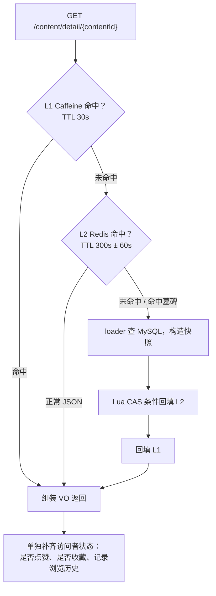

# demo0 content 链路 02：详情读取与多级缓存（读路径）

> **一句话本质**：帖子详情在 L1（Caffeine，进程内 30 秒）和 L2（Redis，5 分钟带抖动）两级缓存上读，读穿了才回 MySQL；**缓存里只放「和访问者无关」的稳定快照**，「我点没点赞」这类状态每次请求单独算。

## 本页包含

| 主题 | 解决什么问题 | 核心技术点 |
| --- | --- | --- |
| 详情读取 | 高并发下如何少查数据库 | L1 + L2 两级缓存、负缓存、TTL 抖动 |
| 缓存一致性 | 多实例并发读写如何不脏 | 墓碑 + Lua CAS 条件回填、afterCommit 失效 |
| 快照边界 | 什么能进共享缓存、什么不能 | 快照与访问者状态分离、作者维度独立缓存 |

---

## 链路一：详情读取

### 1.1 全景



缓存参数（`application.yml` → `quanta.cache.read-path.content-detail`）：

| 参数 | 值 | 作用 |
| --- | --- | --- |
| `l1-ttl-seconds` | 30 | Caffeine 本地缓存，本实例有效 |
| `redis-ttl-seconds` | 300 | L2 基础 TTL |
| `redis-ttl-jitter-seconds` | 60 | L2 TTL 随机抖动幅度（±） |
| `negative-ttl-seconds` | 60 | 负结果（不存在 / 已删 / 未过审）的 TTL |
| `tombstone-ttl-seconds` | 360 | 墓碑有效期 |

### 1.2 核心点

#### 核心一：两级缓存怎么读 —— 先 L1，再 L2，最后回源

```java
@Override
public ContentDetailCacheEntry getOrLoad(Long contentId, Supplier<ContentDetailCacheEntry> loader) {
    // Caffeine 的 get(key, mappingFunction)：mappingFunction 返回 null 就不缓存
    return localCache.get(contentId, ignored -> loadFromL2OrSource(contentId, loader));
}

private ContentDetailCacheEntry loadFromL2OrSource(Long contentId, Supplier<ContentDetailCacheEntry> loader) {
    String key = key(contentId);
    String observedRaw;
    try {
        observedRaw = stringRedisTemplate.opsForValue().get(key);       // 查 L2
    } catch (Exception exception) {
        // Redis 故障：直接回源，并且「禁止回填」（故障期写入的数据可能残缺）
        return loader.get();
    }

    if (observedRaw != null && !observedRaw.startsWith(TOMBSTONE_PREFIX)) {
        ContentDetailCacheEntry cached = objectMapper.readValue(observedRaw, ContentDetailCacheEntry.class);
        if (cached != null && cached.state() != null) {
            return cached;                                             // 命中 L2，直接用
        }
        // JSON 损坏 → 当未命中处理，继续往下回源
    }

    ContentDetailCacheEntry loaded = loader.get();                      // 回源 MySQL
    conditionalWrite(key, observedRaw, loaded);                         // Lua 条件回填 L2
    return loaded;
}
```

`loader` 就是 `ContentDetailDataLoader.load`，它决定「什么能进缓存」：

```java
public ContentDetailCacheEntry load(Long contentId) {
    Content content = contentMapper.selectById(contentId);
    if (content == null)                                    return new ContentDetailCacheEntry(ContentDetailState.NOT_FOUND, null);
    if (Integer.valueOf(1).equals(content.getIsDeleted()))  return new ContentDetailCacheEntry(ContentDetailState.DELETED, null);
    if (content.getAuditStatus() != APPROVED_STATUS)        return new ContentDetailCacheEntry(ContentDetailState.NOT_APPROVED, null);
    if (content.getPublishUserId() == null)                 return new ContentDetailCacheEntry(ContentDetailState.INVALID_AUTHOR, null);

    return new ContentDetailCacheEntry(ContentDetailState.FOUND,
            new ContentDetailSnapshot(
                    content.getContentId(), content.getContentType(), content.getTitle(), content.getContent(),
                    content.getPublishUserId(), content.getAuditStatus(), content.getCreateTime(),
                    zeroIfNull(content.getLiked()), zeroIfNull(content.getCommentCount()),
                    zeroIfNull(content.getCollectCount()), imageUrls));
}
```

**为什么这么写、有什么用**：快照里只放**和访问者无关**的稳定数据（正文、图片、作者 id、三个计数），所以所有用户能共享同一份缓存条目——这是两级缓存能成立的前提。「我点没点赞」这类 per-visitor 状态不进缓存，命中之后由上层单独补齐。判断标准一句话：**两个不同用户请求这个接口，这个字段会不一样吗？会，就不能进共享缓存。**

还有一点值得注意：`load` 返回的是**四种「未命中」状态**，而不是抛异常。因为这些负结果也要被缓存起来挡穿透；抛异常的话，「帖子不存在」这种常态请求就得走异常通道，日志会被刷爆，还拿不到可缓存的负结果。

作者信息同样不进快照，走独立的 `AuthorProfileCache`。原因：作者改昵称，他名下几百个帖子的快照不可能逐个失效。**缓存的粒度必须等于失效的粒度**，粒度选错，失效就是灾难。

#### 核心二：TTL 不是拍脑袋定的 —— 负结果短、正常值带抖动

```java
private long ttlSeconds(ContentDetailCacheEntry value) {
    if (value == null || value.state() != ContentDetailState.FOUND) {
        return properties.getContentDetail().getNegativeTtlSeconds();        // 负结果：60s
    }
    long base = properties.getContentDetail().getRedisTtlSeconds();          // 正常值：300s
    long jitter = properties.getContentDetail().getRedisTtlJitterSeconds();
    if (jitter == 0) {
        return base;
    }
    return base + ThreadLocalRandom.current().nextLong(-jitter, jitter + 1); // ±60s 抖动
}
```

对应的配置（`application.yml` → `quanta.cache.read-path.content-detail`）：

| 参数 | 值 | 作用 |
| --- | --- | --- |
| `l1-ttl-seconds` | 30 | Caffeine 本地缓存，只对本实例有效 |
| `redis-ttl-seconds` | 300 | L2 基础 TTL |
| `redis-ttl-jitter-seconds` | 60 | L2 TTL 随机抖动幅度（**加减都有**） |
| `negative-ttl-seconds` | 60 | 负结果 TTL |
| `tombstone-ttl-seconds` | 360 | 墓碑有效期 |

**为什么这么写、有什么用**：三个经典缓存问题在这里都有真实落点，不是背概念。

| 问题 | 现象 | 这里的解法 |
| --- | --- | --- |
| 穿透 | 已删 / 未过审的帖子被反复请求，每次都打到 MySQL | **负缓存**：四种未命中状态也缓存 60s |
| 击穿 | 热帖缓存到期瞬间，大量请求同时回源 | **墓碑 + Lua CAS**（见链路二） |
| 雪崩 | 同一批 key 同时到期，数据库瞬间被打满 | **TTL 抖动**：300s ± 60s |

两个细节：

- 抖动特意设计成**加减都有**。只加不减会让所有 key 的有效期被系统性拉长，陈旧窗口反而变大；± 抖动在打散到期时间的同时不改变平均 TTL。
- 负缓存 TTL 必须短（60s）。因为「不存在」是会变的——帖子可能被恢复、审核可能通过，TTL 太长就会出现「审核都通过了用户还看不到」。

### 1.3 面试题

**Q1：你是怎么设计「帖子详情读取」的？**

> 详情是典型的读多写少，所以核心目标是**尽量不查数据库**，但又不能牺牲正确性 —— 不同用户看到的状态是不一样的。
>
> 我的设计是「**两级缓存 + 快照与访问者状态分离**」：
> - **读路径**：L1（Caffeine，进程内 30s）→ L2（Redis，300s）→ 回源 MySQL，回填时用 Lua 做条件写；
> - **缓存放什么**：只放**和访问者无关**的稳定快照（正文、图片、作者 id、三个计数）；「我点没点赞」这类 per-visitor 状态不进缓存，命中缓存后单独补齐 —— 这是「多用户共享一份缓存」的前提；
> - **负结果也缓存**：不存在 / 已删 / 未过审返回的是**状态**而不是异常，一样进缓存但 TTL 更短（60s），用来挡穿透；
> - **防雪崩**：正常值的 TTL 带 ±60s 随机抖动。
>
> 设计时最花心思的是「**缓存粒度**」：作者昵称不放进快照，而是单独做作者维度的缓存 —— 因为缓存的粒度必须等于失效的粒度，粒度选错，失效就是灾难。

依据：`ContentDetailCacheServiceImpl` / `ContentDetailDataLoader` / `ContentQueryServiceImpl.getContentDetail`。

**Q2：缓存穿透、击穿、雪崩，你们项目分别怎么处理的？**

> 三个都有真实落点，不是背概念。**穿透**用负缓存：帖子已删或未过审时，loader 返回的不是异常，而是一个 `DELETED` / `NOT_APPROVED` 状态，这个负结果同样会被缓存 60 秒，所以爬虫反复戳已删帖时数据库完全不受影响。**击穿**用墓碑加 Lua 条件回填：缓存失效不是删除 key 而是写墓碑，回填前要用 Lua 校验「这期间没人动过」，既避免热帖到期瞬间大量请求同时回源，也避免旧值覆盖新值。**雪崩**用 TTL 抖动，基础 5 分钟上下浮动 60 秒，而且抖动是加减都有的，不是只加。

依据：`ContentDetailCacheServiceImpl.ttlSeconds`；`ContentDetailDataLoader.load` 的四种负状态。

**Q3：为什么「我有没有点赞」这种字段不放进缓存？**

> 因为它是**每个访问者都不同**的数据。共享缓存的前提是「这份数据对所有请求都一样」，一旦把 per-visitor 字段塞进去，缓存命中就会把别人的点赞状态返回给你。正确做法是把缓存拆成两层：共享的稳定快照进缓存，访问者状态每次请求单独查——虽然多了一次查询，但保住的是缓存的正确性。判断标准可以记成一句话：**两个不同用户请求这个接口，这个字段会不一样吗？**

依据：`ContentDetailDataLoader` 构造的 `ContentDetailSnapshot` 字段；`ContentQueryServiceImpl.getContentDetail` 里单独调用的 `markLiked` / `markCollected`。

**Q4：Redis 挂了，详情接口会怎样？**

> 会退化成「直接查库」，但不会崩。读路径的缓存操作全程 fail-open：L2 读异常时直接回源，并且**跳过回填**——因为故障期间写进去的数据可能残缺（比如网络半途中断），恢复后没人知道它是坏值，宁可这轮不缓存。反序列化失败当未命中处理，序列化失败只跳过回填。写路径也一样，写墓碑失败只记 warn 等 TTL 自愈。核心原则是**缓存组件的异常绝不传染给业务主流程**，最坏情况是性能下降，不是功能不可用。

依据：`ContentDetailCacheServiceImpl.loadFromL2OrSource`、`conditionalWrite`、`evict` 里的异常分支。

---

## 链路二：缓存一致性（多实例并发）

### 2.1 埋的是什么雷

多实例部署下的经典问题：

1. 实例 A 修改了帖子，触发缓存失效；
2. 与此同时，实例 B 的 loader 刚好读到**修改前**的旧值，但它的查询比较慢；
3. A 的失效先执行完毕，B 的回填随后到达——**B 把旧值写回了缓存**；
4. 从此所有实例读到的都是旧快照，直到 TTL 过期才恢复，中间是分钟级的脏窗口，而且**不会自愈**。

### 2.2 核心点：失效写墓碑，回填过 CAS

**失效不写 DELETE，而是写一个墓碑**：

```java
@Override
public void evict(Long contentId) {
    localCache.invalidate(contentId);                                   // 清本实例的 L1
    String key = key(contentId);
    String tombstone = TOMBSTONE_PREFIX + UUID.randomUUID();            // "__INVALIDATED__:<随机UUID>"
    try {
        stringRedisTemplate.opsForValue().set(
                key,
                tombstone,
                properties.getContentDetail().getTombstoneTtlSeconds(),  // 360s
                TimeUnit.SECONDS);
    } catch (Exception exception) {
        // 写墓碑失败只 warn —— 还有 TTL 兜底，不该让写请求 500
        log.warn("详情 L2 失效失败，等待 TTL 自愈，key={}", key, exception);
    }
}
```

**回填不直接 SET，而是走 Lua「先比较、再写」**：

```java
private void conditionalWrite(String key, String observedRaw, ContentDetailCacheEntry value) {
    String mode = observedRaw == null ? "ABSENT" : "MATCH";
    String expected = observedRaw == null ? "" : observedRaw;
    String json = objectMapper.writeValueAsString(value);

    Long written = stringRedisTemplate.execute(
            COMPARE_AND_SET_SCRIPT,                       // lua/trending-cache-compare-set.lua
            List.of(key),
            mode, expected, json, String.valueOf(ttlSeconds(value)));

    if (!Long.valueOf(1L).equals(written)) {
        // 被拒绝不是错误，只说明「期间缓存状态变了，我的值已过期」
        log.debug("详情 L2 条件回填被拒绝，期间缓存状态已变化，key={}", key);
    }
}
```

脚本本体（`lua/trending-cache-compare-set.lua`）：

```lua
local current = redis.call('GET', KEYS[1])
if ARGV[1] == 'ABSENT' then
    if current then return 0 end
elseif current ~= ARGV[2] then
    return 0
end
redis.call('SET', KEYS[1], ARGV[3], 'EX', ARGV[4])
return 1
```

两种模式：

| 模式 | 触发条件 | 含义 |
| --- | --- | --- |
| `ABSENT` | loader 读的时候 key 就是空的 | 回填要求「现在仍然不存在」——防止覆盖掉期间写入的墓碑或别实例的新值 |
| `MATCH` | loader 读到了某个值（含墓碑） | 回填要求「当前值仍等于我读到的那个值」——期间被改过就拒绝 |

**为什么这么写、有什么用**：回到 2.1 那颗雷——实例 B 拿着旧值来回填时，当前值已经是墓碑，`MATCH` 不成立，**回填被拒绝**，迟到的旧值被挡在门外。

用一次 Lua 往返换来「比较 + 写入」的原子性，比 WATCH/MULTI 少一轮往返，也比分布式锁轻得多。墓碑自身有 360 秒 TTL，过期后 key 回到「不存在」，允许新的回填——**整套机制可以自愈，不依赖任何外部协调**。

### 2.3 失效时机

- **必须挂 afterCommit**：直接在事务里删缓存是经典错误——删完缓存但事务还没提交，读请求立刻回源查到**旧值**并回填，等事务提交时缓存里躺着的已经是旧值，而且没人再触发失效。所以顺序是「先让事实源落定，再清投影」。
- **L1 只能清本实例**：Caffeine 在 JVM 内，evict 够不到别的实例。容忍方式是 L1 TTL 很短（30 秒），别的实例最多脏这几秒。推论：**本地缓存只放「陈旧几秒无感」的数据**，不放余额、权限这类强一致数据。
- **统一入口**：所有写路径都通过 `ContentDetailCacheInvalidator.evictAfterCommit(contentId, reason)` 表达「这个 id 变了」，一致性纪律收在一个类里，不散落在十几个写方法里。

### 2.4 面试题

**Q1：你是怎么设计「多实例下的缓存一致性」的？**

> 我先定义了要解决的具体问题：多实例部署时，「一个实例失效缓存」和「另一个实例正在回填」会交错 —— 实例 B 读到旧值后慢查询，A 先完成失效，B 的回填晚到，把旧值写回了缓存。麻烦的是**这个脏数据不会自愈**，要一直等到 TTL 过期。
>
> 我的设计是「**失效不用删除、回填必须先比较**」：
> - **失效**：不 DELETE，而是写一个带随机 UUID 的墓碑值（TTL 360s）；
> - **回填**：不直接 SET，而是走一段 Lua 脚本原子地「比较后再写」—— 要么要求 key 仍然不存在（`ABSENT`），要么要求当前值仍等于我读到的那个值（`MATCH`）；
> - 这样迟到的旧值会撞上墓碑被拒绝，问题就消掉了。
>
> 为什么用 Lua 而不是分布式锁或 WATCH：这里只需要「比较 + 写入」的原子性和一次往返，不值得引入锁的获取、续期、释放这一整套生命周期问题。整套机制靠墓碑自身的 TTL 自愈，不需要任何外部协调。

依据：`ContentDetailCacheServiceImpl.evict` / `conditionalWrite`；`lua/trending-cache-compare-set.lua`。

**Q2：多实例部署时，一个实例失效缓存、另一个实例正在回填，会出什么问题？怎么解决？**

> 会写出**脏数据而且不会自愈**：实例 B 读到旧值后慢查询，实例 A 先完成了失效，B 的回填晚到，把旧值写回缓存，之后所有实例都读旧值，直到 TTL 过期。解法是把「失效」从 DELETE 改成写墓碑，把「回填」改成走 Lua 的条件写：如果当前值是墓碑（说明期间有人失效过），或者当前值已经不等于我读到的那个值，就直接拒绝这次回填。这样迟到的旧值会被挡在门外，**用一次 CAS 解决了并发回填的时序问题**，不需要引入分布式锁。

依据：`ContentDetailCacheServiceImpl.evict`（写墓碑）、`conditionalWrite`（走 Lua）；脚本 `lua/trending-cache-compare-set.lua`。

**Q3：为什么用 Lua 脚本，不用 WATCH/MULTI 或者分布式锁？**

> WATCH 是乐观锁，单实例够用，但每次回填要多一轮 watch/exec 往返，冲突后还得整体重试；分布式锁是重武器，为了一个只有两种模式的比较-写入，引入锁的获取、续期、释放和锁失效问题，不成比例。Lua 脚本在 Redis 单线程里原子执行，一次往返就完成「比较 + 写入」，模式只有 ABSENT 和 MATCH 两种，复杂度可控。这也是「什么时候该用 Lua」的标准答案：**需要多条命令的原子性，同时想省掉往返。**

依据：`ContentDetailCacheServiceImpl.COMPARE_AND_SET_SCRIPT` 的加载与执行。

**Q4：作者昵称改了，为什么不用去失效他名下所有帖子的缓存？**

> 因为作者信息根本不在帖子快照里。如果把昵称头像塞进详情快照，作者一改资料，就得找出他名下所有帖子逐条失效——这个代价随发帖量增长，而且缓存里存的是冗余副本。所以作者信息单独做成「作者维度」的缓存（`AuthorProfileCache`），改资料只失效作者自己那一条。原则是：**缓存粒度要和失效粒度对齐**，粒度选错，失效就会变成灾难。

依据：`ContentQueryServiceImpl.getContentDetail` 中 `authorProfileCache.get(snapshot.publishUserId())`。

**Q5：afterCommit 回调里如果抛异常会怎样？**

> 事务已经提交了，异常没法再改变业务结果，只能被日志吃掉。所以缓存失效的实现内部必须自己 try-catch——`ContentDetailCacheServiceImpl.evict` 里写墓碑失败只记 warn，靠 key 自带的 TTL 兜底。这也是为什么整套失效被设计成「可自愈」：**afterCommit 阶段的动作，不能在失败时把异常抛给调用方，因为它已经无能为力了。**

依据：`ContentDetailCacheInvalidatorImpl.evictAfterCommit` 的注册逻辑；`ContentDetailCacheServiceImpl.evict` 的异常处理。

---

## 小结：读路径的三条不变式

1. **共享缓存只放共享数据**——per-visitor 状态永远单独算。
2. **失效用墓碑，不用 DELETE**——挡住迟到的并发回填；回填必须过 CAS。
3. **一切缓存操作 fail-open**——宁可退化成查库，也不能让缓存故障变成接口 5xx。
