# demo0 后端深度学习文档：从安全治理四件套看 Spring 后端架构演进

> **文档定位**：这不是一份"功能介绍"，而是一份**问题驱动的架构学习文档**。它回答三个问题：这个项目遇到了什么问题？为什么这样解决？面试官会怎么追问？
>
> **学习目标**：读完本文，你能把 demo0 后端的安全治理体系（认证、授权、审计、限流）和可靠消息体系讲成自己的架构能力，而不是背简历。

---

# 第一章：需求分析--这个项目到底在做什么

## 1.1 项目业务定位

demo0 是一个**校友知识社区后端**，同时服务两个客户端：

| 端 | 核心功能 | 对应 Controller |
| --- | --- | --- |
| 用户端（微信小程序） | 浏览/发布帖子、回答、评论、关注、通知、搜索、AI 问答 | ContentController、AnswerController、CommentController、FollowController、NotificationController、SearchController、RagController |
| 管理端 | 内容审核、用户管理、角色管理、审计日志查询、事件重放、身份认证审核 | AdminContentController、AdminUserController、AdminRoleController、AdminAuditLogController、AdminEventController、IdentityExamController |

**为什么这个业务值得学**：它天然包含三类高价值技术场景--

1. **匿名与登录混合访问**（推荐流、搜索匿名可看，登录后返回点赞态）-> 逼你思考"可选认证"怎么做
2. **高风险管理操作**（封号、删帖、改角色）-> 逼你思考权限细分和操作留痕
3. **内容社区的反滥用**（刷接口、爬虫、恶意注册）-> 逼你思考限流

## 1.2 后端技术栈全景

| 层次 | 技术选型 | 用途 |
| --- | --- | --- |
| 框架 | Spring Boot 3.5.11 / Java 17 | 基础框架 |
| 安全 | Spring Security 6 + jjwt 0.12.6 | 认证授权、JWT 签发解析 |
| Web | Spring MVC + WebSocket(STOMP) | REST API + 实时通知 |
| ORM | MyBatis + PageHelper | SQL 映射与分页 |
| 数据库 | MySQL 8 | 业务数据、审计日志、Outbox |
| 缓存 | Redis + Lua | 登录态会话、限流计数、状态缓存 |
| 消息 | RabbitMQ | 异步解耦（配合 Outbox/Inbox 可靠投递） |
| 搜索 | Elasticsearch | 内容搜索 + RAG 的 BM25 检索 |
| AI | Spring AI（DeepSeek + Qwen） | AI 问答、RAG 混合检索（es-weight 0.8 / vector-weight 1.0） |
| 云服务 | 阿里云 OSS / 内容安全 green | 图片存储、机审自动驳回 + 转人工 |
| 文档 | Knife4j (OpenAPI 3) | 接口文档 |

## 1.3 后端模块地图

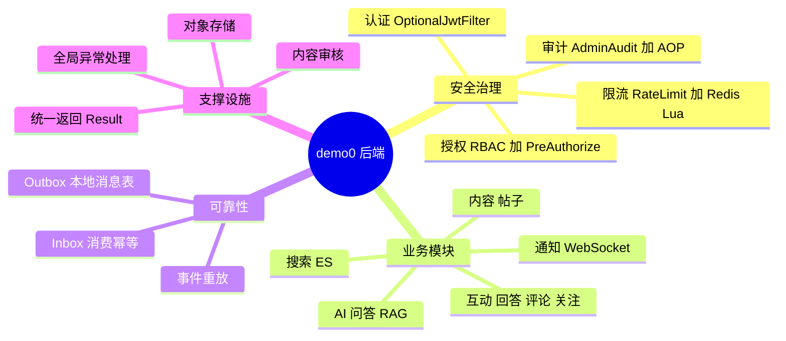

> **看图方法**：整个后端按"安全治理 -> 业务 -> 可靠性 -> 支撑"四层理解。本文重点拆解**安全治理四件套**和 **Outbox 可靠消息**，因为它们是架构含金量最高、面试区分度最大的部分。

## 1.4 本文聚焦的五个核心问题

| # | 核心问题 | 一句话矛盾 |
| --- | --- | --- |
| 1 | 认证体系演进 | 无状态 JWT 的"不可撤销" vs 业务需要"封号立刻生效" |
| 2 | RBAC 权限模型 | is_admin 一个布尔 vs 十种精细管理能力 |
| 3 | 管理员审计 | 业务回滚会吞掉日志 vs 审计必须不可抵赖 |
| 4 | 接口限流 | Redis 故障时"拒绝"还是"放行" |
| 5 | 可靠消息 | 本地事务成功但 MQ 发送失败的悬空问题 |

---

# 第二章：问题推演--每个设计决策背后的"为什么"

> **学习心法**：面试官不关心你"用了什么"，只关心你"为什么用"。本章把项目从旧架构推演到新架构的每一步"痛点 -> 约束 -> 决策"都还原出来。

## 2.1 认证问题：拦截器时代的三宗罪

项目早期用两个拦截器做认证：`AuthInterceptor`（HTTP 鉴权）和 `JwtTokenUserInterceptor`（Token 解析）。随着业务长大，暴露三个结构性问题：

| # | 罪状 | 具体表现 | 后果 |
| --- | --- | --- | --- |
| 1 | **逻辑分散** | HTTP 鉴权、校友认证判断、WebSocket 鉴权分散在不同拦截器 | 同一套 Token 校验写了三遍，改一处漏两处 |
| 2 | **注解失效漏洞** | `@RequireAuth` 注解存在，但 `AuthInterceptor` 根本没注册到 WebMvcConfigurer | 以为有认证，实际裸奔--**这是真实发生过的安全漏洞** |
| 3 | **可选鉴权难做** | 推荐流/搜索要求"匿名可访问 + 带 Token 时返回个性化数据" | 拦截器的放行/拦截是二元的，表达不了"第三态" |

第 2 条值得展开：**"注解存在但拦截器未注册"是 Spring 项目最常见的隐性安全漏洞**。因为 code review 时看到 `@RequireAuth` 会直觉认为"已保护"，只有追到拦截器注册代码才能发现真相。这正是迁移到 Spring Security 的直接导火索--Security 的过滤链是**集中声明式配置**，`/admin/**` 有没有被保护，看一眼 `SecurityConfiguration` 就知道，不存在"注解没生效"的暗坑。

### 迁移时的硬约束：59 处 BaseContext 调用

旧代码里有约 59 处 `BaseContext.getCurrentId()`。若强制全部改成 `SecurityContextHolder`，改动面巨大且极易引入回归。项目的决策是**双写双清**：认证过滤器同时写入 `SecurityContext`（供授权用）和 `BaseContext`（兼容存量业务），请求结束时在 finally 中同时清理两者。这是典型的**绞杀者模式（Strangler Pattern）**：新体系逐步接管，旧体系平稳共存。

## 2.2 权限问题：is_admin 的表达力瓶颈

旧模型只有一个 `is_admin` 字段，只能回答"是不是管理员"。但管理端实际存在十种能力维度：

| 能力 | 举例 |
| --- | --- |
| 内容读取/删除 | 审核帖子、删除违规内容 |
| 评论/回答管理 | 删评、删回答 |
| 用户管理 | 封号、解封 |
| 角色管理 | 授予/撤销管理员角色 |
| 事件重放 | 重发失败的 MQ 事件 |
| 审计日志查看 | 查管理员操作记录 |
| 内容审核管理 | 处理机审灰度案例 |
| 身份认证审核 | 审核校友认证申请 |

用 is_admin 的问题：**权限无法细分导致"要么全给要么不给"**。如果内容审核外包给运营同学，你只能给他全部管理员权限--他就能封号、能改角色。这在真实公司是不可接受的内控风险（权限最小化原则）。

另一个隐藏问题：**角色变更如何立刻生效**。JWT 有效期 7 天，如果用户被降权后 Token 里还带着旧角色，他还能继续操作 7 天。这是无状态认证的经典矛盾。

## 2.3 审计问题：为什么 log.info 不够

管理端做高风险操作（封号、删帖、改角色）时，旧做法是在方法里 `log.info(...)` 打日志。三个致命缺陷：

1. **业务回滚吞日志**：`@Transactional` 方法抛异常回滚时，日志已经打出去了--日志说"封号成功"，数据库里却没封。**日志与业务结果不一致，审计就失去法律效力**（合规场景要求审计不可抵赖）
2. **不可查询**：想查"过去一周谁对帖子 123 做过什么"，只能 grep 服务器日志文件，无法按操作人/目标/时间过滤
3. **信息不全**：随手打的日志没有统一字段（谁、何时、从哪个 IP、操作前后的状态快照）

## 2.4 限流问题：为什么自己做而不是上网关

项目没有独立网关层（Spring Cloud Gateway），限流必须在应用内做。这带来三个必须回答的子问题：

| 子问题 | 选项 |
| --- | --- |
| 切入点 | Filter / Interceptor / AOP 注解 |
| 计数器放哪 | JVM 内存 / Redis |
| Redis 挂了怎么办 | 拒绝所有请求（fail-closed）/ 放行（fail-open） |

第 3 个问题是最有面试价值的：**安全接口（登录、发帖）的限流器在 Redis 故障时应该拒绝（宁可错杀不可放过），可读性接口的限流器应该放行（可用性优先）**。一个 `failClosed` 布尔参数把这个决策权交给每个接口的声明者，而不是全局一刀切。

## 2.5 可靠消息问题：本地事务与 MQ 的悬空

RabbitMQ 的经典问题：业务操作和消息发送是两个系统，无法放进同一个事务。

```text
先发消息后提交事务：事务回滚了，消费者却收到了"已成功"的假消息
先提交事务后发消息：提交成功但发送时进程崩溃，消息永远丢了
```

这两个方向都有失败窗口，这就是**双写一致性**问题。项目用 Outbox 模式解决：业务事务内往本地表插一条"待发送事件"，事务提交后由后台调度器扫描表并投递 MQ。本地表和业务数据在同一个 MySQL 事务里，**原子性由数据库保证，不依赖任何分布式事务组件**。

## 2.6 问题全景回顾

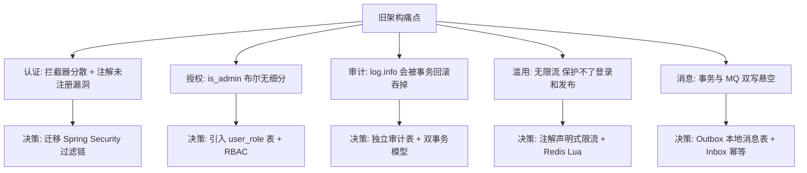

> **面试话术**：这一章就是你的 STAR 里的 S（Situation）和 T（Task）。五个痛点都是真实存在的（其中"注解未注册"是项目里真实发现过的漏洞），讲的时候按"现象 -> 风险 -> 为什么旧方案修不了"的顺序展开。

---

# 第三章：方案设计总结--五大问题的技术实现

> **学习心法**：每个方案先看"对比了哪些备选"（决策过程），再看"最终怎么实现"（代码细节），最后看"边界情况怎么处理"（区分度所在）。

## 3.1 认证链路：可选认证过滤器

### 3.1.1 方案对比：Token 状态管理

| 维度 | 方案 A：纯无状态 JWT | 方案 B：Session/Cookie | 方案 C：JWT + Redis 会话（本项目） |
| --- | --- | --- | --- |
| 水平扩展 | 天然支持 | 需要 Session 粘滞或共享存储 | 天然支持 |
| 主动失效（封号立刻生效） | 做不到，只能等 Token 过期 | 可以（删 Session） | 可以（删 Redis 键） |
| 单设备登录 | 做不到 | 天然支持 | 可以（Redis 里只存最新 Token，比对） |
| 每请求开销 | 无 | 无 | 一次 Redis GET |
| 适用场景 | 短 Token、无注销需求 | 传统 Web 单体 | **小程序 + 需要封号/踢人** |

**决策理由**：社区产品必须支持"封号立刻生效"（内容社区的硬需求），纯无状态 JWT 直接出局；小程序端 Cookie 管理别扭且不利多端，Session 出局。JWT 承担"自证身份"（验签即信任，不查库），Redis 承担"随时翻脸"（会话可撤销），两者各取所长。代价是每请求多一次 Redis 读，对内网 Redis（亚毫秒级）完全可接受。

### 3.1.2 认证过滤器决策流程

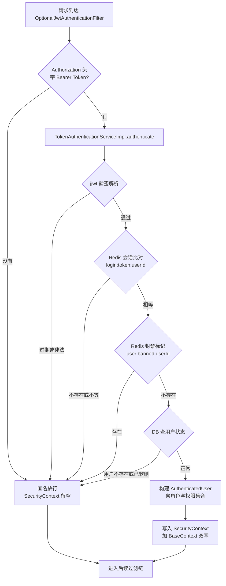

> **关键设计--"认证失败降级为匿名"而不是返回 401**：这是"可选认证"的精髓。推荐流接口匿名可访问，用户带着过期 Token 访问时，正确语义是"当作未登录返回通用数据"，而不是报错让用户强制登出。`/admin/**` 等强认证路径由后续的 `authorizeHttpRequests` 拦截：匿名（无认证信息）访问管理端 -> 401。**过滤器负责"尽最大努力认证"，授权层负责"该拒绝时拒绝"**，职责分离。

### 3.1.3 authenticate 的七步校验链

代码位于 `TokenAuthenticationServiceImpl`，每步失败都会"降级匿名"：

| 步骤 | 检查内容 | 挡住的攻击 |
| --- | --- | --- |
| 1 | jjwt 验签 + 过期解析 | 伪造 Token、过期 Token |
| 2 | Redis `login:token:{userId}` 比对 | 旧 Token（被顶号）、登出后的 Token |
| 3 | Redis `user:banned:{userId}` 封禁标记 | 已封禁用户 |
| 4 | DB 用户存在性 | 已注销用户 |
| 5 | DB `isDeleted` 软删标志 | 被软删的用户 |
| 6 | 校友认证状态（Redis 缓存 12h，cache-aside） | 决定是否授予 VERIFIED_USER 角色 |
| 7 | `user_role` 表加载管理角色 | RBAC 数据来源 |

**角色组装规则**（第 6、7 步的输出）：

```text
roles = [USER]                                # 人人都有
      + [VERIFIED_USER]  (若校友认证已通过)     # 状态角色
      + user_role 表中的 ACTIVE 角色           # 管理角色
permissions = RolePermissionMapping.getPermissions(roles)
```

### 3.1.4 请求收尾：双写必须双清

过滤器 finally 块中同时清理 `SecurityContextHolder` 和 `BaseContext.remove()`。**为什么必须清理**：Servlet 容器线程池复用线程，上一个用户的身份信息会"串"到下一个请求--这是 Web 层最经典的内存泄漏/越权隐患。Tomcat 复用线程时不会重置 ThreadLocal，Security 的 ThreadLocal 清理是自动的（过滤器链契约），BaseContext 是自定义 ThreadLocal，必须手动清。

## 3.2 RBAC 授权模型

### 3.2.1 方案对比：权限模型选型

| 维度 | ACL（直接用户-资源授权） | 硬编码 if-else | RBAC（本项目） |
| --- | --- | --- | --- |
| 新增管理员 | 逐资源授权，繁琐 | 改代码发版 | 授一个角色，即插即用 |
| 权限审计 | 极细但难总览 | 无从审计 | 角色维度一目了然 |
| 表达力 | 最强 | 最弱 | 够用（本场景十种能力） |
| 过度设计风险 | 高（用户量小） | 低 | 低 |

**决策理由**：管理端用户量小（个位数到几十人），ACL 的精细授权用不上；硬编码无法应对角色变化。RBAC 的"用户-角色-权限"两级间接刚好匹配：角色授予走数据库（运营可操作），角色含哪些权限走代码 `RolePermissionMapping`（开发控版本）。

### 3.2.2 数据模型

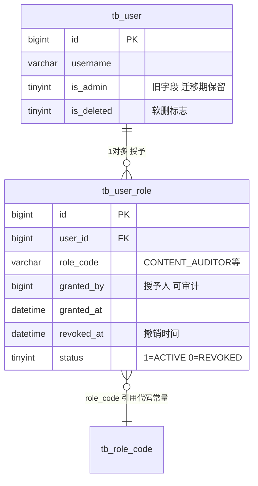

**表设计细节的讲究**：

1. `UNIQUE KEY uk_user_role (user_id, role_code)`：同一用户同一角色只有一条记录，**重复授予幂等**（数据库层兜底，代码先查后插也有竞态，唯一索引是最后防线）
2. 保留 `revoked_at` 和 `status=REVOKED` 而不是物理删除：**授权历史本身就是审计证据**，"谁在什么时候被撤销了角色"可追溯
3. `granted_by`：授予人字段，配合审计日志形成双保险

### 3.2.3 角色-权限映射矩阵（代码即配置）

`RolePermissionMapping` 中角色与权限是**代码内静态映射**：

| 权限 \ 角色 | CONTENT_AUDITOR | OPERATIONS_ADMIN | SUPER_ADMIN |
| --- | :-: | :-: | :-: |
| content:read / content:delete | Y | - | Y |
| comment:read / comment:delete | Y | - | Y |
| answer:read / answer:delete | Y | - | Y |
| audit:log:read | Y | Y | Y |
| identity:exam:review | Y | - | Y |
| user:manage | - | Y | Y |
| event:replay | - | Y | Y |
| moderation:manage | - | Y | Y |
| role:manage | - | - | Y |
| **兜底逻辑** | - | - | **任何权限缺失时 SUPER_ADMIN 直接放行** |

```java
// RolePermissionMapping 核心逻辑（节选）
public static Set<String> getPermissions(Set<String> roles) {
    if (roles == null || roles.isEmpty()) return Collections.emptySet();
    if (roles.contains(RoleConstants.SUPER_ADMIN)) {
        return ALL_PERMISSIONS;      // 超管全量兜底
    }
    Set<String> permissions = new HashSet<>();
    for (String role : roles) {
        permissions.addAll(ROLE_PERMISSIONS.getOrDefault(role, Collections.emptySet()));
    }
    return permissions;
}
```

> **为什么角色-权限映射放代码而不是数据库**：权限字符串（如 `user:manage`）必须与 `@PreAuthorize("hasAuthority('user:manage')")` 的硬编码字符串严格一致，放数据库一旦改错权限名，授权静默失效且无编译期检查。放代码里，权限常量类 `PermissionConstants` 与注解引用同一常量，重构安全。**角色是运营数据（库），权限是代码契约（码）**。

### 3.2.4 双层授权架构

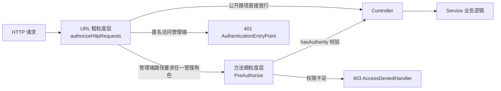

| 层 | 机制 | 粒度 | 例子 |
| --- | --- | --- | --- |
| URL 层 | `authorizeHttpRequests` | 路径前缀 | `/admin/**` 需要管理角色之一 |
| 方法层 | `@PreAuthorize` | 单接口单个权限 | `AdminRoleController` 的 grant/revoke 要求 `role:manage` |

**为什么两层都要**：URL 层是"防线外移"（非法请求在过滤链就被挡住，不消耗 Controller 资源），方法层是"最小权限"（同样是 /admin/ 路径下，审核员只能删帖不能改角色）。只留任何一层都会退化：只有 URL 层 -> 管理端内部无隔离；只有方法层 -> 每个接口都要记得加注解，漏一个就是漏洞（回到 2.1 节的老问题）。

### 3.2.5 权限变更的即时生效

角色变更后旧 Token 还带着旧权限，怎么破？`AdminRoleServiceImpl` 在**事务提交后**删除该用户的 Redis 登录态：

```java
TransactionSynchronizationManager.registerSynchronization(
    new TransactionSynchronization() {
        @Override
        public void afterCommit() {
            stringRedisTemplate.delete(LOGIN_USER_KEY + userId);
        }
    });
```

下一次请求走到认证链第 2 步（会话比对）时 Redis 已无此键 -> 认证失败 -> 降级匿名 -> 访问管理端得到 401。**用户被降权后，管理端访问在下一次请求立刻失效，无需等 Token 过期**。

> **为什么放在 afterCommit 而不是事务内删**：事务内删除 Redis 后 MySQL 万一回滚，用户的登录态就"误伤"丢了（角色没变却要重新登录）。afterCommit 保证"只有数据库真正提交了变更，才去失效会话"。顺序反了是**可恢复的不一致**（重新登录即可），正着做是**不可恢复的误伤**。

## 3.3 管理员审计：双事务模型

### 3.3.1 方案对比：审计记录的写入时机

| 维度 | 方案 A：AOP 统一记录（proceed 成功后写） | 方案 B：业务代码内显式写 | 方案 C：混合双事务（本项目） |
| --- | --- | --- | --- |
| 成功审计与业务一致性 | AOP 的写库在业务事务外，**业务回滚后审计还在** | 同事务，同生共死 | 同事务，同生共死 |
| 失败审计可靠性 | 抛异常时 AOP 自己也可能在事务回滚链上被吞 | 同样可能被吞 | **REQUIRES_NEW 独立事务，必落库** |
| 侵入性 | 零侵入 | 每个业务方法手动调 | 一个注解 + Service 一行调用 |

**决策理由**：审计的两种结果有相反的事务诉求--**成功审计必须与业务同事务**（防"审计说成功但业务回滚了"的假账），**失败审计必须独立于业务事务**（业务回滚不能连带吞掉审计）。单一事务策略无法同时满足，所以拆成两条路径。

### 3.3.2 双事务模型全景

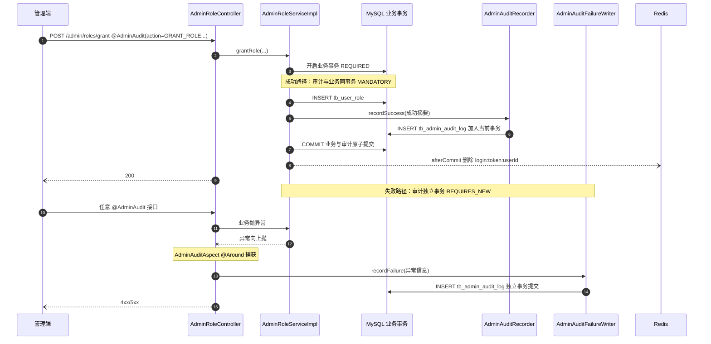

### 3.3.3 事务传播行为对比（本节是面试重灾区）

| 传播行为 | 语义 | 在审计中的角色 |
| --- | --- | --- |
| REQUIRED（默认） | 有事务就加入，没有就新建 | 业务方法的默认行为 |
| **MANDATORY** | **必须已存在事务，否则直接抛异常** | `recordSuccess` 用它--**强制审计必须寄生在业务事务内**，谁单独调用它谁得到运行时错误，设计意图编译不进代码就用运行时异常兜底 |
| **REQUIRES_NEW** | **挂起当前事务，开全新事务** | `AdminAuditFailureWriter` 用它--业务事务标记回滚也不影响审计事务独立提交 |

> **MANDATORY 的价值**：如果 `recordSuccess` 用默认 REQUIRED，某天有人在事务外调用它，审计就会"静默地"写进独立事务，与业务脱钩，回到方案 A 的假账问题。MANDATORY 把"必须同事务"这个设计约定变成运行时强制约束。**用传播行为表达架构意图，是事务设计的高级用法。**

### 3.3.4 审计日志记录了什么（字段即证据链）

| 字段 | 来源 | 取证价值 |
| --- | --- | --- |
| request_id | 请求头 X-Request-Id（无则生成 UUID），**唯一索引** | 串联一次请求的所有日志，防抵赖锚点 |
| operator_id / operator_roles | SecurityContext | 谁、以什么身份操作 |
| action / target_type / target_id | @AdminAudit 注解 + SpEL 动态取参 | 对什么对象做了什么 |
| before_summary / after_summary | 业务传入快照（限长 2000 字） | 操作前后状态对比 |
| result_status / error_code / error_message | 成功/失败路径分别填充 | 操作结果 |
| http_method / request_path / client_ip / user_agent | RequestContextHolder（IP 取 X-Forwarded-For 第一段） | 从哪台机器发起 |

索引设计对应三类查询：`UNIQUE(request_id)`（按请求追踪）、`INDEX(action, target_type, target_id)`（查"谁动过这个帖子"）、`INDEX(operator_id, created_at)`（查"这个人最近做了什么"）。

## 3.4 接口限流：注解 + AOP + Redis Lua

### 3.4.1 方案对比：切入点与算法

| 维度 | Filter 全局限流 | Interceptor 路径匹配 | **AOP 注解（本项目）** |
| --- | --- | --- | --- |
| 粒度控制 | 全局一刀切 | 按路径前缀 | **按方法，参数可带业务语义（scene）** |
| 获取用户上下文 | 手动解析 Token | 手动 | **直接读 SecurityContext** |
| 声明位置 | 配置文件远离子码 | 拦截器注册处 | **贴在方法上，所见即所得** |

算法维度上，固定窗口 vs 滑动窗口 vs 令牌桶：

| 算法 | 实现 | 优点 | 缺点 |
| --- | --- | --- | --- |
| **固定窗口（本项目）** | INCR + 首次 EXPIRE | **一个 key 一个计数器，内存和实现最简** | 窗口边界突刺（两个窗口交界可放行 2 倍流量） |
| 滑动窗口 | ZSET 时间戳 | 平滑 | 内存 O(请求数)，需清理 |
| 令牌桶 | Lua 定时补充 | 允许突发流量 | 实现复杂 |

**决策理由**：管理端和登录接口的防护目标是"挡住脚本刷接口"而不是精确整形流量，固定窗口的边界突刺（100/分钟限流在边界两秒内放过 200 个请求）对安全场景无关紧要，**简单性胜过精确性**。

### 3.4.2 一次限流检查的完整时序

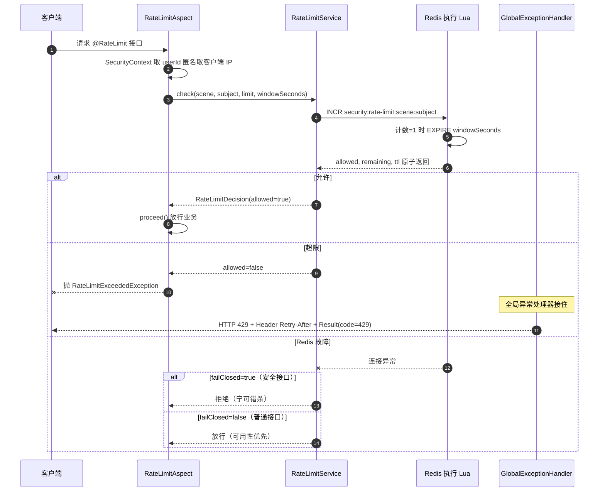

> **Lua 的必要性**：INCR 和 EXPIRE 是两条命令，分开发送存在竞态--INCR 成功但 EXPIRE 未执行（进程崩溃），key 永不过期，**计数器只增不减，接口永久 429**。Lua 脚本在 Redis 单线程内原子执行"读-改-写"，同时返回 allowed/remaining/ttl 三元组，一次网络往返完成判断。

### 3.4.3 failClosed：每个接口自己决定熔断语义

```java
@RateLimit(scene = "login:password", limit = 5, windowSeconds = 300, failClosed = true)   // 登录防爆破
@RateLimit(scene = "content:publish", limit = 10, windowSeconds = 60, failClosed = true)  // 发帖防刷
@RateLimit(scene = "search", limit = 30, windowSeconds = 60, failClosed = false)          // 搜索可降级
```

| failClosed | 语义 | 适用 |
| --- | --- | --- |
| true | Redis 挂 -> 全部拒绝 | 防滥用是接口存在前提的场景（登录爆破、垃圾内容） |
| false | Redis 挂 -> 全部放行 | 限流只是保护性优化，挂了也不能影响主业务 |

> **面试高频追问**："限流器自己成为可用性单点怎么办？"--答案就是 failClosed 的二分：**安全组件的降级策略必须由业务属性决定，而不是组件统一决定**。

## 3.5 Outbox 可靠消息

### 3.5.1 双表结构与事件状态机

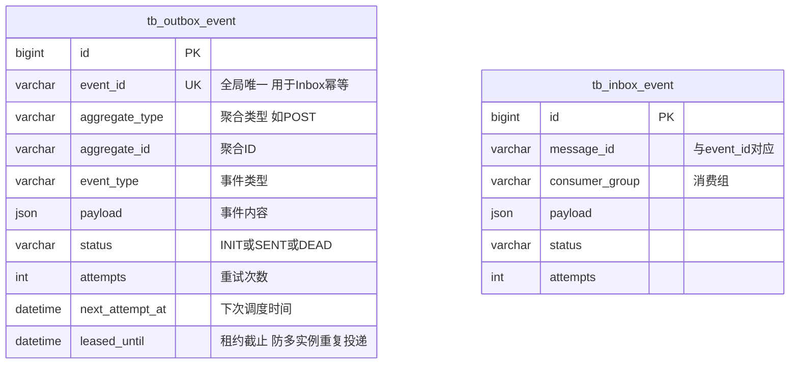

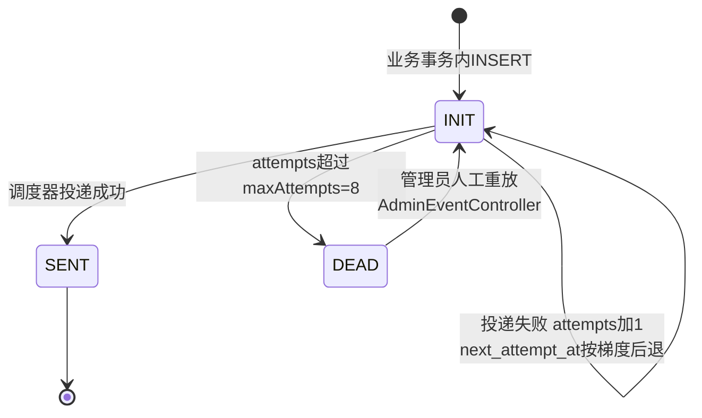

### 3.5.2 关键机制拆解

| 机制 | 参数（application.yml） | 解决的问题 |
| --- | --- | --- |
| 业务内写入 | 事件与业务同 MySQL 事务 | 消息不丢（原子性） |
| **租约抢占** | lease-ms: 60000 | 多实例部署时，同一事件只被一个调度器处理；实例崩溃后租约过期，其他实例接管 |
| **重试梯度** | initial-delay 60s，multiplier 4.0，max-delay 6h（60s -> 4m -> 16m -> 64m -> 4.3h -> 6h...） | 短暂故障快速重试，持续故障退避防打崩下游 |
| 死信 + 人工重放 | maxAttempts: 8 后置 DEAD | 肉眼可见的失败，而不是无限重试的僵尸 |
| Inbox 幂等 | UNIQUE(message_id, consumer_group) | 消费端"至少一次投递"下的重复消费问题 |
| 数据保留 | retention-days: 7 | SENT 事件定期清理，表不无限膨胀 |

> **为什么需要租约**：如果两个后端实例同时扫描 outbox 表，同一事件会被投递两次。`leased_until` 配合条件 UPDATE（`WHERE status='INIT' AND leased_until < NOW()`）实现乐观锁抢占，抢到才有投递权。**"至少一次 + 消费端幂等"比追求"恰好一次"简单且可实现**，Inbox 唯一索引兜底重复消费。

---

# 第四章：完整链路--把组件串成请求的生命周期

> **学习心法**：第三章是"零件图"，本章是"装配图"。面试讲项目最忌讳零件堆砌，能流畅讲出一个请求的完整旅程才是真正的理解。

## 4.1 一次"授予角色"请求的完整生命周期（主线案例）

管理员在后台给用户 A 授予 CONTENT_AUDITOR 角色，这个请求会穿过本文讲过的所有组件：

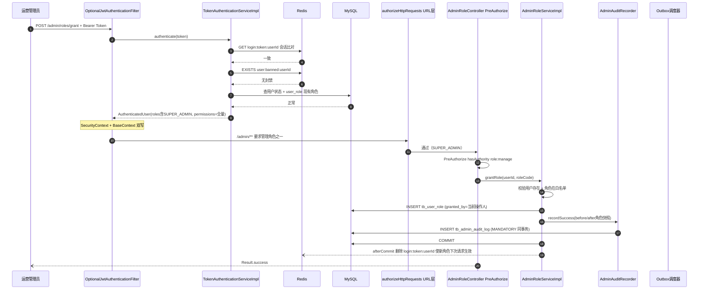

**这条链路上，六个组件各挡了一类风险**：

| 组件 | 挡住的风险 |
| --- | --- |
| 认证过滤器 | 伪造/过期/被封禁的 Token |
| URL 授权层 | 非管理端用户触碰 /admin/** |
| @PreAuthorize | CONTENT_AUDITOR 越权改角色（无 role:manage） |
| 角色白名单 | grantRole 传入不存在的角色码 |
| 审计 MANDATORY | 业务回滚后的假审计记录 |
| afterCommit 会话失效 | 被授予人 7 天内拿着旧权限继续用 |

## 4.2 认证的三个分支结局

同一个过滤器，三种 Token 状态走出三种结局（呼应 3.1.2 决策图）：

| Token 状态 | 过滤器行为 | 访问推荐流 | 访问 /admin/** |
| --- | --- | --- | --- |
| 无 Token | 匿名放行 | 200 通用数据 | 401 |
| 有效 Token | 认证通过 | 200 个性化数据（点赞态） | 进入授权层判断 |
| 过期/被踢/封禁 | **降级匿名** | 200 通用数据（无感降级） | 401 |

## 4.3 限流触发时的完整响应链

```text
客户端 -> RateLimitAspect(取subject) -> Redis Lua(原子计数) -> 超限
      -> 抛 RateLimitExceededException(retryAfterSeconds)
      -> GlobalExceptionHandler 接住
      -> HTTP 429 + Header[Retry-After: ttl] + Body[Result(code=429, msg=...)]
```

客户端拿到 `Retry-After` 头可以精确知道等多久，而不是盲目重试。

## 4.4 核心数据模型总图

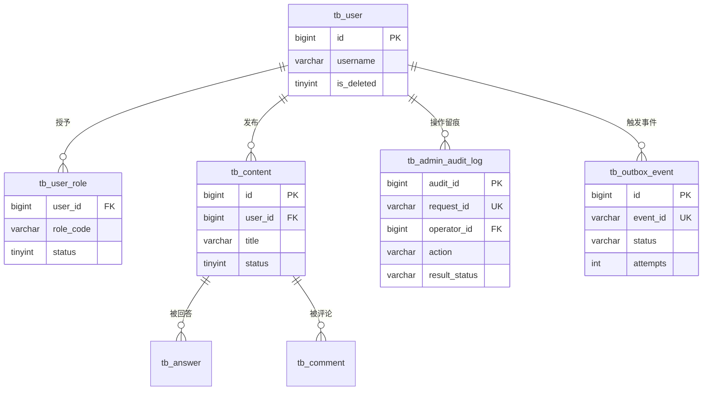

> 这张图回答"安全数据模型怎么设计"：**业务表（user/content）与治理表（user_role/audit_log/outbox）分离**，治理表的生命周期独立于业务表（软删用户后审计日志仍可查询）。

## 4.5 全局异常契约：错误码的统一出口

| HTTP 状态 | 触发场景 | 响应体 | 特殊头 |
| --- | --- | --- | --- |
| 401 | 匿名访问受保护接口（AuthenticationEntryPoint） | Result.error(401) | - |
| 403 | 已认证但权限不足（AccessDeniedHandler） | Result.error(403) | - |
| 429 | 限流触发 | Result.error(429) | Retry-After |
| 400 | 业务异常（LoginFailed 等） | Result.error(400) | - |
| 404 | 资源不存在 | Result.error(404) | - |
| 500 | 未预期异常 | Result.error(500) | - |

**关键点**：Security 的 401/403 默认返回空 body 或 HTML，项目用 `authenticationEntryPoint` / `accessDeniedHandler` 定制成与业务一致的 `Result` JSON 结构，**前端只需要一套错误处理代码**。

---

# 第五章：测试验证--怎么证明每个机制真的在工作

> **学习心法**："我做了 X"不如"我验证过 X"。每个机制给出可复现的验证方法，面试时能把"怎么测的"讲清楚，可信度远高于只讲设计。

## 5.1 验证认证链路（token 三态实验）

用 Knife4j 或 .http 脚本依次实验：

| 实验 | 操作 | 预期 |
| --- | --- | --- |
| 1 匿名访问推荐流 | 不带 Token GET /content/recommend | 200，isLike 全 false |
| 2 登录态访问推荐流 | 带 Token GET /content/recommend | 200，isLike 有 true |
| 3 过期 Token 访问推荐流 | 带过期 Token | 200 降级匿名（非 401！） |
| 4 过期 Token 访问管理端 | 带过期 Token POST /admin/... | 401 |
| 5 踢号验证 | 另一设备登录同一账号后，旧 Token 调接口 | 推荐 200 匿名 / 管理 401（Redis 会话被覆盖） |
| 6 封禁验证 | Redis SET user:banned:userId 后带 Token 请求 | 降级匿名，管理端 401 |

## 5.2 验证 RBAC

| 实验 | 操作 | 预期 |
| --- | --- | --- |
| 超管授予角色 | SUPER_ADMIN 调 POST /admin/roles/grant | 200 + 审计表新增 SUCCESS 记录 |
| 审核员越权 | CONTENT_AUDITOR 调 grant（无 role:manage） | 403 Result.error(403) |
| 普通用户进管理端 | USER 角色调 GET /admin/** | 401（URL 层拦截，无管理角色） |
| 降权即时生效 | 撤销某管理员角色后其继续调管理接口 | 401（afterCommit 删会话 -> 下次请求认证失败） |
| 防呆校验 | SUPER_ADMIN 尝试撤销自己的 SUPER_ADMIN 且是唯一 | 业务异常拒绝 |

## 5.3 验证审计双事务（本章最能体现深度）

**实验 1：成功审计原子性**

1. 正常调 grant 成功 -> 查 `tb_admin_audit_log`，有 SUCCESS 记录
2. 制造失败（如角色码不在白名单，业务抛异常前）-> 查表，**没有**"成功"记录

**实验 2：失败审计独立性**

1. 调一个会抛异常的 @AdminAudit 接口（如 grant 不存在的角色）
2. 业务回滚，但查审计表 -> **有一条 FAILED 记录**（含 error_code/error_message）
3. 结论：失败审计在 REQUIRES_NEW 独立事务中存活

**实验 3：request_id 唯一性**

构造同一 X-Request-Id 重放请求 -> 第二次插入因唯一索引失败，防重放锚点生效。

## 5.4 验证限流

```text
脚本连续 6 次调 @RateLimit(limit=5, windowSeconds=300) 的接口：
第 1-5 次：200
第 6 次：HTTP 429 + Header[Retry-After: 约剩余秒数] + Body Result(code=429)
Redis 中可见 key: security:rate-limit:scene:subject，TTL 递减
```

**failClosed 验证**：停掉 Redis -> failClosed=true 的接口全 429/503 拒绝，failClosed=false 的接口正常放行。

## 5.5 验证 Outbox

| 实验 | 操作 | 预期 |
| --- | --- | --- |
| 正常投递 | 触发业务事件 | outbox 行 status 变 SENT，MQ 收到消息 |
| 消费幂等 | 同一 message_id 投递两次 | inbox 唯一索引拦截，业务只执行一次 |
| 死信 | 停掉 RabbitMQ 触发事件 | 重试 8 次（梯度后退）后 status=DEAD |
| 人工重放 | 管理端调重放接口 | DEAD -> INIT，恢复投递 |

## 5.6 测试用例总表

| 模块 | 用例数 | 核心断言 |
| --- | --- | --- |
| 认证 | 6 | 三态分支、踢号、封禁 |
| RBAC | 5 | 双层拦截、即时降权 |
| 审计 | 3 | 双事务语义、request_id 唯一 |
| 限流 | 2 | 429 契约、failClosed 分叉 |
| Outbox | 4 | 至少一次 + 幂等 + 死信 + 重放 |

---

# 第六章：总结提升--把项目讲成能力

## 6.1 架构决策速查表（面试前最后过一遍）

| # | 决策点 | 选择 | 一句话理由 |
| --- | --- | --- | --- |
| 1 | Token 方案 | JWT + Redis 会话 | 验签不查库 + 可随时失效 |
| 2 | 认证失败语义 | 降级匿名而非 401 | 可选认证三态 |
| 3 | 存量兼容 | SecurityContext + BaseContext 双写 | 绞杀者模式，59 处调用零回归 |
| 4 | 权限模型 | RBAC，角色入库权限入码 | 角色运营可变，权限是代码契约 |
| 5 | 授权层次 | URL 粗粒度 + @PreAuthorize 细粒度 | 防线外移 + 最小权限 |
| 6 | 角色变更生效 | afterCommit 删 Redis 会话 | 防误伤可恢复方向 |
| 7 | 成功审计事务 | MANDATORY 同事务 | 防假账 |
| 8 | 失败审计事务 | REQUIRES_NEW 独立 | 防吞日志 |
| 9 | 限流算法 | 固定窗口 + Lua 原子 | 简单够用，挡脚本不整形 |
| 10 | 限流降级 | failClosed 按接口声明 | 安全组件降级由业务属性决定 |
| 11 | 消息可靠 | Outbox + Inbox 幂等 | 至少一次 + 消费幂等，不追恰好一次 |

## 6.2 面试追问 20 问（按考察深度分类）

### A. 深度理解类（考察"是不是自己写的"）

| # | 追问 | 答题要点 |
| --- | --- | --- |
| 1 | 为什么认证失败降级匿名而不是返回 401？ | 可选认证三态语义；强认证路径由授权层兜住 401；过滤器与授权职责分离 |
| 2 | JWT + Redis 会不会退化成 Session？ | 不完全等价：验签（身份可信）仍是无状态本地操作，Redis 只承担撤销语义；Session 是完全服务端状态 |
| 3 | BaseContext 和 SecurityContext 双写要清理吗？为什么？ | 必须 finally 双清；线程池复用导致身份串号；Security 自动清，自定义 ThreadLocal 必须手动 |
| 4 | 角色权限映射为什么放代码不放数据库？ | 权限串是 @PreAuthorize 的代码契约，入库改错即静默失效；角色是运营数据入库存量 |
| 5 | 为什么 /admin/** 和 @PreAuthorize 两层都要？ | URL 层防线外移省资源；方法层最小权限；只留其一的退化场景 |

### B. 事务与并发类（考察 Spring 功底）

| # | 追问 | 答题要点 |
| --- | --- | --- |
| 6 | MANDATORY 和 REQUIRED 的区别？什么场景用 MANDATORY？ | MANDATORY 必须已存在事务否则抛异常；用于"强制寄生"约定，如成功审计 |
| 7 | REQUIRES_NEW 挂起原事务，两个事务看到的数据一致吗？ | 不一致：新事务独立连接独立可见性；原事务未提交的修改新事务看不到（隔离级别） |
| 8 | 审计失败但业务成功会怎样？ | recordSuccess 与业务同事务，审计插入失败 -> 整体回滚 -> 宁可业务失败也不留假账（强一致取舍） |
| 9 | afterCommit 里删 Redis 失败了怎么办？ | 不一致窗口存在：角色已改但旧会话仍有效到 Token 过期；可接受因为方向是"可恢复的"（重新认证即修复），可加对账补偿 |
| 10 | 限流 INCR 和 EXPIRE 为什么必须 Lua？ | 两命令竞态：EXPIRE 丢失 -> key 永生 -> 永久 429；Lua 单线程原子 + 减少网络往返 |

### C. 失败模式类（考察工程完备性）

| # | 追问 | 答题要点 |
| --- | --- | --- |
| 11 | Redis 全挂，系统什么表现？ | 认证链第 2 步失败 -> 全员降级匿名 -> 管理端全 401；failClosed 接口 429/拒绝，其余放行；登录不可用 |
| 12 | MySQL 挂但 Redis 活着？ | 会话比对通过但 DB 用户查询失败 -> 降级匿名；业务全部 500 |
| 13 | 审计表写入会不会成为瓶颈？ | 低频管理操作 + 单行 INSERT；真成瓶颈可异步化（但会引入新一致性问题，需权衡） |
| 14 | Outbox 调度器实例崩了，事件会丢吗？ | 不会：事件在 MySQL；租约 60s 过期后被其他实例接管重投 |
| 15 | 消费者收到重复消息？ | 至少一次投递语义；Inbox UNIQUE(message_id, consumer_group) 幂等拦截 |

### D. 可扩展性类（考察架构视野）

| # | 追问 | 答题要点 |
| --- | --- | --- |
| 16 | 权限要动态配置（运营改角色权限），现在的设计怎么演进？ | 权限映射表 + Redis 缓存 + 变更广播失效；代价是与代码契约解耦后需要权限名合法性校验 |
| 17 | 限流要平滑（无边界突刺），怎么改？ | ZSET 滑动窗口或令牌桶 Lua；内存换精度 |
| 18 | 多端登录（手机+平板同时在线）怎么支持？ | 会话 key 加 clientType 维度：login:token:userId:client |
| 19 | 服务拆成微服务后这套安全体系怎么办？ | 认证抽成网关层（JWT 验签下沉）；权限仍服务内自治（去中心化授权） |
| 20 | 为什么不用 Sentinel/Guava RateLimiter？ | 无网关无注册中心的单体阶段，引入重框架成本大于收益；自实现 200 行内且语义完全可控 |

## 6.3 STAR 结构：60 秒项目介绍话术

> **Situation**：我做过一个校友知识社区的后端，Spring Boot 3 + Security + Redis + RabbitMQ + ES 技术栈，用户端小程序加管理端双端。
>
> **Task**：早期认证用两个拦截器，出现过"@RequireAuth 注解存在但拦截器没注册"的真实安全漏洞；权限只有 is_admin 一个布尔，无法做内容审核和用户管理的分权；管理员操作只有 log.info，业务回滚会吞掉日志。
>
> **Action**：我主导了安全治理重构：认证迁移到 Spring Security 过滤链，设计了"可选认证"语义（无 Token 匿名放行、坏 Token 降级匿名而非 401），JWT 验签加 Redis 会话实现封号踢号秒级生效；权限改成 RBAC，user_role 入库、权限映射保持代码契约，URL 加 @PreAuthorize 双层授权，角色变更用事务 afterCommit 回调失效会话；审计设计了双事务模型，成功审计 MANDATORY 同事务防假账、失败审计 REQUIRES_NEW 独立防吞日志；限流用注解 + AOP + Redis Lua 原子计数，每个接口自己声明 failClosed 降级语义。
>
> **Result**：管理端所有高风险操作有不可抵赖的审计记录（request_id 唯一索引防重放），角色变更下一次请求内生效，限流在 Redis 故障时按业务语义降级。**这套治理让"谁在什么时候对什么对象做了什么"变成一条 SQL 就能回答的问题。**

## 6.4 后续演进方向（体现技术视野）

| 方向 | 现状局限 | 演进方案 |
| --- | --- | --- |
| 多端会话 | 单设备登录一刀切 | 会话 key 加 clientType，支持多端并存 + 指定端踢出 |
| 审计异步化 | 同事务 INSERT | 事务内写 outbox，审计异步消费（用自家 Outbox 基建）
| 滑动窗口限流 | 固定窗口边界突刺 | ZSET 或令牌桶，视压测数据决定是否值得 |
| 权限动态化 | 权限映射硬编码 | 配置表 + 缓存 + 失效广播，需配套权限名校验 |
| 密钥管理 | JWT secret 在配置文件 | KMS 或环境变量注入 + 定期轮换（Kid 机制平滑过渡） |
| 可观测性 | 依赖日志 | request_id 贯穿 Metrics + Tracing（Micrometer/OTel） |

## 6.5 学习检查清单

读完本文，自测能否脱口而出：

- [ ] 认证失败的"第三态"是什么，为什么要它
- [ ] JWT + Redis 各自承担什么，为什么不纯 JWT / 不纯 Session
- [ ] MANDATORY 在审计里防什么，REQUIRES_NEW 防什么
- [ ] 角色变更即时生效的完整链路（事务 -> afterCommit -> Redis -> 下次请求）
- [ ] 限流 Lua 脚本不用会出什么事故（key 永生 -> 永久 429）
- [ ] failClosed 的 true/false 各自的适用场景
- [ ] Outbox 解决什么问题，租约和 Inbox 幂等各自的作用
- [ ] 60 秒 STAR 话术完整讲一遍

> 能答上 7 题以上，这个项目就真正是你的了。
