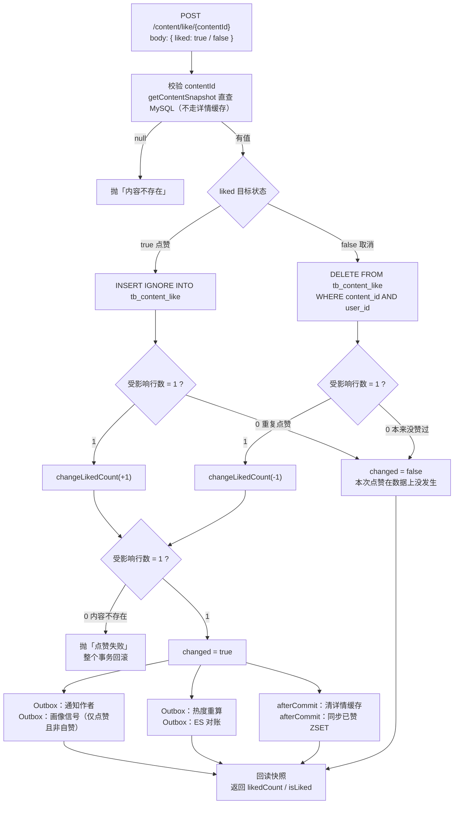
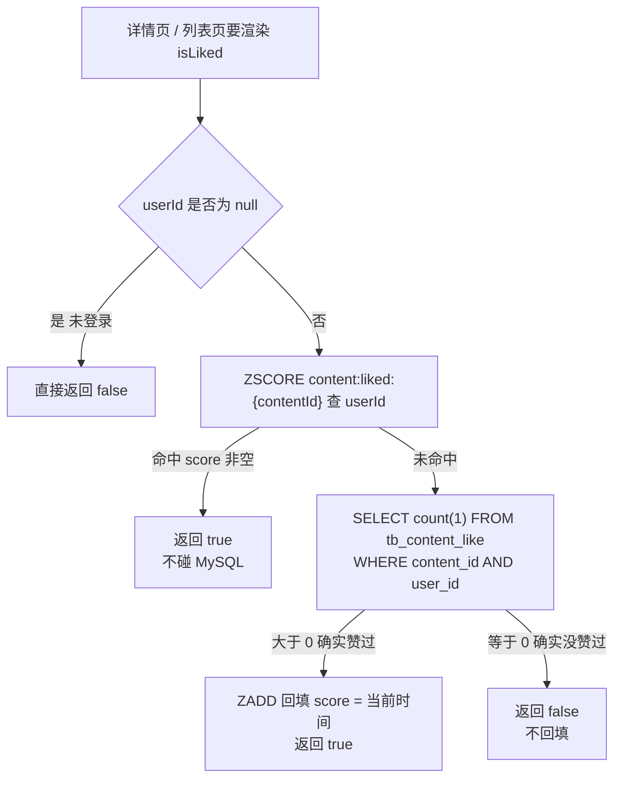
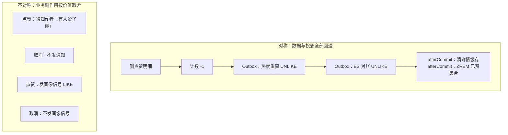

# demo0 interaction 链路 01：点赞与收藏（一次点赞的写路径与读路径）

> **一句话概括**：一次点赞 = **一个事务改两份数据**（点赞明细 + 内容计数）＋ **按「用户能不能感知」分层的四个下游动作**。幂等靠的是 `INSERT IGNORE` 的**受影响行数**，不是「先查再插」。

---

## 本页包含

| 链路 | 回答什么问题 | 核心技术点 |
| --- | --- | --- |
| 一、点赞写路径 | 用户点一下赞，后台到底改了什么 | `INSERT IGNORE` 幂等判定 · delta 原子计数 · 四个下游的分层 |
| 二、点赞状态读路径 | 列表页怎么知道「我赞过这条没有」 | Redis ZSET 加速 · 未命中必回源 · afterCommit 同步 |
| 三、取消点赞与取消收藏 | 逆向链路和正向对称吗 | 数据对称恢复 · 业务副作用按价值取舍 |

**本页不展开**：`HOT_SCORE_RECALCULATE` 的热度算法、`USER_BEHAVIOR` 的画像重建、通知落库与 WebSocket 推送、Feed 推荐流 —— 这些属于 feed / notification / rag 域，各自有独立文档。

**代码位置**：主实现是 `interaction/service/impl/ContentInteractionServiceImpl`（212 行），接口入口在 `content/controller/user/ContentController`。

---

## 链路一：点赞写路径

### 1.1 全景



图看着长，其实只有三句话：

1. **幂等**：`INSERT IGNORE` ＋ 唯一索引，用**受影响行数**判断「这次点赞是不是真的发生了」；
2. **一致性**：明细和计数**同一个事务**，计数走 `SET liked = GREATEST(0, liked + delta)` 原子自增；
3. **下游**：一个 `changed` 布尔值当总闸，四个事件按「用户能不能感知」分层甩出去。

### 1.2 核心点

#### 核心点 ①：幂等判定 = `INSERT IGNORE` 的受影响行数

**真实 SQL**（`src/main/resources/mapper/interaction/ContentInteractionMapper.xml`）：

```xml
<insert id="insertContentLiked" useGeneratedKeys="true" keyProperty="id">
    INSERT IGNORE INTO tb_content_like (content_id, user_id, create_time)
    VALUES (#{contentId}, #{userId}, #{createTime})
</insert>
```

**真实实现**（`ContentInteractionServiceImpl.likeContent`）：

```java
Long userId = BaseContext.getCurrentId();
boolean changed = false;

if (targetLiked) {
    ContentLiked contentLiked = ContentLiked.builder()
            .contentId(contentId).userId(userId).createTime(LocalDateTime.now())
            .build();
    if (contentInteractionMapper.insertContentLiked(contentLiked) == 1) {   // ← 整个链路的命门
        if (contentCounterService.changeLikedCount(contentId, 1) != 1) {
            throw new ContentFailedException("点赞失败");
        }
        changed = true;
    }
}
// 返回 0（重复点赞）→ 不进 if，changed 保持 false —— 这次点赞在数据上「没有发生」
```

三个设计点：

| 设计 | 说明 |
| --- | --- |
| `INSERT IGNORE` ＋ `(content_id, user_id)` 唯一索引 | 第一次插进去 → 影响 1 行；重复插被唯一键拒掉 → 影响 0 行，且 `IGNORE` 把错误降级成警告，**不抛异常** |
| 计数只在 `== 1` 时才 +1 | 重复点击不会把数字越点越高 |
| **没有「先 SELECT 再 INSERT」** | 拆两步就有竞态窗口：两个并发请求都查到「未点赞」，都会去插。**判断和占有必须是同一个原子动作**，这里把它交给唯一索引 |

> 面试可以这样收：**「我不需要用代码去问『你赞过没有』，我直接试着插一下，数据库会告诉我。」**

**入参设计：传「目标状态」，不传「动作」**

```java
// interaction/dto/LikeStateDTO.java
@NotNull(message = "liked不能为空")
private Boolean liked;      // true = 我要「已赞」，false = 我要「未赞」
```

| 接口形状 | 重试两次的结果 |
| --- | --- |
| `POST /like {liked: true}`（本项目，**Set 语义**） | 和调一次完全一样 ✅ |
| `POST /toggle`（Toggle 语义） | +1 再 −1，前端数字抖动 ❌ |

**写接口尽量设计成幂等的 Set，而不是增量的 Toggle** —— 因为网络重试、用户手抖、前端防抖失效都是常态，而「传目标状态」让这些重复天然无害。

**⚠️ 一个必须自己说出来的前提**

这套幂等的**全部安全性都压在那条唯一索引上**。仓库里只有测试 schema 显式建了它：

```sql
-- src/test/resources/db/read-path-cache-runtime-schema.sql
UNIQUE KEY uk_tb_content_like (content_id, user_id)
```

生产建表脚本不在仓库里 —— **上线前应该在库里 `SHOW INDEX FROM tb_content_like` 确认一次**。索引一旦缺失，`INSERT IGNORE` 就退化成普通 INSERT，每次重复点击都会真的 +1，计数立刻失真。

面试里主动讲出这个前提，比等面试官追问「那你这套靠什么保证」要好得多。

#### 核心点 ②：计数用 delta 原子自增，且必须和明细同事务

```java
// content/service/impl/ContentCounterServiceImpl.java
/** 点赞数增减（delta=+1/-1）：Mapper 内原子自增 + GREATEST 防负，返回 1/0 表示是否命中行。 */
@Override
public int changeLikedCount(Long contentId, int delta) {
    return contentMapper.updateLiked(contentId, delta) ? 1 : 0;
}
```

```xml
<!-- src/main/resources/mapper/content/ContentMapper.xml -->
<update id="updateLiked">
    UPDATE tb_content
    SET liked = GREATEST(0, liked + #{i}),
        update_time = NOW()
    WHERE content_id = #{contentId}
</update>
```

三处讲究：

| 写法 | 为什么这么写 |
| --- | --- |
| `liked = liked + #{i}`（传 delta） | 交给数据库行锁，并发下不丢更新。若先 `SELECT` 出旧值、Java 里 +1 再写回，两个并发点赞会互相覆盖 —— **计数漂移就是这么来的** |
| `GREATEST(0, ...)` | 取消点赞把计数打到 0 以下时按 0 截断，脏数据不外泄 |
| 返回受影响行数 | 0 行 = 帖子不存在 → 调用方抛异常回滚。**0 不是「忽略」，是「这次互动不成立」** |

**为什么必须同事务**：明细和计数是同一件事的两面。分开提交就会出现「有明细没计数」或「有计数没明细」，而且没有任何机制能自动修回来。所以**计数是整个点赞链路里唯一没有走异步的一步** —— 用户点完赞要立刻看到数字变了。

顺带记住这段代码的另一重身份：它是**跨域边界**的范例。interaction 域想改 content 的计数，**不能直接注入 `ContentMapper`**，只能走 `ContentCounterService` 这个域接口；反过来 content 域删帖要清互动明细，也走 interaction 的域接口。两个域互相只依赖对方的接口 → **循环依赖断在抽象层上**。

#### 核心点 ③：四个下游，按「用户能不能感知」分层

```java
// interaction/service/impl/ContentInteractionServiceImpl.likeContent（节选）

// 第一组：只有「真的新增了点赞」+「不是给自己点赞」才发
if (changed && targetLiked && !content.getPublishUserId().equals(userId)) {
    NotificationEventMessage notification = NotificationEventMessage.builder()
            .recipientUserId(content.getPublishUserId())
            .actorUserId(userId)
            .type(NotificationType.LIKE_CONTENT.getCode())
            .content("点赞了你的内容")
            .payload(Map.of("contentId", contentId))
            .build();
    notificationEventProducer.createNotificationEvent(
            notification, ModerationTargetType.CONTENT.name(), contentId);      // ① 通知作者
    feedEventProducer.createUserBehaviorEvent(userId, contentId, "LIKE");       // ② 画像信号
}

// 第二组：只要本次真的发生了变化（点赞或取消都算）
if (changed) {
    String triggerType = targetLiked ? "LIKE" : "UNLIKE";
    feedEventProducer.createHotScoreRecalculateEvent(contentId, triggerType);   // ③ 热度重算
    searchEventProducer.createSearchReconcileEvent(
            ModerationTargetType.CONTENT.name(), contentId, triggerType);       // ④ ES 对账
    contentDetailCacheInvalidator.evictAfterCommit(contentId, triggerType);     // ⑤ 详情缓存失效
    synchronizeCacheAfterCommit(
            CONTENT_LIKED_KEY + contentId, userId, targetLiked, "CONTENT_LIKE");// ⑥ 已赞集合
}
```

**`changed` 是所有下游的总闸。** 重复点赞时 `changed = false`，计数不加、四个事件一个都不发 —— 这正是「受影响行数」这个返回值最大的价值：**它一次驱动了「幂等」和「数据一致性」两件事。**

**两类机制混着用，不是随意选的：**

| 下游动作 | 走什么 | 判断依据 |
| --- | --- | --- |
| ① 通知作者 | **Outbox** | 跨进程 ＋ 不能丢（用户要能在通知列表里查到） |
| ② 画像信号 `USER_BEHAVIOR` | **Outbox** | 跨进程 ＋ 丢了画像会偏，没有自愈机制 |
| ③ 热度重算 `HOT_SCORE` | **Outbox** | 跨进程；事件只提醒，消费者回查 MySQL |
| ④ ES 对账 | **Outbox** | 同上 |
| ⑤ 详情缓存失效 | **afterCommit** | 只动本进程 ＋ TTL 到点自然失效，能自愈 |
| ⑥ 已赞集合（ZSET） | **afterCommit** | 幂等操作（加两次和一次一样），且读时未命中会回源兜底 |

沿用那条判断标准：**失败之后有没有东西自动兜底？没有 → Outbox；有（TTL／对账／幂等）→ afterCommit。**

⚠️ 但注意：**计数不在这张表里。** 它是**同事务同步调用**的，一个事件都没发。因为「点完赞立刻看到数字变了」是硬需求，不能异步。**「不是什么都该异步」这句话本身就能体现你想过为什么。**

**事件的落点**：四个事件全部写进 `tb_outbox_event`，和点赞明细、计数**同一个事务提交**。四个生产方法内部都标了 `@Transactional`（REQUIRED 传播），会加入调用方事务：

```java
// notification/mq/producer/NotificationEventProducer.java
@Transactional
public String createNotificationEvent(NotificationEventMessage message,
                                      String aggregateType, Long aggregateId) { ... }

// feed/mq/producer/FeedEventProducer.java
@Transactional
public String createHotScoreRecalculateEvent(Long contentId, String triggerType) { ... }
@Transactional
public String createUserBehaviorEvent(Long userId, Long contentId, String behaviorType) { ... }
```

事务提交 → 明细、计数、四个事件一起落地；事务回滚 → 一起消失。**这就是 Outbox 的意义：让「发消息」和「改数据」变成同一件原子的动作。**

### 1.3 面试题

---

**Q1：你是怎么设计「点赞」这个链路的？**

**答题思路**：先立约束 → 给一句话骨架 → 分步讲关键决策 → 收边界取舍。这四步正是面试官问「怎么设计」时想听的顺序。

**可以直接说出口的版本**：

> 「点赞这个功能看着简单，但它有两个硬约束：一是**它天然会重复** —— 手抖、网络重试、前端防抖失效都会让同一个请求到达两次；二是**用户点完要立刻看到结果**，数字不能等异步。
>
> 所以我的骨架是：**一次事务写两份数据，四个下游按「用户能不能感知」分层甩出去。**
>
> 第一，幂等。接口入参我设计成「目标状态」而不是「动作」，body 里传 `liked: true/false`，不是 `toggle()`。落库用 `INSERT IGNORE` 加唯一索引 `(content_id, user_id)`，**靠受影响行数判断这次到底有没有真的发生** —— 返回 1 才执行计数加一，返回 0 就是重复点赞，直接什么都不做、但接口照样返回成功。
>
> 第二，一致性。点赞明细和内容计数必须在同一个事务里，而且计数我传的是 delta（+1/−1），SQL 是 `SET liked = GREATEST(0, liked + delta)`，交给数据库行锁原子自增 —— 如果先查出来加一再写回，两个并发点赞会互相覆盖。加 `GREATEST(0, ...)` 是防取消点赞把计数打到负数。
>
> 第三，下游。能立刻感知的只有计数，所以它同步做；用户无感的四个动作 —— 通知作者、画像信号、热度重算、ES 对账 —— 全部走 Outbox 异步，和点赞事务一起提交。缓存类的两个动作（清详情缓存、同步已赞集合）走 afterCommit，因为它们失败有 TTL 和回源兜底。
>
> 边界上也有取舍：这整套幂等的安全性压在数据库唯一索引上，所以上线前必须确认索引真的建了；另外我**没有**给点赞接口加限流，项目的九个限流场景里不含点赞 —— 频率完全靠幂等兜住，而不是靠限流。这两点我觉得是可以拿出来讨论的地方。」

**代码依据**：`ContentInteractionServiceImpl.likeContent`、`ContentInteractionMapper.xml` 的 `insertContentLiked`、`ContentMapper.updateLiked`、`LikeStateDTO`。

---

**Q2：用户狂点「点赞」按钮，会不会把计数点爆？**

**答**：

> 「不会，但有意思的是它防的重点和你想的可能不太一样。
>
> 真正的防线只有一道，就是**唯一索引 ＋ `INSERT IGNORE`**。第一次插入影响 1 行，计数才 +1；第二次以后插入影响 0 行，`if` 不成立，计数根本不执行。所以不管点多少次，计数最多加一次。
>
> 而且这套判定还顺手覆盖了并发：哪怕两个请求同时到达、同时查到「没赞过」，也只有一个能插进唯一索引，另一个拿 0 行 —— **我不需要加锁，数据库的约束就是锁。**
>
> 但要说明一点：**这个接口没有配限流。** 项目的限流一共九个场景 —— 发帖、发评论、发回答、举报、上传、bot 读写、提交状态查询 —— 里面**没有点赞**。所以它的抗刷靠的是幂等（不产生脏数据），而不是限流（不限制请求数）。真要防高频刷接口，那得在网关或入口加一层，现在是被幂等兜住的。」

**代码依据**：`insertContentLiked` 的 `INSERT IGNORE`；`grep -rn "@RateLimit"` 共 14 处、9 个 scene，`ContentController` 的 `like`/`collect` 接口上没有任何 `@RateLimit`。

> ⚠️ 顺带提醒：旧文档 `chain04_like_notify.md` 的 Q5 说「这个接口上有 `@RateLimit` 注解」—— **这句是错的**，点赞接口没有限流。用上面的说法。

---

**Q3：计数为什么不放 Redis？项目里明明到处都在用 Redis。**

**答**：

> 「技术上完全可以 —— `INCR` 之后定时刷回 MySQL。但在这个项目里我不用，三个理由。
>
> 第一，**幂等方案和它冲突**。我的幂等判定依赖「插入明细的受影响行数」，计数如果放 Redis，就和明细不在同一个事务里了，两者之间必然有窗口 —— 明细插进去了、Redis 计数还没来得及加，中间挂掉就漂了，而且 Redis 里的值 MySQL 无从对账。
>
> 第二，**事实源必须唯一**。计数一旦只活在 Redis，就等于把事实源从 MySQL 挪出去了 —— Redis 丢了数据，没有任何地方能补回来。而留在 MySQL，它就是普通一列，随时能全量重算。
>
> 第三，**量级不需要**。Redis 计数解决的是「大 V 帖子百万并发点赞、MySQL 行锁扛不住」的场景。我们这个体量，一次点赞两次 DB 写（明细 INSERT ＋ 计数 UPDATE）完全够。
>
> 一句话：**选型跟着量级走，不跟着炫技走。** 什么时候该换？当同一条内容的写热到数据库行锁成为瓶颈、且业务能接受计数短暂不准的时候 —— 那时候连幂等方案也要一起改。」

---

**Q4：点赞成功后为什么要「回读一次快照」，直接 +1 不就行了？**

**答**：

> 「因为并发下你手上那个数字是不可信的。`SET liked = liked + 1` 之后，我不知道现在是几 —— 可能别的请求同时也在加，也可能刚才那次点赞是重复的、压根没加。
>
> 所以代码最后又调了一次 `contentCounterService.getContentSnapshot(contentId)`，把**当下真实的计数**读出来返回给前端。
>
> 这里有两个细节值得说：
>
> 一，这次回读**故意绕过了详情缓存**。`getContentSnapshot` 的实现直接调 `contentMapper.selectById`，不走 `ContentDetailCacheService`。因为它要的是**当下事实**，而详情缓存里的计数可能还是 300 秒前的旧值 —— 用它做回显，用户会看到数字没变，以为没点上。
>
> 二，返回的 `isLiked` 字段其实是**入参原样回传**的，不是重新查的：`LikeResultVO.builder().likedCount(likedCount).isLiked(targetLiked)`。这也符合幂等语义 —— 你要求「已赞」，我就告诉你「现在已赞」。
>
> 严格说这里有个小成本：一次点赞带着两次快照查询（进来一次校验内容存在、出去一次回读计数）。放到列表场景会有优化空间，但对单条点赞来说两次主键查询是毫秒级的，不值得为它引入额外状态。」

**代码依据**：`ContentInteractionServiceImpl.likeContent` 第 53 行与第 99 行两处 `getContentSnapshot`；`ContentCounterServiceImpl.getContentSnapshot` 的注释「不走详情缓存……这类场景要的是当下的事实，缓存投影反而帮倒忙」。

---

**Q5：通知为什么只在「非自赞」时才发？`!content.getPublishUserId().equals(userId)` 防的是什么？**

**答**：

> 「防的是自己给自己点赞还收到通知 —— 那是纯噪音。
>
> 这是条**业务规则**不是技术约束，但它被放在服务端而不是前端，因为前端拦不住脚本。判断条件写在一起还有一层意思：`changed && targetLiked && 非自赞` —— 三个条件必须同时成立。`changed` 保证「没真的发生」不发，`targetLiked` 保证「取消点赞」不发，非自赞保证「给自己点」不发。
>
> 另外注意**画像信号 `USER_BEHAVIOR` 用的是同一个条件**：自赞和取消点赞都不发画像信号。给自己点赞不能算作对某个领域的兴趣证据，取消点赞也不代表兴趣消失 —— 这两个都写在了单测里（`自赞不发画像行为事件`、`取消点赞不发画像行为事件`）。」

**代码依据**：`likeContent` 第 79−89 行；`ContentInteractionServiceImplTest` 的 `自赞不发画像行为事件` / `取消点赞不发画像行为事件` 两个用例。

---

**Q6：会不会出现「明细写进去了，但通知事件没写进去」？**

**答**：

> 「不会 —— 四个事件都和业务数据在**同一个数据库事务**里。
>
> 实现上：`createNotificationEvent`、`createHotScoreRecalculateEvent`、`createSearchReconcileEvent`、`createUserBehaviorEvent` 这四个方法内部都标了 `@Transactional`，用的是默认 REQUIRED 传播 —— 有外层事务就加入，不自己新开。而 `likeContent` 本身有 `@Transactional`，所以四个事件插的 `tb_outbox_event` 行，和点赞明细、计数更新是同一个事务提交的。
>
> 结果就是：事务提交 → 明细、计数、四条事件一起落地；事务回滚 → 一起消失。**不会出现「通知发了但点赞没成功」的幽灵事件，也不会出现「点赞成功了但下游永远不知道」。**
>
> 这也是 Outbox 相对「事务里直接发 MQ」的关键差别：直接发 MQ 的窗口在事务外面，回滚了消息也收不回；写进同库的 outbox 表，回滚时它跟着消失。」

**代码依据**：`NotificationEventProducer.createNotificationEvent` 与 `FeedEventProducer` / `SearchEventProducer` 各方法上的 `@Transactional`；`likeContent` 类上无、方法上有 `@Transactional`。

---

## 链路二：点赞状态读路径

### 2.1 全景

写完了，下一个问题是**读**：详情页、推荐流、列表页都要渲染「这颗心是不是红的」，20 条内容就是 20 次「我赞过没有」的判断。这条链路就是回答它。



### 2.2 核心点

#### 核心点 ①：Redis 里那个 ZSET 是「加速器」，不是「事实源」

**真实代码**（`ContentInteractionServiceImpl.isContentLiked`）：

```java
@Override
public boolean isContentLiked(Long contentId, Long userId) {
    if (userId == null) {
        return false;                                   // 未登录 → 必然没赞过
    }
    String key = CONTENT_LIKED_KEY + contentId;         // content:liked:{contentId}
    Double score = stringRedisTemplate.opsForZSet().score(key, userId.toString());
    if (score != null) {
        return true;                                    // 命中：直接返回，不碰 MySQL
    }
    boolean liked = contentInteractionMapper.countContentLiked(contentId, userId) > 0;
    if (liked) {
        stringRedisTemplate.opsForZSet().add(key, userId.toString(), System.currentTimeMillis());
    }
    return liked;
}
```

三个设计决定：

| 决定 | 说明 |
| --- | --- |
| 用 **ZSET**，member = `userId`，score = `当前时间戳` | 一个 key 装「这条内容被谁赞过」，天然的集合去重 |
| **只有命中才提前返回** | 命中查的是 Redis，未命中一定要回源 MySQL |
| **只有「真的赞过」才回填** | 查出来是 false 时**什么都不写** —— 见下面核心点 ② |

key 的定义在 `platform/redis/constant/RedisConstants`：

```java
public static final String CONTENT_LIKED_KEY  = "content:liked:";
public static final String CONTENT_COLLECT_KEY = "content:collect:";
```

#### 核心点 ②：只加速「正例」—— 未命中必然回源

这是这条链路最容易被面试官抓住的地方，也是它和 content 详情缓存**最本质的区别**：

| | content 详情缓存 | 已赞集合（ZSET） |
| --- | --- | --- |
| 是不是「全量镜像」 | 是，每条被读过的内容都有 | **不是**，只有在某次查询里「确实赞过」的用户才会有 member |
| 未命中的含义 | 「缓存没预热／过期了」 | 「**不能判断**」—— 可能没赞过，也可能只是没被预热过 |
| 负结果怎么处理 | 有**负缓存**（NOT_FOUND 等状态缓存 60 秒） | **不回填**，每次都得回源 |

所以它加速的只有**「已经赞过」的重复查询**：

- 用户点完赞立刻刷新详情页 → 写路径已经 `ZADD` 过了，第二次读必命中；
- 用户反复回看自己点过赞的帖子 → 命中；
- 同一会话里多次进同一个详情页 → 命中。

**诚实地说，这是一层收益有限、范围明确的加速。** 它挡不住「20 条内容全是没赞过的」这种场景 —— 那种场景每一次都要回源。列表页真正的解法是**批量查询**，项目里评论那边就是这么做的：

```xml
<!-- mapper/interaction/CommentInteractionMapper.xml -->
<select id="selectCommentLikeIds" resultType="java.lang.Long">
    SELECT comment_id FROM tb_comment_like
    WHERE user_id = #{userId} AND comment_id IN
    <foreach collection="allCommentIds" item="id" open="(" close=")" separator=",">#{id}</foreach>
</select>
```

一次 `IN` 查完一页评论的点赞关系，而不是逐条问缓存。**「批量查一次」比「逐条查缓存」更值钱** —— 这个判断在点赞这里同样成立。

> 顺带指出一个小冗余（面试可主动说）：`feed/service/impl/FollowFeedServiceImpl` 里也写了一份 `isContentLiked`，先查一次 ZSET，未命中再调 `contentInteractionService.isContentLiked` —— 而后者内部**又查了一次 ZSET**。功能没问题，但多了一次 Redis 往返。合并掉会更干净。

#### 核心点 ③：同步走 afterCommit，删帖整 key 清掉

ZSET 是投影，所以要跟着事实源走。同步动作写在 `synchronizeCacheAfterCommit`：

```java
private void synchronizeCacheAfterCommit(String key, Long userId, boolean targetState, String businessType) {
    if (!TransactionSynchronizationManager.isActualTransactionActive()) {
        return;                              // 没事务就不注册，直接跳过
    }
    TransactionSynchronizationManager.registerSynchronization(new TransactionSynchronization() {
        @Override
        public void afterCommit() {
            try {
                if (targetState) {
                    stringRedisTemplate.opsForZSet().add(key, userId.toString(), System.currentTimeMillis());
                } else {
                    stringRedisTemplate.opsForZSet().remove(key, userId.toString());
                }
            } catch (Exception e) {
                log.error("互动缓存同步失败，businessType={}, userId={}, targetState={}",
                        businessType, userId, targetState, e);
            }
        }
    });
}
```

**为什么挂 afterCommit 而不是放事务里？**

| 放事务里 | 挂 afterCommit |
| --- | --- |
| 事务回滚了，但 ZSET 已经加了 → **缓存说「赞过」，数据库里没有**，而且这个假 member 不会自己消失（除非 TTL 或删 key） | 事务提交成功才写投影；失败就不写，下次读回源 |

而且它**可以**挂 afterCommit 的前提是：**这个操作是幂等的、且丢了能自愈** —— ZADD 两次和一次一样，ZREM 不存在的 member 也没事；真丢了下次读未命中会回源。所以它属于「能自愈」那一类，afterCommit 就够了。

里面那个 `try-catch` 也有必要：**afterCommit 里抛异常没人接**（事务已提交，回滚不了），只能兜住打日志。

**删帖时的清理**（`content/service/impl/ContentCommandServiceImpl`，`deleteContent` 的 afterCommit 投影清理段）：

```java
stringRedisTemplate.delete(CONTENT_LIKED_KEY + contentId);
stringRedisTemplate.delete(CONTENT_COLLECT_KEY + contentId);
```

管理端删帖（`AdminContentServiceImpl`）同样清。**整个 key 删掉**而不是逐个 ZREM —— 帖子都没了，这个集合没有保留价值。不清的后果是：帖子被恢复（软删回滚／重新上架）后，里面的人会看到「幽灵已赞」。

### 2.3 面试题

---

**Q1：你是怎么设计「判断我有没有赞过这条内容」这个点的？**

**答**：

> 「事实只有一处：`tb_content_like` 表，`(content_id, user_id)` 上有唯一索引。理论上直接 `SELECT count(1)` 就能回答，但详情页和列表页都要渲染这个状态，一页 20 条就是 20 次 count 查询，全压到 MySQL 上不合理。
>
> 所以我在 Redis 加了一层加速：`content:liked:{contentId}` 是个 ZSET，member 是 userId，score 是加入时间。读的时候先 `ZSCORE`，命中就直接返回 true；不命中回查 MySQL，而且**只有查出来真的赞过才回填** —— 查出来是 false 的情况不回填。
>
> 这里有个关键取舍要讲清楚：**这个 ZSET 不是全量镜像，它是懒加载的加速结构。** 所以「不在集合里」推不出「没赞过」—— 可能只是没被预热过。要断言 false 必须回源。它加速的只是「已经赞过」的重复查询，比如用户点完赞立刻刷新、或者反复回看自己赞过的帖子。
>
> 同步走 afterCommit：新增点赞 ZADD、取消点赞 ZREM、删帖整个 key 删掉。挂 afterCommit 是因为它幂等且丢失能自愈 —— ZADD 两次和一次一样，真丢了下次读未命中会回源。如果放事务里，回滚会留下一个不会自己消失的假 member。」

**代码依据**：`ContentInteractionServiceImpl.isContentLiked` / `synchronizeCacheAfterCommit`；`RedisConstants.CONTENT_LIKED_KEY`。

---

**Q2：为什么「不在 ZSET 里」不能等同于「没赞过」？那它到底加速了什么？**

**答**：

> 「因为它不是全量镜像，是**懒加载**的。ZSET 里只有『历史上至少被查过一次、并且那一次结论是赞过』的用户。一个从没被查询过的人，天然不在里面 —— 但这不代表他没赞过。
>
> 所以读取逻辑必须是：命中 → 直接 true；未命中 → **回源 DB 才能给出结论**。这也是为什么它不能做负缓存：负结果要缓存的话，得先能区分『确定没赞过』和『只是不知道』，而它区分不了。
>
> 加速的收益在『正例的重复查询』上：点赞后立刻刷新（写路径刚 ZADD 过）、用户反复看自己赞过的帖子、同一会话重复进详情页。**说实话这是一层范围明确的优化，不是银弹。** 真正划算的是批量：评论那边就是一次 `WHERE comment_id IN (...)` 把一页的点赞关系全查出来，而不是逐条问缓存。列表场景我会优先选批量查库，而不是逐条查缓存。」

**代码依据**：`isContentLiked` 的三个分支；`CommentInteractionMapper.xml` 的 `selectCommentLikeIds`。

---

**Q3：为什么用 ZSET 而不是 SET 或 String？score 存时间戳有什么用？**

**答**：

> 「先用排除法：String 不行，那是『一个人一个 key』的存法，判断『某人赞过没』理论上能用 `SISMEMBER` 类似的思路，但这里要按内容聚合。SET 可以做去重，`SISMEMBER` 也是 O(1)。
>
> 选 ZSET 是因为它多了一个**可排序的维度**：score 存时间戳，就能按时间范围裁剪（`ZREMRANGEBYSCORE`）或者取最近的一批。不过要诚实说，**目前代码里没有用到任何按 score 的查询** —— 读取只用了 `ZSCORE`，写入用的是 `ZADD`。所以这个 score 现在是**预留**的，为将来做『只保留最近 N 个』或者清理老数据留的口子。
>
> 如果要更严谨一点，用 SET 也能满足当前所有需求。选 ZSET 更多是考虑扩展性 —— 这是个可以拿出来讨论的取舍，而不是非它不可。」

**代码依据**：`isContentLiked` 里只有 `opsForZSet().score(...)` 和 `.add(...)`，全项目没有 `ZREMRANGEBYSCORE` / `ZRANGEBYSCORE` 调用。

---

**Q4：帖子被删了，这个 ZSET 谁清？**

**答**：

> 「两条路径都清。用户自己删帖走 `ContentCommandServiceImpl.deleteContent` 的 afterCommit 投影清理，`stringRedisTemplate.delete(CONTENT_LIKED_KEY + contentId)`；管理端删帖在 `AdminContentServiceImpl` 里做同样的事。
>
> 注意是**整个 key 删掉**，不是逐个 ZREM。因为帖子没了，这个集合本身就没有意义 —— 留着它只是浪费内存，而且帖子万一被恢复（重新上架）会出现『幽灵已赞』：数据库里没有这条点赞明细了，但缓存说赞过。
>
> 删帖干净这一点是『投影跟着事实源走』原则的直接体现：**事实源没了，投影不能留。**」

**代码依据**：`ContentCommandServiceImpl` 第 407−408 行、`AdminContentServiceImpl` 第 344/348 行。

---

**Q5：这套「明细 + 计数 + 缓存」的点赞，和评论点赞、回答点赞是什么关系？**

**答**：

> 「是**同一个模式复用三处**，不是三套不同实现。
>
> | | 明细表 | 计数 | 通知类型 |
> |---|---|---|---|
> | 点赞内容 | `tb_content_like` | `tb_content.liked` | `LIKE_CONTENT` |
> | 点赞评论 | `tb_comment_like` | 评论表点赞数 | `LIKE_COMMENT` |
> | 点赞回答 | `tb_answer_like` | 回答表点赞数 | `LIKE_ANSWER` |
>
> 三者都是：`INSERT IGNORE` 明细 → 受影响行数判断 → 同事务改计数 → `changed` 才发下游。差异只在两处：**回答点赞不发画像信号**（它只有通知和 ES 对账），**评论点赞不发热度重算**（热度榜只针对内容）。
>
> 这也说明这套幂等模式的可迁移性 —— 它不依赖某个具体业务，只要满足『明细有唯一约束』就能用。」

**代码依据**：`CommentInteractionServiceImpl.likeComment`、`AnswerInteractionServiceImpl.likeAnswer`；三张明细表的 `INSERT IGNORE` SQL。

---

## 链路三：取消点赞与取消收藏

### 3.1 全景



### 3.2 核心点：数据对称恢复，业务副作用按价值取舍

```java
} else if (contentInteractionMapper.deleteContentLikedByUser(contentId, userId) == 1) {
    if (contentCounterService.changeLikedCount(contentId, -1) != 1) {
        throw new ContentFailedException("取消点赞失败");
    }
    changed = true;
}
```

**对称的部分 —— 数据与投影必须全部回退：**

| 层 | 点赞时 | 取消时 |
| --- | --- | --- |
| 明细 | 插入 | 删除（`DELETE WHERE content_id AND user_id`） |
| 计数 | +1 | −1（`GREATEST(0, ...)` 兜底防负） |
| 热度 | 发 `LIKE` 事件 | 发 `UNLIKE` 事件 |
| ES | 发 `LIKE` 对账 | 发 `UNLIKE` 对账 |
| 详情缓存 | 失效 | 失效 |
| 已赞集合 | ZADD | ZREM |

**不对称的部分 —— 业务副作用按价值取舍：**

```java
// 通知：只在 targetLiked=true 时才有
if (changed && targetLiked && !content.getPublishUserId().equals(userId)) {
    ...
    feedEventProducer.createUserBehaviorEvent(userId, contentId, "LIKE");
}
```

| 副作用 | 取消时 | 为什么 |
| --- | --- | --- |
| 通知 | **不发** | 「有人取消赞了你」没有业务价值，还会造成困扰 |
| 画像信号 | **不发** | 取消点赞不代表兴趣消失；而且这个信号本身已由「点赞」记录了 |

> 设计逆向流程的原则一句话：**数据一致性必须对称恢复，业务副作用按价值取舍。**

另一个细节：`deleteByContentId` 是**删帖时的级联清理**，把某条内容下所有点赞和收藏明细一次删掉：

```java
@Override
public void deleteByContentId(Long contentId) {
    contentInteractionMapper.deleteContentLikedByContentId(contentId);
    contentInteractionMapper.deleteContentCollectByContentId(contentId);
}
```

它自己**没有 `@Transactional`** —— 因为调用它的 `ContentCommandServiceImpl.deleteContent` 本身在事务里，它加入即可，和「软删帖子 + 删图片 + 删评论 + 删回答」一起原子提交。

### 3.3 面试题

---

**Q1：你是怎么设计「取消点赞」这个逆向链路的？**

**答**：

> 「我先明确一件事：**逆向不是正向的镜像**，两者的对称性要分层看。
>
> 第一层是数据，必须严格对称 —— 正向插明细、加计数、发 LIKE 事件、ZADD；逆向就删明细、减计数、发 UNLIKE 事件、ZREM。这一层漏掉任何一项，缓存和索引就会和事实源分叉，而且没有机制自动纠正。
>
> 第二层是业务副作用，要按价值取舍 —— 正向发通知（『有人赞了你』）和画像信号（『这个用户对这类内容感兴趣』），逆向两样都不发。取消赞的通知没有价值还有困扰；取消点赞也不代表兴趣消失，画像只加不减是合理的。
>
> 第三层是幂等，和正向完全同构：`DELETE` 的受影响行数决定要不要减计数。本来就没赞过的取消请求，`DELETE` 影响 0 行，`changed` 保持 false，计数不动、事件不发，接口返回成功。**所以『反复取消』也是安全的。**
>
> 一个实现细节：计数更新带 `GREATEST(0, ...)`，所以哪怕明细和计数因为历史脏数据不一致，计数也不会被减成负数。」

**代码依据**：`likeContent` 的 else-if 分支；`ContentMapper.updateLiked` 的 `GREATEST(0, ...)`。

---

**Q2：取消点赞为什么不发通知？但热度事件照发？**

**答**：

> 「判断标准是**这个副作用的业务价值**，不是『它属于哪一类』。
>
> 热度必须重算 —— 因为热度分是排序依据，点赞数变了排序就该变。取消赞让热度降下来，和点赞让它升上去一样，都是**数据正确性**问题，不能省。
>
> ES 对账也一样 —— 搜索结果里的点赞数字段得跟着变，否则用户会看到搜索页显示 5 个赞、点进去只有 3 个。
>
> 通知则纯属**业务体验**：『有人取消赞了你』这条消息，用户看到只会困惑（谁？为什么？），甚至是被取消了还被提醒一次，体验更差。所以它被砍掉了 —— 砍掉一个副作用不会导致任何数据不一致，只是少一个通知。
>
> 这其实就是**「这不是 bug，是设计」**的一个好例子：正向和逆向看起来不对称，但每一处不对称都有理由。」

**代码依据**：`likeContent` 中 `createNotificationEvent` 与 `createUserBehaviorEvent` 都在 `targetLiked` 分支内；热度／ES 事件在 `if (changed)` 块内，正逆向都发。

---

**Q3：取消一个「本来就没赞过」的请求，会怎样？会报错吗？**

**答**：

> 「不会报错，静默返回成功。这是幂等语义的要求。
>
> 代码路径是：`DELETE FROM tb_content_like WHERE content_id = ? AND user_id = ?` 影响 0 行 → `== 1` 不成立 → 不进 if → `changed` 保持 false → 计数不执行 → 四个事件都不发 → 直接走到最后回读快照返回。
>
> 返回体里的 `likedCount` 是当前真实计数（没变），`isLiked` 是 `targetLiked`，也就是 false。前端拿到的结果和『我确实取消掉了一个点赞』完全一样。
>
> 这一点和重复点赞是对称的：**重复操作不报错、不重复生效、返回成功。** 如果这里抛异常，前端就会弹一个『取消失败』—— 可实际状态正是用户想要的，报错反而是错的。」

**代码依据**：`likeContent` 的 `deleteContentLikedByUser(...) == 1` 判断；单测 `重复点赞未新增关系时不更新计数也不发画像事件`（同构逻辑）。

---

**Q4：取消点赞后，用户立刻刷新详情页，看到的是对的吗？**

**答**：

> 「对的，而且是**两条路都通向正确**。
>
> 第一条路是已赞集合：取消点赞的 `afterCommit` 里做了 `ZREM`，所以下次读 `isContentLiked` 时 `ZSCORE` 返回空，会回源 MySQL 确认 —— 确认结果是没赞过，返回 false。
>
> 第二条路是详情缓存：`evictAfterCommit` 把这条内容的详情缓存写成了墓碑，下次读会强制回源，拿到的计数是减过 1 的。
>
> 唯一要注意的是 **afterCommit 的时序**：它在事务提交之后、同一个请求线程里执行。所以如果用户在 ZREM 完成之前（毫秒级窗口）就刷新，理论上可能读到旧状态 —— 但那一刻 MySQL 里明细也已经删了，未命中会回源，所以最坏情况是「多花一次 DB 查询」，而不是返回错误结果。**这正是允许它挂 afterCommit 而不是走 Outbox 的原因：它丢得起。**」

**代码依据**：`synchronizeCacheAfterCommit` + `contentDetailCacheInvalidator.evictAfterCommit` 相邻调用；`isContentLiked` 的未命中回源分支。

---

## 附：这条链路涉及的面试关键词（对着题库自检用）

| 关键词 | 一句话 |
| --- | --- |
| 幂等写接口 | 传**目标状态**（Set），不传**动作**（Toggle） |
| 幂等落库 | `INSERT IGNORE` ＋ 唯一索引，靠**受影响行数**判定，不先查再插 |
| 原子计数 | `SET x = GREATEST(0, x + delta)`，不读出来加一写回 |
| 事务边界 | 明细 + 计数同事务；四个事件写 Outbox 同事务 |
| 同步还是异步 | 失败**有人兜底** → afterCommit；**没人兜底** → Outbox；**用户要立刻看到** → 同步 |
| 懒加载缓存 | 未命中不等于否 —— 断言 false 必须回源 |
| 批量优先 | 列表场景「一次 IN 查询」优于「逐条查缓存」 |
| 逆向链路 | 数据对称恢复，业务副作用按价值取舍 |

---

## 附：需要你确认的一处事实

**`tb_content_like` 的唯一索引在生产库里是否真的存在？**

仓库里只有测试 schema（`src/test/resources/db/read-path-cache-runtime-schema.sql`）显式声明了：

```sql
UNIQUE KEY uk_tb_content_like (content_id, user_id)
```

生产建表脚本不在仓库里。**建议在库里跑一次 `SHOW INDEX FROM tb_content_like;` 确认** —— 这条索引一旦缺失，整套点赞幂等就失效了（`INSERT IGNORE` 会退化成普通 INSERT，重复点击真的会重复加计数）。
