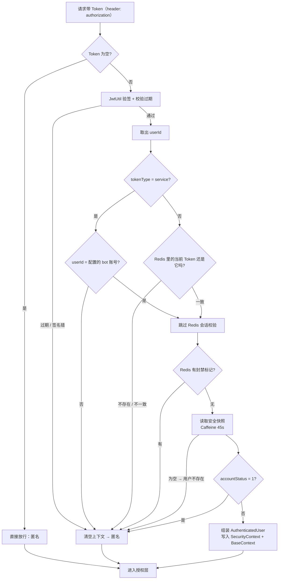
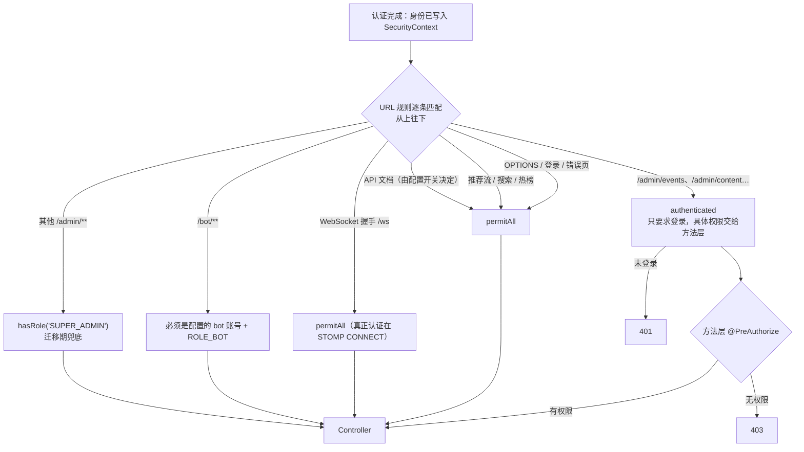
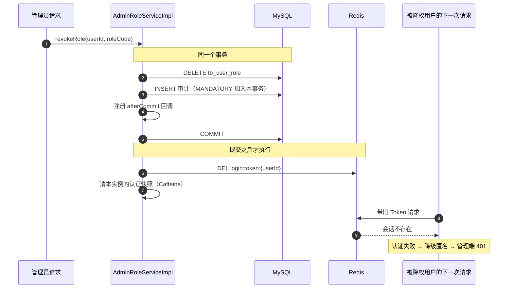

# demo0 security 链路 01：认证与授权 —— 从「你是谁」到「你能做什么」

> **一句话概括**：一次请求的安全由两件事决定 —— **认证**回答「你是谁」（JWT 验签 → Redis 会话 → 安全快照），**授权**回答「你能做什么」（URL 层粗筛 → `@PreAuthorize` 细查）。JWT 里**只放 userId**，角色和权限每次请求从快照算出来，所以权限变更能立刻生效。

---

## 本页包含

| 链路 | 解决什么问题 | 核心点 |
| --- | --- | --- |
| **链路一：认证** | 一个带 Token 的请求，怎么确定它是谁 | ① 安全快照：把存在性 / 认证状态 / 角色 / 权限压成一次读<br>② 七步判断链 + service token 旁路<br>③ 双写双清：清理边界划在哪 |
| **链路二：授权** | 已确定的身份，能不能访问这个接口 | ① `authorizeHttpRequests` 的分层规则<br>② 角色 → 权限映射为什么放代码 |
| **链路三：权限变更** | 改了角色 / 封了号，旧 Token 怎么立刻失效 | ① `afterCommit` 删会话 + 清快照 |

---

## 链路一：认证 —— 一次请求怎么确定「你是谁」

### 1.1 全景



**这张图的三个关键设计**：

1. **过滤器从不说「不行」** —— 任何一步失败都只是「降级为匿名」，继续往下走。到底放不放行，交给后面的授权层按路径判断。
2. **验签在前，查 Redis 在后** —— 身份可不可信是本地计算出来的（不依赖外部服务），Redis 只负责「这个身份还有没有效」。
3. **写两份上下文** —— `SecurityContext`（Spring Security 用）+ `BaseContext`（项目存量代码用，66 处 `getCurrentId()` 都是它）。

### 1.2 核心点

#### 核心点 1：一次快照，把四次查库压成一次

认证链要回答四件事：**用户还在吗、有没有被软删、校友认证过了吗、他有哪些角色**。朴素写法是四次查询串起来 —— 但这是**每个请求都要跑一遍**的热路径，四次查询全压在认证上，数据库会先扛不住。

真实做法是 `AuthenticationSnapshotCacheImpl.load`：

```java
// platform/security/service/impl/AuthenticationSnapshotCacheImpl.java
private AuthenticationSnapshot load(Long userId, boolean serviceToken) {
    UserAccountVO user = userQueryService.getAccount(userId);
    if (user == null) {
        return null;                                    // 用户不存在 → 快照为空
    }

    UserAuthStatusVO userAuth = identityQueryService.getAuthStatus(userId);
    boolean verified = userAuth != null
            && Objects.equals(userAuth.getAuditStatus(), AuditStatus.APPROVED.getCode());

    Set<String> roles = loadRoles(userId, verified, serviceToken);
    Set<String> authorities = RolePermissionMapping.permissionsFor(roles);   // 角色 → 权限，纯内存计算

    return new AuthenticationSnapshot(
            user.getAccountStatus(), verified, roles, authorities,
            roles.contains(RoleConstants.SUPER_ADMIN)
    );
}
```

缓存本身是 **Caffeine**（进程内），配置在 `quanta.read-path.authentication`：

```yaml
quanta:
  read-path:
    authentication:
      maximum-size: 10000
      ttl-seconds: 45          # ← 本地缓存 45 秒
```

**为什么这么写**：

- **合并读 + 加缓存，把热路径的 DB 压力压到 1/45**。45 秒内同一个用户的认证不再碰数据库。
- **缓存的是「不可变的计算结果」，不是「可变对象」**。`AuthenticationSnapshot` 是 record，`roles` / `authorities` 都是 `Set.copyOf(...)` 的不可变集合；每次认证再 `new` 一个 `AuthenticatedUser` 出来。**缓存只做共享，不做状态** —— 这是缓存安全对象的铁律。
- **缓存 key 带上「令牌类型」**，这点很关键：

```java
private record AuthenticationCacheKey(Long userId, boolean serviceToken) { }
```

同一个账号，**普通 Token 和 service token 必须拿不同的快照**。否则 bot 的系统身份（`BOT` 角色）会被普通 Token 复用 —— 等于给普通用户发了一张 bot 通行证。

> **代价要说清楚**：这是**本地**缓存，多实例下各存一份。改角色时只能清掉当前实例的那一份，别的实例最长脏 45 秒。所以链路三才必须额外删 Redis 登录态 —— 那一步是**跨实例**的，效果才是即时的。

#### 核心点 2：七步判断链里藏了一条「服务旁路」

```java
// platform/security/service/impl/TokenAuthenticationServiceImpl.java
@Override
public AuthenticatedUser authenticate(String token) {
    if (token == null || token.isBlank()) {                       // ① 没带 Token
        throw authenticationFailed(TOKEN_MISSING, "未携带登录凭证");
    }

    Claims claims = parseClaims(token);                           // ② 验签 + 查过期
    Long userId = extractUserId(claims);                          // ③ 取 userId

    boolean serviceToken = JwtClaimsConstant.SERVICE_TOKEN_TYPE
            .equals(claims.get(JwtClaimsConstant.TOKEN_TYPE));
    if (serviceToken) {
        if (!quantabotProperties.getBotUserId().equals(userId)) {  // ④ service token 只认 bot 账号
            throw authenticationFailed(TOKEN_INVALID, "service token 仅限 bot 系统账号");
        }
    } else {
        validateCurrentSession(userId, token);                     // ④ 普通 token：比对 Redis 会话
    }

    Boolean banned = stringRedisTemplate.hasKey(                        // ⑤ Redis 封禁标记
            RedisConstants.USER_BANNED_KEY + userId);
    if (Boolean.TRUE.equals(banned)) {
        throw authenticationFailed(USER_BANNED, "账号已被封禁");
    }

    AuthenticationSnapshot snapshot =
            authenticationSnapshotCache.get(userId, serviceToken);      // ⑥ 读安全快照
    if (snapshot == null) {
        throw authenticationFailed(USER_NOT_FOUND, "用户不存在");       //    快照为空 = 用户不存在
    }
    if (Integer.valueOf(1).equals(snapshot.accountStatus())) {          // ⑦ 快照里的封禁状态
        throw authenticationFailed(USER_BANNED, "账号已被封禁");
    }

    return AuthenticatedUser.builder()                                  // 每次新建认证主体
            .userId(userId)
            .roles(snapshot.roles())
            .authorities(snapshot.authorities())
            .accountStatus(snapshot.accountStatus())
            .verified(snapshot.verified())
            .admin(snapshot.admin())
            .build();
}
```

**为什么要有 service token 这条旁路**：

QuantaBot 是**另一个进程**，它调后端不是「某个用户登录了」，而是「内部系统间调用」。如果强行让它走用户那套，就必须给 bot 造一个假的登录会话，还要维护它的 Redis Token 续期 —— 那是把系统账号伪装成用户，最难查的一类问题。

所以做法是：**在 JWT 里加一个 `tokenType = service` 声明，并且用两个条件夹住它** ——

| 条件 | 位置 | 作用 |
| --- | --- | --- |
| `tokenType = service` | `TokenAuthenticationServiceImpl` | 跳过 Redis 会话校验（服务调用没有「登录态」） |
| `userId == 配置的 botUserId` | 同上 | 防止有人自己签一个 service token 冒充别人 |
| `principal.userId == botUserId && hasRole('BOT')` | `SecurityConfiguration.isBotHttpPrincipal` | `/bot/**` 的第二道边界 |

第三道是重点：**`/bot/**` 不满足于「你是登录用户」，而是要求「你就是那个配置的 bot 账号，并且真的带 BOT 角色」**。这样即使有人在数据库里误给某用户授了 `BOT` 角色，也翻不过这道墙。

**封禁为什么查两次**：第 ⑤ 步查的是 Redis 标记（**立即生效、可回滚**），第 ⑦ 步查的是数据库快照里的 `accountStatus`（**持久事实**）。两层是刻意的：Redis 挂了还有数据库兜底，数据库改了但 Redis 标记还在也不会漏拦。**方向和目标一致，只是精度不同**。

#### 核心点 3：双写双清 —— 清理边界必须划清楚

过滤器同时写两个上下文，但**清理责任是分开的**：

```java
// platform/security/filter/OptionalJwtAuthenticationFilter.java
@Override
protected void doFilterInternal(HttpServletRequest request, HttpServletResponse response,
                                FilterChain filterChain) throws ServletException, IOException {

    BaseContext.removeCurrentId();        // 进门先清一次（线程可能是复用的）

    try {
        if ("OPTIONS".equalsIgnoreCase(request.getMethod())) {   // 跨域预检不认证
            filterChain.doFilter(request, response);
            return;
        }

        String token = request.getHeader(jwtProperties.getUserTokenName());
        if (token != null && token.startsWith("Bearer ")) {      // 兼容两种传法
            token = token.substring("Bearer ".length()).trim();
        }
        if (token == null || token.isBlank()) {                   // 没带 Token = 匿名，不报错
            filterChain.doFilter(request, response);
            return;
        }

        try {
            AuthenticatedUser authenticatedUser = tokenAuthenticationService.authenticate(token);
            // ……组装 UsernamePasswordAuthenticationToken……
            SecurityContextHolder.setContext(securityContext);     // 写 Spring Security
            BaseContext.setCurrentId(authenticatedUser.getUserId()); // 写项目自有上下文
        } catch (TokenAuthenticationException exception) {         // 凭证问题
            SecurityContextHolder.clearContext();
            BaseContext.removeCurrentId();
            log.warn("HTTP Token认证失败，uri={}，reason={}", request.getRequestURI(), exception.getReason());
        } catch (Exception exception) {                            // Redis / DB 抖动
            SecurityContextHolder.clearContext();
            BaseContext.removeCurrentId();
            log.error("HTTP Token认证发生系统异常，uri={}，message={}", request.getRequestURI(), exception.getMessage());
        }

        filterChain.doFilter(request, response);
    } finally {
        BaseContext.removeCurrentId();     // ← finally 里只清 BaseContext
    }
}
```

**为什么 `finally` 里只清 `BaseContext`**：

- `SecurityContextHolder` 由 Spring Security 自己的过滤器链负责清理（`SecurityContextHolderFilter`），项目不用重复做。
- **`BaseContext` 是项目自定义的 `ThreadLocal`，Spring 完全不知道它存在** —— 不手动清，Tomcat 线程复用时下一个请求会读到上一个用户的 ID。这就是最经典的越权事故：A 用户的操作被当成 B 用户执行。

代码里同时出现「进门前清一次」和「finally 清一次」，看着冗余，其实各管一段：

| 时机 | 防的是什么 |
| --- | --- |
| 进门前 `removeCurrentId()` | 上一轮异常路径没清干净，残留污染本次请求 |
| finally `removeCurrentId()` | 本次请求结束后污染下一个请求 |

**判断规则一句话**：**往 `ThreadLocal` 塞任何请求级数据的地方，必须有一处配对的 `remove`**。塞在自定义容器里尤其危险 —— 框架不会替你兜底。

### 1.3 面试题

---

**Q1：你是怎么设计「认证」这个链路的？**

**答题框架（总分总）**

> 「先立约束：这是**每个请求都要跑**的热路径，同时社区产品对安全有硬要求 —— 封号必须立刻生效，不能等 Token 自然过期。
>
> 一句话骨架：**JWT 证明『这个身份是真的』，Redis 证明『这个身份还有效』，两者职责不重叠。**
>
> 分三步讲：
>
> **第一步，验签放最前。** 用 jjwt 本地验签，这一步不碰任何外部服务 —— 身份可不可信是个纯计算问题。放最前面，伪造和过期的 Token 在毫秒级就被挡掉。
>
> **第二步，撤销检查。** Redis 里存『这个用户当前唯一的有效 Token』。请求带的 Token 和 Redis 里的不一致，说明他已经被顶号、被下线、或者被封了。这就是『封号立刻生效』的落点 —— 删掉那个 key 就行。
>
> **第三步，用安全快照补齐身份。** 用户存在性、校友认证状态、角色、权限这四件事是**同一个用户的一组事实**，我把它们合并成一次读取并缓存在进程内（Caffeine 45 秒），避免每个请求四次查库。快照是不可变对象，每次认证基于它新建认证主体 —— 缓存只做共享，不存状态。
>
> 收口：整个过滤器**从不说『不行』**，任何一步失败都只是降级成匿名。到底放行还是拒绝，由授权层按路径判断 —— 这样同一套认证能同时支持『推荐流匿名可看』和『管理端必须登录』。」

**依据**：`TokenAuthenticationServiceImpl.authenticate`、`AuthenticationSnapshotCacheImpl.load`、`OptionalJwtAuthenticationFilter.doFilterInternal`

---

**Q2：JWT 加了 Redis，这不就退化成 Session 了吗？**

> 「表面像，故障行为完全不同。Session 的语义是『状态完全在服务端』：每个请求都回存储查一次完整用户状态，**存储是命根子，挂了所有人都要重新登录**。
>
> 我们这是分层的：**JWT 验签承担『身份可信』的证明**，这是本地计算，不依赖任何外部服务；**Redis 只承担撤销语义**，存的是『当前有效 Token 是什么』这一个字符串。
>
> 所以 Redis 挂了，**验签依然通过，但会话比对那一步拿不到值 —— 结果就是所有已登录用户降级为匿名**。普通用户刷推荐流无感（本来匿名也能看），只是没有个性化数据；管理端全部 401。系统退化成『只读的匿名服务』，但**没有任何越权窗口** —— 所有降级方向都是收紧权限。
>
> 换个说法：JWT 在这套架构里是必需的，Redis 是**可退化的增强件**。Session 架构里存储拿掉就死，我们拿掉只是降级。这个『可退化』是设计出来的，不是巧合。」

**依据**：`validateCurrentSession` 在 Redis 无值时抛 `SESSION_NOT_FOUND` → 过滤器 catch 后 `clearContext()`；`RedisConstants.LOGIN_USER_KEY = "login:token:"`

> ⚠️ **一个容易讲错的地方**：别说「Redis 挂了验签通过就能继续用」。代码里会话校验是**认证链的必经一步**（service token 才跳过），拿不到会话值就是认证失败 → 匿名。这样说会和后面的降级推演自相矛盾。

---

**Q3：Token 里为什么只放 userId，不放角色？**

> 「两个原因。
>
> **第一，放进去就得等它过期。** 角色一旦写进 JWT，它在 Token 有效期内就是『冻结』的 —— 我签了 7 天的 Token 说你是管理员，五分钟后把你降权，这个 Token 里还写着管理员。唯一的解法是删会话强制重新登录，但这又回到『认证和授权耦合』了。
>
> **第二，Token 会越来越大、越来越旧。** 角色、权限、认证状态任何一项变化，都要求重新签发 Token，等于把用户状态的一部分复制到了客户端。
>
> 所以我的取舍是：**JWT 只承载『稳定声明』** —— userId、签发时间、过期时间。角色和权限在服务端由 `AuthenticationSnapshotCacheImpl.loadRoles` 每次算出来：`[USER] + [VERIFIED_USER 若认证] + [user_role 表的管理角色]`，再经 `RolePermissionMapping` 展开成权限集合。
>
> 好处是**权限的事实源只剩一处**（数据库 + 代码映射），不存在『Token 里说的』和『数据库里写的』两个版本。降权之后，下一个请求算出来的就是新权限 —— 最长脏一个快照 TTL（45 秒）。」

**依据**：`SessionServiceImpl.login` 只放 `JwtClaimsConstant.USER_ID`；`JwtClaimsConstant` 只有 `USER_ID` / `TOKEN_TYPE`；`RolePermissionMapping.permissionsFor`

---

**Q4：Cookie / Session / 纯 JWT，为什么最后选了 JWT + Redis？**

| 维度 | 纯无状态 JWT | Session / Cookie | **JWT + Redis（本项目）** |
| --- | --- | --- | --- |
| 水平扩展 | 天然支持 | 需要共享存储 | 天然支持 |
| 封号立刻生效 | **做不到**（要等 Token 过期） | 可以 | **可以**（删 Redis key） |
| 单设备登录 / 顶号 | 做不到 | 可以 | 可以（只保留最新 Token） |
| 每请求额外开销 | 无 | 一次共享存储读 | 一次 Redis GET |
| 存储挂了会怎样 | 不受影响 | **全员重新登录** | 降级为匿名（可退化） |

> 「两个约束把选项收窄了：**社区产品必须支持封号立即生效**（内容安全的硬需求），纯 JWT 出局；**小程序端没有浏览器 Cookie 那套便利**，Session/Cookie 也出局。剩下 JWT + Redis 正好是互补的 —— 一个负责『自证身份』，一个负责『随时翻脸』。」

---

## 链路二：授权 —— 已经知道你是谁，接下来判断「你能做什么」

### 2.1 全景



### 2.2 核心点

#### 核心点 1：URL 层只管「进门」，方法层才管「能干什么」

```java
// platform/security/config/SecurityConfiguration.java
.authorizeHttpRequests(authorize -> {
    authorize.requestMatchers(HttpMethod.OPTIONS, "/**").permitAll();
    authorize.requestMatchers("/user/login", "/error").permitAll();

    if (Boolean.TRUE.equals(securityProperties.getApiDocsEnabled())) {   // 文档默认不公开
        authorize.requestMatchers("/v3/api-docs", "/doc.html", "/swagger-ui/**", "/webjars/**")
                 .permitAll();
    }
    authorize.requestMatchers("/ws", "/ws/**").permitAll();              // 握手放行
    authorize.requestMatchers("/content/recommend", "/search/content", "/search/trending")
             .permitAll();                                               // 可选鉴权

    // ↓ 已完成方法级授权的管理接口：URL 层只要求「登录」
    authorize.requestMatchers("/admin/events/**").authenticated();
    authorize.requestMatchers("/admin/content/**", "/admin/answer/**",
                              "/admin/comment/**", "/admin/moderation/**").authenticated();
    authorize.requestMatchers("/admin/user/**", "/admin/identityExam/**").authenticated();
    authorize.requestMatchers("/admin/roles/**", "/admin/audit-logs/**").authenticated();

    // ↓ 迁移期兜底：还没做完方法级授权的管理接口，先只允许超管
    authorize.requestMatchers("/admin/**").hasRole("SUPER_ADMIN");

    // ↓ /bot/** 的第二道边界：不只看「登录」，而是看「是不是那个 bot 账号」
    authorize.requestMatchers("/bot/knowledge/policy-docs/**").authenticated();
    authorize.requestMatchers("/bot/**").access((authentication, context) ->
            new AuthorizationDecision(isBotHttpPrincipal(authentication.get())));

    authorize.anyRequest().authenticated();
})
.addFilterBefore(optionalJwtAuthenticationFilter, UsernamePasswordAuthenticationFilter.class);
```

**为什么这么分层**：

| 层 | 机制 | 粒度 | 例子 |
| --- | --- | --- | --- |
| URL 层 | `authorizeHttpRequests` | 路径前缀 | `/admin/**` 兜底只放超管 |
| 方法层 | `@PreAuthorize` | 单接口单权限 | 授予角色要 `ROLE_MANAGE` |

**只留 URL 层的退化**：管理端就是「进了门都是老大」。审核员、运营、超管的人在同一个 `/admin/**` 前缀下，权限粒度退回成布尔值 —— 审核员能调改角色的接口。

**只留方法层的退化**：每个接口都要记得加注解，漏一个是漏洞。这个项目**真实踩过这个坑** —— 旧实现里 `@RequireAuth` 注解存在，但对应的 `AuthInterceptor` 从来没有注册过，等于注解全是摆设（见 `docs/security-governance-plan.md` 第 10 行）。这正是引入 Spring Security 的直接导火索。

**两层顺序也是设计**：URL 层在前面，非法请求在过滤器链就被挡住，不进 Controller、不消耗业务资源；方法层在最后，做最小权限。

> **一个容易讲错的地方**：不要说「`/admin/**` 整个前缀要求管理角色」。真实代码里**大部分管理接口 URL 层只要求 `authenticated`**，具体权限在 `@PreAuthorize` 上；只有**还没迁移完的那批**才落到 `hasRole('SUPER_ADMIN')` 兜底。这个兜底是**迁移期的安全网，不能提前删** —— 删了那些接口就变成「登录即可访问」。

#### 核心点 2：角色 → 权限的映射放代码，不放数据库

```java
// platform/security/constant/RolePermissionMapping.java
private static final Map<String, Set<String>> ROLE_PERMISSIONS = Map.of(
        RoleConstants.CONTENT_AUDITOR, Set.of(
                PermissionConstants.CONTENT_READ_ADMIN,
                PermissionConstants.CONTENT_AUDIT),

        RoleConstants.OPERATIONS_ADMIN, Set.of(
                PermissionConstants.USER_READ_ADMIN,
                PermissionConstants.USER_BAN,
                PermissionConstants.IDENTITY_AUDIT,
                PermissionConstants.EVENT_READ),

        RoleConstants.SUPER_ADMIN, Set.of(/* 第一版全部管理权限 */),

        RoleConstants.BOT, Set.of()        // 只是为了让 BOT 通过白名单校验，无任何管理权限
);

/** 数据库里的角色字符串不能直接全部信任，只有代码里明确配置的才算管理角色 */
public static boolean isManagementRole(String role) {
    return role != null && !role.isBlank() && ROLE_PERMISSIONS.containsKey(role);
}
```

而 `@PreAuthorize` 里引用的是**同一个常量**：

```java
// platform/security/controller/admin/AdminRoleController.java
@AdminAudit(action = AdminAuditActionConstants.ROLE_GRANT, targetType = "USER_ROLE",
            targetId = "#userId + ':' + #roleCode")
@PreAuthorize("hasAuthority('" + PermissionConstants.ROLE_MANAGE + "')")
@PostMapping("/{userId}/{roleCode}")
public Result grantRole(@PathVariable Long userId, @PathVariable String roleCode) { ... }
```

**为什么映射放代码**：权限字符串是**代码契约**。`@PreAuthorize` 里写的是 `hasAuthority('ROLE_MANAGE')`，它必须和映射表里的权限常量**逐字匹配**才生效。如果映射放数据库，某天运营把权限名改错一个字母，授权就**静默失效** —— 不报错、不编译失败，功能就是莫名不让用。

**而且 `isManagementRole` 是一道安全过滤器**：`tb_user_role` 表里的角色字符串**不能直接信任**。表里如果混进一个拼错的、或者被人手工插进去的角色名，只有代码白名单里认得的才会被算进权限集合，其余的记一条 `log.warn("忽略未知用户角色")` 就丢掉。

**边界一句话**：**跟着代码逻辑走的放代码（角色→权限的映射），跟着人走的放数据库（哪个用户有什么角色）。** 角色授予是运营随时要操作的业务数据，`tb_user_role` 只存 `user_id + role_code`。

### 2.3 面试题

---

**Q1：你是怎么设计「授权」这一层的？**

> 「先立约束：管理端有十几种不同的管理能力（审核内容、封禁用户、审核校友身份、查看事件、重放事件、改角色），**不可能用『是不是管理员』一个布尔值表达**。
>
> 一句话骨架：**URL 层负责『挡住不问自来的』，方法层负责『最小权限』，两层各挡一类风险。**
>
> 展开讲三点：
>
> **① 概念先分开：身份 / 角色 / 权限是三个东西。** 身份是 userId；角色是『你属于哪一类』（普通用户、认证校友、审核员、超管）；权限是『允许做哪件具体事』（`CONTENT_AUDIT`、`USER_BAN`、`EVENT_REPLAY`）。角色只是权限的**聚合容器**，业务方法最终校验的是具体权限 —— 不是到处写 `isAdmin == 1`。
>
> **② 映射关系放代码，不放数据库。** 权限字符串是代码契约，注解里写的常量和映射表里的必须逐字匹配。放数据库的话，运营改错一个字符，授权会静默失效 —— 不报错、编译也不报错，最难排查的一类问题。反过来『哪个用户有什么角色』是运营天天要操作的，那个放数据库。
>
> **③ 兜底要有，但要标清楚是兜底。** 已经做完方法级授权的管理接口，URL 层只要求 `authenticated`；还没做完的落到 `hasRole('SUPER_ADMIN')`。这道兜底不能提前删 —— 删了之后那些接口就变成『登录即可访问』。
>
> 收口：这套设计接住了一类真实事故 —— 旧实现里 `@RequireAuth` 注解存在但拦截器没注册，注解全是摆设。这让我们明白一件事：**『写了注解』不等于『有防护』，授权的有效性必须能被验证**。」

**依据**：`SecurityConfiguration.securityFilterChain`、`RolePermissionMapping`、`PermissionConstants`、`docs/security-governance-plan.md`

---

**Q2：URL 层和方法层两道授权，为什么都要？**

> 「两层解决的不是同一类问题。
>
> **URL 层是粗粒度的成本防线。** 它的价值在于『在过滤器链就把非法请求挡住』—— 不进 Controller、不建事务、不查库。比如 `/admin/**` 兜底只放超管，一个普通登录用户随手请求 `/admin/roles/1/SUPER_ADMIN` 会在 URL 层就被 403，连方法都不会执行。
>
> **方法层是最小权限。** 同在 `/admin/` 下，审核员和超管能做的事完全不同：审核员有 `CONTENT_AUDIT` 可以审核内容，但没有 `ROLE_MANAGE`，调改角色的接口会被 `@PreAuthorize` 拦掉。只留 URL 层，管理端内部就是『进了门都是老大』，权限退化成布尔值。
>
> 反过来只留方法层也不行：每个接口都得记得加注解，**漏一个就是漏洞**。我们项目历史上就出过这类问题 —— `@RequireAuth` 注解写了，但拦截器没注册，注解完全没有生效。这也是当初迁移 Spring Security 的直接原因。
>
> 所以我的结论是：**URL 层管『省资源和粗筛』，方法层管『最小权限和默认安全』，缺一不可**；而且两层都要有测试证明它真的在生效。」

**依据**：`SecurityConfiguration` 的 `authorizeHttpRequests` 分段；`AdminContentController` / `AdminCommentController` 上的 `hasAuthority(CONTENT_READ_ADMIN / CONTENT_AUDIT / CONTENT_DELETE)`

---

**Q3：`/bot/**` 为什么要在 URL 层再校验一次账号？**

> 「因为**只靠数据库角色是挡不住的**。假设 `tb_user_role` 里某条数据被人手工插入了 `BOT`，或者代码有 bug 误授了 `BOT` —— 如果 `/bot/**` 只看『有没有 ROLE_BOT』，这个用户就拿到 bot 的读写权限了。
>
> 所以我在 URL 层加了第二道边界，三个条件同时成立才放行：
>
> ```java
> private boolean isBotHttpPrincipal(Authentication authentication) {
>     if (authentication == null || !authentication.isAuthenticated()) return false;
>     if (!(authentication.getPrincipal() instanceof AuthenticatedUser user)) return false;
>
>     boolean configuredBotUser = Objects.equals(quantabotProperties.getBotUserId(), user.getUserId());
>     boolean hasBotRole = authentication.getAuthorities().stream()
>             .anyMatch(a -> "ROLE_BOT".equals(a.getAuthority()));
>     return configuredBotUser && hasBotRole;
> }
> ```
>
> **必须是配置里那个 bot 账号，并且真的带 BOT 角色。** 前者来自配置（代码之外没人能改），后者来自数据库 —— 两者都要满足，单点失效就翻不过去。
>
> 这里体现的是一个通用原则：**给系统账号开的口子，边界要同时落在『配置』和『数据库』两侧**。只信一侧，就等于把边界交给了最容易被改动的那个地方。」

---

## 链路三：改了角色 / 封了号，旧 Token 怎么立刻失效

### 3.1 全景



### 3.2 核心点：为什么是「提交后」删，而且删两样

```java
// platform/security/service/impl/AdminRoleServiceImpl.java
@Override
@Transactional
public void revokeRole(Long userId, String roleCode) {
    // ……校验用户、校验角色白名单、禁止撤销自己唯一的 SUPER_ADMIN……

    int rows = userRoleMapper.revokeRole(userId, roleCode);           // ① 数据库删角色

    adminAuditRecorder.recordSuccess(                                // ② 成功审计（跟随本事务）
            AdminAuditActionConstants.ROLE_REVOKE, "USER_ROLE",
            userId + ":" + roleCode,
            "beforeRoles=" + String.join(",", beforeRoles),
            "afterRoles="  + String.join(",", userRoleMapper.findRoleCodesByUserId(userId))
    );

    evictLoginStateAfterCommit(userId);                              // ③ 提交后删 Redis 登录态
    userReadCacheInvalidator.evictAuthenticationAfterCommit(userId);  // ④ 提交后清认证快照
}

private void evictLoginStateAfterCommit(Long userId) {
    if (!TransactionSynchronizationManager.isActualTransactionActive()) {
        return;
    }
    TransactionSynchronizationManager.registerSynchronization(new TransactionSynchronization() {
        @Override
        public void afterCommit() {
            try {
                stringRedisTemplate.delete(LOGIN_USER_KEY + userId);
                log.info("角色变更后已撤销用户登录态，userId={}", userId);
            } catch (Exception e) {
                log.error("角色变更后撤销登录态失败，userId={}", userId, e);
            }
        }
    });
}
```

**为什么必须 `afterCommit`，不能写在事务里**：

如果放在事务内删 Redis，会出现「**误伤**」：Redis 删了，然后事务在提交前失败回滚 —— 数据库里角色还在，用户的登录态却没了。**用户什么都没做错，却被强制下线。**

`afterCommit` 的语义是「**事务真正提交成功之后才执行**」，所以：数据库变更落盘了，才去失效会话。即使这时候删 Redis 失败，方向也是安全的 —— 角色已经撤了、旧会话多活一小会儿，用户重新认证就恢复。**不一致是短暂的、可自愈的**；反过来的不一致（角色没变但会话没了）是**不可自愈的用户伤害**。

> 记住这个取舍原则：**宁可让缓存多活，不可让用户白白受损。**

**为什么要删两样**：

| 删什么 | 存在哪 | 作用范围 |
| --- | --- | --- |
| `login:token:{userId}` | **Redis（跨实例共享）** | 让所有实例的会话比对失败 → 旧 Token 全局作废 |
| 认证快照 | **Caffeine（本实例私有）** | 让本实例重新查库算角色 |

关键在第一条：**快照是本地的，只能清掉自己那一份；但登录态在 Redis 里，是所有实例共享的** —— 删掉它，别的实例一样会认证失败。这就是「本地缓存 + 共享会话」这两个设计互相配合的地方：

- 光删快照 → 别的实例最多脏 45 秒（快照 TTL）
- 光删会话 → 用户重新登录后，别的实例还可能读到旧快照里的旧角色

**两个一起删，效果才是「立刻且全局」。**

### 3.3 面试题

---

**Q1：你是怎么设计「权限变更即时生效」的？**

> 「先立约束：JWT 签出去就是 7 天，**Token 本身改不了**。所以『即时生效』不能靠改 Token，只能靠**让它失效**。
>
> 一句话骨架：**让请求在认证阶段就过不去，而不是让 Token 变**。
>
> 三个关键决策：
>
> **① JWT 里只放 userId。** 角色不放 Token，所以不存在「Token 里写着旧角色」的问题 —— 角色每次从安全快照算出来，事实源只有数据库一处。
>
> **② 删 Redis 会话，让旧 Token 全局作废。** 会话检查是认证链的必经一步：Redis 里没有这个 Token，请求就认证失败、降级成匿名，访问管理端返回 401。这一步在 Redis 上，**所有实例共享，所以是全局生效**。
>
> **③ 同时清本地的认证快照。** 快照是进程内 Caffeine，只能清自己的那份。为什么还要清？因为用户重新登录后，如果这个实例的快照里还留着旧角色，他会在 45 秒内继续以旧身份通过。所以两个一起删才是完整的。
>
> **④ 删会话放 `afterCommit`。** 放事务里有『误伤』风险：事务回滚了、角色没变，人却被强制下线了。顺序必须是『先让事实源落定，再动投影』。
>
> 收口：整套的效果是 —— 降权后**最长一个请求的时间**，那个 7 天的旧 Token 就变成了废纸。」

---

**Q2：删会话为什么放 `afterCommit`？放事务里会怎样？**

> 「会**无故伤害用户**。具体场景：撤销角色的 SQL 执行了、Redis 里的登录态也删了，然后事务在提交前回滚 —— 数据库里角色还在，用户的登录态却已经没了。用户什么都没做错，却被强制下线重新登录。
>
> 而且这两个不一致的**性质完全不同**：
>
> | 不一致方向 | 能不能自愈 |
> | --- | --- |
> | 角色已撤、会话多活一会儿 | **能**（下次请求重算权限，≤45 秒） |
> | 角色没变、会话被删了 | **不能**（用户只能重新登录） |
>
> 所以 `afterCommit` 不是「更优雅」，而是**把不一致的方向选到了可自愈的那一侧**。这条原则我总结为：**宁可让缓存多活，不可让用户白白受损。**
>
> 顺便说一句，`afterCommit` 不是异步 —— 它是延后到事务提交之后、**在同一个线程里同步执行**的回调。所以里面只放轻量操作（一次 Redis DEL + 一次本地缓存失效），不能放遍历类重活。而且它抛异常也回滚不了事务，只能被日志吃掉，所以这里必须 try-catch。」

**依据**：`AdminRoleServiceImpl.evictLoginStateAfterCommit`；`UserReadCacheInvalidatorImpl.evictAuthenticationAfterCommit`

---

**Q3：封禁用户时，Redis 标记是在事务里写的 —— 这里跟 `afterCommit` 原则矛盾吗？**

```java
// user/service/impl/AdminUserServiceImpl.java（banUser 节选）
updateUser.setAccountStatus(1);
userMapper.updateById(updateUser);
userReadCacheInvalidator.evictAllAfterCommit(userId);

stringRedisTemplate.delete(LOGIN_USER_KEY + userId);                  // 事务内直接删
stringRedisTemplate.opsForValue().set(
        RedisConstants.USER_BANNED_KEY + userId, "1");                // 事务内直接写

adminAuditRecorder.recordSuccess(USER_BAN, "USER", String.valueOf(userId),
        "accountStatus=" + user.getAccountStatus(), "accountStatus=1");
```

> 「**方向不同，所以可以接受。** 关键在于『万一事务回滚了会怎样』：
>
> - 降权那条链路，事务回滚会留下**会话被误删** —— 这是**伤害用户**，方向是坏的，所以必须 `afterCommit`。
> - 封禁这条链路，事务回滚会留下**Redis 里有封禁标记、数据库里没封** —— 用户会被多拦一会儿，这是**偏保守、fail-safe** 的方向。最坏结果是『该封的没封成，但他多被拒了几次』，而不是『不该封的封了』。
>
> 所以规则可以再精确一点：**不是『所有 Redis 操作都必须 afterCommit』，而是『不能让回滚把系统推向不安全方向』。**
>
> 不过老实说，这里确实是个**可以改进的点**：更严谨的写法是把封禁标记的写入也挂 `afterCommit`，让『数据库没有被封』就等于『Redis 没有标记』，两边严格一致。当前实现的取舍是**宁可多拦，不可漏拦** —— 因为漏拦一个人，比多拦他几秒严重得多。」

---

## 专题：三种认证方案的取舍，一张表看完

| 维度 | 纯无状态 JWT | Session / Cookie | **JWT + Redis（本项目）** |
| --- | --- | --- | --- |
| 身份可信怎么证明 | 本地验签 | 服务端查状态 | **本地验签** |
| 撤销怎么做 | 做不到 | 删服务端状态 | **删 Redis 里的当前 Token** |
| 封号立刻生效 | ❌ 要等过期 | ✅ | ✅ |
| 单设备登录 / 顶号 | ❌ | ✅ | ✅ |
| 水平扩展 | ✅ 天然 | ⚠️ 需共享存储 | ✅ 天然 |
| 存储故障时 | 不受影响 | **全员重新登录** | **降级为匿名** |
| 每请求额外开销 | 0 | 一次共享存储读 | 一次 Redis GET + 一次本地内存读 |
| 适用场景 | 无撤销需求的服务间调用 | 传统 Web | **有撤销需求的 C 端 / 小程序** |

**一句话记住**：**JWT 保证「你证明的身份是真的」，Redis 保证「这个身份还能用」**。前者是计算问题，后者是状态问题 —— 分开之后，两者各自都能独立降级。

---

## 边界与失败处理

| 场景 | 处理 | 为什么 |
| --- | --- | --- |
| Redis 全挂 | 会话比对失败 → 全员匿名 → 管理端 401 | 降级方向是收紧权限，不产生越权窗口 |
| Token 过期访问推荐流 | 正常返回通用数据（`permitAll`） | 可选鉴权：匿名也能看，登录了看个性化 |
| Token 过期访问管理端 | 401（URL 层 `authenticated` 兜底） | 强认证路径必须拒绝 |
| 被封禁用户 | Redis 标记 / 快照 `accountStatus` 双查拦截 | 一层即时、一层持久，互补 |
| 被降权用户继续用旧 Token | 会话已删 → 下次请求 401 | 无需等 Token 过期 |
| 有人伪造 service token | 校验 `userId == 配置的 botUserId` | 服务身份来自配置，不可自造 |
| 重复授予同一角色 | `tb_user_role` 唯一索引兜底 | 数据库层幂等 |
| 线程复用导致身份残留 | 过滤器入口 + `finally` 双清 `BaseContext` | 自定义 ThreadLocal 框架不代管 |

> **401 / 403 / 429 的边界**（也是高频追问）：
> - **401** —— 身份没建立或已失效（没带 Token、验签失败、会话被撤）
> - **403** —— 身份有效但不满足资格 / 权限（不是认证校友、缺少管理权限）
> - **429** —— 身份有效但请求太频繁（见链路 02）
