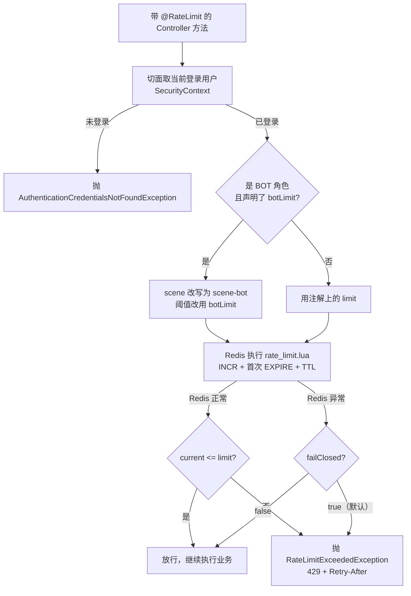
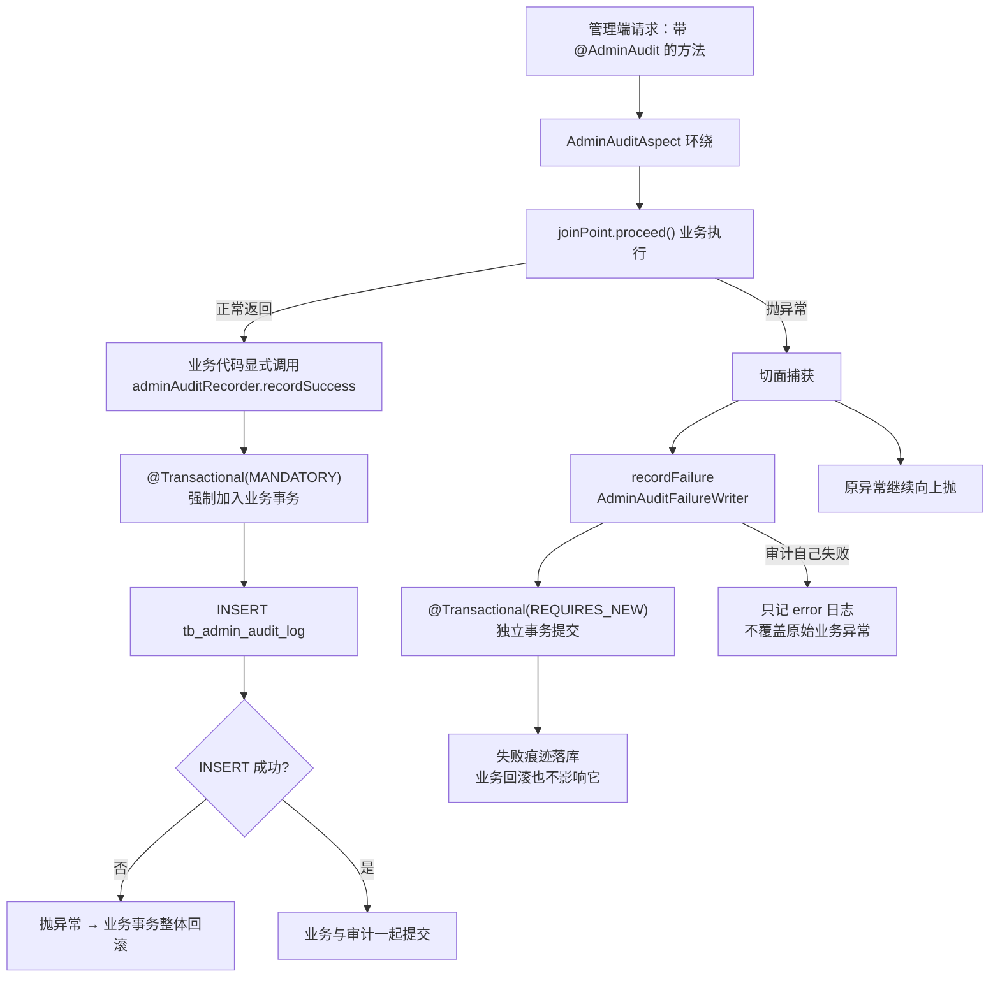

# demo0 security 链路 02：限流与审计 —— 「防滥用」与「留痕」两道防线

> **一句话概括**：**限流**用注解 + AOP + Redis Lua 原子计数挡住脚本刷接口，`failClosed` 让每个接口自己决定「Redis 挂了怎么办」；**审计**把「谁在什么时候对什么对象做了什么」变成一条 SQL 就能回答的问题，用**双事务模型**保证成功不造假账、失败不吞痕迹。

---

## 本页包含

| 链路 | 解决什么问题 | 核心点 |
| --- | --- | --- |
| **链路一：接口限流** | 怎么挡住「一个人把接口刷爆」 | ① 切面怎么切、限谁（含 BOT 独立配额）<br>② Lua 原子计数 + `failClosed` 双向降级 |
| **链路二：操作审计** | 管理端高风险操作怎么留下不可抵赖的痕迹 | ① 切面只管「失败」，成功由业务显式写<br>② `MANDATORY` + `REQUIRES_NEW` 的双事务<br>③ 证据链字段 |

---

## 链路一：接口限流

### 1.1 全景



### 1.2 核心点

#### 核心点 1：限流切在哪、限谁

```java
// platform/security/aop/RateLimitAspect.java
@Around("@annotation(rateLimit)")
public Object checkRateLimit(ProceedingJoinPoint joinPoint, RateLimit rateLimit) throws Throwable {
    // ① 从 SecurityContext 取当前登录用户
    Authentication authentication = SecurityContextHolder.getContext().getAuthentication();
    if (authentication == null
            || !(authentication.getPrincipal() instanceof AuthenticatedUser authenticatedUser)) {
        throw new AuthenticationCredentialsNotFoundException("当前用户未登录");
    }

    // ② BOT 角色且配置了独立配额时，切换到独立限流场景
    String scene = rateLimit.scene();
    int limit = rateLimit.limit();
    if (rateLimit.botLimit() >= 0
            && authenticatedUser.getRoles() != null
            && authenticatedUser.getRoles().contains(RoleConstants.BOT)) {
        scene = scene + "-bot";
        limit = rateLimit.botLimit();
    }

    // ③ 用 userId 做限流主体
    RateLimitDecision decision = rateLimitService.check(
            scene, String.valueOf(authenticatedUser.getUserId()),
            limit, rateLimit.windowSeconds(), rateLimit.failClosed());

    // ④ 被限流就抛 429，否则继续执行业务
    if (!decision.isAllowed()) {
        throw new RateLimitExceededException("操作过于频繁，请稍后再试",
                decision.getRetryAfterSeconds());
    }
    return joinPoint.proceed();
}
```

**为什么选 AOP 注解，而不是 Filter 或 Interceptor**：

| 方案 | 问题 |
| --- | --- |
| Filter | 拿到的是 URL，**看不到业务语义**；同一个 URL 不同参数想限不同额度就做不了 |
| Interceptor | 同样是路径级，且要维护路径匹配规则 |
| **AOP 注解** | 贴在方法上，**所见即所得**；能直接读到 `SecurityContext` 和注解参数 |

还有一个很实际的原因：注解式限流是**声明在业务代码旁边的**。写 `@RateLimit` 的人就是最清楚这个接口该怎么限的人 —— 不需要运维去另一处配置里逐条对应路径。

**为什么主体是 userId**：

```java
scene, String.valueOf(authenticatedUser.getUserId()), ...
```

限流的主体**只能是已登录用户**（未登录直接抛异常，压根进不来）。key 的最终形态是 `security:rate-limit:{scene}:{subject}`，两个维度：

| 维度 | 作用 |
| --- | --- |
| `scene` | 业务场景隔离。他发帖被限，不影响他搜索 |
| `subject`（userId） | 用户隔离。别人刷爆了，不影响你 |

**BOT 独立配额**是这套设计里比较特别的一笔。`QuantaBot` 是内部系统账号，它读评论、读内容都是批量拉数据，量级跟人类用户完全不是一个档 —— 如果和用户共用同一个阈值，它会先把配额吃光。所以注解上留了 `botLimit`：

```java
// comment/controller/user/CommentController.java
@RateLimit(scene = "comment-send", limit = 10, windowSeconds = 60, botLimit = 6)
```

`botLimit = 6` 的含义是：BOT 角色请求时，`scene` 会被改写成 `comment-send-bot`，阈值换成 6。**改 scene 而不是改 limit，这步很关键** —— 如果只改 `limit` 但共用同一个 key，BOT 和普通用户就会**共享同一个计数器**：bot 发了 6 条，真人就只能再发 4 条。改 scene 相当于**开了一份独立账本**。

> 项目里真实的限流场景一览（8 个 scene、13 处使用）：
>
> | scene | 阈值 | failClosed | 用在哪 |
> | --- | --- | --- | --- |
> | `content-publish` | 5 / 60s | 默认（true） | 发帖 |
> | `content-report` | 5 / 60s | 默认 | 举报帖子 |
> | `comment-send` | 10 / 60s（botLimit=6） | 默认 | 发评论 |
> | `comment-report` | 5 / 60s | 默认 | 举报评论 |
> | `answer-publish` | 10 / 60s | 默认 | 发回答 |
> | `file-upload` | 10 / 60s | 默认 | 文件上传 |
> | `bot-read` | 120 / 60s | **false** | bot 读评论链 / 历史 / 树 / 内容同步 |
> | `bot-policy-write` | 20 / 60s | 默认 | bot 写政策文档 |

#### 核心点 2：Lua 原子计数 + failClosed 双向降级

```lua
-- src/main/resources/lua/rate_limit.lua
local current = redis.call('INCR', KEYS[1])

if current == 1 then
    redis.call('EXPIRE', KEYS[1], ARGV[1])      -- 只有第一次才设过期
end

local ttl = redis.call('TTL', KEYS[1])
local limit = tonumber(ARGV[2])
local allowed = 0

if current <= limit then
    allowed = 1
end

local remaining = limit - current
if remaining < 0 then remaining = 0 end

return {allowed, remaining, ttl}                 -- 一次返回三元组
```

```java
// platform/security/service/impl/RateLimitServiceImpl.java
try {
    List<Long> result = stringRedisTemplate.execute(
            RATE_LIMIT_SCRIPT, List.of(key),
            String.valueOf(windowSeconds), String.valueOf(limit));

    if (result == null || result.size() < 3) {
        throw new IllegalStateException("Redis限流结果格式错误");
    }
    return new RateLimitDecision(result.get(0) == 1L, result.get(1), Math.max(result.get(2), 1L));
} catch (Exception exception) {
    log.error("Redis限流检查失败，scene={}", scene, exception);

    if (failClosed) {
        return new RateLimitDecision(false, 0, 1);      // 拒绝（宁可错杀）
    }
    return new RateLimitDecision(true, limit, 0);       // 放行（可用性优先）
}
```

**为什么 `INCR` 和 `EXPIRE` 必须在一个脚本里**：

分开发两条命令，中间有个**致命的窗口**：`INCR` 成功了、计数变成 1，正要发 `EXPIRE` 时进程崩溃或网络断了 —— **key 存在但永不过期**。从此这个 key 的计数只增不减，累计超过阈值之后，**这个接口对所有人永久 429**，直到人工发现去删 key。一个防刷组件变成了永久熔断器。

Lua 在 Redis 里是**单线程原子执行**的：计数、判断首次、设过期、返回结果，要么全做完要么全不做。顺带还有一个好处 —— **网络往返从 3 次降到 1 次**，`allowed / remaining / ttl` 一次拿全，429 响应的 `Retry-After` 直接用返回的 `ttl`，不用再查一次。

**`failClosed` 为什么让每个接口自己声明**：

```java
// platform/security/annotation/RateLimit.java
/** Redis异常时是否拒绝请求。 */
boolean failClosed() default true;
```

**默认是 `true`（fail-closed）** —— 这个默认值本身就是个设计决策：安全组件出问题时，**默认站到安全那一侧**。想放行的接口必须显式写 `failClosed = false`，等于强制作者对可用性做一次显式取舍。

| failClosed | Redis 挂了会怎样 | 适用 |
| --- | --- | --- |
| `true`（默认） | **全部拒绝** | 防滥用是接口存在的前提（发布、上传、举报） |
| `false` | **全部放行** | 限流只是保护性优化（bot 读接口） |

**为什么必须下放到每个接口**：因为「Redis 挂了该怎么办」取决于**接口的业务属性**，组件没法替业务决定。

- 发帖接口：限流是为了防刷。放行等于把刷帖的口子打开，**安全损失不可逆** → 必须拒绝。
- bot 读接口：限流只是保护性优化。Redis 挂了还拒绝，等于**自己把自己搞宕机** → 放行更合理。

全局统一设成拒绝，读接口被连坐；统一放行，写接口裸奔。所以判断权交给**写注解的人**，责任也一起交给他。

### 1.3 面试题

---

**Q1：你是怎么设计接口限流的？**

> 「先立约束：这是**应用内**的限流，项目没有独立网关；目标也不是『精确整形流量』，而是**挡住脚本刷接口** —— 攻击脚本的请求量级是正常用户的几十上百倍。
>
> 一句话骨架：**注解声明策略，AOP 做拦截，Redis Lua 做原子计数，`failClosed` 决定故障时的方向。**
>
> 四个决策：
>
> **① 切在方法上，而不是路径上。** 用 `@Around("@annotation(rateLimit)")` 切注解。Filter 只看得到 URL，看不到业务语义；注解贴在方法上，能直接读到 `SecurityContext` 的场景参数 —— 而且写注解的人就是最懂这个接口的人。
>
> **② 主体是 userId，不是 IP。** 未登录的请求在切面里就被拒了，能进限流的都是已登录用户。key 是 `security:rate-limit:{scene}:{subject}`，scene 做业务隔离、userId 做用户隔离。按 IP 限会误伤同一个出口 IP 下的整栋楼，按 userId 更准确。
>
> **③ 计数用 Lua，不用两条命令。** `INCR` 和 `EXPIRE` 分开发，中间崩了就会留下一个永不过期的 key，最后把接口变成永久 429。Lua 在 Redis 单线程内原子执行，一次往返拿全 `allowed / remaining / ttl`。
>
> **④ 故障方向交给接口自己声明。** `failClosed` 默认 `true`，安全组件出问题时默认站到安全侧；确实可以放行的接口显式写 `false`。因为『Redis 挂了怎么办』取决于接口的业务属性 —— 发帖不能放行，bot 读接口不该拒绝 —— 组件替不了业务做这个决定。
>
> 收口：这套设计覆盖的是**单机刷、单账号刷**。真面对分布式攻击（海量 IP、海量账号），限流只能减损，必须配合设备指纹、验证码、风控 —— 那是另一个量级的对抗，我不会假装一个计数器能解决。」

**依据**：`RateLimitAspect`、`RateLimitServiceImpl`、`lua/rate_limit.lua`、`@RateLimit` 的 8 个 scene

---

**Q2：`INCR` 和 `EXPIRE` 为什么必须放进 Lua？**

> 「因为这两条命令之间有个**中间态**，而这个中间态的后果是灾难性的。
>
> 事故剧本：第一个请求 `INCR` 之后计数变成 1，正要执行 `EXPIRE` 时进程崩溃或者网络断开 —— **key 存在了，但永不过期**。从此这个 key 的计数只增不减。阈值是 5 的话，从第 6 个请求开始，**所有人永远 429**，这个接口等于被永久熔断，直到人工发现去删 key。
>
> 而且这个 bug 特别阴 —— 它只在『刚好卡在那个窗口』时才出现，压测跑一万次可能一次都不复现，上线之后偶发，排查起来会非常痛苦。
>
> Lua 脚本在 Redis 里是**单线程原子执行**的：Redis 执行脚本期间不会穿插其他命令。所以『计数 + 判断首次 + 设过期 + 返回』要么全做完，要么全不做，不存在中间态。
>
> 附带好处是**网络往返从 3 次降到 1 次**，判定和剩余额度一次拿全 —— 429 的 `Retry-After` 直接用它返回的 ttl，不用再查一次。
>
> 这条可以推广成一句通用规则：**所有『读-改-写』形态的 Redis 操作，都应该用 Lua 或原子命令**，别指望两条命令之间不出事。」

---

**Q3：`failClosed` 为什么让每个接口自己声明，不全局统一？**

> 「因为『Redis 挂了该拒绝还是该放行』取决于**接口的业务属性**，限流组件替业务决定不了。
>
> 两个方向的代价完全不对称：
>
> - **发帖接口**：限流是为了防刷。Redis 挂了就放行，等于把刷帖的口子敞开 —— **安全损失不可逆**，脏数据已经进来了。必须拒绝。
> - **bot 读接口**：限流只是保护性优化。Redis 挂了还拒绝，等于**自己把自己搞宕机** —— 可用性损失远大于被刷的风险。应该放行。
>
> 全局统一设成拒绝，读接口被连坐；统一放行，写接口裸奔。所以这个决策必须下放到**声明者**那里。
>
> 默认值也很有讲究：`failClosed()` 的默认是 **`true`** —— 安全组件故障时默认站到安全那一侧。想放行的接口必须显式写 `failClosed = false`，等于**强制作者为可用性做一次显式取舍**，而不是默认就把它放过去了。
>
> 项目里的实际分布也印证了这个思路：写接口（发布/上传/举报）全部用默认值 `true`；唯一显式声明 `false` 的是 `bot-read`（120 次/分钟）——它本来就是批量读，拒绝反而是灾难。」

---

**Q4：为什么选固定窗口，不用滑动窗口或令牌桶？**

> 「先承认缺陷，再说为什么可以接受。固定窗口的边界突刺是真实存在的：限 5 次/分钟，第 59 秒打满 5 次、第 61 秒再打 5 次，**两秒内放过去 10 次**。
>
> 再说为什么仍然选它：**我的威胁模型是『挡脚本刷接口』，不是『精确整形流量』**。脚本的请求量级是正常用户的几十上百倍，根本不在乎边界这点穿透；而正常用户离阈值远得很，更碰不到。防御目标和算法精度是匹配的。
>
> 再看成本：
>
> | 算法 | 数据结构 | 成本 |
> | --- | --- | --- |
> | **固定窗口** | 一个 key 一个计数器 | 内存 O(1)，脚本十几行 |
> | 滑动窗口 | ZSET 存时间戳集合 | 内存 O(请求数)，还要定期清理 |
> | 令牌桶 | 桶状态 + 补充逻辑 | 多实例下参数调优麻烦 |
>
> 固定窗口的实现就是上面那段 Lua，够用且好懂。
>
> 有一个前提要说清楚：**如果哪天需求变成『保护下游脆弱服务、需要平滑放行』，固定窗口就不够了** —— 那种场景需要令牌桶做整形。所以选型的判断标准是**匹配威胁模型**：防滥用选简单够用的，做流量整形才需要精细算法。」

---

## 链路二：管理端操作审计

### 2.1 全景



**两条路径的事务诉求是相反的**，这是整个设计的起点：

| 路径 | 事务要求 | 为什么 |
| --- | --- | --- |
| **成功审计** | 必须和业务**同事务** | 防「审计说成功、业务却回滚了」的假账 |
| **失败审计** | 必须**独立事务** | 业务回滚不能把审计一起吞掉 |

一条事务策略满足不了两个相反的要求 —— 所以拆成双事务。

### 2.2 核心点

#### 核心点 1：切面只管「失败」，成功由业务显式写

```java
// platform/audit/aop/AdminAuditAspect.java
@Around("@annotation(adminAudit)")
public Object auditAdminAction(ProceedingJoinPoint joinPoint, AdminAudit adminAudit) throws Throwable {
    try {
        return joinPoint.proceed();                     // 成功路径：切面什么都不做，直接放行
    } catch (Throwable throwable) {
        try {
            adminAuditRecorder.recordFailure(           // 失败路径：切面负责记一笔
                    adminAudit.action(),
                    adminAudit.targetType(),
                    resolveTargetId(joinPoint, adminAudit.targetId()),   // SpEL 解析 #userId
                    throwable);
        } catch (Exception auditException) {
            log.error("管理员失败审计写入异常", auditException);        // 审计自己失败，不能覆盖原异常
        }
        throw throwable;                                 // 原异常继续往上抛
    }
}
```

**为什么成功不交给切面**：

切面能拿到的是**方法参数和返回值**，但「这个操作改动了什么」只有业务自己知道。看真实业务代码：

```java
// platform/security/service/impl/AdminRoleServiceImpl.java
adminAuditRecorder.recordSuccess(
        AdminAuditActionConstants.ROLE_REVOKE, "USER_ROLE",
        userId + ":" + roleCode,
        "beforeRoles=" + String.join(",", beforeRoles),                        // 改之前长什么样
        "afterRoles="  + String.join(",", userRoleMapper.findRoleCodesByUserId(userId))  // 改之后长什么样
);
```

`beforeRoles` / `afterRoles` 这种**前后状态快照**，切面拿到方法参数是算不出来的 —— 切面只知道「传了 userId 和 roleCode 进来」，不知道「撤销前他有哪几个角色」。而审计的取证价值恰恰在这里：**不只记录「做了什么」，还要记录「做之前和之后是什么样」**，这样才能回答「这个操作到底改没改东西、改成了什么」。

所以职责切得很清楚：

| 谁 | 负责什么 | 为什么 |
| --- | --- | --- |
| **切面** | 只兜住**异常路径** | 异常是切面一定能感知的，不需要业务配合 |
| **业务代码** | 显式写**成功审计** | 只有业务知道前后状态 |
| **注解** | 声明 action / targetType / targetId | 静态元数据，写在方法上最直观 |

**注解里 `targetId` 用 SpEL**：

```java
@AdminAudit(action = AdminAuditActionConstants.ROLE_GRANT, targetType = "USER_ROLE",
            targetId = "#userId + ':' + #roleCode")
@PreAuthorize("hasAuthority('" + PermissionConstants.ROLE_MANAGE + "')")
@PostMapping("/{userId}/{roleCode}")
public Result grantRole(@PathVariable Long userId, @PathVariable String roleCode) { ... }
```

`#userId + ':' + #roleCode` 在切面里用 `MethodBasedEvaluationContext` 求值（`resolveTargetId`），解析失败只 `log.warn` 并返回 null —— **审计元数据解析不上，不该把业务打挂**。

#### 核心点 2：`MANDATORY` + `REQUIRES_NEW` —— 用传播行为表达架构意图

```java
// platform/audit/service/impl/AdminAuditRecorderImpl.java
@Override
@Transactional(propagation = Propagation.MANDATORY)      // ← 必须已存在事务，否则抛异常
public void recordSuccess(String action, String targetType, String targetId,
                          String beforeSummary, String afterSummary) {
    AdminAuditLog auditLog = buildCommonAuditLog();
    auditLog.setAction(action);
    auditLog.setTargetType(targetType);
    auditLog.setTargetId(targetId);
    auditLog.setBeforeSummary(limitSummary(beforeSummary));   // 限长 2000
    auditLog.setAfterSummary(limitSummary(afterSummary));
    auditLog.setResultStatus("SUCCESS");

    if (adminAuditLogMapper.insert(auditLog) != 1) {
        throw new IllegalStateException("管理员审计日志写入失败");
    }
}
```

```java
// platform/audit/service/impl/AdminAuditFailureWriter.java
@Service
public class AdminAuditFailureWriter {

    @Transactional(propagation = Propagation.REQUIRES_NEW)   // ← 挂起原事务，开独立新事务
    public void writeFailed(AdminAuditLog auditLog) {
        adminAuditLogMapper.insert(auditLog);
    }
}
```

**`MANDATORY` 的价值在哪**：如果 `recordSuccess` 用默认的 `REQUIRED`，它在**事务外被调用时不会报错**，而是静默地自己开一个新事务，把审计写成独立记录 —— 于是「业务回滚但审计留着」的假账问题就悄悄回来了。而且这种 bug 不会在开发期暴露，要等业务真回滚时才显现。

`MANDATORY` 把「**必须同事务**」这条架构约定，从一句注释变成**运行时会强制执行的约束**：没有事务就直接抛异常，调用姿势错了立刻暴露。

> 这是事务设计的进阶用法：**不是用传播行为来「兼容各种调用场景」，而是用它来「禁止错误的调用场景」。**

**`REQUIRES_NEW` 的代价要讲清楚**：

| 方面 | 说明 |
| --- | --- |
| 行为 | 挂起当前事务，从连接池另取一个连接开新事务 |
| 数据可见性 | 两个事务各自独立的视图 —— **业务事务未提交的中间状态，新事务看不到** |
| 这正是需要的 | 业务回滚时，失败审计必须能独立提交，否则「谁做失败了什么」这条最关键证据就丢了 |
| 风险 | **多占一个连接**；如果外层持有行锁、新事务又要同一把锁，会死锁 |
| 规避 | 失败审计**只 INSERT 审计表**，不碰任何业务行 —— 从设计上避开死锁可能 |

#### 核心点 3：审计字段就是证据链

```java
// platform/audit/service/impl/AdminAuditRecorderImpl.java
private AdminAuditLog buildCommonAuditLog() {
    AdminAuditLog auditLog = new AdminAuditLog();
    auditLog.setCreatedAt(LocalDateTime.now());

    // 1. 从 SecurityContext 取操作人和角色快照
    AuthenticatedUser operator = resolveCurrentAuthenticatedUser();
    if (operator != null) {
        auditLog.setOperatorId(operator.getUserId());
        auditLog.setOperatorRoles(joinRoles(operator.getRoles()));   // 排序后逗号连接
    }

    // 2. 从当前请求取 requestId 和客户端信息
    HttpServletRequest request = currentRequest();
    if (request != null) {
        auditLog.setRequestId(resolveRequestId(request));    // X-Request-Id 或 UUID
        auditLog.setHttpMethod(request.getMethod());
        auditLog.setRequestPath(request.getRequestURI());
        auditLog.setClientIp(resolveClientIp(request));
        auditLog.setUserAgent(limitLength(request.getHeader("User-Agent"), 1000));
    }
    return auditLog;
}
```

字段与取证价值的对应关系：

| 字段 | 来源 | 取证价值 |
| --- | --- | --- |
| `requestId` | `X-Request-Id` 头，没有就生成 UUID | 串联一次请求，防抵赖锚点 |
| `operatorId` / `operatorRoles` | `SecurityContext` | **谁、以什么身份**做的（角色快照比当前角色更重要） |
| `action` / `targetType` / `targetId` | `@AdminAudit` + SpEL | **对什么对象**做了什么 |
| `beforeSummary` / `afterSummary` | 业务显式传入，限长 2000 | 改动前后的状态对比 |
| `resultStatus` / `errorCode` / `errorMessage` | 成功/失败路径分别填充 | 操作结果与失败原因 |
| `httpMethod` / `requestPath` / `clientIp` / `userAgent` | 当前请求 | **从哪来、走的哪个口** |
| `createdAt` | 服务端时间 | 何时 |

**两个细节值得单独说**：

1. **`operatorRoles` 存的是「操作当时」的角色快照，不是查库时的当前角色。** 因为事后追责要回答的是「他当时是以什么身份做这件事的」—— 如果只存 `operatorId`，等他角色被改过之后，就再也还原不出当时那个场景了。**审计要记录的是历史事实，不是当前状态。**
2. **限长是硬要求。** 摘要限 2000 字符、错误信息和 UA 限 1000 —— 防止一篇超长正文直接灌进审计表，把审计表撑爆。

### 2.3 面试题

---

**Q1：你是怎么设计管理端操作审计的？**

> 「先立约束：审计要回答的是『谁、在什么时候、对什么对象、做了什么、结果如何』，而且必须是**不可抵赖**的 —— 日志文件天生做不到这一点。
>
> 一句话骨架：**注解声明元数据，切面兜住失败，业务显式写成功，两条路径用不同的事务传播行为各自保证。**
>
> 为什么 `log.info` 不够，三个硬伤：
>
> | 缺陷 | 后果 |
> | --- | --- |
> | 业务回滚了日志还在 | 日志说『封号成功』，数据库却没封 —— **审计失去法律效力** |
> | 不可结构化查询 | 想查『谁动过帖子 123』只能 grep 服务器日志 |
> | 字段不统一 | 没有统一的操作人、时间、IP、前后快照 |
>
> 然后讲核心矛盾：**审计的两种结果，事务诉求是相反的** —— 成功审计必须和业务同事务（否则出现假账），失败审计必须独立于业务事务（业务回滚不能吞掉失败痕迹）。一条策略满足不了两个相反要求，所以拆成**双事务模型**：
>
> - 成功走 `@Transactional(propagation = MANDATORY)` —— **强制**寄生在业务事务里，没有事务直接抛异常；
> - 失败走 `@Transactional(propagation = REQUIRES_NEW)` —— 挂起业务事务，独立提交。
>
> 最后讲职责切分：**切面只负责异常路径，成功审计由业务代码显式写**。因为『beforeRoles / afterRoles』这种前后状态快照，切面从方法参数里是算不出来的 —— 只有业务自己知道改动了什么。
>
> 收口：这套设计的取舍是**宁可业务少成功一次，不让审计出现沉默的漏洞**。前提是审计写入的失败率极低（单行 INSERT 到独立表、无外键），为极小概率牺牲一点点可用性，换审计体系的完备性。」

**依据**：`AdminAuditAspect`、`AdminAuditRecorderImpl`、`AdminAuditFailureWriter`、`AdminAuditLog`、`docs/security-governance-plan.md` 阶段 4

---

**Q2：`MANDATORY` 和 `REQUIRED` 有什么区别？什么场景用 `MANDATORY`？**

> 「`REQUIRED` 是默认值，语义最宽容：有事务就加入，没事务就自己新建一个。`MANDATORY` 最严格：**必须已经存在事务，否则直接抛异常**。
>
> 差别在于**对「意外调用」的处理方式**：`REQUIRED` 会静默兜底，`MANDATORY` 会立刻失败。
>
> 我们用在成功审计上。因为成功审计的本质是**宣称这个操作成功了的正式记录**，它必须和业务同生共死 —— 单独存在既没意义又危险。如果用 `REQUIRED`，某天有人在事务外调用它，审计会『静默地』写进一个独立事务，业务回滚了审计还在，**假账问题就悄悄回来了**。而且这种 bug 开发期不会暴露，要等业务真的失败回滚时才显现。
>
> 用 `MANDATORY`，调用姿势错了就是启动/执行时立刻抛异常，**开发第一时间就知道**。
>
> 一句话总结：**`MANDATORY` 不是让代码更宽容，是让错误更早暴露。** 它把『必须同事务』这条架构约定，从注释变成了运行时强制约束。」

---

**Q3：审计写入失败，但业务成功了 —— 怎么办？**

> 「系统会让**整个操作失败**。成功审计用 `MANDATORY` 寄生在业务事务里：业务 SQL 执行了、审计 INSERT 时数据库满了或者约束冲突抛异常，异常向上抛，**整个事务回滚** —— 帖子状态没改、审计也没写，两边一致地失败。用户侧看到的是操作失败、可以重试。
>
> 听起来苛刻，但这是有意为之：
>
> **成功审计的意义就是『宣称操作成功的正式记录』。如果允许『操作成功但审计缺失』，审计体系就有缺口了** —— 合规视角下，一个没有留痕的成功操作，比一次失败的操作危险得多。
>
> 这个取舍成立的前提是：**审计写入的失败率极低**。所以表设计得极简 —— 单行 INSERT、独立表、无外键约束。为「极小概率的失败」牺牲一点点可用性，换审计体系的完备性，这笔账是划算的。
>
> 反过来看失败审计那侧：**它恰恰不能跟着业务一起失败**。业务回滚时，「谁在什么时候做失败了什么」是最关键的证据，所以走 `REQUIRES_NEW` 独立提交。而且如果独立提交也失败了，只记 `log.error`，**绝不能覆盖最初的业务异常** —— 带偏排查方向的日志比没有日志更糟。」

---

**Q4：`REQUIRES_NEW` 挂起原事务，两个事务看到的数据一致吗？**

> 「**不一致，而且这正是我需要的。**
>
> 机制上：`REQUIRES_NEW` 会把当前事务**挂起**，从连接池另外拿一个连接开新事务 —— 两个事务在数据库上就是两个独立会话，各自有各自的隔离视图。
>
> 具体到审计场景：业务事务标记回滚时（比如审核操作抛了异常），失败审计的 `REQUIRES_NEW` 事务在另一个连接上 —— **业务事务未提交的任何中间状态它看不到，业务回滚也不影响它已经提交的审计记录**。
>
> 如果两者共享一个事务会怎样？失败审计跟着业务事务走，业务一回滚审计也没了 —— 『谁做失败了什么』这条最关键的证据就丢了。而这条记录恰恰是排查线上问题的起点。
>
> 代价也要说清楚，两个：
>
> 1. **多占一个连接**。如果外层事务持有很多连接、并发又高，可能把连接池打满。
> 2. **有死锁可能**。如果外层事务持有某行的行锁，而新事务又去拿同一把锁，就会互相等待。
>
> 我们是从设计上规避第二点的：**失败审计只 INSERT 审计表，不碰任何业务行** —— 审计表和业务表之间没有外键，也不做任何 SELECT ... FOR UPDATE。这样两个事务的操作集合完全不相交，死锁的可能就被结构性地排除了。」

---

## 专题：设计与实现的差距（诚实清单）

`docs/security-governance-plan.md` 是这套治理方案的**设计文档**，其中的限流部分有一部分**尚未落地**。这个差距本身就是很好的面试素材 —— 能说清楚「设计到实现之间砍了什么、为什么」比背方案更有说服力。

| 设计文档里写的 | 当前代码实现 | 说明 |
| --- | --- | --- |
| 登录两段式限流（IP 哈希宽阈值 + openid HMAC 严阈值） | **未实现**（登录接口无 `@RateLimit`） | 微信登录依赖 code 换 openid，维度设计更复杂，被延后 |
| 文件上传 `userId + IP` 双维度 | 只按 `userId` | 切面的主体就是 userId，没有 IP 回退维度 |
| 事件重放 / 封禁 / 角色修改 按 adminId 限流 | **未实现**（管理端无 `@RateLimit`） | 这是**当前最明显的缺口**：高风险操作反而没有频控 |
| 「数值必须配置化」 | 阈值**硬编码在注解上** | 改阈值要改代码重新发布，不是配置中心 |
| 登录入口的 `RateLimitFilter` | **不存在**（`grep` 无结果） | 最终只保留了 AOP 注解这一种形态 |
| 限流 key 不含完整 IP 组合、不写微信 code | ✅ **已做到** | 主体只有 userId，天然不含这些 |

**能讲出来的三点**：

1. **范围收敛是主动的**：管理端操作是低频高危，每天撑死几千次，跟「刷接口」的威胁模型不同，所以第一批限流只做了用户侧高频写接口。**先挡量最大的风险，不是把方案里的每一条都实现一遍。**
2. **管理端频控是已知缺口**：角色修改、事件重放这类接口目前只靠 `@PreAuthorize` 做权限校验，没有频控。要补的话不难 —— 加 `@RateLimit` 即可，因为切面本来就从 `SecurityContext` 取主体，管理端同样适用。
3. **阈值配置化是明确的技术债**：现在改阈值要改注解、重新发布。真正的做法是把阈值挪到配置中心，让运维能按真实日志调参 —— 这也是设计文档里写了的、还没做的一条。

---

## 边界与失败处理

| 场景 | 处理 | 为什么 |
| --- | --- | --- |
| Redis 故障 + `failClosed=true` | 全部拒绝 | 安全组件默认站安全侧 |
| Redis 故障 + `failClosed=false` | 全部放行并告警 | 可用性优先，限流只是保护性优化 |
| 触发限流 | 429 + `Retry-After` 头 | 客户端知道等多久，`ttl` 直接来自 Lua 返回值 |
| BOT 与普通用户同场景 | scene 改写为 `{scene}-bot`，各用独立 key | 共用 key 会导致两边抢同一份配额 |
| 审计失败但业务成功 | 同事务回滚 | 宁可业务失败，不留假账 |
| 业务失败 + 失败审计成功 | `REQUIRES_NEW` 独立提交 | 失败也要留痕 |
| 失败审计自身失败 | 只记 `log.error`，原异常继续抛 | 不能覆盖最初的业务异常 |
| 审计摘要超长 | 截断（摘要 2000 / 错误与 UA 1000） | 防止大字段把审计表撑爆 |
| `targetId` SpEL 解析失败 | `log.warn` 并置 null | 审计元数据解析失败不该打挂业务 |

---

## 一句话记住

| | **限流** | **审计** |
| --- | --- | --- |
| 解决什么 | 一个人把接口刷爆 | 管理端操作**不可抵赖** |
| 核心机制 | 注解 + AOP + Redis Lua 原子计数 | 双事务：`MANDATORY` 成功 / `REQUIRES_NEW` 失败 |
| 关键取舍 | `failClosed` 默认 `true`（安全侧） | 宁可业务失败，不留假账 |
| 失败时 | 按接口声明的方向降级 | 失败审计独立提交，且不覆盖原异常 |
